# 数据分析仪表板

<cite>
**本文档引用的文件**
- [README.md](file://README.md)
- [package.json](file://package.json)
- [src/App.tsx](file://src/App.tsx)
- [src/pages/AnalyticsPage.tsx](file://src/pages/AnalyticsPage.tsx)
- [src/data/analytics.ts](file://src/data/analytics.ts)
- [src/components/admin/ActivityTrendChart.tsx](file://src/components/admin/ActivityTrendChart.tsx)
- [src/components/admin/UserGrowthChart.tsx](file://src/components/admin/UserGrowthChart.tsx)
- [src/components/admin/CommunityStatsCharts.tsx](file://src/components/admin/CommunityStatsCharts.tsx)
- [src/components/admin/ContentDistributionChart.tsx](file://src/components/admin/ContentDistributionChart.tsx)
- [src/components/admin/PointsSourceChart.tsx](file://src/components/admin/PointsSourceChart.tsx)
- [src/components/admin/PointsHistoryChart.tsx](file://src/components/admin/PointsHistoryChart.tsx)
- [src/pages/AdminDashboard.tsx](file://src/pages/AdminDashboard.tsx)
- [src/data/communityData.ts](file://src/data/communityData.ts)
- [src/hooks/useUserSystem.ts](file://src/hooks/useUserSystem.ts)
</cite>

## 目录
1. [项目简介](#项目简介)
2. [项目结构](#项目结构)
3. [核心组件](#核心组件)
4. [架构概览](#架构概览)
5. [详细组件分析](#详细组件分析)
6. [依赖关系分析](#依赖关系分析)
7. [性能考虑](#性能考虑)
8. [故障排除指南](#故障排除指南)
9. [结论](#结论)

## 项目简介

数据分析仪表板是基于 React 19 + TypeScript 构建的 YuleTech 开源技术社区的数据可视化平台。该项目专注于为社区管理者提供全面的数据分析和监控功能，通过直观的图表和统计数据帮助决策制定。

### 核心特性
- **实时数据可视化**：使用 Recharts 提供丰富的图表组件
- **多维度数据分析**：涵盖用户行为、内容分布、社区活跃度等多个指标
- **响应式设计**：适配各种设备和屏幕尺寸
- **本地数据持久化**：基于 localStorage 的数据存储机制
- **管理员专用仪表板**：为社区管理者提供专业的数据分析界面

**章节来源**
- [README.md:1-95](file://README.md#L1-L95)
- [package.json:1-49](file://package.json#L1-L49)

## 项目结构

项目采用模块化的组织方式，主要分为以下几个核心部分：

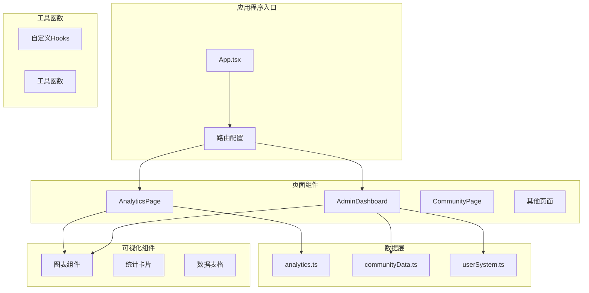

**图表来源**
- [src/App.tsx:40-139](file://src/App.tsx#L40-L139)
- [src/pages/AnalyticsPage.tsx:162-393](file://src/pages/AnalyticsPage.tsx#L162-L393)

### 文件组织结构

项目采用按功能模块划分的文件组织方式：

- **src/**: 主要源代码目录
  - **components/**: 可复用的 React 组件
  - **pages/**: 页面级组件
  - **data/**: 数据模型和模拟数据
  - **hooks/**: 自定义 React Hooks
  - **services/**: 服务层接口
  - **lib/**: 工具函数库

**章节来源**
- [README.md:20-46](file://README.md#L20-L46)

## 核心组件

### 数据分析页面 (AnalyticsPage)

AnalyticsPage 是整个数据分析系统的核心组件，提供了完整的数据可视化界面：

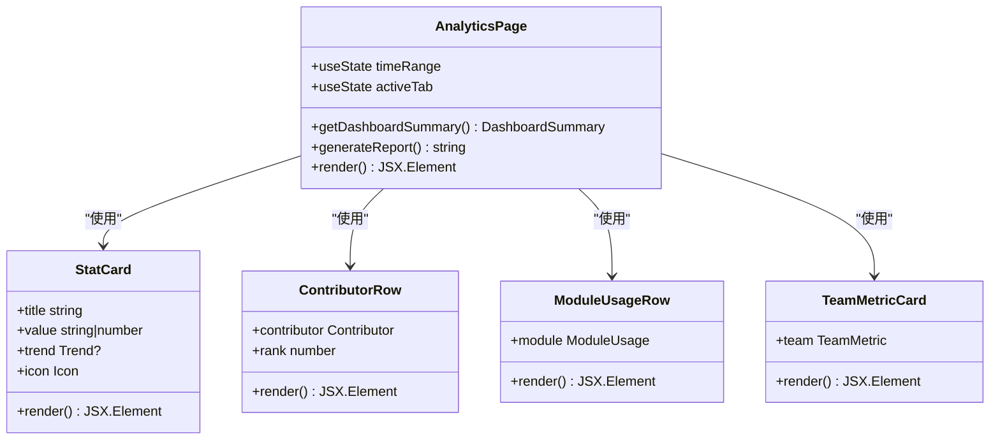

**图表来源**
- [src/pages/AnalyticsPage.tsx:39-160](file://src/pages/AnalyticsPage.tsx#L39-L160)

### 管理员仪表板 (AdminDashboard)

管理员仪表板提供了社区管理所需的关键指标和分析视图：

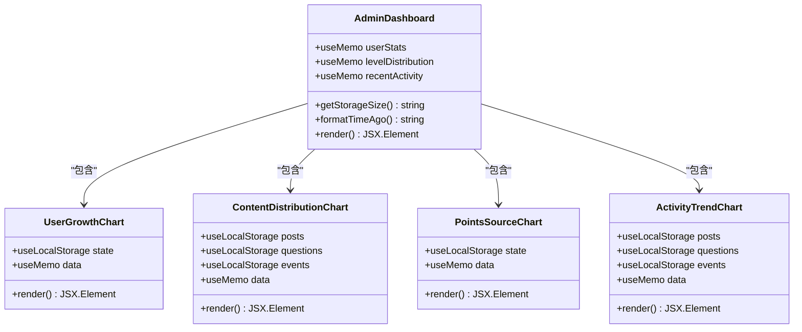

**图表来源**
- [src/pages/AdminDashboard.tsx:67-321](file://src/pages/AdminDashboard.tsx#L67-L321)

**章节来源**
- [src/pages/AnalyticsPage.tsx:162-393](file://src/pages/AnalyticsPage.tsx#L162-L393)
- [src/pages/AdminDashboard.tsx:67-321](file://src/pages/AdminDashboard.tsx#L67-L321)

## 架构概览

### 数据流架构

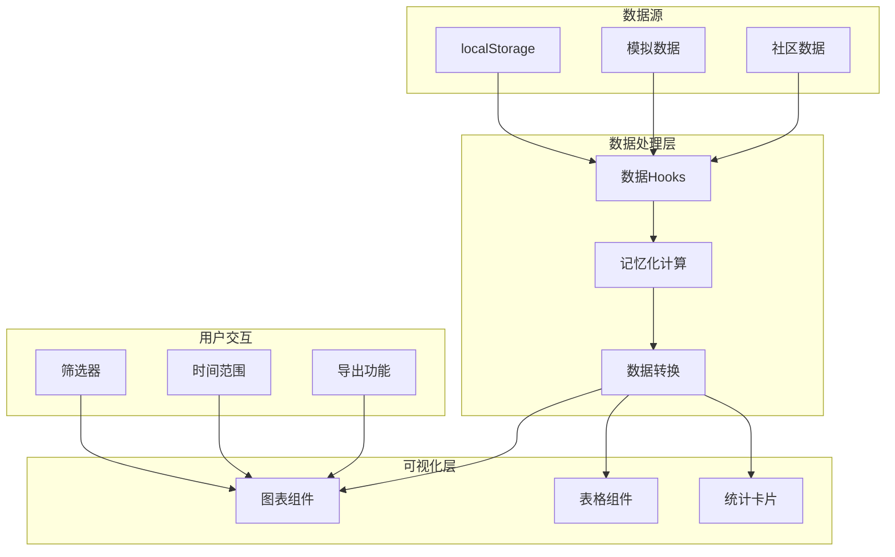

**图表来源**
- [src/data/analytics.ts:1-139](file://src/data/analytics.ts#L1-L139)
- [src/hooks/useUserSystem.ts:91-135](file://src/hooks/useUserSystem.ts#L91-L135)

### 组件通信模式

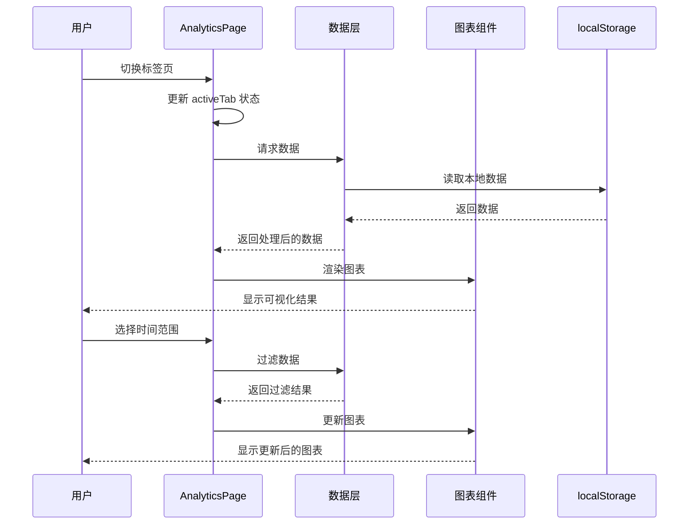

**图表来源**
- [src/pages/AnalyticsPage.tsx:162-232](file://src/pages/AnalyticsPage.tsx#L162-L232)

**章节来源**
- [src/App.tsx:40-139](file://src/App.tsx#L40-L139)

## 详细组件分析

### 数据模型设计

项目采用了类型安全的数据模型设计，确保数据的一致性和可维护性：

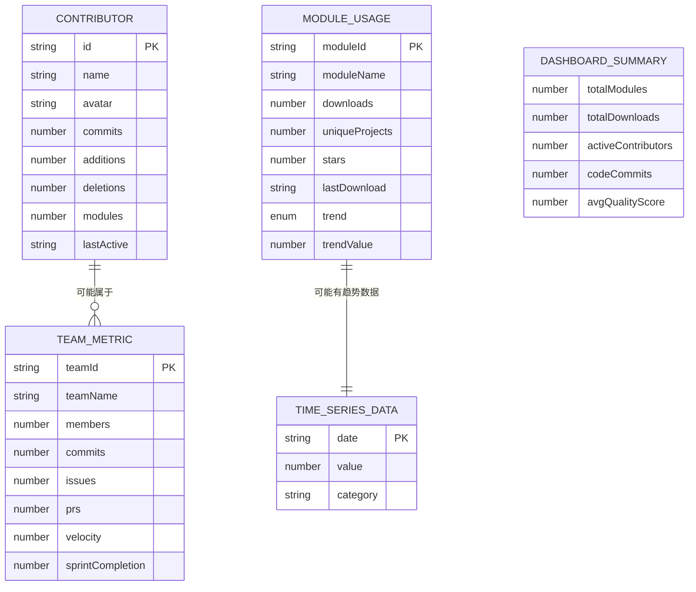

**图表来源**
- [src/data/analytics.ts:1-139](file://src/data/analytics.ts#L1-L139)

### 图表组件分析

#### 活跃趋势图表 (ActivityTrendChart)

ActivityTrendChart 专门用于显示社区活动的每日趋势：

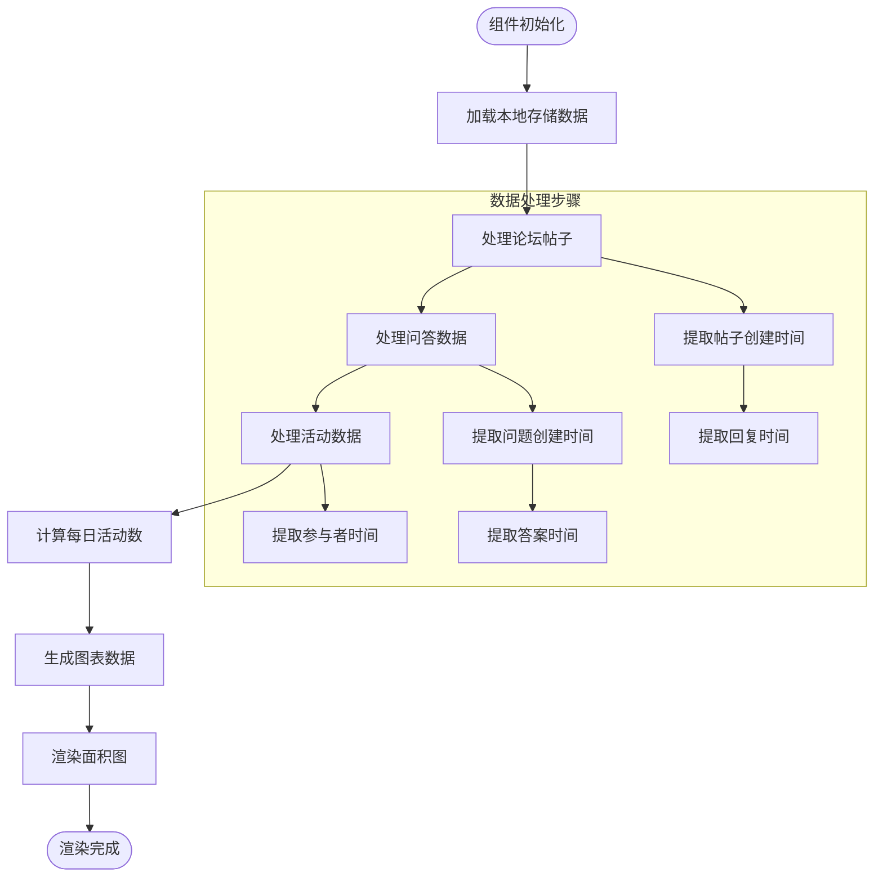

**图表来源**
- [src/components/admin/ActivityTrendChart.tsx:29-129](file://src/components/admin/ActivityTrendChart.tsx#L29-L129)

#### 用户增长图表 (UserGrowthChart)

UserGrowthChart 展示了用户数量的增长趋势：

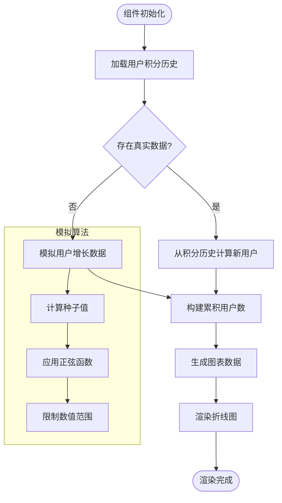

**图表来源**
- [src/components/admin/UserGrowthChart.tsx:23-119](file://src/components/admin/UserGrowthChart.tsx#L23-L119)

#### 内容分布图表 (ContentDistributionChart)

ContentDistributionChart 使用饼图展示不同类型内容的分布情况：

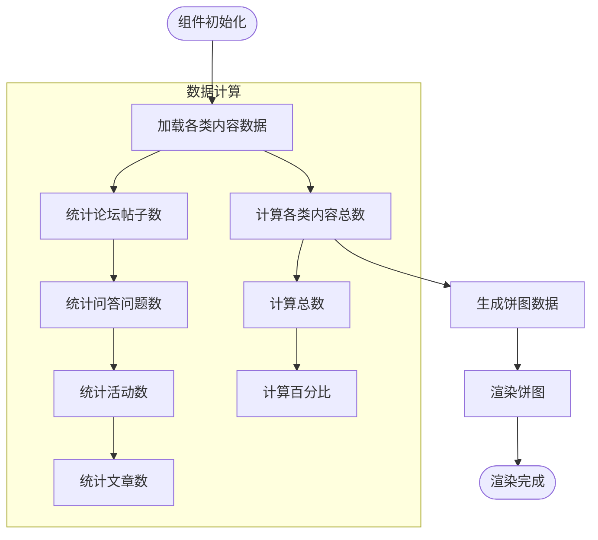

**图表来源**
- [src/components/admin/ContentDistributionChart.tsx:23-72](file://src/components/admin/ContentDistributionChart.tsx#L23-L72)

**章节来源**
- [src/data/analytics.ts:1-139](file://src/data/analytics.ts#L1-L139)
- [src/components/admin/ActivityTrendChart.tsx:29-129](file://src/components/admin/ActivityTrendChart.tsx#L29-L129)
- [src/components/admin/UserGrowthChart.tsx:23-119](file://src/components/admin/UserGrowthChart.tsx#L23-L119)
- [src/components/admin/ContentDistributionChart.tsx:23-72](file://src/components/admin/ContentDistributionChart.tsx#L23-L72)

### 用户系统集成

项目集成了完整的用户积分和等级系统：

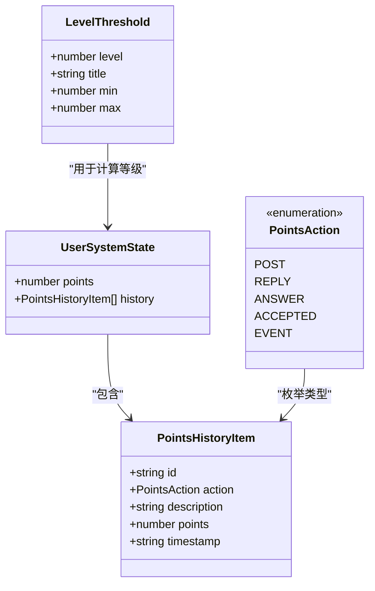

**图表来源**
- [src/hooks/useUserSystem.ts:15-135](file://src/hooks/useUserSystem.ts#L15-L135)

**章节来源**
- [src/hooks/useUserSystem.ts:91-135](file://src/hooks/useUserSystem.ts#L91-L135)

## 依赖关系分析

### 技术栈依赖

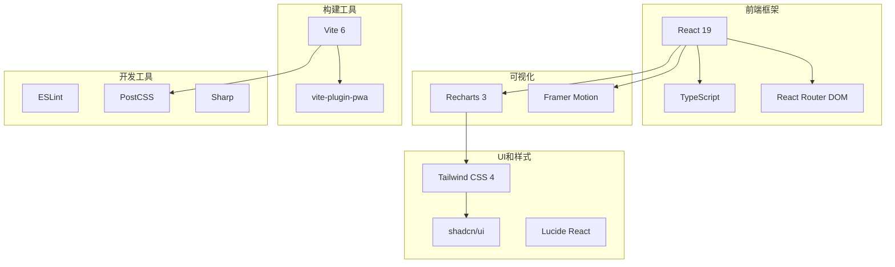

**图表来源**
- [package.json:12-47](file://package.json#L12-L47)

### 组件依赖关系

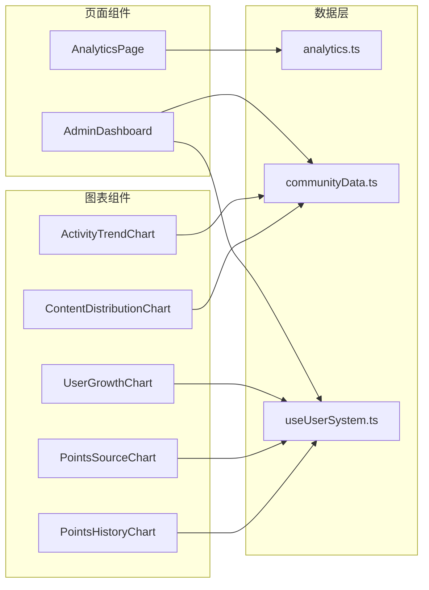

**图表来源**
- [src/pages/AnalyticsPage.tsx:162-393](file://src/pages/AnalyticsPage.tsx#L162-L393)
- [src/pages/AdminDashboard.tsx:67-321](file://src/pages/AdminDashboard.tsx#L67-L321)

**章节来源**
- [package.json:12-47](file://package.json#L12-L47)

## 性能考虑

### 数据缓存策略

项目采用了多层次的数据缓存机制来优化性能：

1. **本地存储缓存**：使用 localStorage 存储用户数据和配置
2. **记忆化计算**：利用 React.memo 和 useMemo 避免不必要的重渲染
3. **懒加载组件**：使用 React.lazy 实现按需加载
4. **响应式容器**：Recharts 的 ResponsiveContainer 自适应不同屏幕尺寸

### 性能优化建议

1. **虚拟化长列表**：对于大量数据的表格，考虑使用 react-window 或 react-virtualized
2. **数据分页**：对大数据集实施分页加载
3. **图表优化**：对于大量时间序列数据，考虑数据聚合或降采样
4. **图片优化**：使用现代格式如 WebP 和适当的尺寸

## 故障排除指南

### 常见问题及解决方案

#### 图表不显示数据

**症状**：图表显示为空白或只有坐标轴
**可能原因**：
- localStorage 数据损坏
- 时间范围选择不当
- 数据格式不匹配

**解决方法**：
1. 检查浏览器控制台是否有错误信息
2. 清除相关 localStorage 项并重新加载
3. 验证数据格式是否符合预期

#### 性能问题

**症状**：页面加载缓慢或图表渲染卡顿
**可能原因**：
- 大量数据同时渲染
- 频繁的状态更新
- 不必要的 re-render

**解决方法**：
1. 实施数据分页或虚拟化
2. 优化 useMemo 和 useCallback 的使用
3. 减少不必要的状态提升

#### 数据同步问题

**症状**：不同图表显示的数据不一致
**可能原因**：
- 多个组件独立获取数据
- 数据更新时机不一致

**解决方法**：
1. 创建统一的数据获取 Hook
2. 实施数据缓存和失效机制
3. 使用 Context 或状态管理库

**章节来源**
- [src/components/admin/ActivityTrendChart.tsx:29-129](file://src/components/admin/ActivityTrendChart.tsx#L29-L129)
- [src/components/admin/UserGrowthChart.tsx:23-119](file://src/components/admin/UserGrowthChart.tsx#L23-L119)

## 结论

数据分析仪表板项目展现了现代前端开发的最佳实践，通过合理的架构设计和组件化开发，成功实现了功能丰富且性能优异的数据可视化平台。

### 主要成就

1. **模块化架构**：清晰的组件分离和职责划分
2. **类型安全**：完整的 TypeScript 类型定义
3. **用户体验**：直观的界面设计和流畅的交互体验
4. **可扩展性**：良好的代码结构便于功能扩展

### 技术亮点

- 基于 React 19 的现代化开发
- 使用 Recharts 实现丰富的数据可视化
- 完整的 TypeScript 类型系统
- 响应式设计适配多设备
- 本地数据持久化机制

该项目为类似的社区管理和数据分析场景提供了优秀的参考实现，其架构设计和组件模式值得在其他项目中借鉴和应用。