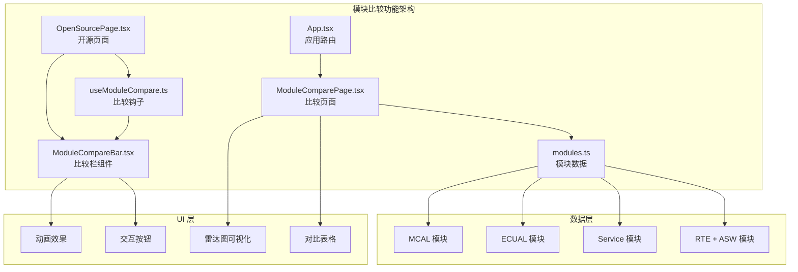
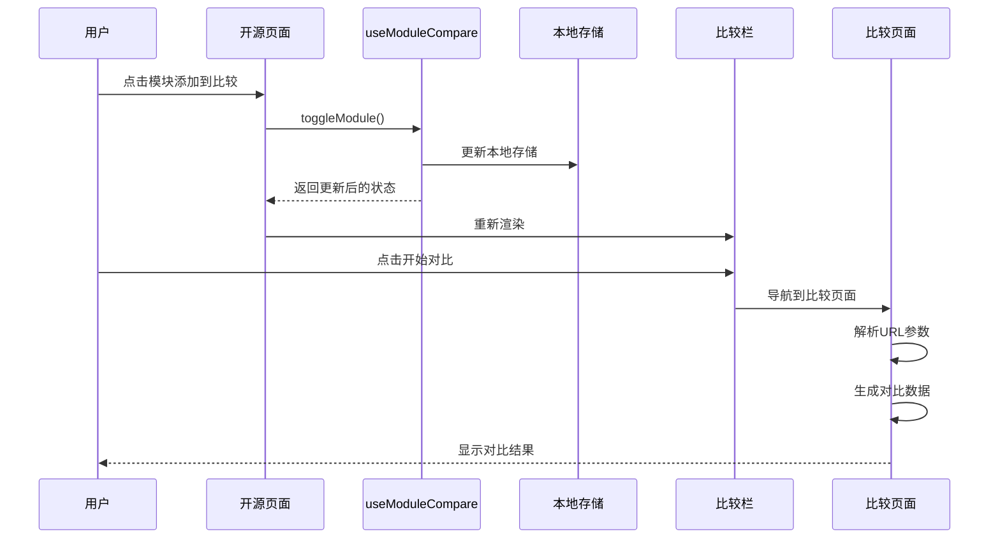
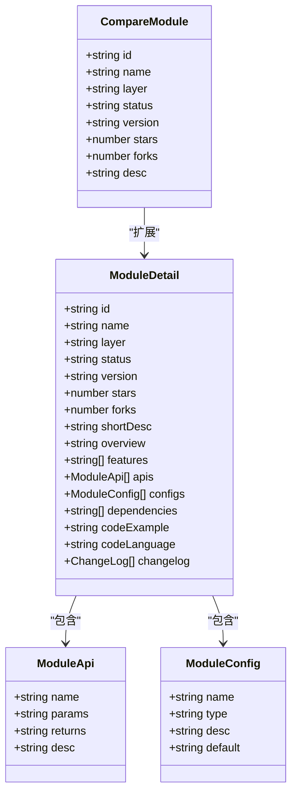
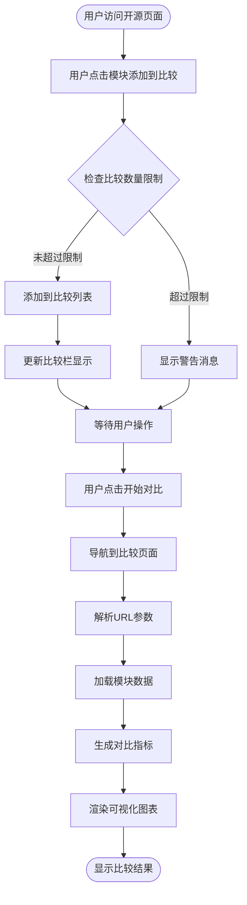
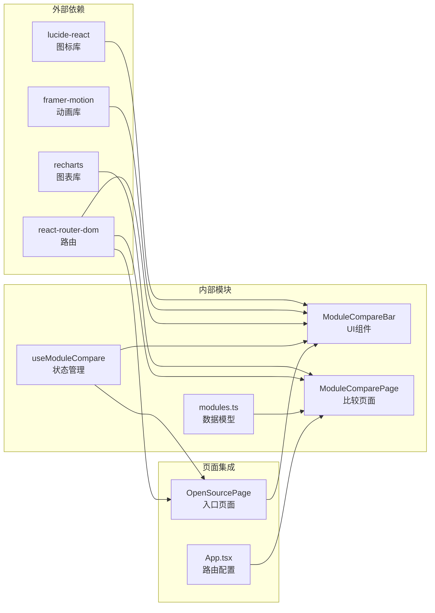

# 模块比较功能

<cite>
**本文档引用的文件**
- [ModuleCompareBar.tsx](file://src/components/ModuleCompareBar.tsx)
- [useModuleCompare.ts](file://src/hooks/useModuleCompare.ts)
- [ModuleComparePage.tsx](file://src/pages/ModuleComparePage.tsx)
- [modules.ts](file://src/data/modules.ts)
- [OpenSourcePage.tsx](file://src/pages/OpenSourcePage.tsx)
- [App.tsx](file://src/App.tsx)
</cite>

## 目录
1. [简介](#简介)
2. [项目结构](#项目结构)
3. [核心组件](#核心组件)
4. [架构概览](#架构概览)
5. [详细组件分析](#详细组件分析)
6. [依赖关系分析](#依赖关系分析)
7. [性能考虑](#性能考虑)
8. [故障排除指南](#故障排除指南)
9. [结论](#结论)

## 简介

模块比较功能是 YuleTech Community 项目中的一个核心特性，允许用户在多个 AutoSAR BSW 模块之间进行对比分析。该功能提供了直观的界面来选择、比较和分析不同模块的技术指标，包括 API 数量、复杂度、测试覆盖率、性能等关键指标。

该功能基于 React Hooks 架构设计，结合本地存储持久化和实时数据可视化，为用户提供了一个完整的模块比较解决方案。

## 项目结构

模块比较功能涉及以下关键文件和组件：

**图表来源**
- [OpenSourcePage.tsx:123-516](file://src/pages/OpenSourcePage.tsx#L123-L516)
- [ModuleCompareBar.tsx:13-86](file://src/components/ModuleCompareBar.tsx#L13-L86)
- [useModuleCompare.ts:17-86](file://src/hooks/useModuleCompare.ts#L17-L86)
- [ModuleComparePage.tsx:27-327](file://src/pages/ModuleComparePage.tsx#L27-L327)

**章节来源**
- [OpenSourcePage.tsx:123-516](file://src/pages/OpenSourcePage.tsx#L123-L516)
- [App.tsx:92-96](file://src/App.tsx#L92-L96)

## 核心组件

### 模块比较钩子 (useModuleCompare)

`useModuleCompare` 钩子是整个比较功能的核心，负责管理用户选择的模块状态和提供相应的操作方法。

**主要功能：**
- 管理本地存储的模块选择状态
- 提供模块添加、移除、切换功能
- 控制最大比较数量限制
- 提供 UI 状态反馈

**关键特性：**
- 最大支持 4 个模块同时比较
- 自动本地存储持久化
- 类型安全的模块数据结构
- 响应式状态管理

**章节来源**
- [useModuleCompare.ts:17-86](file://src/hooks/useModuleCompare.ts#L17-L86)

### 比较栏组件 (ModuleCompareBar)

`ModuleCompareBar` 是一个固定在页面底部的交互组件，显示当前已选择的模块并提供操作按钮。

**主要功能：**
- 显示已选择模块的数量和限制
- 提供模块移除和清空功能
- 导航到比较页面
- 响应式动画效果

**用户界面：**
- 固定定位在页面底部
- 实时显示模块选择状态
- 平滑的进入/退出动画
- 清晰的操作反馈

**章节来源**
- [ModuleCompareBar.tsx:13-86](file://src/components/ModuleCompareBar.tsx#L13-L86)

### 比较页面 (ModuleComparePage)

`ModuleComparePage` 是专门用于展示比较结果的页面，提供多种可视化方式来呈现模块对比数据。

**主要功能：**
- 解析 URL 参数获取要比较的模块
- 生成和显示对比数据
- 提供雷达图和表格两种视图
- 支持导出比较报告

**可视化特性：**
- 雷达图展示综合能力对比
- 表格形式的详细指标对比
- 动态颜色编码
- 响应式布局设计

**章节来源**
- [ModuleComparePage.tsx:27-327](file://src/pages/ModuleComparePage.tsx#L27-L327)

## 架构概览

模块比较功能采用分层架构设计，确保了良好的代码组织和可维护性：

**图表来源**
- [OpenSourcePage.tsx:344-357](file://src/pages/OpenSourcePage.tsx#L344-L357)
- [ModuleCompareBar.tsx:18-25](file://src/components/ModuleCompareBar.tsx#L18-L25)
- [useModuleCompare.ts:53-65](file://src/hooks/useModuleCompare.ts#L53-L65)

## 详细组件分析

### 模块数据结构

模块比较功能基于统一的模块数据结构设计，确保了不同类型模块的一致性：

**图表来源**
- [useModuleCompare.ts:6-15](file://src/hooks/useModuleCompare.ts#L6-L15)
- [modules.ts:15-32](file://src/data/modules.ts#L15-L32)

### 比较流程分析

模块比较功能的完整工作流程如下：

**图表来源**
- [OpenSourcePage.tsx:344-357](file://src/pages/OpenSourcePage.tsx#L344-L357)
- [ModuleComparePage.tsx:32-47](file://src/pages/ModuleComparePage.tsx#L32-L47)

**章节来源**
- [modules.ts:1191-1208](file://src/data/modules.ts#L1191-L1208)

### 比较指标体系

模块比较功能提供了多维度的指标对比：

| 指标类型 | 描述 | 数据来源 | 可视化方式 |
|---------|------|----------|-----------|
| 基础信息 | 版本号、状态、星标数 | 模块元数据 | 文本显示 |
| 技术指标 | API 数量、复杂度评分 | 自动生成 | 数值条形图 |
| 质量指标 | 测试覆盖率、文档完整性 | 代码分析 | 百分比图表 |
| 性能指标 | 执行效率、资源占用 | 性能测试 | 雷达图 |

**章节来源**
- [ModuleComparePage.tsx:38-46](file://src/pages/ModuleComparePage.tsx#L38-L46)

## 依赖关系分析

模块比较功能的依赖关系清晰明确，遵循了单一职责原则：

**图表来源**
- [ModuleCompareBar.tsx:1-4](file://src/components/ModuleCompareBar.tsx#L1-L4)
- [ModuleComparePage.tsx:16-18](file://src/pages/ModuleComparePage.tsx#L16-L18)
- [OpenSourcePage.tsx:27-28](file://src/pages/OpenSourcePage.tsx#L27-L28)

**章节来源**
- [App.tsx:92-96](file://src/App.tsx#L92-L96)

## 性能考虑

模块比较功能在设计时充分考虑了性能优化：

### 内存管理
- 使用 `useMemo` 优化模块数据计算
- 本地存储避免重复网络请求
- 组件卸载时清理动画和事件监听

### 渲染优化
- 条件渲染减少 DOM 元素数量
- 动画使用 CSS 过渡而非 JavaScript 动画
- 图表组件按需渲染

### 数据处理
- 模块数据预加载和缓存
- 比较指标的懒加载生成
- URL 参数的高效解析

## 故障排除指南

### 常见问题及解决方案

**问题1：模块无法添加到比较列表**
- 检查是否达到最大比较数量限制 (4 个)
- 确认模块 ID 是否正确
- 验证本地存储是否正常工作

**问题2：比较页面显示空白**
- 检查 URL 参数格式是否正确
- 确认模块 ID 是否存在于数据集中
- 验证网络连接状态

**问题3：动画效果异常**
- 检查 framer-motion 库版本兼容性
- 确认浏览器对 CSS 动画的支持
- 验证组件挂载状态

**章节来源**
- [useModuleCompare.ts:41-43](file://src/hooks/useModuleCompare.ts#L41-L43)
- [ModuleComparePage.tsx:93-104](file://src/pages/ModuleComparePage.tsx#L93-L104)

## 结论

模块比较功能通过精心设计的架构和用户体验，为 AutoSAR BSW 模块的对比分析提供了强大而直观的工具。该功能的主要优势包括：

1. **用户友好**：简洁直观的界面设计，支持拖拽和键盘快捷键操作
2. **功能完整**：支持多维度指标对比，提供多种可视化方式
3. **性能优秀**：优化的渲染策略和数据处理机制
4. **可扩展性强**：模块化的架构设计便于功能扩展和维护

该功能不仅提升了用户体验，也为开发者提供了重要的决策支持工具，有助于更好地理解和选择合适的 AutoSAR BSW 模块。