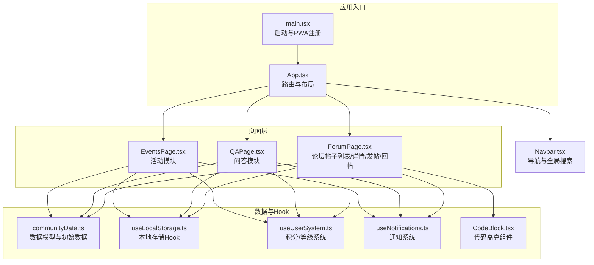
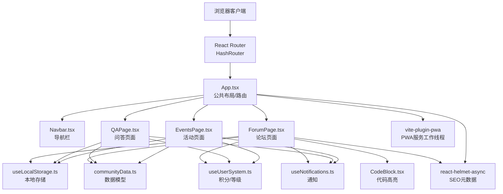
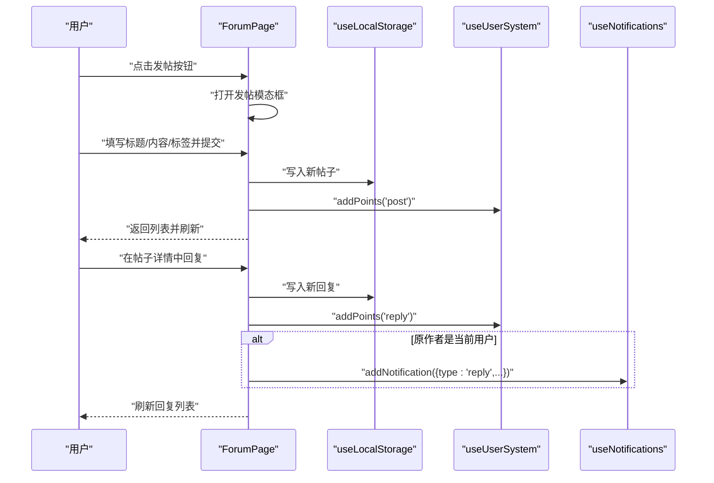
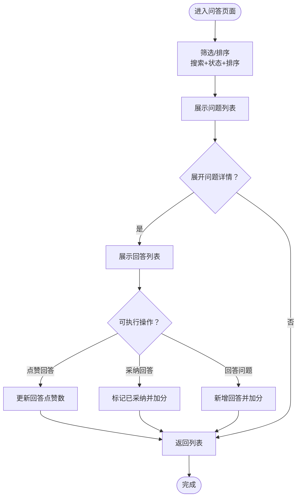
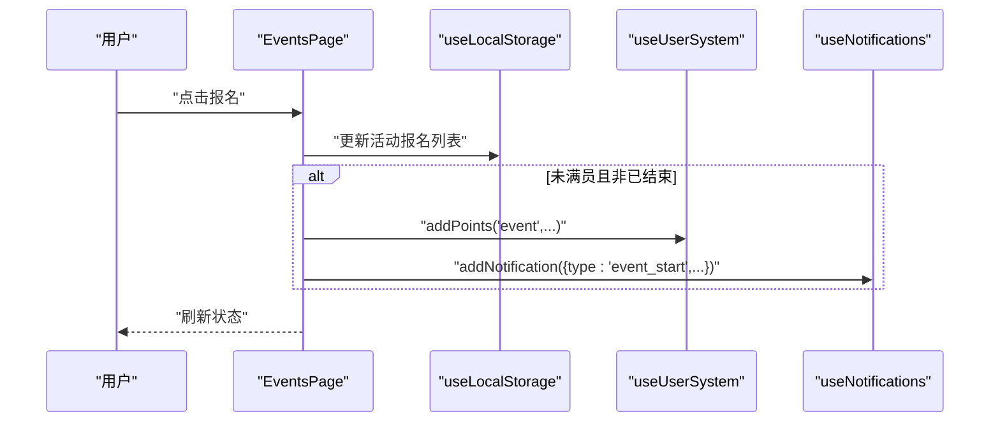
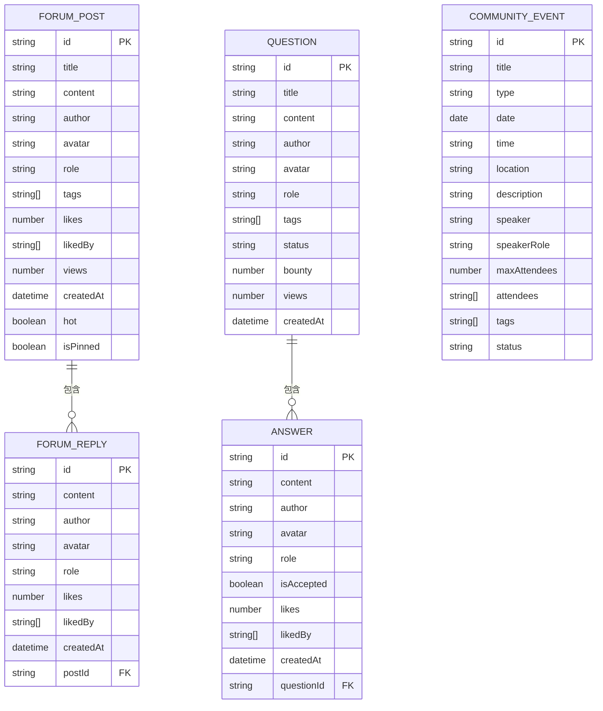
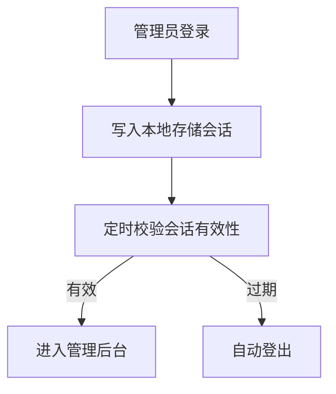
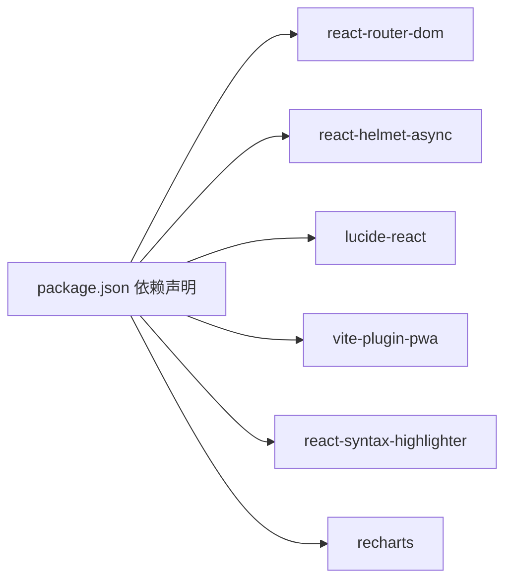

# 技术论坛

<cite>
**本文档引用的文件**
- [ForumPage.tsx](file://src/pages/ForumPage.tsx)
- [communityData.ts](file://src/data/communityData.ts)
- [useUserSystem.ts](file://src/hooks/useUserSystem.ts)
- [useNotifications.ts](file://src/hooks/useNotifications.ts)
- [useLocalStorage.ts](file://src/hooks/useLocalStorage.ts)
- [CodeBlock.tsx](file://src/components/CodeBlock.tsx)
- [QAPage.tsx](file://src/pages/QAPage.tsx)
- [EventsPage.tsx](file://src/pages/EventsPage.tsx)
- [App.tsx](file://src/App.tsx)
- [main.tsx](file://src/main.tsx)
- [Navbar.tsx](file://src/components/Navbar.tsx)
- [useAdminAuth.ts](file://src/hooks/useAdminAuth.ts)
- [package.json](file://package.json)
</cite>

## 目录
1. [简介](#简介)
2. [项目结构](#项目结构)
3. [核心组件](#核心组件)
4. [架构总览](#架构总览)
5. [详细组件分析](#详细组件分析)
6. [依赖分析](#依赖分析)
7. [性能考虑](#性能考虑)
8. [故障排查指南](#故障排查指南)
9. [结论](#结论)
10. [附录](#附录)

## 简介
本文件面向YuleTech社区的技术论坛功能，系统性梳理论坛架构与实现细节，覆盖以下主题：
- 帖子列表展示、帖子详情页面、发帖与回帖流程
- 主题分类与标签管理机制
- 热门话题推荐策略
- 用户权限控制与内容审核思路
- 社交互动能力（点赞、回复等）
- 数据模型设计与实体关系
- 性能优化策略（分页/懒加载/缓存）
- SEO优化与搜索引擎友好URL

## 项目结构
论坛功能主要位于src/pages与src/data目录中，采用按页面拆分的组织方式，结合自定义Hook实现状态与业务逻辑，使用本地存储持久化数据。

**图表来源**
- [main.tsx:1-22](file://src/main.tsx#L1-L22)
- [App.tsx:30-115](file://src/App.tsx#L30-L115)
- [ForumPage.tsx:63-544](file://src/pages/ForumPage.tsx#L63-L544)
- [QAPage.tsx:37-504](file://src/pages/QAPage.tsx#L37-L504)
- [EventsPage.tsx:33-498](file://src/pages/EventsPage.tsx#L33-L498)
- [communityData.ts:1-371](file://src/data/communityData.ts#L1-L371)
- [useLocalStorage.ts:1-60](file://src/hooks/useLocalStorage.ts#L1-L60)
- [useUserSystem.ts:91-135](file://src/hooks/useUserSystem.ts#L91-L135)
- [useNotifications.ts:17-50](file://src/hooks/useNotifications.ts#L17-L50)
- [CodeBlock.tsx:1-49](file://src/components/CodeBlock.tsx#L1-L49)
- [Navbar.tsx:9-204](file://src/components/Navbar.tsx#L9-L204)

**章节来源**
- [main.tsx:1-22](file://src/main.tsx#L1-L22)
- [App.tsx:30-115](file://src/App.tsx#L30-L115)
- [ForumPage.tsx:63-544](file://src/pages/ForumPage.tsx#L63-L544)
- [QAPage.tsx:37-504](file://src/pages/QAPage.tsx#L37-L504)
- [EventsPage.tsx:33-498](file://src/pages/EventsPage.tsx#L33-L498)

## 核心组件
- 论坛页面：负责帖子列表筛选、排序、详情弹窗、发帖与回帖交互，支持富文本渲染与代码块高亮。
- 问答页面：支持问题发布、悬赏、答案提交、采纳回答与点赞。
- 活动页面：支持活动发布、报名、状态管理与提醒。
- 数据模型：定义帖子、回复、问题、答案、活动等实体结构及初始数据。
- 用户系统：积分规则、等级阈值、历史记录；支持动态配置。
- 通知系统：本地存储通知队列，支持标记已读与未读计数。
- 本地存储Hook：跨组件共享状态与持久化，监听存储变化事件。
- 代码高亮组件：基于Prism语法高亮，适配深色/浅色主题切换。
- 管理员鉴权：本地存储管理员会话，带超时校验。

**章节来源**
- [ForumPage.tsx:63-544](file://src/pages/ForumPage.tsx#L63-L544)
- [QAPage.tsx:37-504](file://src/pages/QAPage.tsx#L37-L504)
- [EventsPage.tsx:33-498](file://src/pages/EventsPage.tsx#L33-L498)
- [communityData.ts:1-371](file://src/data/communityData.ts#L1-L371)
- [useUserSystem.ts:91-135](file://src/hooks/useUserSystem.ts#L91-L135)
- [useNotifications.ts:17-50](file://src/hooks/useNotifications.ts#L17-L50)
- [useLocalStorage.ts:1-60](file://src/hooks/useLocalStorage.ts#L1-L60)
- [CodeBlock.tsx:1-49](file://src/components/CodeBlock.tsx#L1-L49)
- [useAdminAuth.ts:29-66](file://src/hooks/useAdminAuth.ts#L29-L66)

## 架构总览
论坛采用前端单页应用架构，通过React Router进行页面级路由，页面内以组件化方式组织功能模块。数据通过本地存储持久化，用户行为（发帖、回帖、点赞、报名等）即时更新UI并写入本地存储。SEO通过react-helmet-async注入页面标题与描述，PWA通过vite-plugin-pwa提供离线能力。

**图表来源**
- [App.tsx:30-115](file://src/App.tsx#L30-L115)
- [ForumPage.tsx:63-544](file://src/pages/ForumPage.tsx#L63-L544)
- [QAPage.tsx:37-504](file://src/pages/QAPage.tsx#L37-L504)
- [EventsPage.tsx:33-498](file://src/pages/EventsPage.tsx#L33-L498)
- [useLocalStorage.ts:1-60](file://src/hooks/useLocalStorage.ts#L1-L60)
- [communityData.ts:1-371](file://src/data/communityData.ts#L1-L371)
- [useUserSystem.ts:91-135](file://src/hooks/useUserSystem.ts#L91-L135)
- [useNotifications.ts:17-50](file://src/hooks/useNotifications.ts#L17-L50)
- [CodeBlock.tsx:1-49](file://src/components/CodeBlock.tsx#L1-L49)
- [main.tsx:1-22](file://src/main.tsx#L1-L22)
- [package.json:12-26](file://package.json#L12-L26)

**章节来源**
- [App.tsx:30-115](file://src/App.tsx#L30-L115)
- [main.tsx:1-22](file://src/main.tsx#L1-L22)
- [package.json:12-26](file://package.json#L12-L26)

## 详细组件分析

### 论坛页面（ForumPage）
- 列表展示与筛选
  - 支持按标题/内容关键词搜索、按标签过滤、按发布时间/回复数/点赞数/浏览量排序。
  - 支持置顶与“热门”标识显示。
- 详情弹窗
  - 点击进入帖子详情，支持原帖与回复列表展示，支持回复输入与提交。
- 发帖与回帖
  - 新帖创建支持标题、内容、标签输入；回帖创建支持内容输入与提交。
  - 回帖与原帖点赞逻辑独立维护，支持取消点赞。
- 富文本与代码高亮
  - 使用正则解析代码块，渲染代码高亮组件，其余文本保持原格式。
- 用户积分与通知
  - 发帖/回帖增加积分；回帖触发通知提醒作者。
- SEO与URL
  - 页面标题与描述通过Helmet注入；使用HashRouter，URL形如/forum。

**图表来源**
- [ForumPage.tsx:139-194](file://src/pages/ForumPage.tsx#L139-L194)
- [useLocalStorage.ts:1-60](file://src/hooks/useLocalStorage.ts#L1-L60)
- [useUserSystem.ts:97-111](file://src/hooks/useUserSystem.ts#L97-L111)
- [useNotifications.ts:20-28](file://src/hooks/useNotifications.ts#L20-L28)

**章节来源**
- [ForumPage.tsx:63-544](file://src/pages/ForumPage.tsx#L63-L544)
- [useUserSystem.ts:91-135](file://src/hooks/useUserSystem.ts#L91-L135)
- [useNotifications.ts:17-50](file://src/hooks/useNotifications.ts#L17-L50)
- [CodeBlock.tsx:1-49](file://src/components/CodeBlock.tsx#L1-L49)

### 问答页面（QAPage）
- 问题列表与筛选
  - 支持按标题/内容搜索、按状态（全部/未解决/已解决）过滤、按发布时间/悬赏/浏览量排序。
- 问题详情与回答
  - 展示问题详情与回答列表，支持展开/折叠；回答可点赞；未解决状态下可采纳回答。
- 提问与回答
  - 提问支持悬赏积分设置；回答提交后增加积分并通知作者。
- SEO与URL
  - 页面标题与描述通过Helmet注入；URL形如/qa。

**图表来源**
- [QAPage.tsx:53-171](file://src/pages/QAPage.tsx#L53-L171)
- [useUserSystem.ts:97-111](file://src/hooks/useUserSystem.ts#L97-L111)
- [useNotifications.ts:20-28](file://src/hooks/useNotifications.ts#L20-L28)

**章节来源**
- [QAPage.tsx:37-504](file://src/pages/QAPage.tsx#L37-L504)
- [useUserSystem.ts:91-135](file://src/hooks/useUserSystem.ts#L91-L135)
- [useNotifications.ts:17-50](file://src/hooks/useNotifications.ts#L17-L50)

### 活动页面（EventsPage）
- 活动列表与筛选
  - 支持按标题/描述搜索、按类型（线上/线下）与状态（即将开始/进行中/已结束）过滤。
- 报名与提醒
  - 支持报名/取消报名；当活动临近开始时推送提醒通知；报名成功增加积分。
- SEO与URL
  - 页面标题与描述通过Helmet注入；URL形如/events。

**图表来源**
- [EventsPage.tsx:65-88](file://src/pages/EventsPage.tsx#L65-L88)
- [useUserSystem.ts:97-111](file://src/hooks/useUserSystem.ts#L97-L111)
- [useNotifications.ts:20-28](file://src/hooks/useNotifications.ts#L20-L28)

**章节来源**
- [EventsPage.tsx:33-498](file://src/pages/EventsPage.tsx#L33-L498)
- [useUserSystem.ts:91-135](file://src/hooks/useUserSystem.ts#L91-L135)
- [useNotifications.ts:17-50](file://src/hooks/useNotifications.ts#L17-L50)

### 数据模型与实体关系
论坛涉及的核心实体包括：论坛帖子、回复、问答问题、答案、活动。它们之间存在一对多关系（帖子-回复、问题-答案），并共享通用字段（作者、角色、时间戳等）。

**图表来源**
- [communityData.ts:1-70](file://src/data/communityData.ts#L1-L70)

**章节来源**
- [communityData.ts:1-371](file://src/data/communityData.ts#L1-L371)

### 用户权限与内容审核
- 管理员鉴权
  - 本地存储管理员登录状态，带会话超时校验；提供登录/登出方法。
- 内容审核
  - 当前实现为本地演示，未接入后端审核流程；可在迁移至后端时扩展为：管理员可标记违规内容、屏蔽敏感词、冻结账号等。

**图表来源**
- [useAdminAuth.ts:29-66](file://src/hooks/useAdminAuth.ts#L29-L66)

**章节来源**
- [useAdminAuth.ts:1-67](file://src/hooks/useAdminAuth.ts#L1-L67)

### 社交功能实现
- 点赞：支持帖子与回复点赞，支持取消点赞；维护likedBy集合与likes计数。
- 回复：支持在帖子详情中输入回复并提交；回帖作者获得积分与通知。
- 通知：本地存储通知队列，支持标记已读/全部已读与未读计数。
- 积分：定义发帖、回帖、回答、采纳回答、活动报名等动作的积分规则，支持动态配置。

**章节来源**
- [ForumPage.tsx:105-165](file://src/pages/ForumPage.tsx#L105-L165)
- [QAPage.tsx:68-142](file://src/pages/QAPage.tsx#L68-L142)
- [useNotifications.ts:17-50](file://src/hooks/useNotifications.ts#L17-L50)
- [useUserSystem.ts:20-47](file://src/hooks/useUserSystem.ts#L20-L47)

### SEO与URL结构
- SEO
  - 每个页面通过Helmet注入标题与描述，提升搜索引擎可见性。
- URL结构
  - 使用HashRouter，页面URL形如/forum、/qa、/events等，便于静态部署与分享。

**章节来源**
- [ForumPage.tsx:210-216](file://src/pages/ForumPage.tsx#L210-L216)
- [QAPage.tsx:187-192](file://src/pages/QAPage.tsx#L187-L192)
- [EventsPage.tsx:170-175](file://src/pages/EventsPage.tsx#L170-L175)
- [main.tsx:1-22](file://src/main.tsx#L1-L22)

## 依赖分析
- 路由与SEO
  - react-router-dom：页面路由；react-helmet-async：页面元数据注入。
- 主题与UI
  - lucide-react：图标；TailwindCSS：样式；recharts：图表（后台模块）。
- 代码高亮
  - react-syntax-highlighter：代码块高亮。
- PWA
  - vite-plugin-pwa：提供Service Worker与离线能力。

**图表来源**
- [package.json:12-26](file://package.json#L12-L26)

**章节来源**
- [package.json:12-26](file://package.json#L12-L26)

## 性能考虑
- 分页加载
  - 当前为全量渲染，建议在帖子/问答/活动列表引入虚拟滚动或分页加载，减少DOM节点数量。
- 图片懒加载
  - 若富文本中包含图片，建议使用IntersectionObserver实现懒加载，降低首屏压力。
- 缓存机制
  - 已使用本地存储持久化数据；可进一步引入IndexedDB或内存缓存策略，避免重复解析与渲染。
- 代码分割
  - 页面已使用React.lazy与Suspense，建议对大型组件（如图表、编辑器）单独拆包。
- 事件节流/防抖
  - 搜索与筛选建议加入防抖，减少频繁重排与渲染。
- PWA与离线
  - 已集成PWA，建议配置合适的缓存策略与更新提示，提升离线体验。

[本节为通用性能建议，不直接分析具体文件]

## 故障排查指南
- 页面空白或路由异常
  - 检查HashRouter配置与路由表；确认页面组件导出与路径一致。
- 本地存储异常
  - 检查localStorage可用性与容量；确认useLocalStorage事件监听是否正常触发。
- 通知未显示
  - 检查通知队列长度限制与未读计数计算；确认通知类型与链接配置。
- 代码高亮不生效
  - 检查主题切换逻辑与Prism样式；确认语言标识是否正确传递。
- PWA离线不可用
  - 检查Service Worker注册与缓存策略；确认manifest与图标资源可用。

**章节来源**
- [useLocalStorage.ts:1-60](file://src/hooks/useLocalStorage.ts#L1-L60)
- [useNotifications.ts:17-50](file://src/hooks/useNotifications.ts#L17-L50)
- [CodeBlock.tsx:1-49](file://src/components/CodeBlock.tsx#L1-L49)
- [main.tsx:1-22](file://src/main.tsx#L1-L22)

## 结论
YuleTech社区论坛采用轻量级前端架构，通过本地存储实现数据持久化，结合积分与通知体系构建了完整的社区互动闭环。当前实现适合演示与小规模社区使用，后续可围绕性能优化、内容审核与后端对接进行增强，以支撑更大规模的用户与内容增长。

[本节为总结性内容，不直接分析具体文件]

## 附录
- 热门话题推荐算法（建议实现）
  - 基于热度指标：近期点赞/回复/浏览加权；置顶优先；人工置顶。
  - 基于标签：热门标签聚合；跨标签交叉推荐。
  - 基于用户画像：根据用户历史行为与标签偏好进行个性化推荐。
- 权限控制与内容审核（建议实现）
  - 角色体系：普通用户、版主、管理员；不同角色具备不同操作权限。
  - 审核流程：内容提交后进入待审队列；管理员可快速审核/拒绝；违规内容自动屏蔽与封禁。
- SEO优化建议
  - 结构化数据：为帖子/问答/活动添加Schema；提升搜索结果丰富度。
  - 友好URL：若迁移到History Router，建议生成静态HTML与sitemap。
  - 多语言支持：为国际化做准备，提前分离文案与路由参数。

[本节为概念性建议，不直接分析具体文件]