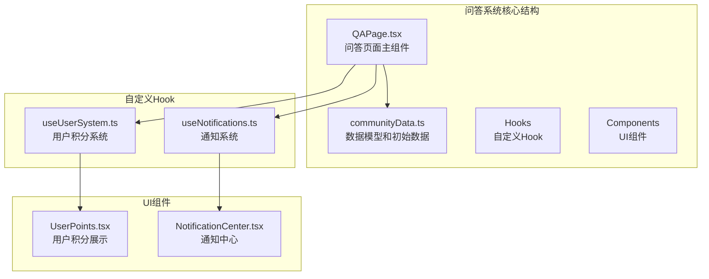
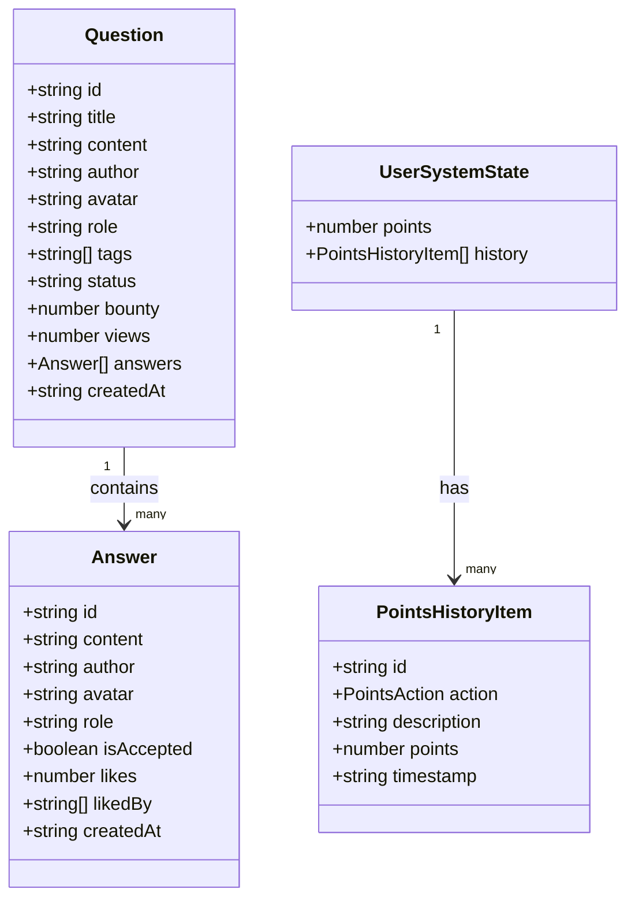
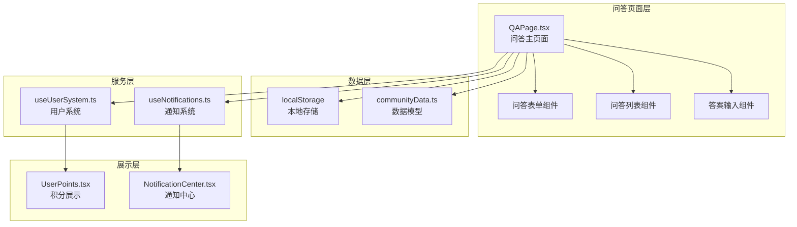
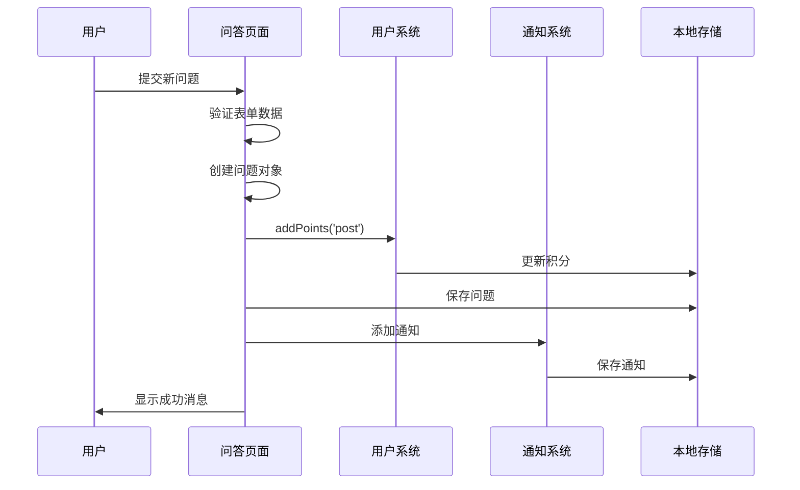
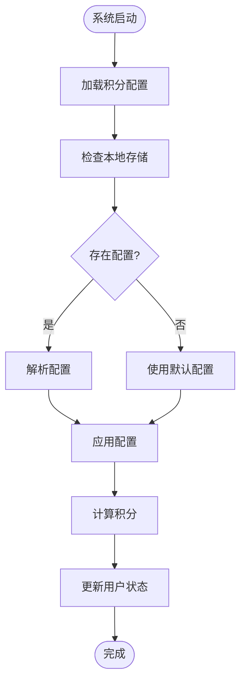
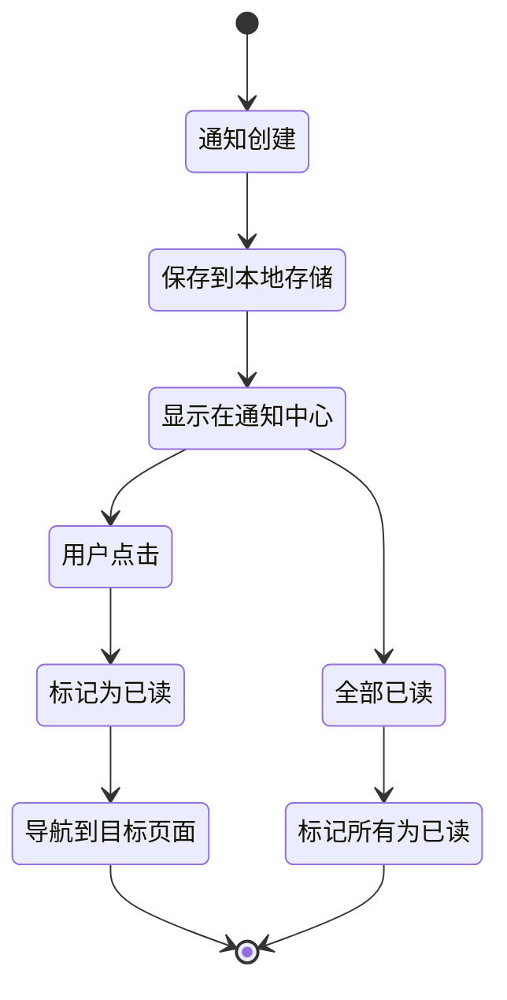
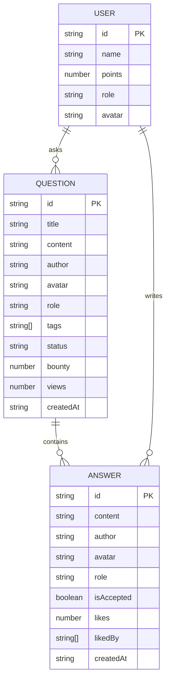
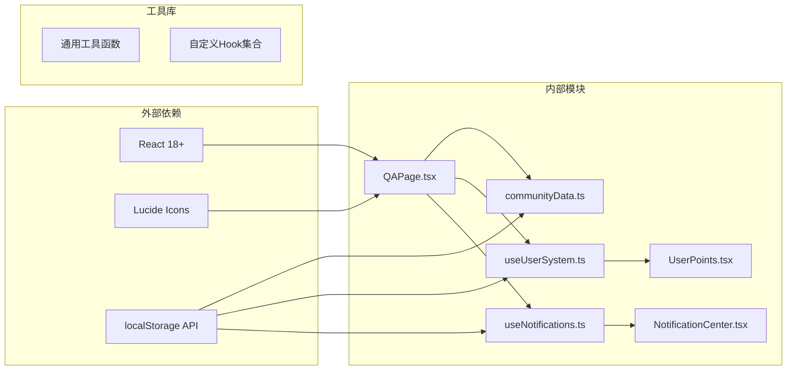

# 技术问答系统

<cite>
**本文档引用的文件**
- [QAPage.tsx](file://src/pages/QAPage.tsx)
- [communityData.ts](file://src/data/communityData.ts)
- [useUserSystem.ts](file://src/hooks/useUserSystem.ts)
- [useNotifications.ts](file://src/hooks/useNotifications.ts)
- [UserPoints.tsx](file://src/components/UserPoints.tsx)
- [NotificationCenter.tsx](file://src/components/NotificationCenter.tsx)
- [CommunityPage.tsx](file://src/pages/CommunityPage.tsx)
- [AdminSettings.tsx](file://src/pages/AdminSettings.tsx)
</cite>

## 目录
1. [简介](#简介)
2. [项目结构](#项目结构)
3. [核心组件](#核心组件)
4. [架构概览](#架构概览)
5. [详细组件分析](#详细组件分析)
6. [依赖关系分析](#依赖关系分析)
7. [性能考虑](#性能考虑)
8. [故障排除指南](#故障排除指南)
9. [结论](#结论)

## 简介

YuleTech社区技术问答系统是一个基于React和TypeScript构建的现代化问答平台，专为AutoSAR和汽车软件开发者设计。该系统提供了完整的问答功能，包括问题发布、答案提交、悬赏机制、答案采纳流程、积分奖励系统和实时通知等功能。

系统采用本地存储持久化方案，支持离线使用，同时具备良好的扩展性和可维护性。问答系统集成了社区的积分体系、等级制度和通知中心，为用户提供完整的社区参与体验。

## 项目结构

技术问答系统位于YuleTech社区项目的`src/pages`目录下，主要包含以下核心文件：

**图表来源**
- [QAPage.tsx:1-504](file://src/pages/QAPage.tsx#L1-L504)
- [communityData.ts:1-371](file://src/data/communityData.ts#L1-L371)
- [useUserSystem.ts:1-135](file://src/hooks/useUserSystem.ts#L1-L135)

**章节来源**
- [QAPage.tsx:1-504](file://src/pages/QAPage.tsx#L1-L504)
- [communityData.ts:1-371](file://src/data/communityData.ts#L1-L371)

## 核心组件

### 数据模型设计

问答系统采用类型安全的数据模型设计，确保数据的一致性和完整性：

**图表来源**
- [communityData.ts:29-54](file://src/data/communityData.ts#L29-L54)
- [useUserSystem.ts:7-18](file://src/hooks/useUserSystem.ts#L7-L18)

### 用户积分系统

系统实现了完整的积分奖励机制，支持多种行为触发积分增长：

| 行为类型 | 默认积分值 | 描述 |
|---------|-----------|------|
| 发布问题 | 10 | 用户发布新问题时获得的积分 |
| 回答问题 | 15 | 用户回答问题时获得的积分 |
| 回答被采纳 | 50 | 用户的回答被问题提出者采纳时获得的积分 |
| 参加活动 | 20 | 用户参加社区活动时获得的积分 |
| 回复帖子 | 5 | 用户回复论坛帖子时获得的积分 |

**章节来源**
- [useUserSystem.ts:20-34](file://src/hooks/useUserSystem.ts#L20-L34)
- [QAPage.tsx:104-112](file://src/pages/QAPage.tsx#L104-L112)

## 架构概览

技术问答系统采用模块化的架构设计，各组件职责清晰，耦合度低：

**图表来源**
- [QAPage.tsx:37-51](file://src/pages/QAPage.tsx#L37-L51)
- [useUserSystem.ts:91-132](file://src/hooks/useUserSystem.ts#L91-L132)

## 详细组件分析

### 问答页面组件 (QAPage)

问答页面是系统的核心组件，负责管理整个问答流程：

#### 主要功能特性

1. **问题管理**：支持问题的创建、搜索、过滤和排序
2. **答案交互**：提供答案提交、点赞和采纳功能
3. **悬赏机制**：支持悬赏积分设置和奖励发放
4. **状态管理**：维护问题的开放/解决状态

#### 关键实现细节

**图表来源**
- [QAPage.tsx:144-171](file://src/pages/QAPage.tsx#L144-L171)
- [useUserSystem.ts:97-111](file://src/hooks/useUserSystem.ts#L97-L111)

#### 排序和筛选机制

系统支持多种排序方式和筛选条件：

| 排序选项 | 排序依据 | 用户界面标签 |
|---------|---------|-------------|
| newest | 创建时间 | 最新提问 |
| bounty | 悬赏积分 | 悬赏最高 |
| views | 浏览次数 | 最多浏览 |

| 状态筛选 | 筛选条件 | 用户界面标签 |
|---------|---------|-------------|
| all | 所有问题 | 全部 |
| open | 未解决状态 | 未解决 |
| resolved | 已解决状态 | 已解决 |

**章节来源**
- [QAPage.tsx:25-35](file://src/pages/QAPage.tsx#L25-L35)
- [QAPage.tsx:53-66](file://src/pages/QAPage.tsx#L53-L66)

### 用户积分系统 (useUserSystem)

用户积分系统是问答系统的重要组成部分，负责管理用户的积分获取、消耗和等级提升：

#### 积分规则配置

系统支持动态配置积分规则，管理员可以通过管理界面调整各项行为的积分值：

**图表来源**
- [useUserSystem.ts:36-47](file://src/hooks/useUserSystem.ts#L36-L47)
- [useUserSystem.ts:91-132](file://src/hooks/useUserSystem.ts#L91-L132)

#### 等级制度设计

系统实现了灵活的等级制度，支持自定义等级阈值：

| 等级 | 等级名称 | 积分范围 | 描述 |
|------|---------|---------|------|
| 1 | 初级工程师 | 0 - 100 | 新手工程师 |
| 2 | 中级工程师 | 101 - 500 | 有一定经验的工程师 |
| 3 | 高级工程师 | 501 - 2000 | 资深工程师 |
| 4 | 技术专家 | 2001+ | 顶级专家 |

**章节来源**
- [useUserSystem.ts:49-89](file://src/hooks/useUserSystem.ts#L49-L89)

### 通知系统 (useNotifications)

通知系统为用户提供了实时的消息提醒功能，支持多种通知类型的分类管理：

#### 通知类型定义

| 通知类型 | 图标 | 颜色主题 | 用途 |
|---------|------|---------|------|
| reply | MessageSquare | 蓝色 | 回复提醒 |
| answer | HelpCircle | 橙色 | 新回答通知 |
| event_start | Calendar | 绿色 | 活动开始提醒 |
| points_change | Star | 紫色 | 积分变化通知 |

#### 通知管理流程

**图表来源**
- [useNotifications.ts:17-49](file://src/hooks/useNotifications.ts#L17-L49)
- [NotificationCenter.tsx:14-103](file://src/components/NotificationCenter.tsx#L14-L103)

**章节来源**
- [useNotifications.ts:5-15](file://src/hooks/useNotifications.ts#L5-L15)
- [NotificationCenter.tsx:7-12](file://src/components/NotificationCenter.tsx#L7-L12)

### 数据模型详解

问答系统的核心数据模型设计体现了良好的面向对象原则和数据一致性保障：

#### 问答实体关系

**图表来源**
- [communityData.ts:41-54](file://src/data/communityData.ts#L41-L54)
- [communityData.ts:29-39](file://src/data/communityData.ts#L29-L39)

#### 初始化数据结构

系统提供了丰富的初始化数据，用于演示和测试：

| 数据类型 | 数量 | 用途 |
|---------|------|------|
| 问答问题 | 3个 | 展示问答功能 |
| 论坛帖子 | 5个 | 展示社区功能 |
| 社区活动 | 4个 | 展示活动功能 |
| 问答答案 | 3个 | 展示答案交互 |

**章节来源**
- [communityData.ts:218-296](file://src/data/communityData.ts#L218-L296)

## 依赖关系分析

技术问答系统的依赖关系清晰明确，各模块之间通过接口进行解耦：

**图表来源**
- [QAPage.tsx:1-23](file://src/pages/QAPage.tsx#L1-L23)
- [useUserSystem.ts:1-4](file://src/hooks/useUserSystem.ts#L1-L4)

### 组件间通信机制

系统采用React的单向数据流模式，通过props和状态提升实现组件间通信：

1. **父组件到子组件**：通过props传递数据和回调函数
2. **子组件到父组件**：通过回调函数向上级传递事件
3. **全局状态管理**：通过自定义Hook管理共享状态

**章节来源**
- [QAPage.tsx:37-51](file://src/pages/QAPage.tsx#L37-L51)
- [useUserSystem.ts:91-132](file://src/hooks/useUserSystem.ts#L91-L132)

## 性能考虑

技术问答系统在设计时充分考虑了性能优化，采用了多种策略来提升用户体验：

### 本地存储优化

- **增量更新**：使用状态更新函数避免不必要的重渲染
- **数据序列化**：合理处理复杂数据结构的序列化和反序列化
- **内存管理**：及时清理不再使用的数据引用

### 渲染性能优化

- **虚拟滚动**：对于大量问答数据，可考虑实现虚拟滚动
- **懒加载**：图片和代码块采用懒加载策略
- **防抖处理**：搜索和筛选操作使用防抖优化

### 状态管理优化

- **状态分离**：将问答状态和用户状态分离管理
- **局部状态**：仅在必要范围内维护组件状态
- **缓存策略**：对计算结果进行缓存避免重复计算

## 故障排除指南

### 常见问题及解决方案

#### 问答数据丢失

**问题描述**：用户刷新页面后问答数据消失

**可能原因**：
- 浏览器禁用了localStorage
- 浏览器隐私设置阻止了本地存储
- 浏览器缓存问题

**解决方案**：
1. 检查浏览器的localStorage功能是否正常
2. 确认网站权限设置允许使用本地存储
3. 清理浏览器缓存后重新访问

#### 积分显示异常

**问题描述**：用户积分不正确或不更新

**可能原因**：
- 积分规则配置错误
- 本地存储损坏
- 浏览器兼容性问题

**解决方案**：
1. 检查管理员设置中的积分规则
2. 清除浏览器本地存储数据
3. 使用支持localStorage的现代浏览器

#### 通知不显示

**问题描述**：用户收不到系统通知

**可能原因**：
- 浏览器通知权限未授权
- JavaScript错误阻止了通知初始化
- 通知系统状态异常

**解决方案**：
1. 检查浏览器通知权限设置
2. 查看浏览器控制台是否有JavaScript错误
3. 重新加载页面或重启浏览器

**章节来源**
- [useUserSystem.ts:91-132](file://src/hooks/useUserSystem.ts#L91-L132)
- [useNotifications.ts:17-49](file://src/hooks/useNotifications.ts#L17-L49)

## 结论

YuleTech社区技术问答系统是一个设计精良、功能完善的问答平台。系统采用了现代化的React技术栈，结合TypeScript的类型安全保障，为用户提供了一个流畅、可靠的问答体验。

### 系统优势

1. **完整的功能覆盖**：从问题发布到答案采纳的全流程支持
2. **灵活的积分机制**：可配置的积分规则和等级制度
3. **实时的通知系统**：及时的消息提醒和状态更新
4. **良好的扩展性**：模块化设计便于功能扩展和维护
5. **本地存储持久化**：支持离线使用和数据持久化

### 技术特色

- **类型安全**：完整的TypeScript类型定义确保代码质量
- **响应式设计**：适配各种设备和屏幕尺寸
- **性能优化**：合理的状态管理和渲染优化策略
- **用户体验**：直观的界面设计和流畅的交互体验

### 发展建议

1. **数据库迁移**：考虑从localStorage迁移到真正的数据库
2. **实时同步**：实现多设备间的实时数据同步
3. **搜索优化**：增强问答内容的全文搜索功能
4. **社交功能**：添加关注、粉丝等社交互动功能
5. **移动端优化**：针对移动设备进行专门的界面优化

技术问答系统为YuleTech社区提供了强大的知识分享和问题解决平台，为汽车软件开发者社区的发展奠定了坚实的基础。