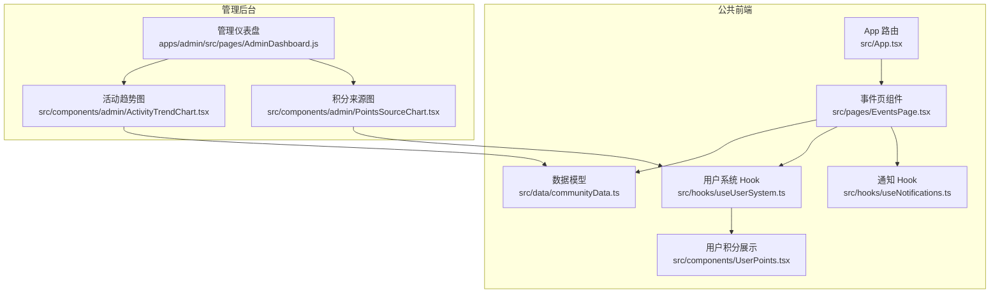
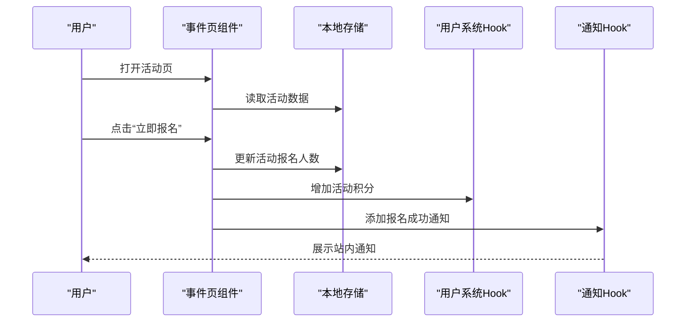
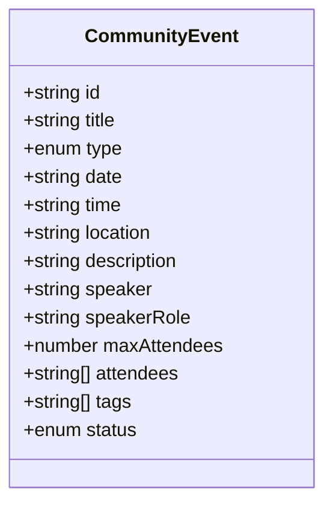
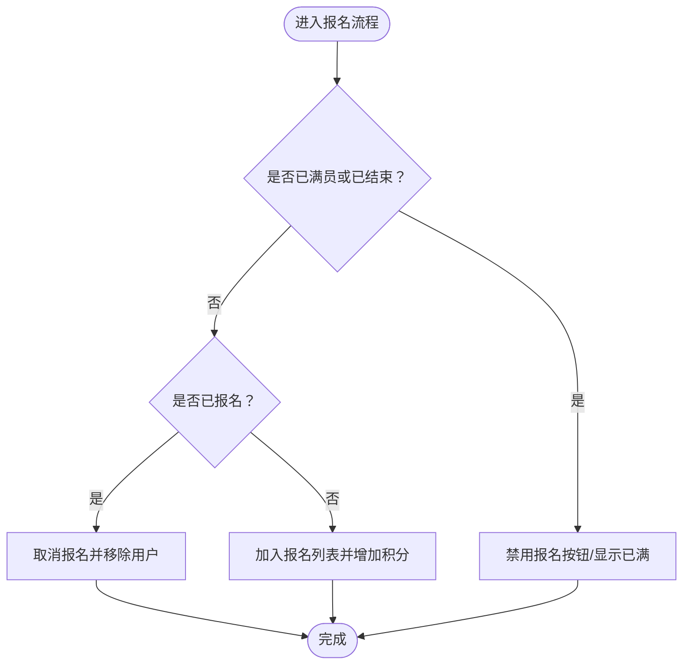
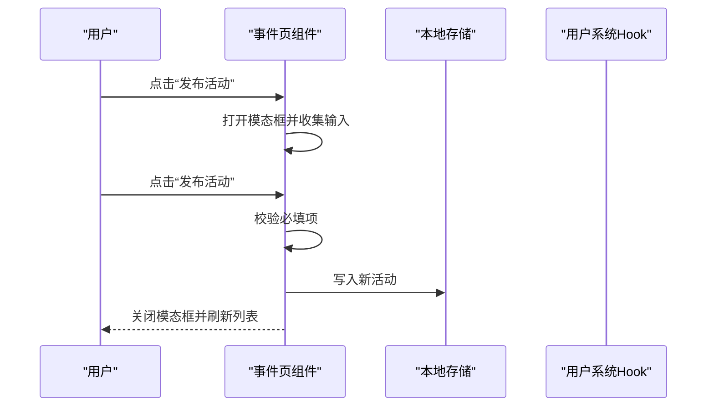
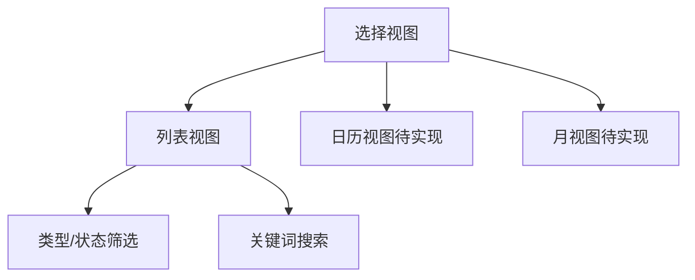
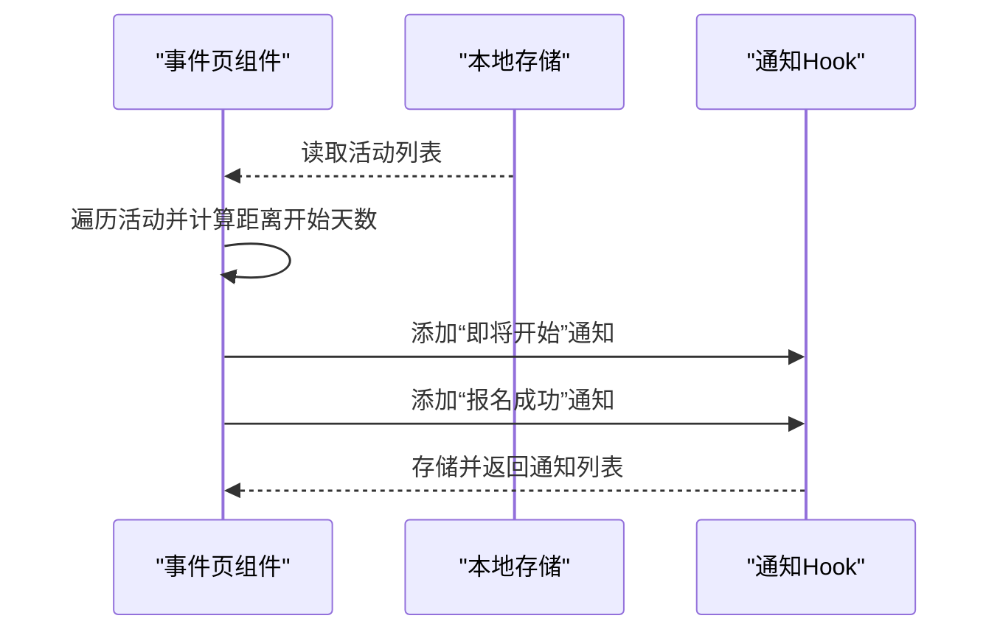
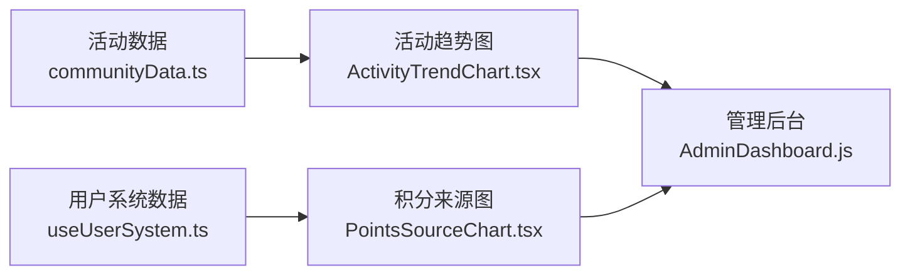
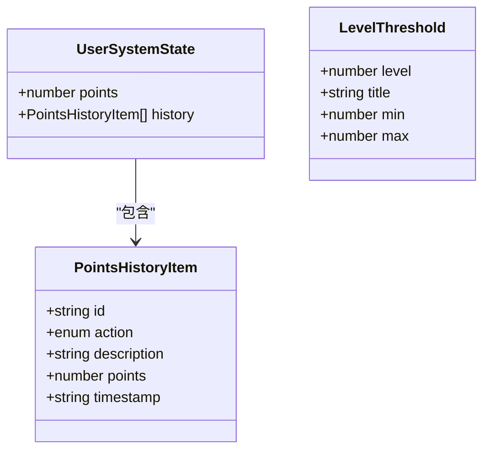
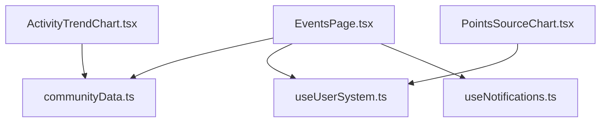

# 活动管理

<cite>
**本文引用的文件**
- [README.md](file://README.md)
- [App.tsx](file://src/App.tsx)
- [EventsPage.tsx](file://src/pages/EventsPage.tsx)
- [EventsPage.tsx（备份）](file://archive/src/pages/EventsPage.tsx)
- [EventsPage.js（社区应用）](file://apps/community/src/pages/EventsPage.js)
- [EventsPage.js（Shell应用）](file://apps/shell/src/pages/community/EventsPage.js)
- [communityData.ts](file://src/data/communityData.ts)
- [useUserSystem.ts](file://src/hooks/useUserSystem.ts)
- [useNotifications.ts](file://src/hooks/useNotifications.ts)
- [UserPoints.tsx](file://src/components/UserPoints.tsx)
- [ActivityTrendChart.tsx](file://src/components/admin/ActivityTrendChart.tsx)
- [PointsSourceChart.tsx](file://src/components/admin/PointsSourceChart.tsx)
- [AdminDashboard.js（Admin应用）](file://apps/admin/src/pages/AdminDashboard.js)
</cite>

## 目录
1. [引言](#引言)
2. [项目结构](#项目结构)
3. [核心组件](#核心组件)
4. [架构总览](#架构总览)
5. [详细组件分析](#详细组件分析)
6. [依赖关系分析](#依赖关系分析)
7. [性能考量](#性能考量)
8. [故障排查指南](#故障排查指南)
9. [结论](#结论)
10. [附录](#附录)

## 引言
本文件针对 YuleTech 社区的活动管理系统进行全面技术文档化，覆盖活动创建、编辑、发布与状态管理；活动类型分类（线上、线下、培训课程等）；报名系统（条件校验、人数限制、确认流程）；活动日历展示（时间轴/月视图/日视图切换）；通知体系（站内信、邮件、社交分享）；数据统计与分析（报名人数、参与度、效果评估）；与用户积分系统的联动（参与活动获积分、积分兑换）；以及 SEO 优化与推广策略。本文以仓库现有实现为基础，结合代码结构与组件职责，给出可操作的架构说明与扩展建议。

## 项目结构
- 页面入口与路由
  - 公共路由包含事件页面，通过懒加载方式引入事件页组件。
- 事件页组件
  - 提供活动列表、筛选、搜索、报名、发布新活动等交互。
- 数据模型
  - 使用本地存储持久化活动数据，定义活动接口与初始数据。
- 用户系统与通知
  - 提供积分规则、等级阈值、通知中心等能力。
- 管理后台图表
  - 提供活动趋势与积分来源的可视化分析。

**图表来源**
- [App.tsx:30-115](file://src/App.tsx#L30-L115)
- [EventsPage.tsx:33-497](file://src/pages/EventsPage.tsx#L33-L497)
- [communityData.ts:56-70](file://src/data/communityData.ts#L56-L70)
- [useUserSystem.ts:91-132](file://src/hooks/useUserSystem.ts#L91-L132)
- [useNotifications.ts:17-49](file://src/hooks/useNotifications.ts#L17-L49)
- [UserPoints.tsx:8-81](file://src/components/UserPoints.tsx#L8-L81)
- [ActivityTrendChart.tsx:29-128](file://src/components/admin/ActivityTrendChart.tsx#L29-L128)
- [PointsSourceChart.tsx:22-91](file://src/components/admin/PointsSourceChart.tsx#L22-L91)
- [AdminDashboard.js（Admin应用）:1-5](file://apps/admin/src/pages/AdminDashboard.js#L1-L5)

**章节来源**
- [App.tsx:30-115](file://src/App.tsx#L30-L115)
- [README.md:1-95](file://README.md#L1-L95)

## 核心组件
- 事件页组件（EventsPage）
  - 负责活动列表渲染、搜索与筛选、报名与取消报名、发布新活动、活动状态徽章显示。
  - 使用本地存储持久化活动数据，并在注册时更新报名人数与状态。
- 数据模型（communityData）
  - 定义活动接口、初始活动集合、ID 生成器，支持类型安全的数据结构。
- 用户系统（useUserSystem）
  - 提供积分增减、历史记录、等级计算与阈值配置，支持管理员动态调整规则。
- 通知系统（useNotifications）
  - 提供通知添加、标记已读、未读计数，支持事件开始前的提醒推送。
- 用户积分展示（UserPoints）
  - 展示当前积分、等级进度条与积分历史。
- 后台图表（ActivityTrendChart、PointsSourceChart）
  - 基于 recharts 提供图表，统计活动趋势与积分来源构成。

**章节来源**
- [EventsPage.tsx:33-497](file://src/pages/EventsPage.tsx#L33-L497)
- [communityData.ts:56-70](file://src/data/communityData.ts#L56-L70)
- [useUserSystem.ts:91-132](file://src/hooks/useUserSystem.ts#L91-L132)
- [useNotifications.ts:17-49](file://src/hooks/useNotifications.ts#L17-L49)
- [UserPoints.tsx:8-81](file://src/components/UserPoints.tsx#L8-L81)
- [ActivityTrendChart.tsx:29-128](file://src/components/admin/ActivityTrendChart.tsx#L29-L128)
- [PointsSourceChart.tsx:22-91](file://src/components/admin/PointsSourceChart.tsx#L22-L91)

## 架构总览
事件管理采用“前端单页应用 + 本地存储”的轻量架构：
- 路由层：App 路由统一挂载事件页。
- 页面层：事件页负责 UI、交互与状态管理。
- 数据层：本地存储保存活动、论坛、问答与用户系统数据。
- 分析层：后台图表组件消费本地数据生成可视化报表。

**图表来源**
- [EventsPage.tsx:65-88](file://src/pages/EventsPage.tsx#L65-L88)
- [useUserSystem.ts:97-111](file://src/hooks/useUserSystem.ts#L97-L111)
- [useNotifications.ts:20-28](file://src/hooks/useNotifications.ts#L20-L28)

## 详细组件分析

### 活动类型与状态管理
- 类型分类
  - 线上（online）与线下（offline），用于界面图标与筛选。
- 状态管理
  - upcoming（即将开始）、ongoing（进行中）、ended（已结束），用于状态徽章与报名按钮禁用逻辑。
- 标签与描述
  - 支持标签分组与描述展示，便于活动归类与检索。

**图表来源**
- [communityData.ts:56-70](file://src/data/communityData.ts#L56-L70)

**章节来源**
- [communityData.ts:56-70](file://src/data/communityData.ts#L56-L70)
- [EventsPage.tsx:20-31](file://src/pages/EventsPage.tsx#L20-L31)

### 报名系统与人数控制
- 报名流程
  - 用户点击“立即报名”或“已报名”，触发报名/取消报名逻辑。
  - 若未满员且活动未结束，更新报名人数并发放活动积分。
- 人数限制
  - 当报名人数达到 maxAttendees 或活动状态为 ended 时，按钮禁用或显示“名额已满”。

**图表来源**
- [EventsPage.tsx:65-88](file://src/pages/EventsPage.tsx#L65-L88)
- [useUserSystem.ts:97-111](file://src/hooks/useUserSystem.ts#L97-L111)

**章节来源**
- [EventsPage.tsx:65-88](file://src/pages/EventsPage.tsx#L65-L88)
- [useUserSystem.ts:97-111](file://src/hooks/useUserSystem.ts#L97-L111)

### 活动发布与编辑
- 发布新活动
  - 打开模态框填写标题、类型、人数上限、日期、时间、地点/链接、描述、主讲人、标签等。
  - 校验必填字段后生成唯一 ID 并写入本地存储。
- 编辑与状态变更
  - 当前实现未提供编辑入口；可通过扩展在模态框中区分“新建/编辑”模式。

**图表来源**
- [EventsPage.tsx:90-125](file://src/pages/EventsPage.tsx#L90-L125)

**章节来源**
- [EventsPage.tsx:90-125](file://src/pages/EventsPage.tsx#L90-L125)

### 活动日历与展示逻辑
- 列表视图
  - 支持按类型与状态筛选，支持关键词搜索，卡片式展示活动信息与报名按钮。
- 日历视图
  - 当前实现为列表网格布局，未包含专用的日历组件；可通过第三方库（如 FullCalendar）扩展。
- 时间轴/月视图
  - 未在现有代码中实现；可在路由层新增日历页并接入日历组件。

**图表来源**
- [EventsPage.tsx:20-31](file://src/pages/EventsPage.tsx#L20-L31)
- [EventsPage.tsx:194-235](file://src/pages/EventsPage.tsx#L194-L235)

**章节来源**
- [EventsPage.tsx:194-235](file://src/pages/EventsPage.tsx#L194-L235)

### 通知系统
- 事件提醒
  - 在活动开始前 3 天内自动推送“活动即将开始”通知。
- 站内信
  - 报名成功后推送“报名成功”通知，支持跳转至活动页。
- 通知中心
  - 提供通知列表、未读计数、标记已读/全部已读。

**图表来源**
- [EventsPage.tsx:127-143](file://src/pages/EventsPage.tsx#L127-L143)
- [useNotifications.ts:20-28](file://src/hooks/useNotifications.ts#L20-L28)

**章节来源**
- [EventsPage.tsx:127-143](file://src/pages/EventsPage.tsx#L127-L143)
- [useNotifications.ts:17-49](file://src/hooks/useNotifications.ts#L17-L49)

### 数据统计与分析
- 活动趋势图（ActivityTrendChart）
  - 统计近 14 天的互动次数，包含论坛回帖、问答回答与活动报名等。
- 积分来源图（PointsSourceChart）
  - 统计各类积分来源的累计值，支持管理员配置规则后实时更新。
- 管理仪表盘
  - 管理端入口提供图表展示，便于运营分析。

**图表来源**
- [ActivityTrendChart.tsx:29-84](file://src/components/admin/ActivityTrendChart.tsx#L29-L84)
- [PointsSourceChart.tsx:22-60](file://src/components/admin/PointsSourceChart.tsx#L22-L60)
- [AdminDashboard.js（Admin应用）:1-5](file://apps/admin/src/pages/AdminDashboard.js#L1-L5)

**章节来源**
- [ActivityTrendChart.tsx:29-128](file://src/components/admin/ActivityTrendChart.tsx#L29-L128)
- [PointsSourceChart.tsx:22-91](file://src/components/admin/PointsSourceChart.tsx#L22-L91)
- [AdminDashboard.js（Admin应用）:1-5](file://apps/admin/src/pages/AdminDashboard.js#L1-L5)

### 积分系统与奖励机制
- 积分规则
  - 默认规则包含发帖、回帖、回答、采纳、活动等动作的积分值，支持管理员通过本地存储覆盖。
- 等级体系
  - 通过阈值计算当前等级与进度条，展示在用户积分组件中。
- 奖励兑换
  - 当前未实现奖励兑换；可在用户中心扩展“积分商城”页面与兑换流程。

**图表来源**
- [useUserSystem.ts:15-89](file://src/hooks/useUserSystem.ts#L15-L89)

**章节来源**
- [useUserSystem.ts:91-132](file://src/hooks/useUserSystem.ts#L91-L132)
- [UserPoints.tsx:8-81](file://src/components/UserPoints.tsx#L8-L81)

### SEO 优化与推广策略
- SEO 建议
  - 为活动页设置动态 meta 标题与描述，结合 react-helmet-async 已在事件页中使用。
  - 为活动详情页提供结构化数据（Schema.org），提升搜索引擎可见性。
  - 使用语义化标签与可访问性属性，改善用户体验与 SEO。
- 推广策略
  - 结合通知系统与社交渠道（如 B站直播、腾讯会议）进行活动预热与回顾分享。
  - 通过后台图表分析活动参与度，优化选题与发布时间。

**章节来源**
- [EventsPage.tsx:170-175](file://src/pages/EventsPage.tsx#L170-L175)

## 依赖关系分析
- 组件耦合
  - 事件页与用户系统、通知系统存在直接依赖；数据模型独立于 UI，便于扩展。
- 外部依赖
  - 使用 recharts 进行数据可视化；使用 lucide-react 图标库；使用 react-helmet-async 管理 SEO。
- 潜在循环依赖
  - 当前结构清晰，未见循环依赖迹象。

**图表来源**
- [EventsPage.tsx:18-54](file://src/pages/EventsPage.tsx#L18-L54)
- [ActivityTrendChart.tsx:11-32](file://src/components/admin/ActivityTrendChart.tsx#L11-L32)
- [PointsSourceChart.tsx:23-26](file://src/components/admin/PointsSourceChart.tsx#L23-L26)

**章节来源**
- [EventsPage.tsx:18-54](file://src/pages/EventsPage.tsx#L18-L54)
- [ActivityTrendChart.tsx:11-32](file://src/components/admin/ActivityTrendChart.tsx#L11-L32)
- [PointsSourceChart.tsx:23-26](file://src/components/admin/PointsSourceChart.tsx#L23-L26)

## 性能考量
- 渲染优化
  - 使用虚拟滚动与分页可进一步优化大量活动列表的渲染性能。
- 本地存储
  - 避免频繁写入，批量更新或节流写入可降低抖动。
- 图表性能
  - 对于大规模数据，建议在图表组件中启用数据采样与懒加载。

## 故障排查指南
- 报名按钮异常
  - 检查活动状态与报名人数是否达到上限；确认当前用户是否已报名。
- 通知未出现
  - 确认活动开始日期与当前时间差是否在 3 天内；检查通知存储是否被清理。
- 积分未增加
  - 确认报名成功逻辑是否触发；检查用户系统本地存储是否被重置。
- 图表无数据
  - 确认本地存储中是否存在活动数据；检查图表组件依赖的数据键是否一致。

**章节来源**
- [EventsPage.tsx:65-88](file://src/pages/EventsPage.tsx#L65-L88)
- [EventsPage.tsx:127-143](file://src/pages/EventsPage.tsx#L127-L143)
- [useUserSystem.ts:97-111](file://src/hooks/useUserSystem.ts#L97-L111)
- [ActivityTrendChart.tsx:30-84](file://src/components/admin/ActivityTrendChart.tsx#L30-L84)

## 结论
YuleTech 社区活动管理系统以简洁的前端架构实现了完整的活动生命周期管理：从创建、筛选、报名到通知与统计分析。通过本地存储与 Hooks 的组合，系统具备良好的可维护性与扩展性。后续可在日历视图、社交分享、积分商城等方面继续增强，以满足更复杂的社区运营需求。

## 附录
- 路由与页面映射
  - 事件页路由：/events
  - 管理后台路由：/admin/*
- 数据持久化
  - 事件数据：localStorage 中的 yuletech-events
  - 用户系统：localStorage 中的 yuletech-user-system
  - 通知：localStorage 中的 yuletech-notifications
- 管理员配置
  - 积分规则与等级阈值可通过本地存储键 yuletech-point-rules 与 yuletech-level-thresholds 进行覆盖。

**章节来源**
- [App.tsx:90-93](file://src/App.tsx#L90-L93)
- [useUserSystem.ts:36-79](file://src/hooks/useUserSystem.ts#L36-L79)
- [useNotifications.ts:17-49](file://src/hooks/useNotifications.ts#L17-L49)