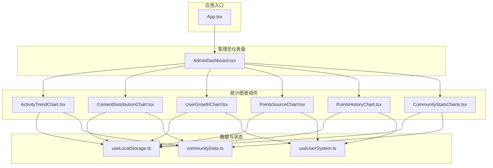
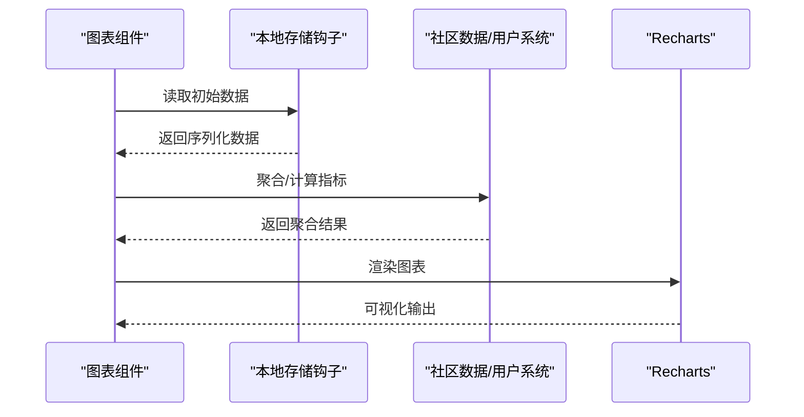
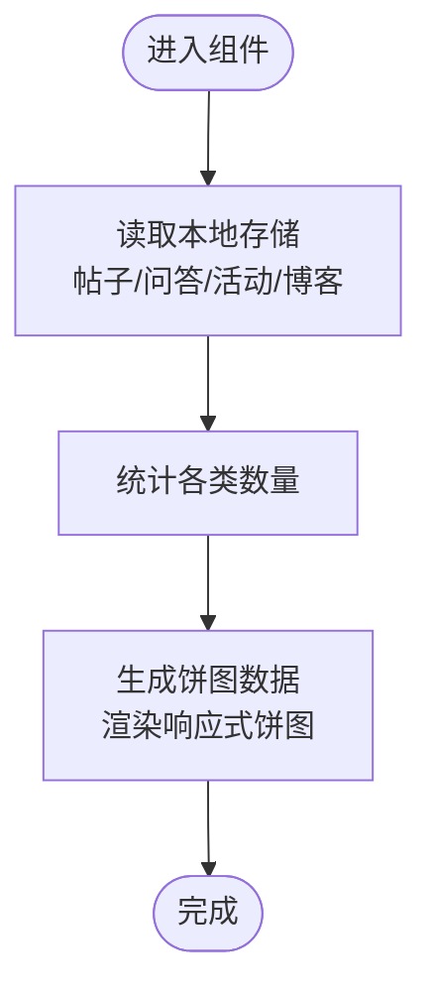
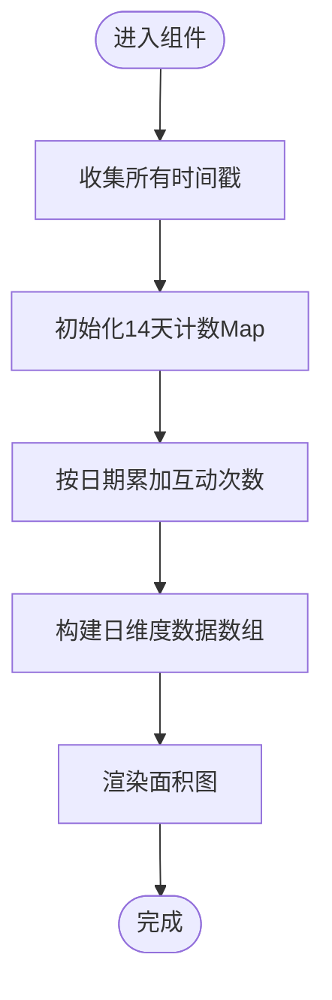
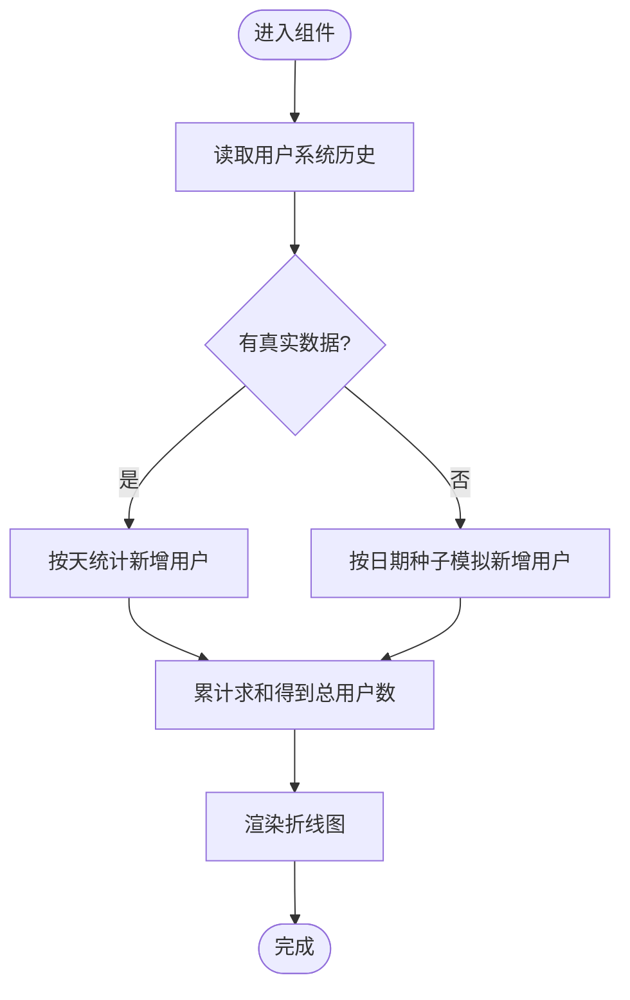
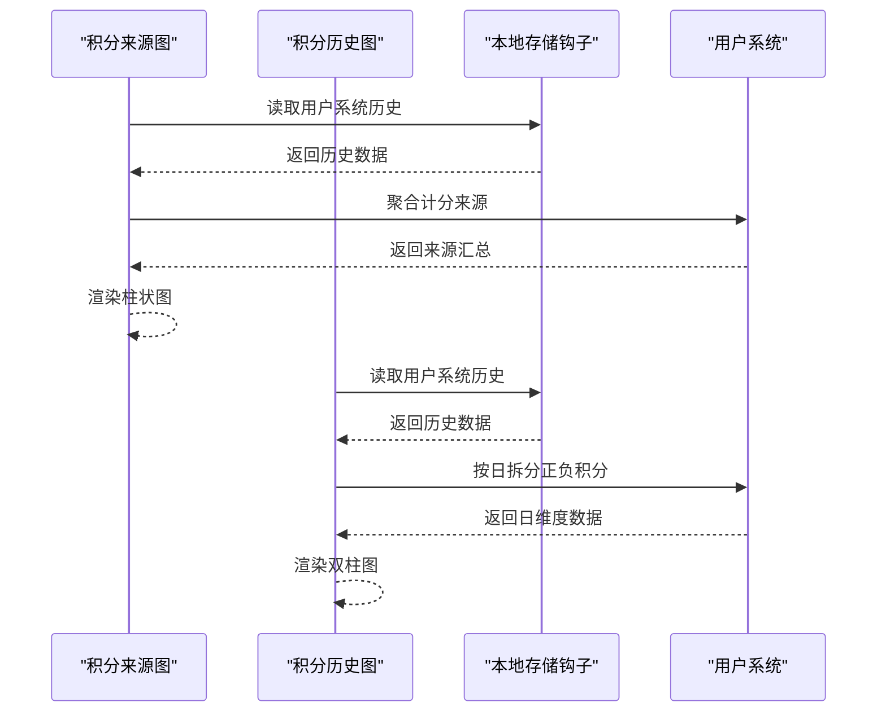
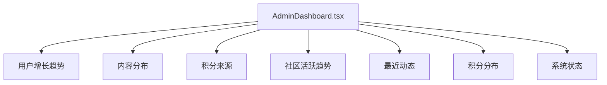
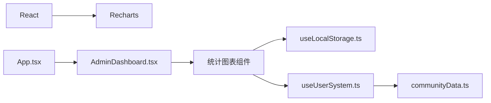

# 社区统计

<cite>
**本文引用的文件**
- [src/data/communityData.ts](file://src/data/communityData.ts)
- [src/components/admin/CommunityStatsCharts.tsx](file://src/components/admin/CommunityStatsCharts.tsx)
- [src/components/admin/ActivityTrendChart.tsx](file://src/components/admin/ActivityTrendChart.tsx)
- [src/components/admin/ContentDistributionChart.tsx](file://src/components/admin/ContentDistributionChart.tsx)
- [src/components/admin/UserGrowthChart.tsx](file://src/components/admin/UserGrowthChart.tsx)
- [src/components/admin/PointsSourceChart.tsx](file://src/components/admin/PointsSourceChart.tsx)
- [src/components/admin/PointsHistoryChart.tsx](file://src/components/admin/PointsHistoryChart.tsx)
- [src/hooks/useUserSystem.ts](file://src/hooks/useUserSystem.ts)
- [src/hooks/useLocalStorage.ts](file://src/hooks/useLocalStorage.ts)
- [src/pages/AdminDashboard.tsx](file://src/pages/AdminDashboard.tsx)
- [src/App.tsx](file://src/App.tsx)
- [package.json](file://package.json)
</cite>

## 目录
1. [简介](#简介)
2. [项目结构](#项目结构)
3. [核心组件](#核心组件)
4. [架构总览](#架构总览)
5. [详细组件分析](#详细组件分析)
6. [依赖分析](#依赖分析)
7. [性能考量](#性能考量)
8. [故障排查指南](#故障排查指南)
9. [结论](#结论)
10. [附录](#附录)

## 简介
本文件面向YuleTech社区的统计数据与可视化子系统，系统性梳理了统计图表的实现架构、数据采集与处理机制、指标计算逻辑、交互能力、导出与API能力现状、性能优化策略、隐私与合规性考虑，以及统计报告自动化与推送机制的现状说明。目标是帮助开发者与运营人员快速理解与扩展社区统计功能。

## 项目结构
统计与可视化功能主要集中在前端应用的“admin”页面与对应的图表组件中，采用React + Recharts的组合，数据通过本地存储进行持久化与跨组件共享。

**图表来源**
- [src/App.tsx:30-70](file://src/App.tsx#L30-L70)
- [src/pages/AdminDashboard.tsx:67-218](file://src/pages/AdminDashboard.tsx#L67-L218)
- [src/components/admin/ActivityTrendChart.tsx:29-129](file://src/components/admin/ActivityTrendChart.tsx#L29-L129)
- [src/components/admin/ContentDistributionChart.tsx:23-72](file://src/components/admin/ContentDistributionChart.tsx#L23-L72)
- [src/components/admin/UserGrowthChart.tsx:23-119](file://src/components/admin/UserGrowthChart.tsx#L23-L119)
- [src/components/admin/PointsSourceChart.tsx:22-92](file://src/components/admin/PointsSourceChart.tsx#L22-L92)
- [src/components/admin/PointsHistoryChart.tsx:22-114](file://src/components/admin/PointsHistoryChart.tsx#L22-L114)
- [src/components/admin/CommunityStatsCharts.tsx:36-172](file://src/components/admin/CommunityStatsCharts.tsx#L36-L172)
- [src/hooks/useLocalStorage.ts:3-59](file://src/hooks/useLocalStorage.ts#L3-L59)
- [src/hooks/useUserSystem.ts:91-132](file://src/hooks/useUserSystem.ts#L91-L132)
- [src/data/communityData.ts:72-371](file://src/data/communityData.ts#L72-L371)

**章节来源**
- [src/App.tsx:30-115](file://src/App.tsx#L30-L115)
- [src/pages/AdminDashboard.tsx:67-321](file://src/pages/AdminDashboard.tsx#L67-L321)

## 核心组件
- 内容分布图：展示论坛帖子、问答问题、社区活动、博客文章的数量占比，用于宏观了解内容生态构成。
- 社区活跃趋势图：按日统计互动次数（包含发帖、回帖、回答、活动报名等），反映社区近期活跃度变化。
- 用户增长趋势图：基于用户积分历史推导新增用户趋势，若无真实数据则模拟近30天新增用户曲线。
- 积分来源柱状图：统计各类行为产生的积分总量，帮助评估激励体系效果。
- 积分历史折线图：按日统计正负积分变化，便于追踪每日积分流入流出。
- 管理员仪表盘：聚合上述图表与系统状态信息，提供概览与导航。

**章节来源**
- [src/components/admin/ContentDistributionChart.tsx:23-72](file://src/components/admin/ContentDistributionChart.tsx#L23-L72)
- [src/components/admin/ActivityTrendChart.tsx:29-129](file://src/components/admin/ActivityTrendChart.tsx#L29-L129)
- [src/components/admin/UserGrowthChart.tsx:23-119](file://src/components/admin/UserGrowthChart.tsx#L23-L119)
- [src/components/admin/PointsSourceChart.tsx:22-92](file://src/components/admin/PointsSourceChart.tsx#L22-L92)
- [src/components/admin/PointsHistoryChart.tsx:22-114](file://src/components/admin/PointsHistoryChart.tsx#L22-L114)
- [src/pages/AdminDashboard.tsx:67-321](file://src/pages/AdminDashboard.tsx#L67-L321)

## 架构总览
统计系统以“数据层-状态层-视图层”三层组织：
- 数据层：社区数据模型（论坛、问答、活动）、用户积分系统。
- 状态层：本地存储钩子封装，提供跨组件一致的状态读写与事件通知。
- 视图层：各统计图表组件，负责数据聚合、格式化与可视化渲染。

**图表来源**
- [src/hooks/useLocalStorage.ts:3-59](file://src/hooks/useLocalStorage.ts#L3-L59)
- [src/data/communityData.ts:72-371](file://src/data/communityData.ts#L72-L371)
- [src/hooks/useUserSystem.ts:91-132](file://src/hooks/useUserSystem.ts#L91-L132)

## 详细组件分析

### 内容类型分布图
- 数据来源：本地存储的论坛帖子、问答问题、社区活动；博客文章数量来自页面数据。
- 计算逻辑：直接统计各类型条目数量，形成饼图数据集。
- 交互特性：支持悬浮提示、图例与响应式容器。

**图表来源**
- [src/components/admin/ContentDistributionChart.tsx:23-72](file://src/components/admin/ContentDistributionChart.tsx#L23-L72)
- [src/hooks/useLocalStorage.ts:3-59](file://src/hooks/useLocalStorage.ts#L3-L59)
- [src/data/communityData.ts:72-371](file://src/data/communityData.ts#L72-L371)

**章节来源**
- [src/components/admin/ContentDistributionChart.tsx:23-72](file://src/components/admin/ContentDistributionChart.tsx#L23-L72)

### 社区活跃趋势图
- 数据来源：帖子创建时间、回复创建时间、问答创建时间、回答创建时间、活动报名时间。
- 计算逻辑：统计近14天内每日互动次数，按日期标签格式化。
- 交互特性：面积图填充渐变、网格线、坐标轴样式与悬浮提示。

**图表来源**
- [src/components/admin/ActivityTrendChart.tsx:29-129](file://src/components/admin/ActivityTrendChart.tsx#L29-L129)

**章节来源**
- [src/components/admin/ActivityTrendChart.tsx:29-129](file://src/components/admin/ActivityTrendChart.tsx#L29-L129)

### 用户增长趋势图
- 数据来源：用户积分历史（按天统计新增用户）。
- 计算逻辑：若存在真实历史，则以历史天粒度统计新增用户；否则模拟近30天新增用户曲线，累计得到总用户数。
- 交互特性：双线（总用户数/新增用户），支持悬浮提示与图例。

**图表来源**
- [src/components/admin/UserGrowthChart.tsx:23-119](file://src/components/admin/UserGrowthChart.tsx#L23-L119)
- [src/hooks/useUserSystem.ts:91-132](file://src/hooks/useUserSystem.ts#L91-L132)

**章节来源**
- [src/components/admin/UserGrowthChart.tsx:23-119](file://src/components/admin/UserGrowthChart.tsx#L23-L119)

### 积分来源与历史
- 积分来源柱状图：统计各类行为产生的积分总和，作为激励效果的直观体现。
- 积分历史折线图：按日拆分正负积分，呈现每日积分流入与流出。

**图表来源**
- [src/components/admin/PointsSourceChart.tsx:22-92](file://src/components/admin/PointsSourceChart.tsx#L22-L92)
- [src/components/admin/PointsHistoryChart.tsx:22-114](file://src/components/admin/PointsHistoryChart.tsx#L22-L114)
- [src/hooks/useUserSystem.ts:91-132](file://src/hooks/useUserSystem.ts#L91-L132)

**章节来源**
- [src/components/admin/PointsSourceChart.tsx:22-92](file://src/components/admin/PointsSourceChart.tsx#L22-L92)
- [src/components/admin/PointsHistoryChart.tsx:22-114](file://src/components/admin/PointsHistoryChart.tsx#L22-L114)

### 管理员仪表盘
- 聚合展示：用户统计卡片、用户增长趋势、内容分布、积分来源、社区活跃趋势、最近动态、积分分布、系统状态。
- 数据来源：本地存储的社区数据与用户系统状态。

**图表来源**
- [src/pages/AdminDashboard.tsx:67-321](file://src/pages/AdminDashboard.tsx#L67-L321)

**章节来源**
- [src/pages/AdminDashboard.tsx:67-321](file://src/pages/AdminDashboard.tsx#L67-L321)

## 依赖分析
- React与Recharts：图表渲染与响应式布局。
- 本地存储钩子：提供跨组件状态同步与事件通知。
- 用户系统：定义积分规则、等级阈值与行为动作类型。

**图表来源**
- [package.json:12-26](file://package.json#L12-L26)
- [src/App.tsx:30-115](file://src/App.tsx#L30-L115)
- [src/pages/AdminDashboard.tsx:67-321](file://src/pages/AdminDashboard.tsx#L67-L321)

**章节来源**
- [package.json:12-26](file://package.json#L12-L26)

## 性能考量
- 渲染优化
  - 使用响应式容器与轻量级图表组件，避免不必要的重绘。
  - 对大列表数据采用分段渲染或虚拟化策略（建议）。
- 数据处理
  - 使用Memo化与浅比较，减少重复计算。
  - 对时间序列数据按天聚合，避免高频重算。
- 存储与同步
  - 本地存储读写封装提供事件通知，避免全局刷新。
  - 对大数据量场景建议引入分页或懒加载。
- 网络与外部数据
  - 当前统计数据均来自本地存储，无需网络请求；若接入外部API，应增加缓存与节流策略。
- 图表渲染
  - 面积图/折线图启用monotone类型，提升视觉连续性；对大数据集可考虑降采样或分桶聚合。

[本节为通用性能建议，不直接分析具体文件，故无“章节来源”]

## 故障排查指南
- 图表不显示或空白
  - 检查本地存储键是否存在或为空；确认初始数据是否正确注入。
  - 参考：[src/hooks/useLocalStorage.ts:3-59](file://src/hooks/useLocalStorage.ts#L3-L59)
- 数据异常或不更新
  - 确认本地存储事件监听是否生效；检查自定义事件派发逻辑。
  - 参考：[src/hooks/useLocalStorage.ts:27-56](file://src/hooks/useLocalStorage.ts#L27-L56)
- 积分规则或等级阈值不生效
  - 检查本地存储键“yuletech-point-rules”与“yuletech-level-thresholds”的格式与解析。
  - 参考：[src/hooks/useUserSystem.ts:36-79](file://src/hooks/useUserSystem.ts#L36-L79)
- 用户增长图无真实数据
  - 若历史为空，组件会模拟新增用户；确认用户系统是否正常记录积分历史。
  - 参考：[src/components/admin/UserGrowthChart.tsx:30-67](file://src/components/admin/UserGrowthChart.tsx#L30-L67), [src/hooks/useUserSystem.ts:97-111](file://src/hooks/useUserSystem.ts#L97-L111)

**章节来源**
- [src/hooks/useLocalStorage.ts:3-59](file://src/hooks/useLocalStorage.ts#L3-L59)
- [src/hooks/useUserSystem.ts:36-79](file://src/hooks/useUserSystem.ts#L36-L79)
- [src/components/admin/UserGrowthChart.tsx:30-67](file://src/components/admin/UserGrowthChart.tsx#L30-L67)

## 结论
当前统计系统以本地存储为核心，结合Recharts实现了内容分布、活跃趋势、用户增长、积分来源与历史等关键图表，满足管理员对社区运营态势的概览需求。系统具备良好的扩展性，后续可在以下方向增强：
- 引入服务端统计API与缓存策略，支撑更大规模数据与实时更新。
- 增加时间范围选择、数据筛选与图表钻取交互。
- 完善统计数据导出（CSV/报表）与自动化报告推送机制。
- 加强隐私与合规性控制，明确数据最小化与访问审计。

[本节为总结性内容，不直接分析具体文件，故无“章节来源”]

## 附录

### 统计指标与算法说明
- 内容分布
  - 指标：各类内容数量占比。
  - 算法：直接计数，O(n)。
- 社区活跃度
  - 指标：日互动次数。
  - 算法：收集时间戳，按日期聚合，O(m)（m为互动数）。
- 用户增长
  - 指标：新增用户/累计用户。
  - 算法：基于积分历史按日统计新增用户，再累计求和；无真实数据时按日期种子模拟。
- 积分来源/历史
  - 指标：各类行为积分总和/日正负积分。
  - 算法：遍历历史记录，按动作类型或日期聚合，O(h)（h为历史条目数）。

**章节来源**
- [src/components/admin/ContentDistributionChart.tsx:28-35](file://src/components/admin/ContentDistributionChart.tsx#L28-L35)
- [src/components/admin/ActivityTrendChart.tsx:34-84](file://src/components/admin/ActivityTrendChart.tsx#L34-L84)
- [src/components/admin/UserGrowthChart.tsx:26-67](file://src/components/admin/UserGrowthChart.tsx#L26-L67)
- [src/components/admin/PointsSourceChart.tsx:28-60](file://src/components/admin/PointsSourceChart.tsx#L28-L60)
- [src/components/admin/PointsHistoryChart.tsx:28-68](file://src/components/admin/PointsHistoryChart.tsx#L28-L68)

### 交互功能现状与建议
- 现状：支持悬浮提示、图例、响应式容器。
- 建议：增加时间范围选择器、数据筛选器、图表钻取（如从总用户数钻取到按角色/来源的细分）。

[本节为概念性建议，不直接分析具体文件，故无“章节来源”]

### 统计数据导出与API现状
- 导出：当前未见内置CSV/报表导出与API接口实现。
- 建议：在AdminSettings中增加导出按钮与清理/恢复默认功能，结合后端API实现批量导出与订阅推送。

**章节来源**
- [src/pages/AdminDashboard.tsx:67-321](file://src/pages/AdminDashboard.tsx#L67-L321)

### 隐私保护与合规性
- 当前数据存储于浏览器本地，未涉及敏感信息。
- 建议：明确数据最小化原则、用户知情同意与删除权；对可能扩展的外部API接入建立数据加密与访问审计机制。

[本节为通用建议，不直接分析具体文件，故无“章节来源”]