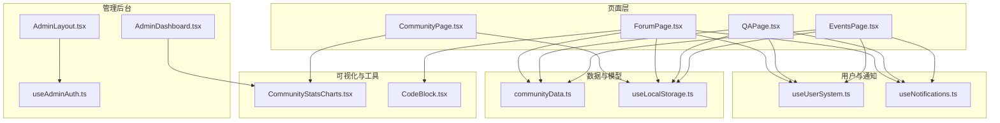
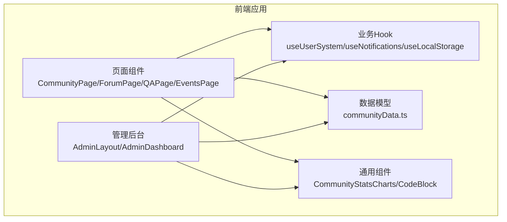
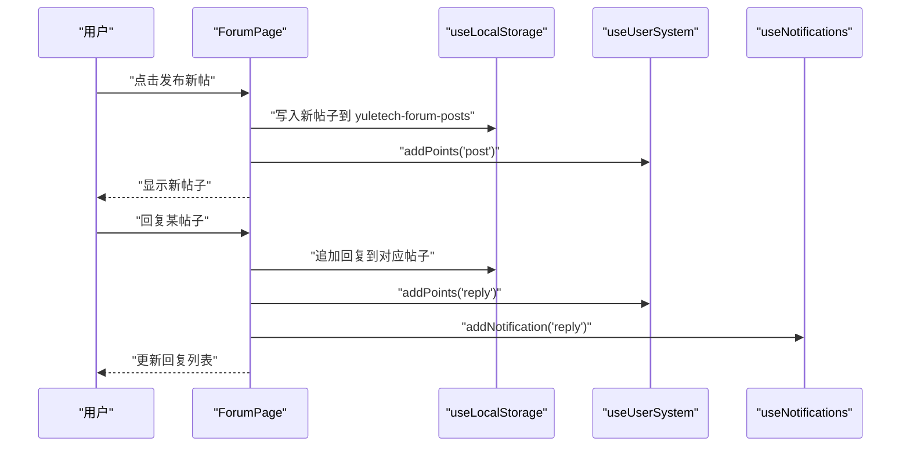
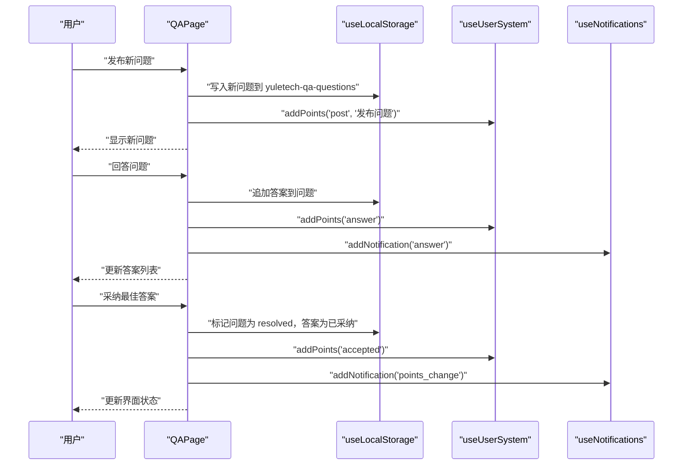
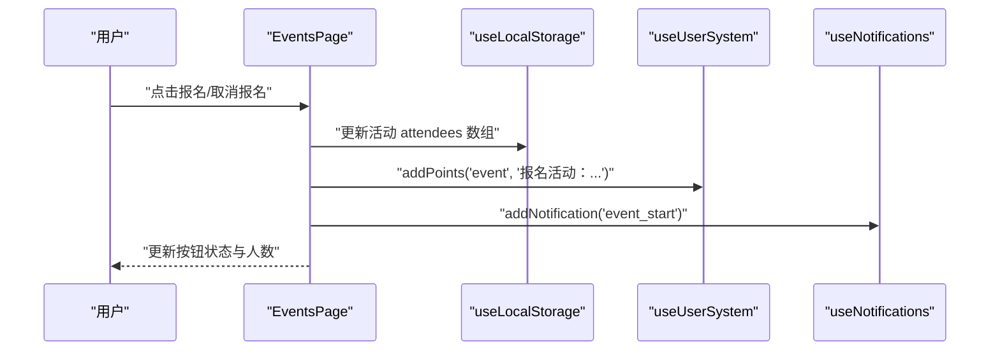
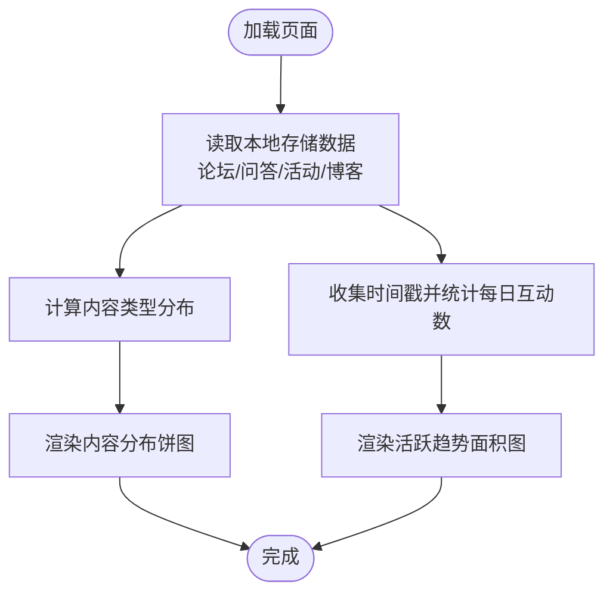
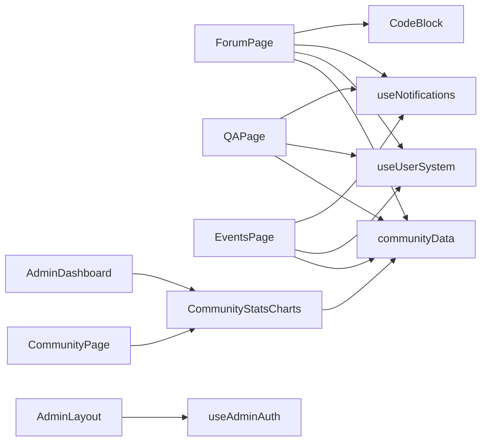

# 社区页面

<cite>
**本文引用的文件**
- [CommunityPage.tsx](file://src/pages/CommunityPage.tsx)
- [ForumPage.tsx](file://src/pages/ForumPage.tsx)
- [QAPage.tsx](file://src/pages/QAPage.tsx)
- [EventsPage.tsx](file://src/pages/EventsPage.tsx)
- [communityData.ts](file://src/data/communityData.ts)
- [CommunityStatsCharts.tsx](file://src/components/admin/CommunityStatsCharts.tsx)
- [useUserSystem.ts](file://src/hooks/useUserSystem.ts)
- [useNotifications.ts](file://src/hooks/useNotifications.ts)
- [useLocalStorage.ts](file://src/hooks/useLocalStorage.ts)
- [CodeBlock.tsx](file://src/components/CodeBlock.tsx)
- [AdminLayout.tsx](file://src/components/AdminLayout.tsx)
- [useAdminAuth.ts](file://src/hooks/useAdminAuth.ts)
- [AdminDashboard.tsx](file://src/pages/AdminDashboard.tsx)
</cite>

## 目录
1. [简介](#简介)
2. [项目结构](#项目结构)
3. [核心组件](#核心组件)
4. [架构总览](#架构总览)
5. [详细组件分析](#详细组件分析)
6. [依赖关系分析](#依赖关系分析)
7. [性能考量](#性能考量)
8. [故障排查指南](#故障排查指南)
9. [结论](#结论)
10. [附录](#附录)

## 简介
本文件面向YuleTech社区技术平台的“社区页面”，系统性梳理论坛系统、问答系统、活动管理与社区统计等核心功能。文档覆盖以下主题：
- 论坛帖子的创建、回复与交互（点赞、浏览、标签、置顶）
- 问答系统的提问、回答、悬赏与采纳机制
- 活动管理的创建、报名与状态跟踪
- 社区数据模型（帖子、回复、问题、答案、活动）与本地持久化
- 用户互动与积分体系、通知系统
- 权限控制与内容审核（管理员后台）
- 社区统计图表与数据分析
- SEO优化与用户参与度提升策略

## 项目结构
社区页面采用按功能模块划分的组织方式，核心页面与数据模型集中于src目录，统计图表与用户系统通过独立Hook与组件实现。

图示来源
- [CommunityPage.tsx:1-667](file://src/pages/CommunityPage.tsx#L1-L667)
- [ForumPage.tsx:1-544](file://src/pages/ForumPage.tsx#L1-L544)
- [QAPage.tsx:1-504](file://src/pages/QAPage.tsx#L1-L504)
- [EventsPage.tsx:1-498](file://src/pages/EventsPage.tsx#L1-L498)
- [communityData.ts:1-371](file://src/data/communityData.ts#L1-L371)
- [CommunityStatsCharts.tsx:1-172](file://src/components/admin/CommunityStatsCharts.tsx#L1-L172)
- [useUserSystem.ts:1-135](file://src/hooks/useUserSystem.ts#L1-L135)
- [useNotifications.ts:1-50](file://src/hooks/useNotifications.ts#L1-L50)
- [useLocalStorage.ts:1-60](file://src/hooks/useLocalStorage.ts#L1-L60)
- [CodeBlock.tsx:1-49](file://src/components/CodeBlock.tsx#L1-L49)
- [AdminLayout.tsx:1-50](file://src/components/AdminLayout.tsx#L1-L50)
- [useAdminAuth.ts:1-48](file://src/hooks/useAdminAuth.ts#L1-L48)
- [AdminDashboard.tsx:1-321](file://src/pages/AdminDashboard.tsx#L1-L321)

章节来源
- [CommunityPage.tsx:1-667](file://src/pages/CommunityPage.tsx#L1-L667)
- [ForumPage.tsx:1-544](file://src/pages/ForumPage.tsx#L1-L544)
- [QAPage.tsx:1-504](file://src/pages/QAPage.tsx#L1-L504)
- [EventsPage.tsx:1-498](file://src/pages/EventsPage.tsx#L1-L498)

## 核心组件
- 社区首页（CommunityPage）：聚合论坛、问答、活动、圈子与任务入口，展示社区统计数据与图表。
- 论坛页（ForumPage）：帖子列表、搜索过滤、标签筛选、排序、点赞、回复、富文本渲染与代码块高亮。
- 问答页（QAPage）：问题列表、悬赏排序、状态筛选、回答列表、采纳回答、点赞与富文本渲染。
- 活动页（EventsPage）：活动网格、类型与状态筛选、报名逻辑、提醒通知与创建活动。
- 数据模型（communityData.ts）：定义论坛帖子、回复、问答问题、答案、活动的接口与初始数据。
- 用户系统（useUserSystem.ts）：积分规则、等级阈值、积分历史与动态计算。
- 通知系统（useNotifications.ts）：消息推送、未读计数与批量标记。
- 本地存储（useLocalStorage.ts）：跨组件共享状态与本地持久化。
- 统计图表（CommunityStatsCharts.tsx）：内容分布饼图、近14天活跃趋势。
- 管理后台（AdminLayout.tsx、useAdminAuth.ts、AdminDashboard.tsx）：管理员鉴权、导航与仪表盘。

章节来源
- [CommunityPage.tsx:245-666](file://src/pages/CommunityPage.tsx#L245-L666)
- [ForumPage.tsx:63-543](file://src/pages/ForumPage.tsx#L63-L543)
- [QAPage.tsx:37-503](file://src/pages/QAPage.tsx#L37-L503)
- [EventsPage.tsx:33-497](file://src/pages/EventsPage.tsx#L33-L497)
- [communityData.ts:1-371](file://src/data/communityData.ts#L1-L371)
- [useUserSystem.ts:91-132](file://src/hooks/useUserSystem.ts#L91-L132)
- [useNotifications.ts:17-49](file://src/hooks/useNotifications.ts#L17-L49)
- [useLocalStorage.ts:3-59](file://src/hooks/useLocalStorage.ts#L3-L59)
- [CommunityStatsCharts.tsx:36-171](file://src/components/admin/CommunityStatsCharts.tsx#L36-L171)
- [AdminLayout.tsx:28-50](file://src/components/AdminLayout.tsx#L28-L50)
- [useAdminAuth.ts:29-48](file://src/hooks/useAdminAuth.ts#L29-L48)
- [AdminDashboard.tsx:67-320](file://src/pages/AdminDashboard.tsx#L67-L320)

## 架构总览
社区页面采用“页面组件 + Hook + 数据模型”的分层设计，页面组件负责UI与交互，Hook封装业务逻辑（用户系统、通知、本地存储），数据模型提供类型与默认数据，统计图表与代码块作为通用工具组件复用。

图示来源
- [CommunityPage.tsx:245-666](file://src/pages/CommunityPage.tsx#L245-L666)
- [ForumPage.tsx:63-543](file://src/pages/ForumPage.tsx#L63-L543)
- [QAPage.tsx:37-503](file://src/pages/QAPage.tsx#L37-L503)
- [EventsPage.tsx:33-497](file://src/pages/EventsPage.tsx#L33-L497)
- [communityData.ts:1-371](file://src/data/communityData.ts#L1-L371)
- [CommunityStatsCharts.tsx:36-171](file://src/components/admin/CommunityStatsCharts.tsx#L36-L171)
- [useUserSystem.ts:91-132](file://src/hooks/useUserSystem.ts#L91-L132)
- [useNotifications.ts:17-49](file://src/hooks/useNotifications.ts#L17-L49)
- [useLocalStorage.ts:3-59](file://src/hooks/useLocalStorage.ts#L3-L59)
- [AdminLayout.tsx:28-50](file://src/components/AdminLayout.tsx#L28-L50)
- [AdminDashboard.tsx:67-320](file://src/pages/AdminDashboard.tsx#L67-L320)

## 详细组件分析

### 社区首页（CommunityPage）
- 功能要点
  - 快捷入口：技术论坛、技术问答、社区活动
  - 统计卡片：注册工程师、技术讨论、活跃圈子、开放任务
  - 公共统计图表：内容类型分布、近14天活跃趋势
  - 标签页：技术论坛、活动日历、工程师圈子、众包任务
- 交互与样式
  - 使用渐变背景与卡片布局，强调视觉层次
  - 图标与徽章增强可读性与信息密度
- SEO
  - 使用react-helmet-async设置标题与描述

章节来源
- [CommunityPage.tsx:245-666](file://src/pages/CommunityPage.tsx#L245-L666)

### 论坛系统（ForumPage）
- 数据模型
  - 论坛帖子：标题、内容、作者、标签、点赞、回复、浏览量、创建时间、热度、置顶
  - 回复：内容、作者、点赞、创建时间
- 关键流程
  - 列表渲染：支持搜索、标签筛选、排序（最新/最多回复/最多点赞/最多浏览）、置顶优先
  - 富文本渲染：识别代码块并使用CodeBlock组件高亮
  - 交互：点赞（帖子/回复）、新增回复、新增帖子
  - 本地持久化：useLocalStorage保存至yuletech-forum-posts
- 用户激励
  - 发帖/回帖增加积分，通知作者有新回复

图示来源
- [ForumPage.tsx:105-194](file://src/pages/ForumPage.tsx#L105-L194)
- [communityData.ts:12-27](file://src/data/communityData.ts#L12-L27)
- [useLocalStorage.ts:3-59](file://src/hooks/useLocalStorage.ts#L3-L59)
- [useUserSystem.ts:97-111](file://src/hooks/useUserSystem.ts#L97-L111)
- [useNotifications.ts:20-28](file://src/hooks/useNotifications.ts#L20-L28)

章节来源
- [ForumPage.tsx:63-543](file://src/pages/ForumPage.tsx#L63-L543)
- [communityData.ts:1-371](file://src/data/communityData.ts#L1-L371)
- [CodeBlock.tsx:1-49](file://src/components/CodeBlock.tsx#L1-L49)

### 问答系统（QAPage）
- 数据模型
  - 问题：标题、内容、作者、标签、状态（open/resolved）、悬赏、浏览、答案、创建时间
  - 答案：内容、作者、是否被采纳、点赞、创建时间
- 关键流程
  - 列表渲染：支持搜索、状态筛选（全部/未解决/已解决）、排序（最新/悬赏最高/最多浏览）
  - 交互：点赞答案、采纳回答（仅未解决状态下开放）、新增回答
  - 本地持久化：useLocalStorage保存至yuletech-qa-questions
- 用户激励
  - 提问/回答/被采纳增加积分，通知作者有新回答或被采纳

图示来源
- [QAPage.tsx:88-171](file://src/pages/QAPage.tsx#L88-L171)
- [communityData.ts:41-54](file://src/data/communityData.ts#L41-L54)
- [useLocalStorage.ts:3-59](file://src/hooks/useLocalStorage.ts#L3-L59)
- [useUserSystem.ts:97-111](file://src/hooks/useUserSystem.ts#L97-L111)
- [useNotifications.ts:20-28](file://src/hooks/useNotifications.ts#L20-L28)

章节来源
- [QAPage.tsx:37-503](file://src/pages/QAPage.tsx#L37-L503)
- [communityData.ts:1-371](file://src/data/communityData.ts#L1-L371)

### 活动管理（EventsPage）
- 数据模型
  - 活动：标题、类型（线上/线下）、日期、时间、地点/链接、描述、主讲人、最大人数、报名者、标签、状态（upcoming/ongoing/ended）
- 关键流程
  - 列表渲染：支持搜索、类型筛选、状态筛选
  - 报名逻辑：重复点击取消报名；未满员且未结束时可报名；成功报名后增加积分并发送通知
  - 本地持久化：useLocalStorage保存至yuletech-events
  - 自动提醒：活动开始前3天内自动推送“即将开始”通知
- 用户激励
  - 参加活动增加积分

图示来源
- [EventsPage.tsx:65-143](file://src/pages/EventsPage.tsx#L65-L143)
- [communityData.ts:56-70](file://src/data/communityData.ts#L56-L70)
- [useLocalStorage.ts:3-59](file://src/hooks/useLocalStorage.ts#L3-L59)
- [useUserSystem.ts:97-111](file://src/hooks/useUserSystem.ts#L97-L111)
- [useNotifications.ts:20-28](file://src/hooks/useNotifications.ts#L20-L28)

章节来源
- [EventsPage.tsx:33-497](file://src/pages/EventsPage.tsx#L33-L497)
- [communityData.ts:1-371](file://src/data/communityData.ts#L1-L371)

### 社区统计与图表（CommunityStatsCharts）
- 内容类型分布：论坛帖子、问答问题、社区活动、博客文章的饼图
- 近14天活跃趋势：基于所有内容的创建与回复时间生成折线面积图
- 数据来源：useLocalStorage读取各模块初始数据与本地持久化数据

图示来源
- [CommunityStatsCharts.tsx:36-171](file://src/components/admin/CommunityStatsCharts.tsx#L36-L171)
- [communityData.ts:72-359](file://src/data/communityData.ts#L72-L359)
- [useLocalStorage.ts:3-59](file://src/hooks/useLocalStorage.ts#L3-L59)

章节来源
- [CommunityStatsCharts.tsx:1-172](file://src/components/admin/CommunityStatsCharts.tsx#L1-L172)
- [communityData.ts:1-371](file://src/data/communityData.ts#L1-L371)

### 用户系统与通知（useUserSystem、useNotifications）
- 用户系统
  - 积分规则：发帖、回帖、回答、被采纳、参加活动
  - 等级阈值：可配置，按累计积分映射到不同等级
  - 积分历史：记录每次动作、描述与时间
- 通知系统
  - 支持多种类型：回复、回答、活动开始、积分变更
  - 未读计数与批量标记

章节来源
- [useUserSystem.ts:91-132](file://src/hooks/useUserSystem.ts#L91-L132)
- [useNotifications.ts:17-49](file://src/hooks/useNotifications.ts#L17-L49)

### 权限控制与内容审核（AdminLayout、useAdminAuth、AdminDashboard）
- 管理员鉴权
  - 登录凭据与会话有效期（2小时）
  - 未登录自动跳转登录页
- 后台仪表盘
  - 展示用户增长、内容分布、积分来源、活跃趋势
  - 系统状态监控（PWA、localStorage大小、置顶帖子数、即将开始活动数）

章节来源
- [AdminLayout.tsx:28-50](file://src/components/AdminLayout.tsx#L28-L50)
- [useAdminAuth.ts:29-48](file://src/hooks/useAdminAuth.ts#L29-L48)
- [AdminDashboard.tsx:67-320](file://src/pages/AdminDashboard.tsx#L67-L320)

## 依赖关系分析
- 页面组件依赖Hook与数据模型，形成清晰的单向依赖链
- 统计图表与代码块作为通用组件被页面与后台复用
- 管理后台与前台共享鉴权与数据持久化能力

图示来源
- [ForumPage.tsx:20-21](file://src/pages/ForumPage.tsx#L20-L21)
- [QAPage.tsx:23-24](file://src/pages/QAPage.tsx#L23-L24)
- [EventsPage.tsx:18-19](file://src/pages/EventsPage.tsx#L18-L19)
- [CommunityPage.tsx:24-26](file://src/pages/CommunityPage.tsx#L24-L26)
- [CommunityStatsCharts.tsx:15-24](file://src/components/admin/CommunityStatsCharts.tsx#L15-L24)
- [AdminLayout.tsx:17-17](file://src/components/AdminLayout.tsx#L17-L17)
- [useAdminAuth.ts:3-6](file://src/hooks/useAdminAuth.ts#L3-L6)

章节来源
- [ForumPage.tsx:1-544](file://src/pages/ForumPage.tsx#L1-L544)
- [QAPage.tsx:1-504](file://src/pages/QAPage.tsx#L1-L504)
- [EventsPage.tsx:1-498](file://src/pages/EventsPage.tsx#L1-L498)
- [CommunityPage.tsx:1-667](file://src/pages/CommunityPage.tsx#L1-L667)
- [CommunityStatsCharts.tsx:1-172](file://src/components/admin/CommunityStatsCharts.tsx#L1-L172)
- [AdminLayout.tsx:1-50](file://src/components/AdminLayout.tsx#L1-L50)
- [useAdminAuth.ts:1-48](file://src/hooks/useAdminAuth.ts#L1-L48)

## 性能考量
- 本地存储与事件同步
  - 使用自定义事件localStorageChange保证多实例同步，避免重复写入
  - 对异常解析进行捕获，防止崩溃
- 渲染优化
  - 列表渲染采用虚拟滚动与懒加载策略（建议）
  - 图表组件使用ResponsiveContainer，按容器尺寸自适应
- 交互响应
  - 点赞/采纳等操作即时反馈，避免网络延迟影响体验
- 数据规模
  - 当数据量增大时，建议引入分页或服务端缓存

## 故障排查指南
- 本地存储异常
  - 现象：页面无法保存数据或状态不一致
  - 排查：检查浏览器localStorage可用性与容量；查看控制台错误；确认自定义事件监听是否生效
- 通知未显示
  - 现象：用户操作后无提示
  - 排查：确认通知队列长度限制（最多100条）；检查addNotification调用参数；核对未读计数
- 积分不更新
  - 现象：发帖/回帖/回答后积分不变
  - 排查：确认积分规则是否被修改；检查addPoints调用与时间戳；核对等级阈值配置
- 活动报名失败
  - 现象：名额已满仍可报名或已结束活动仍可报名
  - 排查：核对活动状态与最大人数；检查报名逻辑分支；确认通知推送条件

章节来源
- [useLocalStorage.ts:3-59](file://src/hooks/useLocalStorage.ts#L3-L59)
- [useNotifications.ts:17-49](file://src/hooks/useNotifications.ts#L17-L49)
- [useUserSystem.ts:97-111](file://src/hooks/useUserSystem.ts#L97-L111)
- [EventsPage.tsx:65-88](file://src/pages/EventsPage.tsx#L65-L88)

## 结论
YuleTech社区页面以清晰的模块化架构实现了论坛、问答、活动与统计的核心功能，并通过用户系统与通知体系促进用户参与。管理后台提供必要的权限控制与数据概览。建议后续在大数据场景下引入分页与服务端缓存，在SEO与可访问性方面进一步完善。

## 附录
- SEO优化建议
  - 页面标题与描述：已在页面中使用react-helmet-async设置
  - 结构化数据：可考虑添加Schema.org的Article/Event等标记
  - 可访问性：为图片与图标提供替代文本；确保键盘导航可用
- 用户参与度提升策略
  - 积分与等级：持续优化积分规则与等级激励
  - 社区活动：定期举办线上/线下活动，设置报名提醒
  - 内容质量：通过置顶、标签与精选提升优质内容曝光