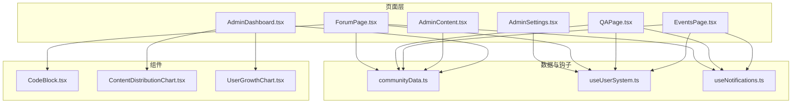
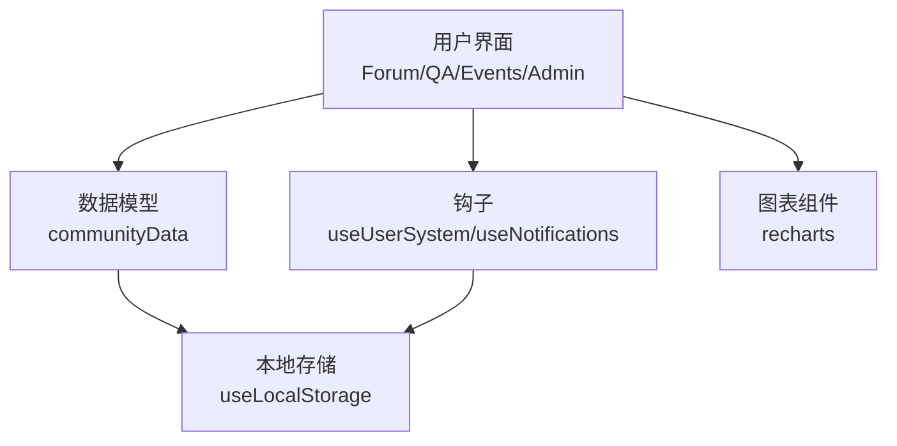
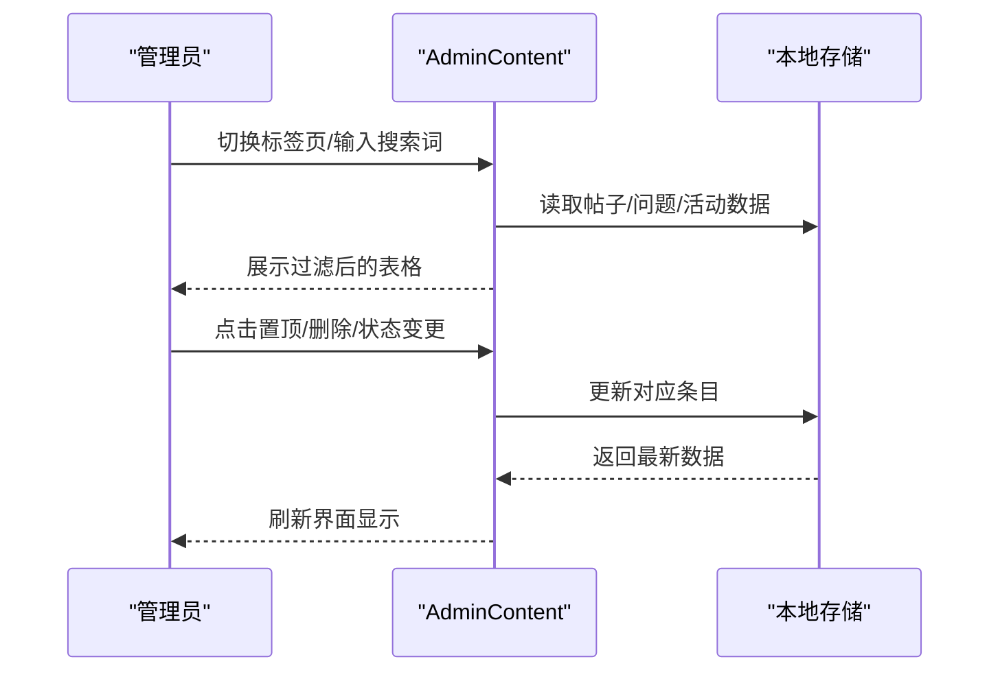
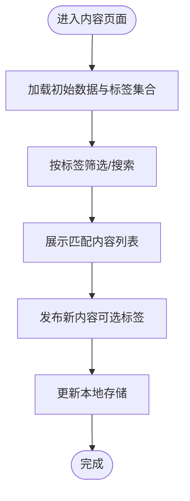
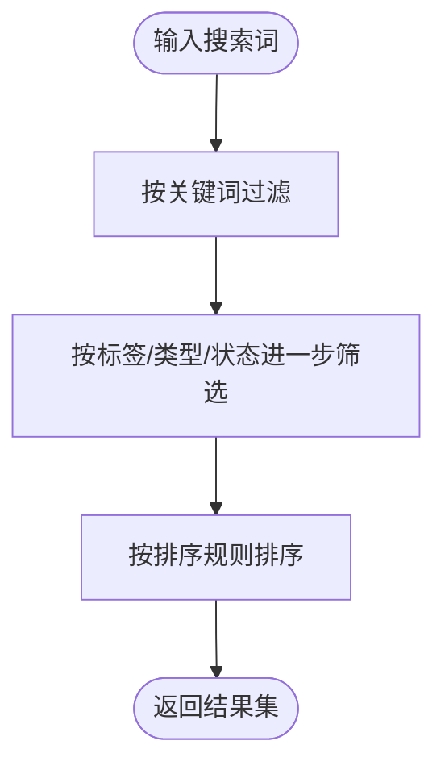
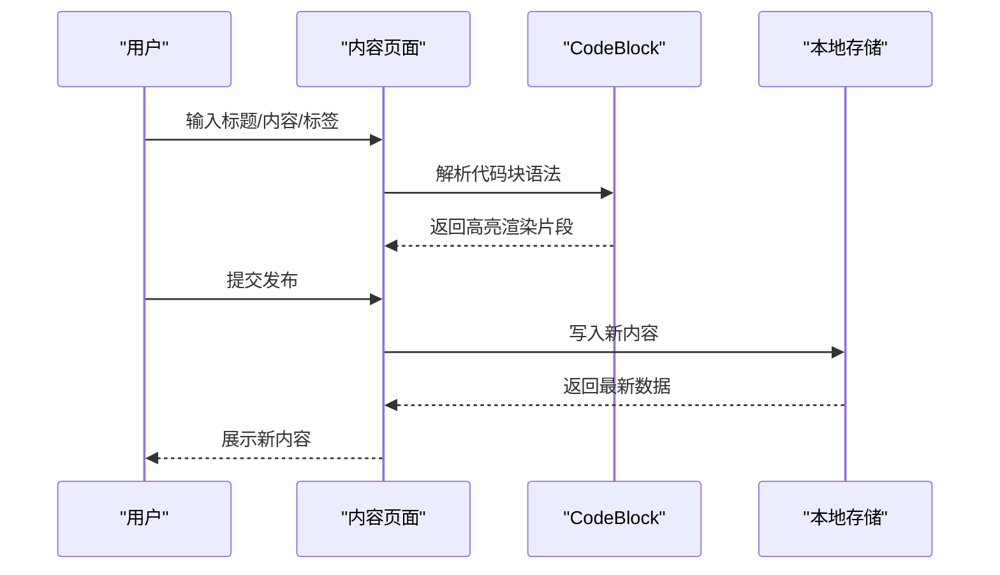
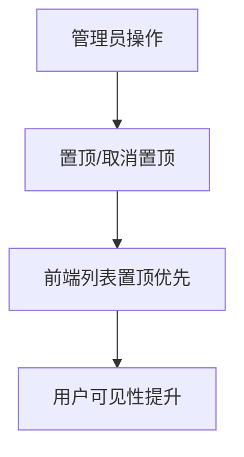
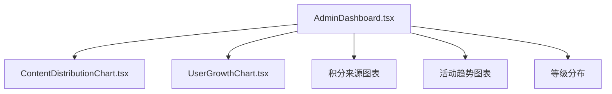
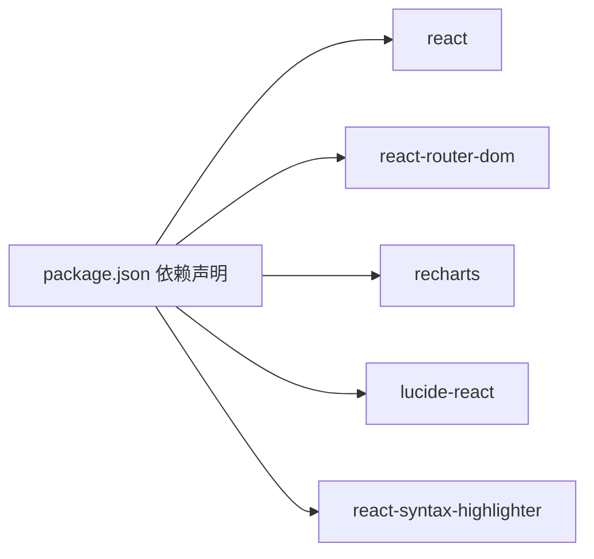

# 内容管理

<cite>
**本文引用的文件**
- [README.md](file://README.md)
- [package.json](file://package.json)
- [AdminContent.tsx](file://src/pages/AdminContent.tsx)
- [AdminDashboard.tsx](file://src/pages/AdminDashboard.tsx)
- [AdminSettings.tsx](file://src/pages/AdminSettings.tsx)
- [ForumPage.tsx](file://src/pages/ForumPage.tsx)
- [QAPage.tsx](file://src/pages/QAPage.tsx)
- [EventsPage.tsx](file://src/pages/EventsPage.tsx)
- [communityData.ts](file://src/data/communityData.ts)
- [useUserSystem.ts](file://src/hooks/useUserSystem.ts)
- [useNotifications.ts](file://src/hooks/useNotifications.ts)
- [CodeBlock.tsx](file://src/components/CodeBlock.tsx)
- [ContentDistributionChart.tsx](file://src/components/admin/ContentDistributionChart.tsx)
- [UserGrowthChart.tsx](file://src/components/admin/UserGrowthChart.tsx)
</cite>

## 目录
1. [引言](#引言)
2. [项目结构](#项目结构)
3. [核心组件](#核心组件)
4. [架构总览](#架构总览)
5. [详细组件分析](#详细组件分析)
6. [依赖分析](#依赖分析)
7. [性能考虑](#性能考虑)
8. [故障排查指南](#故障排查指南)
9. [结论](#结论)
10. [附录](#附录)

## 引言
本文件面向YuleTech社区技术平台的内容管理功能，系统性梳理论坛帖子、问答内容与活动信息的审核、管理与运营流程。文档覆盖内容审核机制、批量操作与状态控制；内容分类与标签体系；搜索与过滤；编辑与预览；推荐与置顶；统计分析与管理员操作指南。目标是帮助管理员与开发者快速理解平台内容治理的实现方式，并据此制定内容质量把控标准。

## 项目结构
- 前端采用React 19 + TypeScript + Vite 6 + Tailwind CSS 4，使用Lucide React图标与recharts图表库。
- 内容管理相关页面集中在src/pages目录，数据模型与本地持久化在src/data与src/hooks中，管理员面板位于src/pages/Admin*系列文件。
- 关键依赖：react、react-router-dom、recharts、lucide-react、react-syntax-highlighter等。

**图示来源**
- [ForumPage.tsx:1-544](file://src/pages/ForumPage.tsx#L1-L544)
- [QAPage.tsx:1-504](file://src/pages/QAPage.tsx#L1-L504)
- [EventsPage.tsx:1-498](file://src/pages/EventsPage.tsx#L1-L498)
- [AdminContent.tsx:1-397](file://src/pages/AdminContent.tsx#L1-L397)
- [AdminDashboard.tsx:1-321](file://src/pages/AdminDashboard.tsx#L1-L321)
- [AdminSettings.tsx:1-38](file://src/pages/AdminSettings.tsx#L1-L38)
- [communityData.ts:1-371](file://src/data/communityData.ts#L1-L371)
- [useUserSystem.ts:1-135](file://src/hooks/useUserSystem.ts#L1-L135)
- [useNotifications.ts:1-50](file://src/hooks/useNotifications.ts#L1-L50)
- [CodeBlock.tsx:1-49](file://src/components/CodeBlock.tsx#L1-L49)
- [ContentDistributionChart.tsx:1-72](file://src/components/admin/ContentDistributionChart.tsx#L1-L72)
- [UserGrowthChart.tsx:1-119](file://src/components/admin/UserGrowthChart.tsx#L1-L119)

**章节来源**
- [README.md:1-95](file://README.md#L1-L95)
- [package.json:1-46](file://package.json#L1-L46)

## 核心组件
- 内容数据模型：论坛帖子、问答问题、社区活动均以接口形式定义，包含标题、内容、作者、标签、状态、时间戳等字段，支持本地持久化与迁移。
- 用户积分与等级：通过useUserSystem提供积分增减、等级阈值配置与等级信息查询，支撑内容激励与质量评估。
- 通知系统：useNotifications提供消息推送、标记已读与未读计数，用于内容互动提醒。
- 富文本渲染：CodeBlock组件支持代码高亮与主题切换，提升内容可读性。
- 管理后台：AdminContent负责三类内容的列表、搜索、状态变更与删除；AdminDashboard汇总统计与图表；AdminSettings支持积分规则与等级阈值配置。

**章节来源**
- [communityData.ts:12-70](file://src/data/communityData.ts#L12-L70)
- [useUserSystem.ts:1-135](file://src/hooks/useUserSystem.ts#L1-L135)
- [useNotifications.ts:1-50](file://src/hooks/useNotifications.ts#L1-L50)
- [CodeBlock.tsx:1-49](file://src/components/CodeBlock.tsx#L1-L49)
- [AdminContent.tsx:1-397](file://src/pages/AdminContent.tsx#L1-L397)
- [AdminDashboard.tsx:1-321](file://src/pages/AdminDashboard.tsx#L1-L321)
- [AdminSettings.tsx:1-38](file://src/pages/AdminSettings.tsx#L1-L38)

## 架构总览
内容管理采用“页面-数据-钩子-组件”分层架构：
- 页面层：ForumPage、QAPage、EventsPage负责用户侧浏览、搜索、排序、评论与发布；AdminContent、AdminDashboard、AdminSettings负责管理侧审核、统计与配置。
- 数据层：communityData提供类型定义、初始数据与迁移逻辑；useLocalStorage封装本地存储。
- 钩子层：useUserSystem与useNotifications提供用户行为追踪与通知能力。
- 组件层：CodeBlock、各类图表组件提供内容渲染与可视化。

**图示来源**
- [ForumPage.tsx:1-544](file://src/pages/ForumPage.tsx#L1-L544)
- [QAPage.tsx:1-504](file://src/pages/QAPage.tsx#L1-L504)
- [EventsPage.tsx:1-498](file://src/pages/EventsPage.tsx#L1-L498)
- [AdminContent.tsx:1-397](file://src/pages/AdminContent.tsx#L1-L397)
- [AdminDashboard.tsx:1-321](file://src/pages/AdminDashboard.tsx#L1-L321)
- [communityData.ts:1-371](file://src/data/communityData.ts#L1-L371)
- [useUserSystem.ts:1-135](file://src/hooks/useUserSystem.ts#L1-L135)
- [useNotifications.ts:1-50](file://src/hooks/useNotifications.ts#L1-L50)
- [ContentDistributionChart.tsx:1-72](file://src/components/admin/ContentDistributionChart.tsx#L1-L72)
- [UserGrowthChart.tsx:1-119](file://src/components/admin/UserGrowthChart.tsx#L1-L119)

## 详细组件分析

### 内容审核与管理（AdminContent）
- 支持三类内容切换：论坛、问答、活动。
- 搜索：按标题/内容关键词过滤。
- 列表操作：
  - 论坛：置顶/取消置顶、删除；展开查看正文与发布时间。
  - 问答：悬赏积分调整、删除；展开查看正文与回答数。
  - 活动：状态变更（即将开始/进行中/已结束）、删除；展开查看描述与时间地点。
- 批量与状态控制：通过状态选择器与按钮实现批量状态更新与删除确认。

**图示来源**
- [AdminContent.tsx:1-397](file://src/pages/AdminContent.tsx#L1-L397)
- [communityData.ts:72-359](file://src/data/communityData.ts#L72-L359)

**章节来源**
- [AdminContent.tsx:1-397](file://src/pages/AdminContent.tsx#L1-L397)

### 内容分类与标签系统
- 分类维度：论坛（如MCAL、ECUAL、Service、OS、工具链、经验分享等）、问答（如OS、FreeRTOS、Alarm等）、活动（如BSW、技术分享、线下、社区庆典等）。
- 标签管理：用户发布时可输入标签（逗号分隔），默认自动填充；页面侧支持按标签筛选。
- 归档与迁移：提供generateId与migrateForumPosts，保证数据一致性与扩展性。

**图示来源**
- [ForumPage.tsx:61-61](file://src/pages/ForumPage.tsx#L61-L61)
- [QAPage.tsx:31-35](file://src/pages/QAPage.tsx#L31-L35)
- [EventsPage.tsx:20-31](file://src/pages/EventsPage.tsx#L20-L31)
- [communityData.ts:72-359](file://src/data/communityData.ts#L72-L359)

**章节来源**
- [ForumPage.tsx:61-61](file://src/pages/ForumPage.tsx#L61-L61)
- [QAPage.tsx:31-35](file://src/pages/QAPage.tsx#L31-L35)
- [EventsPage.tsx:20-31](file://src/pages/EventsPage.tsx#L20-L31)
- [communityData.ts:72-359](file://src/data/communityData.ts#L72-L359)

### 搜索与过滤
- 全文搜索：论坛与问答支持按标题/内容关键词搜索；活动支持按标题/描述搜索。
- 分类筛选：论坛支持标签筛选；问答支持状态筛选；活动支持类型与状态筛选。
- 排序：论坛按最新、回复数、点赞数、浏览数排序；问答按最新、悬赏、浏览排序；活动按时间与状态。

**图示来源**
- [ForumPage.tsx:86-103](file://src/pages/ForumPage.tsx#L86-L103)
- [QAPage.tsx:53-66](file://src/pages/QAPage.tsx#L53-L66)
- [EventsPage.tsx:56-63](file://src/pages/EventsPage.tsx#L56-L63)

**章节来源**
- [ForumPage.tsx:86-103](file://src/pages/ForumPage.tsx#L86-L103)
- [QAPage.tsx:53-66](file://src/pages/QAPage.tsx#L53-L66)
- [EventsPage.tsx:56-63](file://src/pages/EventsPage.tsx#L56-L63)

### 内容编辑与预览
- 富文本编辑器：支持Markdown风格代码块语法（三反引号包裹语言标识），渲染为高亮代码块。
- 预览与版本：页面内以模态框展示完整内容，支持点赞、回复、浏览计数；编辑后即时更新本地存储。
- 发布流程：用户填写标题、内容、标签（问答可设置悬赏），提交后生成唯一ID并写入本地存储。

**图示来源**
- [ForumPage.tsx:23-52](file://src/pages/ForumPage.tsx#L23-L52)
- [CodeBlock.tsx:1-49](file://src/components/CodeBlock.tsx#L1-L49)
- [communityData.ts:361-363](file://src/data/communityData.ts#L361-L363)

**章节来源**
- [ForumPage.tsx:23-52](file://src/pages/ForumPage.tsx#L23-L52)
- [CodeBlock.tsx:1-49](file://src/components/CodeBlock.tsx#L1-L49)
- [communityData.ts:361-363](file://src/data/communityData.ts#L361-L363)

### 内容推荐与置顶
- 置顶机制：管理员可在管理后台对论坛帖子进行置顶/取消置顶；前端列表中置顶内容优先展示。
- 推荐策略：当前实现为管理员人工置顶；可结合浏览量、回复数、点赞数等指标设计算法推荐（需扩展）。
- 权重计算：可基于浏览量、回复数、点赞数与时间衰减因子综合评分（需扩展）。

**图示来源**
- [AdminContent.tsx:71-75](file://src/pages/AdminContent.tsx#L71-L75)
- [ForumPage.tsx:94-103](file://src/pages/ForumPage.tsx#L94-L103)

**章节来源**
- [AdminContent.tsx:71-75](file://src/pages/AdminContent.tsx#L71-L75)
- [ForumPage.tsx:94-103](file://src/pages/ForumPage.tsx#L94-L103)

### 内容统计分析
- 仪表盘概览：总用户数、内容总量、活动数等卡片统计。
- 图表可视化：内容分布饼图、用户增长趋势线图、积分来源柱状图、社区活跃度折线图。
- 等级分布：根据用户积分计算等级分布，辅助评估社区质量与激励效果。

**图示来源**
- [AdminDashboard.tsx:1-321](file://src/pages/AdminDashboard.tsx#L1-L321)
- [ContentDistributionChart.tsx:1-72](file://src/components/admin/ContentDistributionChart.tsx#L1-L72)
- [UserGrowthChart.tsx:1-119](file://src/components/admin/UserGrowthChart.tsx#L1-L119)

**章节来源**
- [AdminDashboard.tsx:1-321](file://src/pages/AdminDashboard.tsx#L1-L321)
- [ContentDistributionChart.tsx:1-72](file://src/components/admin/ContentDistributionChart.tsx#L1-L72)
- [UserGrowthChart.tsx:1-119](file://src/components/admin/UserGrowthChart.tsx#L1-L119)

### 管理员操作指南与质量把控标准
- 登录与入口：管理员登录页位于AdminLoginPage，管理功能集中在AdminContent、AdminDashboard、AdminSettings。
- 内容质量标准：
  - 论坛：禁止广告营销、重复内容；鼓励高质量技术分享与问题描述清晰。
  - 问答：问题需有明确背景与尝试方案；答案需可验证、可复现。
  - 活动：信息完整（时间、地点、主讲人、议程）；避免虚假宣传。
- 日常操作：
  - 审核：对违规内容及时删除；对优质内容可置顶。
  - 过滤：利用标签与状态筛选异常内容。
  - 配置：通过AdminSettings调整积分规则与等级阈值，引导社区行为。

**章节来源**
- [AdminContent.tsx:1-397](file://src/pages/AdminContent.tsx#L1-L397)
- [AdminDashboard.tsx:1-321](file://src/pages/AdminDashboard.tsx#L1-L321)
- [AdminSettings.tsx:1-38](file://src/pages/AdminSettings.tsx#L1-L38)

## 依赖分析
- 外部库：react、react-router-dom、recharts、lucide-react、react-syntax-highlighter等。
- 本地持久化：useLocalStorage封装localStorage，保障数据在浏览器端持久化。
- 类型安全：communityData提供强类型接口，降低运行时错误风险。

**图示来源**
- [package.json:12-26](file://package.json#L12-L26)

**章节来源**
- [package.json:12-26](file://package.json#L12-L26)

## 性能考虑
- 本地存储读写：所有内容与用户状态均使用localStorage，避免网络请求开销；注意localStorage容量与序列化成本。
- 渲染优化：列表项使用虚拟滚动与懒加载（建议）；代码高亮按需渲染。
- 图表性能：recharts组件在大数据量时可考虑分页或抽样渲染。
- 缓存策略：结合PWA（Service Worker）与浏览器缓存提升访问速度（已在系统状态中检测）。

## 故障排查指南
- 本地存储异常：若出现数据丢失或格式错误，检查localStorage容量与键名一致性；必要时清理无效键。
- 通知未显示：确认useNotifications钩子正常初始化与权限；检查浏览器通知开关。
- 积分规则不生效：检查AdminSettings中积分规则与等级阈值是否正确保存至localStorage。
- 图表无数据：确认数据源存在且格式正确；检查recharts主题与容器尺寸。

**章节来源**
- [useNotifications.ts:1-50](file://src/hooks/useNotifications.ts#L1-L50)
- [AdminSettings.tsx:1-38](file://src/pages/AdminSettings.tsx#L1-L38)
- [AdminDashboard.tsx:1-321](file://src/pages/AdminDashboard.tsx#L1-L321)

## 结论
YuleTech社区内容管理以本地存储为核心，结合用户积分与等级体系，实现了从内容发布、审核、筛选到统计分析的闭环。管理员可通过AdminContent与AdminSettings高效管理内容与激励规则，用户则通过丰富的搜索、标签与排序体验高质量内容。未来可在推荐算法、时间范围查询与版本历史等方面进一步增强，以满足更复杂的运营需求。

## 附录
- 快速操作清单
  - 审核违规内容：在AdminContent中删除或调整状态。
  - 提升优质内容曝光：对论坛帖子进行置顶。
  - 调整激励策略：在AdminSettings中修改积分规则与等级阈值。
  - 查看社区健康度：在AdminDashboard中查看图表与统计数据。