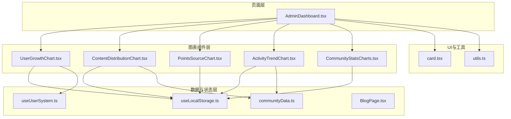
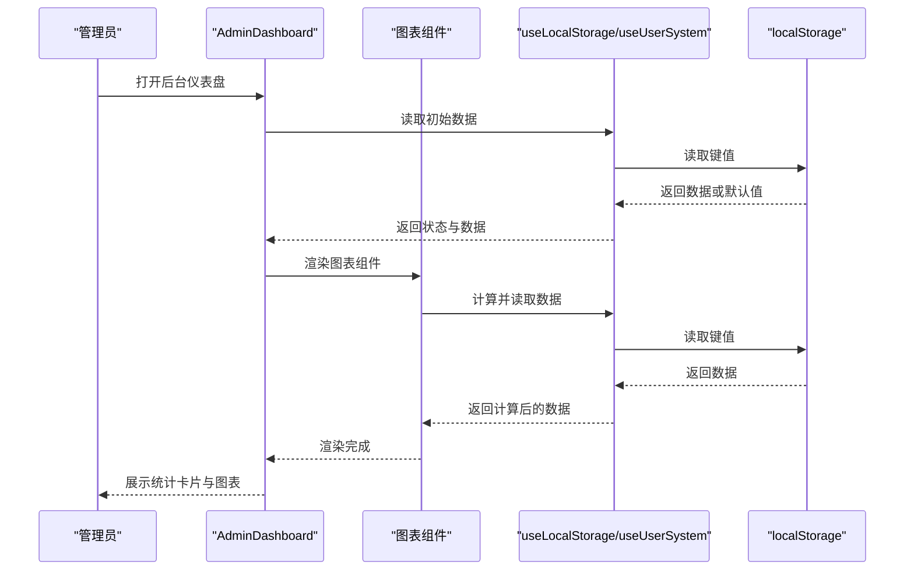
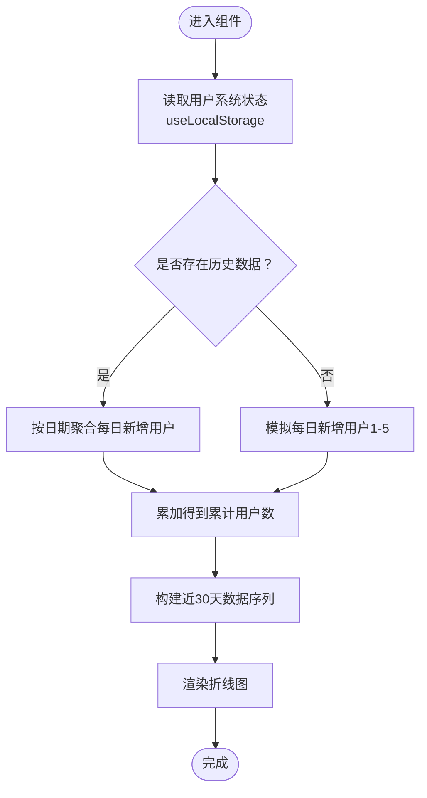
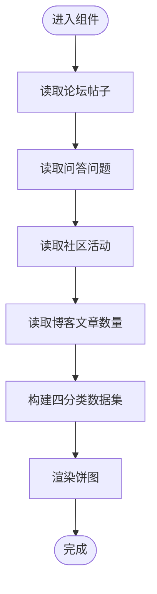
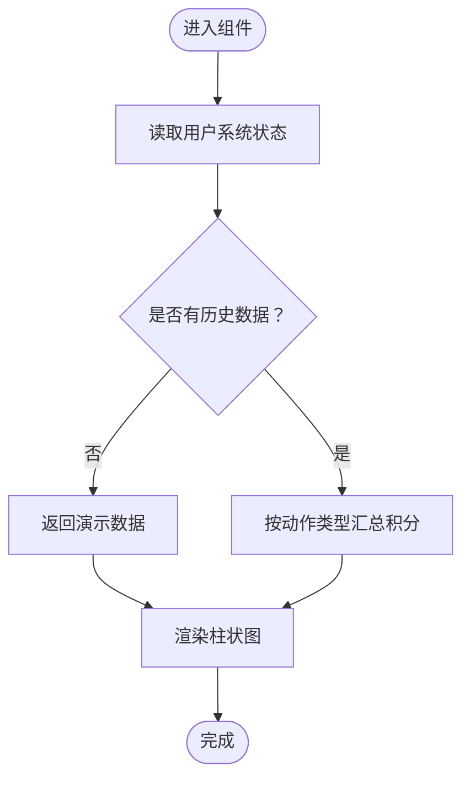
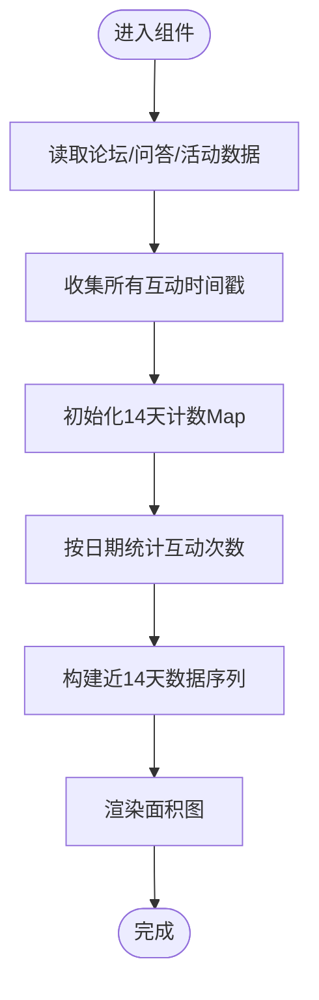
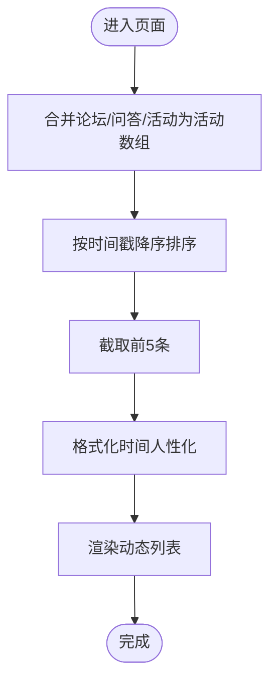
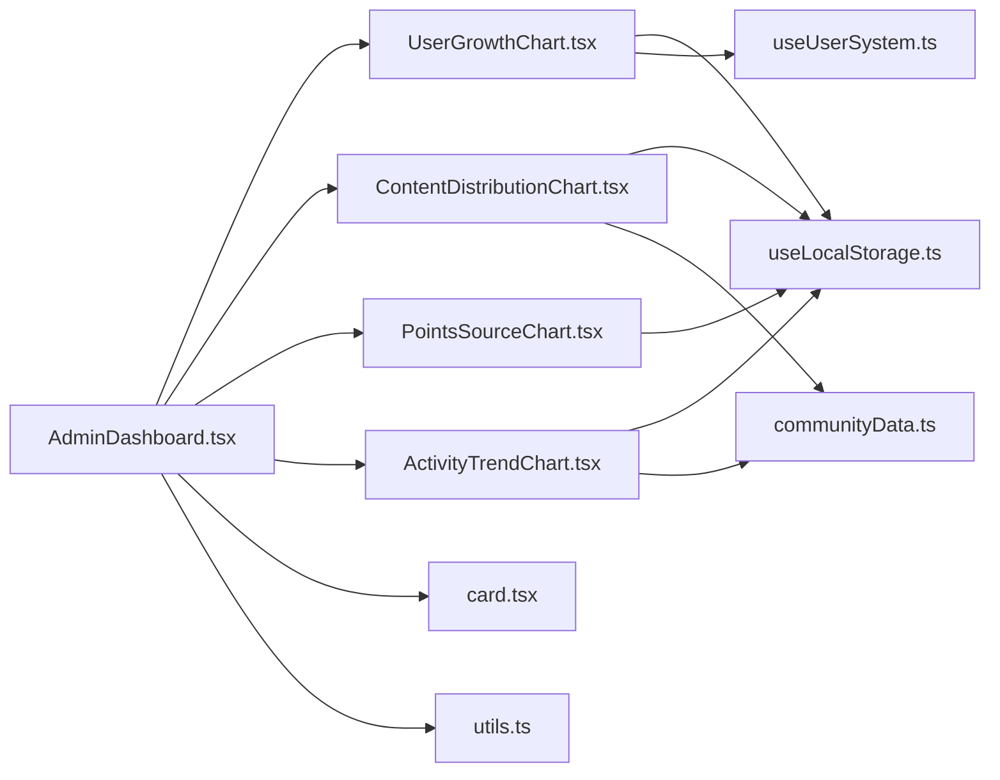

# 后台仪表盘

<cite>
**本文引用的文件**
- [AdminDashboard.tsx](file://src/pages/AdminDashboard.tsx)
- [UserGrowthChart.tsx](file://src/components/admin/UserGrowthChart.tsx)
- [ContentDistributionChart.tsx](file://src/components/admin/ContentDistributionChart.tsx)
- [PointsSourceChart.tsx](file://src/components/admin/PointsSourceChart.tsx)
- [ActivityTrendChart.tsx](file://src/components/admin/ActivityTrendChart.tsx)
- [CommunityStatsCharts.tsx](file://src/components/admin/CommunityStatsCharts.tsx)
- [useUserSystem.ts](file://src/hooks/useUserSystem.ts)
- [useLocalStorage.ts](file://src/hooks/useLocalStorage.ts)
- [communityData.ts](file://src/data/communityData.ts)
- [BlogPage.tsx](file://src/pages/BlogPage.tsx)
- [card.tsx](file://src/components/ui/card.tsx)
- [utils.ts](file://src/lib/utils.ts)
- [package.json](file://package.json)
</cite>

## 目录
1. [简介](#简介)
2. [项目结构](#项目结构)
3. [核心组件](#核心组件)
4. [架构总览](#架构总览)
5. [组件详细分析](#组件详细分析)
6. [依赖关系分析](#依赖关系分析)
7. [性能考量](#性能考量)
8. [故障排查指南](#故障排查指南)
9. [结论](#结论)
10. [附录](#附录)

## 简介
本文件为 YuleTech 社区技术平台后台仪表盘的技术文档，面向管理员与开发者，系统性阐述仪表盘的整体架构、数据可视化组件（用户增长趋势图、内容分布图、积分来源图、社区活跃度图）、系统状态监控、数据实时更新机制与缓存策略、图表定制化配置与交互能力，以及最近动态列表的聚合与时间格式化处理。同时提供数据解读指南与异常处理流程，帮助管理员高效运营与维护平台。

## 项目结构
仪表盘位于前端工程的 admin 页面与 admin 组件目录中，采用 React + Recharts 的组合，数据持久化通过自研 Hook 使用浏览器 localStorage 实现，并以主题化的 UI 组件库提供一致的视觉与交互体验。

**图表来源**
- [AdminDashboard.tsx:67-321](file://src/pages/AdminDashboard.tsx#L67-L321)
- [UserGrowthChart.tsx:23-119](file://src/components/admin/UserGrowthChart.tsx#L23-L119)
- [ContentDistributionChart.tsx:23-72](file://src/components/admin/ContentDistributionChart.tsx#L23-L72)
- [PointsSourceChart.tsx:22-92](file://src/components/admin/PointsSourceChart.tsx#L22-L92)
- [ActivityTrendChart.tsx:29-129](file://src/components/admin/ActivityTrendChart.tsx#L29-L129)
- [CommunityStatsCharts.tsx:36-172](file://src/components/admin/CommunityStatsCharts.tsx#L36-L172)
- [useLocalStorage.ts:3-60](file://src/hooks/useLocalStorage.ts#L3-L60)
- [useUserSystem.ts:91-135](file://src/hooks/useUserSystem.ts#L91-L135)
- [communityData.ts:72-371](file://src/data/communityData.ts#L72-L371)
- [BlogPage.tsx:37-208](file://src/pages/BlogPage.tsx#L37-L208)
- [card.tsx:4-47](file://src/components/ui/card.tsx#L4-L47)
- [utils.ts:4-6](file://src/lib/utils.ts#L4-L6)

**章节来源**
- [AdminDashboard.tsx:67-321](file://src/pages/AdminDashboard.tsx#L67-L321)
- [package.json:12-26](file://package.json#L12-L26)

## 核心组件
- 用户增长趋势图（UserGrowthChart）：基于用户系统积分历史推导日新增用户，生成近 30 天累计用户与新增用户折线图。
- 内容分布图（ContentDistributionChart）：统计论坛帖子、问答问题、社区活动、博客文章的数量占比，展示饼图。
- 积分来源图（PointsSourceChart）：按动作类型汇总积分来源，展示柱状图。
- 社区活跃度图（ActivityTrendChart）：聚合论坛、问答、活动的互动事件，统计近 14 天每日互动次数。
- 最近动态列表：聚合论坛、问答、活动的最新事件，按时间倒序展示，支持人性化时间格式化。
- 系统状态监控：展示 PWA 注册状态、localStorage 存储占用、置顶帖子数、即将开始活动数等关键指标。

**章节来源**
- [AdminDashboard.tsx:118-315](file://src/pages/AdminDashboard.tsx#L118-L315)
- [UserGrowthChart.tsx:23-119](file://src/components/admin/UserGrowthChart.tsx#L23-L119)
- [ContentDistributionChart.tsx:23-72](file://src/components/admin/ContentDistributionChart.tsx#L23-L72)
- [PointsSourceChart.tsx:22-92](file://src/components/admin/PointsSourceChart.tsx#L22-L92)
- [ActivityTrendChart.tsx:29-129](file://src/components/admin/ActivityTrendChart.tsx#L29-L129)

## 架构总览
仪表盘采用“页面容器 + 可视化组件 + 数据钩子”的分层架构：
- 页面容器负责布局、统计卡片、系统状态与最近动态的聚合展示。
- 图表组件负责数据计算与可视化渲染，内部使用 Recharts。
- 数据钩子负责本地数据持久化与跨组件共享，使用 localStorage 作为数据源。
- UI 组件库提供卡片、按钮等基础 UI，保证一致性与可访问性。

**图表来源**
- [AdminDashboard.tsx:67-321](file://src/pages/AdminDashboard.tsx#L67-L321)
- [useLocalStorage.ts:3-60](file://src/hooks/useLocalStorage.ts#L3-L60)
- [useUserSystem.ts:91-135](file://src/hooks/useUserSystem.ts#L91-L135)

## 组件详细分析

### 用户增长趋势图（UserGrowthChart）
- 数据来源与计算逻辑
  - 从用户系统历史中提取每日新增用户数，若存在真实数据则直接使用；否则模拟每日 1-5 新用户。
  - 基于基底用户数（模拟）与每日新增用户累加，生成近 30 天的累计用户与新增用户两条折线。
- 时间轴与标签
  - 使用日期标签（月/日），从 29 天前到今天。
- 可视化特性
  - 使用折线图，两条曲线分别表示累计用户与新增用户，支持响应式容器与主题化样式。
- 性能与缓存
  - 通过 useMemo 对数据进行记忆化计算，依赖用户系统状态；依赖变化时重新计算。
- 定制化与交互
  - 支持主题色、边框、网格、图例、提示框等样式定制；tooltip 格式化显示“人数”。

**图表来源**
- [UserGrowthChart.tsx:23-119](file://src/components/admin/UserGrowthChart.tsx#L23-L119)
- [useUserSystem.ts:15-18](file://src/hooks/useUserSystem.ts#L15-L18)
- [useLocalStorage.ts:3-60](file://src/hooks/useLocalStorage.ts#L3-L60)

**章节来源**
- [UserGrowthChart.tsx:23-119](file://src/components/admin/UserGrowthChart.tsx#L23-L119)
- [useUserSystem.ts:91-135](file://src/hooks/useUserSystem.ts#L91-L135)

### 内容分布图（ContentDistributionChart）
- 数据来源与计算逻辑
  - 从 localStorage 读取论坛帖子、问答问题、社区活动三类数据长度，结合博客文章数量（来自 BlogPage 的静态数据）。
  - 形成“论坛帖子/问答问题/社区活动/博客文章”四个分类的数据集。
- 可视化特性
  - 使用饼图，带内半径与外半径、间距角度、主题色填充，支持 tooltip 与图例。
- 性能与缓存
  - 通过 useMemo 计算，依赖数据长度变化；依赖变化时重绘。
- 定制化与交互
  - 支持主题色、描边、网格、提示框、图例等样式定制。

**图表来源**
- [ContentDistributionChart.tsx:23-72](file://src/components/admin/ContentDistributionChart.tsx#L23-L72)
- [BlogPage.tsx:37-208](file://src/pages/BlogPage.tsx#L37-L208)
- [communityData.ts:72-371](file://src/data/communityData.ts#L72-L371)

**章节来源**
- [ContentDistributionChart.tsx:23-72](file://src/components/admin/ContentDistributionChart.tsx#L23-L72)
- [BlogPage.tsx:37-208](file://src/pages/BlogPage.tsx#L37-L208)

### 积分来源图（PointsSourceChart）
- 数据来源与计算逻辑
  - 若历史为空，返回演示数据；否则按动作类型（发帖、回帖、回答、采纳、活动）汇总累计积分。
  - 动作类型与中文标签映射，形成柱状图数据。
- 可视化特性
  - 使用柱状图，支持主题色、圆角、网格、提示框。
- 性能与缓存
  - 通过 useMemo 计算，依赖用户系统状态；依赖变化时重算。
- 定制化与交互
  - 支持主题色、边框、网格、提示框、图例等样式定制。

**图表来源**
- [PointsSourceChart.tsx:22-92](file://src/components/admin/PointsSourceChart.tsx#L22-L92)
- [useUserSystem.ts:15-18](file://src/hooks/useUserSystem.ts#L15-L18)

**章节来源**
- [PointsSourceChart.tsx:22-92](file://src/components/admin/PointsSourceChart.tsx#L22-L92)
- [useUserSystem.ts:36-47](file://src/hooks/useUserSystem.ts#L36-L47)

### 社区活跃度图（ActivityTrendChart）
- 数据来源与计算逻辑
  - 聚合论坛帖子创建时间与回复时间、问答问题创建时间与回答时间、活动签到时间（按参会人数计为一次活动互动）。
  - 统计近 14 天每日互动次数，形成面积图数据。
- 可视化特性
  - 使用面积图，带渐变填充与主题色，支持网格、提示框。
- 性能与缓存
  - 通过 useMemo 计算，依赖三类数据；依赖变化时重算。
- 定制化与交互
  - 支持主题色、渐变、边框、网格、提示框等样式定制。

**图表来源**
- [ActivityTrendChart.tsx:29-129](file://src/components/admin/ActivityTrendChart.tsx#L29-L129)
- [communityData.ts:12-70](file://src/data/communityData.ts#L12-L70)

**章节来源**
- [ActivityTrendChart.tsx:29-129](file://src/components/admin/ActivityTrendChart.tsx#L29-L129)
- [communityData.ts:12-70](file://src/data/communityData.ts#L12-L70)

### 最近动态列表（聚合与时间格式化）
- 聚合算法
  - 将论坛帖子、问答问题、社区活动合并为统一结构的活动数组，字段包含类型、标题、作者、时间戳。
  - 按时间戳降序排序，截取前 5 条作为最近动态。
- 时间格式化
  - 使用人性化时间格式：刚/分钟前/小时前/天前/日期；支持本地化日期显示。
- 可视化特性
  - 卡片式列表，支持图标区分类型、标签标识类型、悬停态与过渡效果。

**图表来源**
- [AdminDashboard.tsx:118-145](file://src/pages/AdminDashboard.tsx#L118-L145)
- [AdminDashboard.tsx:53-65](file://src/pages/AdminDashboard.tsx#L53-L65)

**章节来源**
- [AdminDashboard.tsx:118-145](file://src/pages/AdminDashboard.tsx#L118-L145)
- [AdminDashboard.tsx:53-65](file://src/pages/AdminDashboard.tsx#L53-L65)

### 系统状态监控
- 指标说明
  - PWA 状态：检测 serviceWorker 是否可用，显示“已注册/未支持”。
  - localStorage：遍历 localStorage 计算总大小（UTF-16 字节），单位为 B/KB/MB。
  - 置顶帖子：统计置顶帖子数量。
  - 即将开始活动：统计状态为 upcoming 的活动数量。
- 阈值与告警建议
  - localStorage 占用：建议超过 5MB 时关注清理策略；超过 10MB 时预警。
  - PWA 状态：未注册时检查 Service Worker 注册流程与 HTTPS 环境。
  - 活动数量：若 upcoming 活动长期为 0，需检查活动发布与状态管理流程。

**章节来源**
- [AdminDashboard.tsx:147-315](file://src/pages/AdminDashboard.tsx#L147-L315)

## 依赖关系分析
- 组件间依赖
  - AdminDashboard 作为容器，依赖四个图表组件与其数据钩子。
  - 图表组件均依赖 useLocalStorage 与 useUserSystem 或 communityData。
- 外部依赖
  - Recharts：用于图表渲染。
  - TailwindCSS + 自定义 UI 组件：用于样式与卡片组件。
  - lucide-react：用于图标。
- 数据流
  - localStorage 作为唯一持久化来源，useLocalStorage 提供读写与跨组件同步。
  - useUserSystem 提供积分规则与等级阈值的可配置能力。

**图表来源**
- [AdminDashboard.tsx:67-321](file://src/pages/AdminDashboard.tsx#L67-L321)
- [UserGrowthChart.tsx:23-119](file://src/components/admin/UserGrowthChart.tsx#L23-L119)
- [ContentDistributionChart.tsx:23-72](file://src/components/admin/ContentDistributionChart.tsx#L23-L72)
- [PointsSourceChart.tsx:22-92](file://src/components/admin/PointsSourceChart.tsx#L22-L92)
- [ActivityTrendChart.tsx:29-129](file://src/components/admin/ActivityTrendChart.tsx#L29-L129)
- [useLocalStorage.ts:3-60](file://src/hooks/useLocalStorage.ts#L3-L60)
- [useUserSystem.ts:91-135](file://src/hooks/useUserSystem.ts#L91-L135)
- [communityData.ts:72-371](file://src/data/communityData.ts#L72-L371)
- [card.tsx:4-47](file://src/components/ui/card.tsx#L4-L47)
- [utils.ts:4-6](file://src/lib/utils.ts#L4-L6)

**章节来源**
- [package.json:12-26](file://package.json#L12-L26)

## 性能考量
- 记忆化计算
  - 所有图表组件均使用 useMemo 对数据计算进行记忆化，避免重复计算。
- 依赖最小化
  - 仅在必要依赖变化时重算，如用户系统状态、各类数据长度或内容集合。
- 本地存储监听
  - useLocalStorage 提供 storage 事件与自定义事件监听，确保多标签页与组件间数据同步。
- 可访问性与主题
  - 使用主题变量与 Tailwind 类名，适配深浅主题与高对比度场景。
- 建议
  - 当数据量增大时，可考虑分页或虚拟化列表；当前规模下无需过度优化。

[本节为通用性能建议，不直接分析具体文件]

## 故障排查指南
- 图表不更新或显示空白
  - 检查 localStorage 中对应键是否存在与可解析；确认 useLocalStorage 的读取与事件监听是否正常。
  - 关注图表组件的依赖项是否变化（如用户系统状态、数据集合长度）。
- 积分来源图显示演示数据
  - 确认用户系统历史是否为空；若为空则会返回演示数据。
- 活跃度图数据异常
  - 检查论坛/问答/活动数据的创建时间与回复/回答时间字段是否正确；确认活动签到人数是否计入。
- 最近动态列表为空
  - 检查三类数据集合是否为空；确认时间戳格式是否正确。
- 系统状态异常
  - PWA 未注册：检查 Service Worker 注册与 HTTPS 环境；localStorage 占用过高：清理无用键或迁移数据。

**章节来源**
- [useLocalStorage.ts:3-60](file://src/hooks/useLocalStorage.ts#L3-L60)
- [useUserSystem.ts:91-135](file://src/hooks/useUserSystem.ts#L91-L135)
- [communityData.ts:12-70](file://src/data/communityData.ts#L12-L70)
- [AdminDashboard.tsx:118-315](file://src/pages/AdminDashboard.tsx#L118-L315)

## 结论
后台仪表盘通过清晰的分层架构与本地化数据持久化，实现了用户增长、内容分布、积分来源与社区活跃度的多维度可视化。管理员可通过系统状态监控快速定位问题，借助最近动态列表掌握社区热点。建议在生产环境中结合业务数据规模评估性能与缓存策略，并建立定期健康检查与异常处理流程。

[本节为总结性内容，不直接分析具体文件]

## 附录

### 图表组件定制化配置与交互
- 主题与样式
  - 通过主题变量控制颜色、边框、网格与卡片背景；支持渐变与透明度。
- 交互能力
  - 提示框（Tooltip）支持自定义内容与格式化；图例支持主题色；响应式容器适配不同屏幕尺寸。
- 可扩展点
  - 可增加更多筛选条件（时间范围、分类过滤）；支持导出图表为图片或 PDF。

**章节来源**
- [UserGrowthChart.tsx:70-117](file://src/components/admin/UserGrowthChart.tsx#L70-L117)
- [ContentDistributionChart.tsx:38-70](file://src/components/admin/ContentDistributionChart.tsx#L38-L70)
- [PointsSourceChart.tsx:62-90](file://src/components/admin/PointsSourceChart.tsx#L62-L90)
- [ActivityTrendChart.tsx:86-127](file://src/components/admin/ActivityTrendChart.tsx#L86-L127)

### 数据解读指南
- 用户增长趋势
  - 新增用户曲线反映社区拉新效果；累计用户曲线反映社区规模。
- 内容分布
  - 各板块占比反映内容生态健康度；建议关注占比异常波动。
- 积分来源
  - 不同动作类型的积分贡献比例反映用户行为偏好；可据此调整激励策略。
- 社区活跃度
  - 日均互动次数反映社区热度；建议结合活动与内容策略观察趋势。

**章节来源**
- [AdminDashboard.tsx:150-315](file://src/pages/AdminDashboard.tsx#L150-L315)