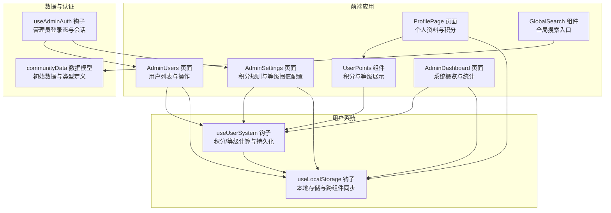
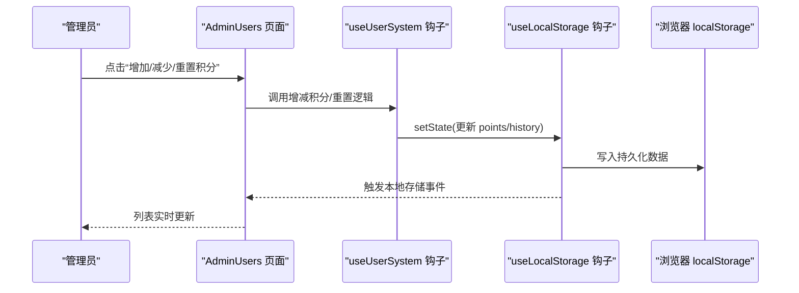
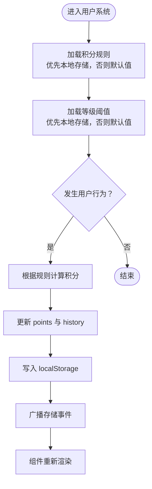
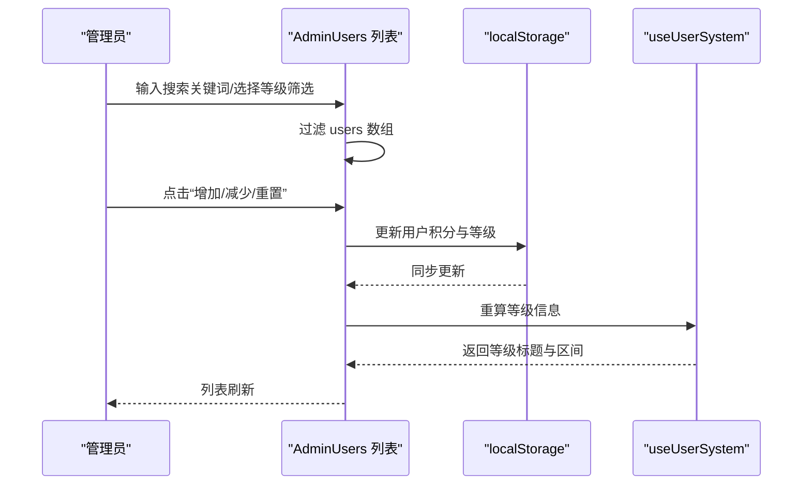
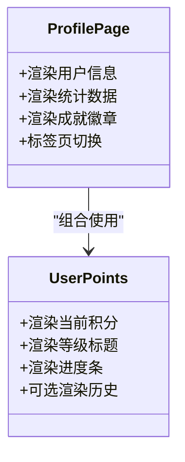
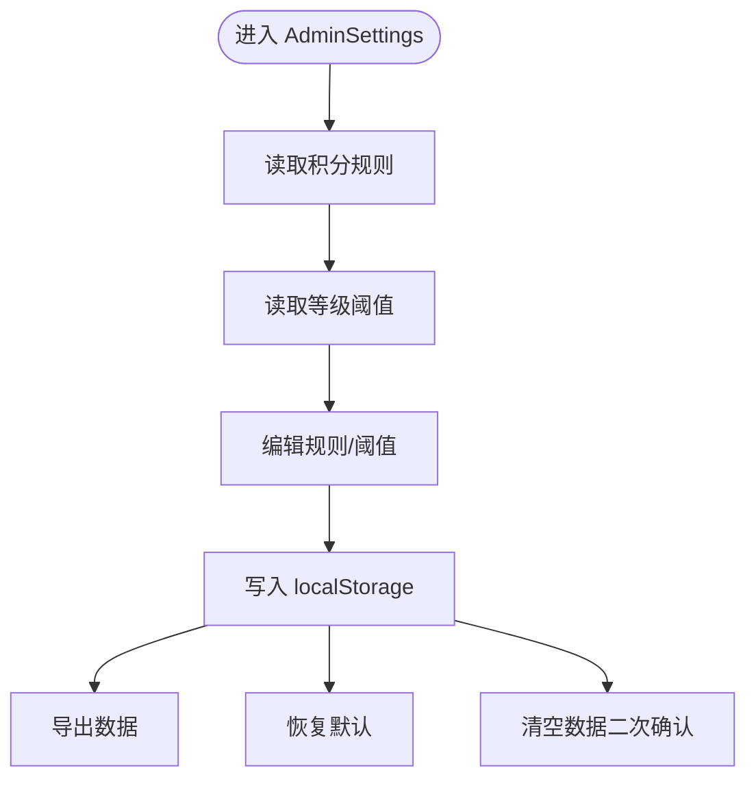
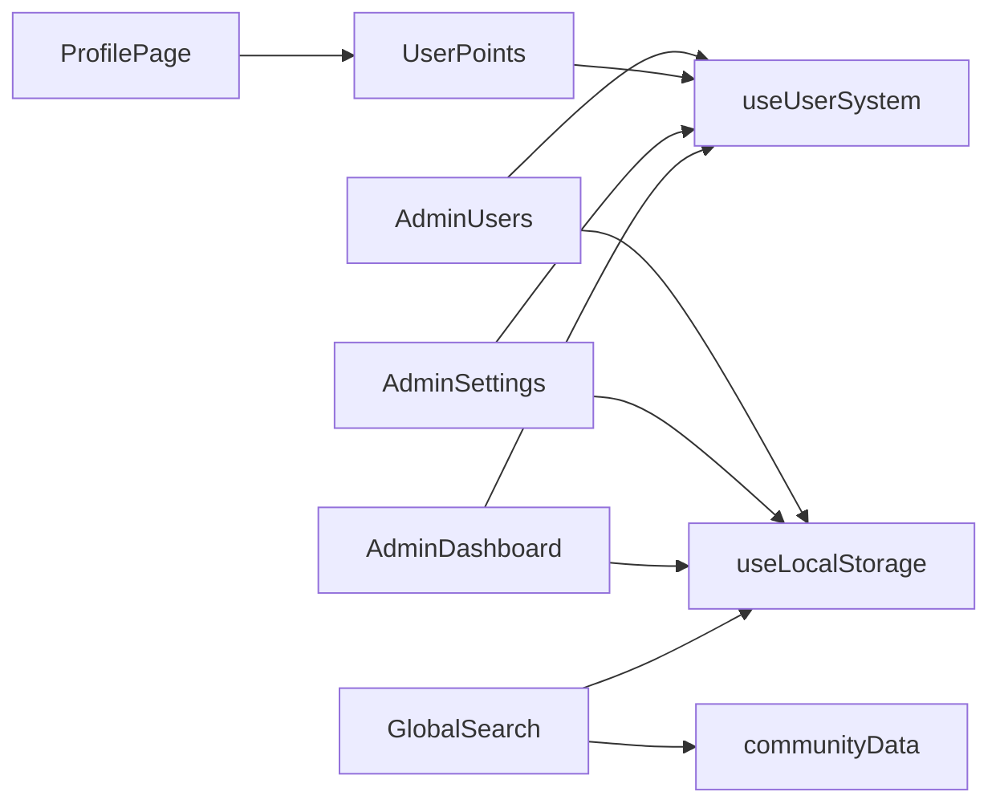

# 用户管理

<cite>
**本文引用的文件**
- [useUserSystem.ts](file://src/hooks/useUserSystem.ts)
- [useLocalStorage.ts](file://src/hooks/useLocalStorage.ts)
- [AdminUsers.tsx](file://src/pages/AdminUsers.tsx)
- [ProfilePage.tsx](file://src/pages/ProfilePage.tsx)
- [UserPoints.tsx](file://src/components/UserPoints.tsx)
- [AdminSettings.tsx](file://src/pages/AdminSettings.tsx)
- [AdminDashboard.tsx](file://src/pages/AdminDashboard.tsx)
- [GlobalSearch.tsx](file://src/components/GlobalSearch.tsx)
- [communityData.ts](file://src/data/communityData.ts)
- [useAdminAuth.ts](file://src/hooks/useAdminAuth.ts)
- [AdminLoginPage.tsx](file://src/pages/AdminLoginPage.tsx)
</cite>

## 目录
1. [简介](#简介)
2. [项目结构](#项目结构)
3. [核心组件](#核心组件)
4. [架构总览](#架构总览)
5. [详细组件分析](#详细组件分析)
6. [依赖关系分析](#依赖关系分析)
7. [性能考量](#性能考量)
8. [故障排查指南](#故障排查指南)
9. [结论](#结论)
10. [附录](#附录)

## 简介
本文件面向YuleTech社区技术平台的“用户管理”功能，系统性阐述用户信息的增删改查、列表展示、个人信息编辑、账户状态管理；完整文档化用户权限体系与等级制度（积分计算规则、等级划分标准、权限分配机制）；解释用户数据的本地存储策略与同步机制（持久化、备份恢复、迁移方案）；提供用户搜索与过滤能力（关键词匹配、筛选条件、排序选项）；描述用户行为监控与违规处理流程（举报机制、审核流程、封禁策略）；并覆盖批量操作（批量删除、批量禁用、批量权限调整）等管理场景。最后给出管理员最佳实践与常见问题解决方案。

## 项目结构
围绕用户管理的关键模块与文件组织如下：
- 用户系统钩子：负责积分与等级的计算、持久化与查询
- 管理端页面：用户列表、积分与等级配置、仪表盘与系统状态
- 前端页面：个人资料页、积分与等级展示
- 本地存储钩子：跨组件共享与同步
- 搜索与过滤：全局搜索、用户列表过滤
- 认证与登录：管理员登录态与会话控制

图表来源
- [AdminUsers.tsx:60-271](file://src/pages/AdminUsers.tsx#L60-L271)
- [ProfilePage.tsx:87-393](file://src/pages/ProfilePage.tsx#L87-L393)
- [UserPoints.tsx:8-80](file://src/components/UserPoints.tsx#L8-L80)
- [AdminSettings.tsx:27-38](file://src/pages/AdminSettings.tsx#L27-L38)
- [AdminDashboard.tsx:67-320](file://src/pages/AdminDashboard.tsx#L67-L320)
- [GlobalSearch.tsx:26-215](file://src/components/GlobalSearch.tsx#L26-L215)
- [useUserSystem.ts:91-134](file://src/hooks/useUserSystem.ts#L91-L134)
- [useLocalStorage.ts:3-59](file://src/hooks/useLocalStorage.ts#L3-L59)
- [communityData.ts:1-371](file://src/data/communityData.ts#L1-L371)
- [useAdminAuth.ts:29-66](file://src/hooks/useAdminAuth.ts#L29-L66)

章节来源
- [AdminUsers.tsx:60-271](file://src/pages/AdminUsers.tsx#L60-L271)
- [useUserSystem.ts:91-134](file://src/hooks/useUserSystem.ts#L91-L134)
- [useLocalStorage.ts:3-59](file://src/hooks/useLocalStorage.ts#L3-L59)

## 核心组件
- 用户系统钩子（useUserSystem）
  - 提供积分与等级的计算、历史记录、增减积分、设置积分等能力
  - 支持从本地存储加载/保存积分规则与等级阈值
- 本地存储钩子（useLocalStorage）
  - 封装 localStorage 读写与跨组件事件同步，保证多实例一致
- 管理端用户列表（AdminUsers）
  - 展示用户列表、关键词搜索、按等级筛选、积分增减与重置、行内编辑
- 个人资料页（ProfilePage）
  - 展示用户信息、统计、成就、贡献、学习进度、收藏与积分等级
- 积分与等级展示（UserPoints）
  - 当前积分、等级标题、进度条与历史记录
- 管理端设置（AdminSettings）
  - 配置积分规则与等级阈值，导出/导入/恢复默认/清空数据
- 仪表盘（AdminDashboard）
  - 社区概览、用户增长趋势、内容分布、积分来源、活跃度、系统状态
- 全局搜索（GlobalSearch）
  - 支持在全站范围内搜索帖子、问答、文章、活动与代码
- 认证与登录（useAdminAuth、AdminLoginPage）
  - 管理员登录态校验、会话有效期与登出

章节来源
- [useUserSystem.ts:91-134](file://src/hooks/useUserSystem.ts#L91-L134)
- [useLocalStorage.ts:3-59](file://src/hooks/useLocalStorage.ts#L3-L59)
- [AdminUsers.tsx:60-271](file://src/pages/AdminUsers.tsx#L60-L271)
- [ProfilePage.tsx:87-393](file://src/pages/ProfilePage.tsx#L87-L393)
- [UserPoints.tsx:8-80](file://src/components/UserPoints.tsx#L8-L80)
- [AdminSettings.tsx:27-38](file://src/pages/AdminSettings.tsx#L27-L38)
- [AdminDashboard.tsx:67-320](file://src/pages/AdminDashboard.tsx#L67-L320)
- [GlobalSearch.tsx:26-215](file://src/components/GlobalSearch.tsx#L26-L215)
- [useAdminAuth.ts:29-66](file://src/hooks/useAdminAuth.ts#L29-L66)
- [AdminLoginPage.tsx:6-38](file://src/pages/AdminLoginPage.tsx#L6-L38)

## 架构总览
用户管理采用“本地存储 + 自定义Hook”的轻量架构：
- 数据持久化：通过自定义 useLocalStorage 钩子统一读写 localStorage，并广播变更事件以实现跨组件同步
- 用户系统：useUserSystem 负责积分与等级计算，支持从本地存储加载可配置规则
- 管理端：AdminUsers 提供用户列表与批量操作；AdminSettings 提供规则与阈值配置；AdminDashboard 提供系统概览
- 前端展示：ProfilePage 与 UserPoints 展示个人积分与等级；GlobalSearch 提供全局搜索能力
- 安全与认证：useAdminAuth 控制管理员登录态与会话有效期

图表来源
- [AdminUsers.tsx:75-95](file://src/pages/AdminUsers.tsx#L75-L95)
- [useUserSystem.ts:97-118](file://src/hooks/useUserSystem.ts#L97-L118)
- [useLocalStorage.ts:14-25](file://src/hooks/useLocalStorage.ts#L14-L25)

## 详细组件分析

### 用户系统与等级制度
- 积分计算规则
  - 默认规则包含发布帖子、回复、回答、被采纳、参加活动等动作的积分值
  - 规则可通过本地存储覆盖，默认值作为回退
- 等级划分
  - 默认等级阈值包含四个等级区间，支持从本地存储加载自定义阈值
  - 等级判定根据当前积分落在的区间返回对应等级信息
- 历史记录
  - 每次增减积分都会生成一条历史记录，包含动作、描述、积分变化与时间戳
- 本地存储与同步
  - 使用自定义 Hook 统一读写，监听 storage 事件与自定义事件，保证多实例一致

图表来源
- [useUserSystem.ts:36-89](file://src/hooks/useUserSystem.ts#L36-L89)
- [useLocalStorage.ts:14-56](file://src/hooks/useLocalStorage.ts#L14-L56)

章节来源
- [useUserSystem.ts:20-89](file://src/hooks/useUserSystem.ts#L20-L89)
- [useLocalStorage.ts:3-59](file://src/hooks/useLocalStorage.ts#L3-L59)

### 用户列表与管理操作
- 列表展示
  - 展示用户名、积分、等级、头衔、注册时间等字段
- 搜索与筛选
  - 关键词搜索用户名（大小写不敏感）
  - 等级筛选（全部/初级/中级/高级/技术专家）
- 行内编辑与批量调整
  - 点击积分单元格进入编辑，支持直接输入数值并回车/失焦保存
  - 提供“增加10/减少10/重置积分”按钮进行快速调整
- 本地存储与演示数据
  - 使用本地存储保存用户列表，初始化时合并当前用户系统积分信息

图表来源
- [AdminUsers.tsx:67-122](file://src/pages/AdminUsers.tsx#L67-L122)
- [useUserSystem.ts:81-89](file://src/hooks/useUserSystem.ts#L81-L89)

章节来源
- [AdminUsers.tsx:60-271](file://src/pages/AdminUsers.tsx#L60-L271)

### 个人信息与积分等级展示
- 个人资料页
  - 展示头像、昵称、角色、公司、加入时间、个人简介
  - 展示统计数据（代码贡献、技术文章、学习课时、点赞数）
  - 成就徽章展示
  - 标签页切换：我的贡献、学习进度、收藏内容、积分等级
- 积分与等级组件
  - 展示当前积分、等级标题、等级进度条
  - 可选显示积分历史记录

图表来源
- [ProfilePage.tsx:87-393](file://src/pages/ProfilePage.tsx#L87-L393)
- [UserPoints.tsx:8-80](file://src/components/UserPoints.tsx#L8-L80)

章节来源
- [ProfilePage.tsx:87-393](file://src/pages/ProfilePage.tsx#L87-L393)
- [UserPoints.tsx:8-80](file://src/components/UserPoints.tsx#L8-L80)

### 管理端设置与数据管理
- 积分规则配置
  - 支持为不同行为（发帖、回复、回答、被采纳、活动）设置积分值
  - 本地存储保存，重启后生效
- 等级阈值配置
  - 支持自定义等级区间与标题，支持最大值为空表示无穷大
- 数据管理
  - 导出数据、恢复默认、清空所有数据（带二次确认）

图表来源
- [AdminSettings.tsx:27-38](file://src/pages/AdminSettings.tsx#L27-L38)
- [useUserSystem.ts:36-79](file://src/hooks/useUserSystem.ts#L36-L79)

章节来源
- [AdminSettings.tsx:27-38](file://src/pages/AdminSettings.tsx#L27-L38)

### 仪表盘与系统状态
- 概览卡片：总用户数、论坛帖子、问答问题、活动数
- 图表组件：用户增长趋势、内容分布、积分来源、社区活跃度
- 系统状态：PWA 状态、localStorage 占用大小、置顶帖子数、即将开始活动数
- 最近动态：按时间倒序展示论坛、问答、活动的最近动态

章节来源
- [AdminDashboard.tsx:67-320](file://src/pages/AdminDashboard.tsx#L67-L320)

### 全局搜索与用户搜索过滤
- 全局搜索
  - 支持快捷键打开/关闭，输入关键词后在帖子、问答、文章、活动、代码中检索
  - 结果按类型分类展示，点击跳转至相应页面
- 用户搜索过滤
  - 用户列表支持关键词匹配用户名与等级筛选
  - 与全局搜索互补，满足管理员精细化检索需求

章节来源
- [GlobalSearch.tsx:26-215](file://src/components/GlobalSearch.tsx#L26-L215)
- [AdminUsers.tsx:67-73](file://src/pages/AdminUsers.tsx#L67-L73)

### 权限体系与认证
- 管理员登录
  - 登录页校验用户名与密码，成功后写入登录态并跳转仪表盘
- 登录态与会话
  - 使用 localStorage 存储登录时间，定期检查会话是否过期
  - 过期自动登出并清理存储

章节来源
- [useAdminAuth.ts:29-66](file://src/hooks/useAdminAuth.ts#L29-L66)
- [AdminLoginPage.tsx:6-38](file://src/pages/AdminLoginPage.tsx#L6-L38)

## 依赖关系分析
- 组件耦合
  - AdminUsers 依赖 useUserSystem 与 useLocalStorage，用于积分计算与持久化
  - ProfilePage 依赖 UserPoints 与 useUserSystem，用于展示个人积分与等级
  - AdminSettings 依赖 useUserSystem 与 useLocalStorage，用于规则与阈值配置
  - AdminDashboard 依赖 useUserSystem 与 useLocalStorage，用于统计与图表
  - GlobalSearch 依赖 communityData 与 useLocalStorage，用于检索与缓存
- 外部依赖
  - localStorage 作为唯一持久化介质
  - 自定义事件用于跨组件同步

图表来源
- [AdminUsers.tsx:60-271](file://src/pages/AdminUsers.tsx#L60-L271)
- [ProfilePage.tsx:87-393](file://src/pages/ProfilePage.tsx#L87-L393)
- [UserPoints.tsx:8-80](file://src/components/UserPoints.tsx#L8-L80)
- [AdminSettings.tsx:27-38](file://src/pages/AdminSettings.tsx#L27-L38)
- [AdminDashboard.tsx:67-320](file://src/pages/AdminDashboard.tsx#L67-L320)
- [GlobalSearch.tsx:26-215](file://src/components/GlobalSearch.tsx#L26-L215)
- [useUserSystem.ts:91-134](file://src/hooks/useUserSystem.ts#L91-L134)
- [useLocalStorage.ts:3-59](file://src/hooks/useLocalStorage.ts#L3-L59)
- [communityData.ts:1-371](file://src/data/communityData.ts#L1-L371)

## 性能考量
- 本地存储读写
  - 使用自定义 Hook 统一处理，避免重复序列化/反序列化
  - 通过事件机制减少不必要的重渲染
- 列表过滤
  - 使用 useMemo 对过滤结果进行缓存，降低大列表渲染成本
- 图表与统计
  - 仅在必要时计算统计与图表数据，避免频繁重算
- 搜索
  - 全局搜索在输入长度达到一定阈值后再进行检索，减少无效计算

## 故障排查指南
- 登录态异常
  - 检查 localStorage 中是否存在管理员登录态，确认会话是否过期
  - 如过期自动登出，需重新登录
- 积分规则不生效
  - 检查本地存储中的积分规则键值是否存在，确认格式是否正确
  - 若规则损坏，可在设置页恢复默认或重新配置
- 等级阈值异常
  - 检查本地存储中的等级阈值，确认最大值是否为 Infinity 或合理数值
  - 重新配置后刷新页面查看效果
- 数据丢失或异常
  - 可通过设置页的“导出数据”备份当前数据
  - 使用“恢复默认”或“清空数据”进行修复或重置
- 列表不更新
  - 确认 useLocalStorage 事件是否正常触发，检查浏览器控制台是否有错误
  - 强制刷新页面或重启应用以同步最新数据

章节来源
- [useAdminAuth.ts:29-66](file://src/hooks/useAdminAuth.ts#L29-L66)
- [AdminSettings.tsx:196-287](file://src/pages/AdminSettings.tsx#L196-L287)
- [useLocalStorage.ts:3-59](file://src/hooks/useLocalStorage.ts#L3-L59)

## 结论
本用户管理方案以本地存储为核心，结合自定义 Hook 实现了完整的积分与等级体系、用户列表管理、个人资料展示与全局搜索能力。通过管理端设置页，管理员可灵活配置积分规则与等级阈值，并具备数据导出与恢复能力。整体架构简洁、易维护，适合中小型社区的用户运营与管理需求。

## 附录
- 管理员最佳实践
  - 定期导出数据备份，防止意外丢失
  - 合理设置积分规则与等级阈值，保持激励与公平
  - 使用全局搜索与用户列表筛选快速定位问题用户
  - 对违规行为及时处理，必要时重置积分或封禁账号
- 常见问题
  - 积分规则修改后不生效：确认本地存储键值存在且格式正确
  - 等级显示异常：检查阈值边界与最大值配置
  - 列表不刷新：检查事件广播与 useLocalStorage 使用是否正确