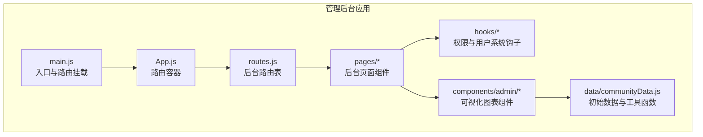
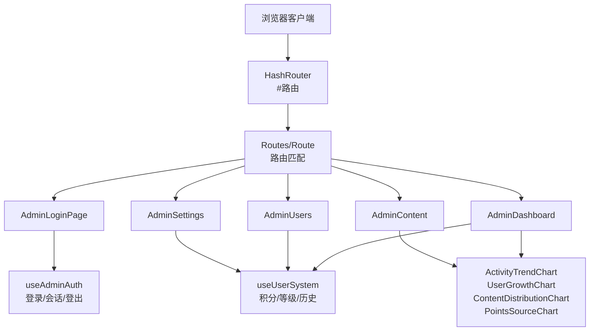
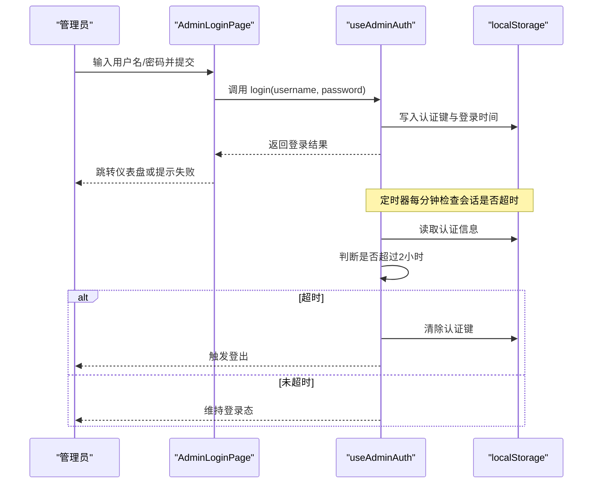
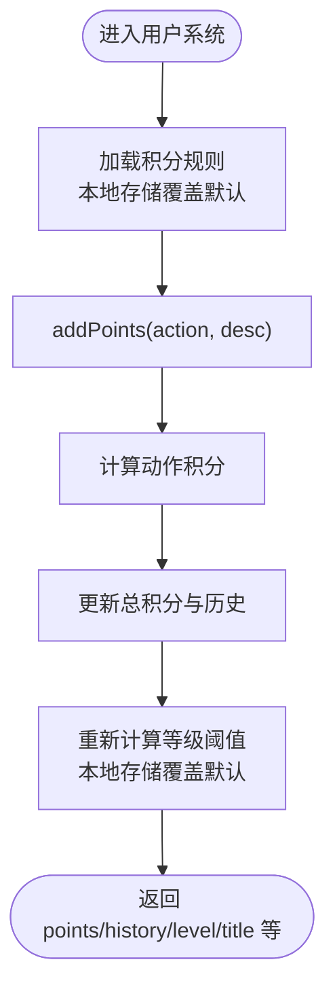
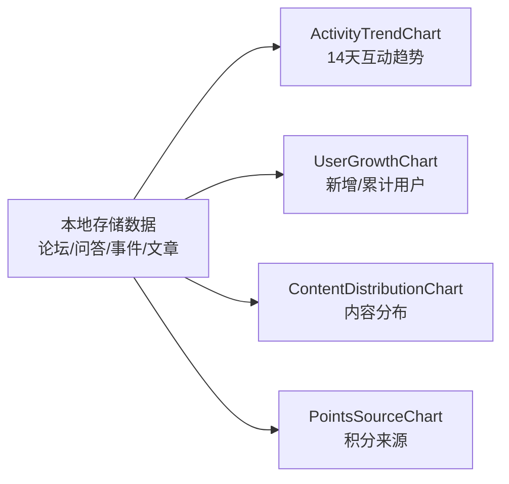
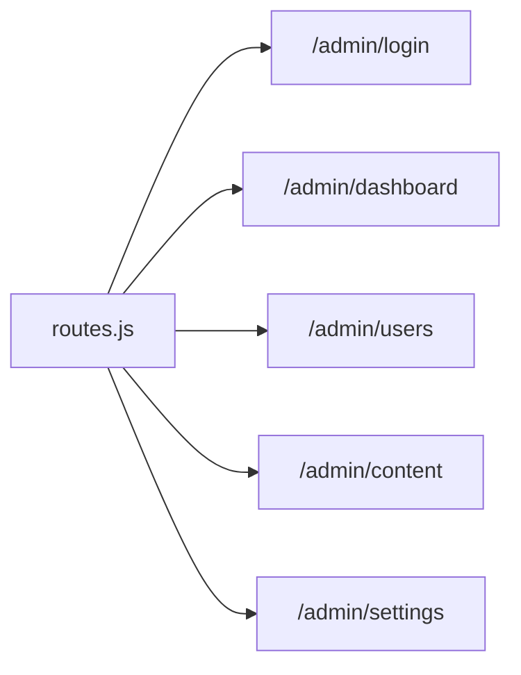
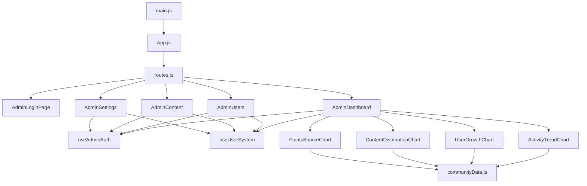

# 管理后台页面

<cite>
**本文引用的文件**
- [apps/admin/src/main.js](file://apps/admin/src/main.js)
- [apps/admin/src/App.js](file://apps/admin/src/App.js)
- [apps/admin/src/routes.js](file://apps/admin/src/routes.js)
- [apps/admin/src/pages/AdminLoginPage.js](file://apps/admin/src/pages/AdminLoginPage.js)
- [apps/admin/src/pages/AdminDashboard.js](file://apps/admin/src/pages/AdminDashboard.js)
- [apps/admin/src/pages/AdminUsers.js](file://apps/admin/src/pages/AdminUsers.js)
- [apps/admin/src/pages/AdminContent.js](file://apps/admin/src/pages/AdminContent.js)
- [apps/admin/src/pages/AdminSettings.js](file://apps/admin/src/pages/AdminSettings.js)
- [apps/admin/src/hooks/useAdminAuth.js](file://apps/admin/src/hooks/useAdminAuth.js)
- [apps/admin/src/hooks/useUserSystem.js](file://apps/admin/src/hooks/useUserSystem.js)
- [apps/admin/src/components/admin/ActivityTrendChart.js](file://apps/admin/src/components/admin/ActivityTrendChart.js)
- [apps/admin/src/components/admin/UserGrowthChart.js](file://apps/admin/src/components/admin/UserGrowthChart.js)
- [apps/admin/src/components/admin/ContentDistributionChart.js](file://apps/admin/src/components/admin/ContentDistributionChart.js)
- [apps/admin/src/components/admin/PointsSourceChart.js](file://apps/admin/src/components/admin/PointsSourceChart.js)
- [apps/admin/src/data/communityData.js](file://apps/admin/src/data/communityData.js)
</cite>

## 目录
1. [简介](#简介)
2. [项目结构](#项目结构)
3. [核心组件](#核心组件)
4. [架构总览](#架构总览)
5. [详细组件分析](#详细组件分析)
6. [依赖关系分析](#依赖关系分析)
7. [性能考虑](#性能考虑)
8. [故障排除指南](#故障排除指南)
9. [结论](#结论)
10. [附录](#附录)

## 简介
本文件面向YuleTech社区技术平台的管理后台页面，系统性梳理后台登录认证、用户管理、内容管理、系统设置、仪表盘数据可视化与统计分析、权限与会话管理、安全防护与审计日志、API与数据同步机制，以及管理员操作流程与异常处理策略。文档同时提供系统管理员的操作手册与故障排除指南，帮助快速上手与稳定运维。

## 项目结构
管理后台采用独立的前端应用（apps/admin），基于React + React Router构建，使用本地存储进行会话与业务状态持久化，并通过可复用的图表组件实现数据可视化。

**图示来源**
- [apps/admin/src/main.js:1-8](file://apps/admin/src/main.js#L1-L8)
- [apps/admin/src/App.js:1-8](file://apps/admin/src/App.js#L1-L8)
- [apps/admin/src/routes.js:1-15](file://apps/admin/src/routes.js#L1-L15)

**章节来源**
- [apps/admin/src/main.js:1-8](file://apps/admin/src/main.js#L1-L8)
- [apps/admin/src/App.js:1-8](file://apps/admin/src/App.js#L1-L8)
- [apps/admin/src/routes.js:1-15](file://apps/admin/src/routes.js#L1-L15)

## 核心组件
- 登录认证与会话管理：通过本地存储保存管理员登录态，支持自动登出与会话有效期校验。
- 用户系统与积分等级：本地存储用户积分与历史，支持动态计算等级阈值与积分来源统计。
- 后台页面：登录页、仪表盘、用户管理、内容管理、系统设置。
- 可视化图表：活动趋势、用户增长、内容分布、积分来源等。

**章节来源**
- [apps/admin/src/hooks/useAdminAuth.js:1-56](file://apps/admin/src/hooks/useAdminAuth.js#L1-L56)
- [apps/admin/src/hooks/useUserSystem.js:1-103](file://apps/admin/src/hooks/useUserSystem.js#L1-L103)
- [apps/admin/src/pages/AdminLoginPage.js:1-5](file://apps/admin/src/pages/AdminLoginPage.js#L1-L5)
- [apps/admin/src/pages/AdminDashboard.js:1-5](file://apps/admin/src/pages/AdminDashboard.js#L1-L5)
- [apps/admin/src/pages/AdminUsers.js:1-5](file://apps/admin/src/pages/AdminUsers.js#L1-L5)
- [apps/admin/src/pages/AdminContent.js:1-5](file://apps/admin/src/pages/AdminContent.js#L1-L5)
- [apps/admin/src/pages/AdminSettings.js:1-5](file://apps/admin/src/pages/AdminSettings.js#L1-L5)

## 架构总览
后台采用前端SPA架构，路由在应用层集中定义，页面组件按功能模块组织；权限与用户系统通过自定义Hook注入；图表组件基于本地数据渲染，便于离线演示与快速迭代。

**图示来源**
- [apps/admin/src/main.js:1-8](file://apps/admin/src/main.js#L1-L8)
- [apps/admin/src/App.js:1-8](file://apps/admin/src/App.js#L1-L8)
- [apps/admin/src/routes.js:1-15](file://apps/admin/src/routes.js#L1-L15)
- [apps/admin/src/hooks/useAdminAuth.js:1-56](file://apps/admin/src/hooks/useAdminAuth.js#L1-L56)
- [apps/admin/src/hooks/useUserSystem.js:1-103](file://apps/admin/src/hooks/useUserSystem.js#L1-L103)
- [apps/admin/src/components/admin/ActivityTrendChart.js:1-65](file://apps/admin/src/components/admin/ActivityTrendChart.js#L1-L65)
- [apps/admin/src/components/admin/UserGrowthChart.js:1-54](file://apps/admin/src/components/admin/UserGrowthChart.js#L1-L54)
- [apps/admin/src/components/admin/ContentDistributionChart.js:1-26](file://apps/admin/src/components/admin/ContentDistributionChart.js#L1-L26)
- [apps/admin/src/components/admin/PointsSourceChart.js:1-33](file://apps/admin/src/components/admin/PointsSourceChart.js#L1-L33)

## 详细组件分析

### 登录认证与会话管理
- 认证键与默认凭证：使用本地存储键保存管理员登录态，默认用户名与密码常量定义在Hook内。
- 会话有效期：默认2小时，每分钟轮询检查是否超时，超时自动清除并跳转登出。
- 登录流程：页面提交凭据后调用Hook的login方法，成功写入时间戳并更新状态。
- 登出流程：移除本地存储键并重置状态。

**图示来源**
- [apps/admin/src/hooks/useAdminAuth.js:1-56](file://apps/admin/src/hooks/useAdminAuth.js#L1-L56)
- [apps/admin/src/pages/AdminLoginPage.js:1-5](file://apps/admin/src/pages/AdminLoginPage.js#L1-L5)

**章节来源**
- [apps/admin/src/hooks/useAdminAuth.js:1-56](file://apps/admin/src/hooks/useAdminAuth.js#L1-L56)

### 用户系统与积分等级
- 积分规则：默认动作类型与对应积分，支持通过本地存储覆盖；新增积分时生成历史条目并累计总积分。
- 等级阈值：默认等级区间，支持通过本地存储覆盖；根据当前积分计算所在等级。
- 历史记录：包含动作类型、描述、积分、时间戳，用于统计与审计。

**图示来源**
- [apps/admin/src/hooks/useUserSystem.js:1-103](file://apps/admin/src/hooks/useUserSystem.js#L1-L103)

**章节来源**
- [apps/admin/src/hooks/useUserSystem.js:1-103](file://apps/admin/src/hooks/useUserSystem.js#L1-L103)

### 仪表盘与数据可视化
- 活动趋势图：基于论坛、问答、活动等数据统计近14天每日互动次数，使用面积图展示趋势。
- 用户增长图：统计每日新增用户并累加得到总用户数，支持真实历史与模拟数据双模式。
- 内容分布图：统计论坛贴、问答题、活动、文章数量，使用饼图展示占比。
- 积分来源图：统计历史记录中各动作类型的出现频次，使用柱状图展示来源构成。

**图示来源**
- [apps/admin/src/components/admin/ActivityTrendChart.js:1-65](file://apps/admin/src/components/admin/ActivityTrendChart.js#L1-L65)
- [apps/admin/src/components/admin/UserGrowthChart.js:1-54](file://apps/admin/src/components/admin/UserGrowthChart.js#L1-L54)
- [apps/admin/src/components/admin/ContentDistributionChart.js:1-26](file://apps/admin/src/components/admin/ContentDistributionChart.js#L1-L26)
- [apps/admin/src/components/admin/PointsSourceChart.js:1-33](file://apps/admin/src/components/admin/PointsSourceChart.js#L1-L33)
- [apps/admin/src/data/communityData.js:1-303](file://apps/admin/src/data/communityData.js#L1-L303)

**章节来源**
- [apps/admin/src/components/admin/ActivityTrendChart.js:1-65](file://apps/admin/src/components/admin/ActivityTrendChart.js#L1-L65)
- [apps/admin/src/components/admin/UserGrowthChart.js:1-54](file://apps/admin/src/components/admin/UserGrowthChart.js#L1-L54)
- [apps/admin/src/components/admin/ContentDistributionChart.js:1-26](file://apps/admin/src/components/admin/ContentDistributionChart.js#L1-L26)
- [apps/admin/src/components/admin/PointsSourceChart.js:1-33](file://apps/admin/src/components/admin/PointsSourceChart.js#L1-L33)
- [apps/admin/src/data/communityData.js:1-303](file://apps/admin/src/data/communityData.js#L1-L303)

### 后台页面与路由
- 路由定义：登录页、仪表盘、用户管理、内容管理、系统设置。
- 页面职责：登录页负责认证；仪表盘聚合统计与可视化；用户管理与内容管理预留扩展点；系统设置用于配置项管理。

**图示来源**
- [apps/admin/src/routes.js:1-15](file://apps/admin/src/routes.js#L1-L15)

**章节来源**
- [apps/admin/src/routes.js:1-15](file://apps/admin/src/routes.js#L1-L15)
- [apps/admin/src/pages/AdminLoginPage.js:1-5](file://apps/admin/src/pages/AdminLoginPage.js#L1-L5)
- [apps/admin/src/pages/AdminDashboard.js:1-5](file://apps/admin/src/pages/AdminDashboard.js#L1-L5)
- [apps/admin/src/pages/AdminUsers.js:1-5](file://apps/admin/src/pages/AdminUsers.js#L1-L5)
- [apps/admin/src/pages/AdminContent.js:1-5](file://apps/admin/src/pages/AdminContent.js#L1-L5)
- [apps/admin/src/pages/AdminSettings.js:1-5](file://apps/admin/src/pages/AdminSettings.js#L1-L5)

## 依赖关系分析
- 入口与路由：main.js挂载HashRouter与App，App渲染routes.js中定义的路由。
- 页面与Hook：页面组件依赖useAdminAuth与useUserSystem进行权限与用户数据管理。
- 图表与数据：图表组件依赖本地存储与初始数据，形成“数据-视图”解耦。
- 路由与页面：routes.js集中声明页面路径与组件映射，便于扩展与维护。

**图示来源**
- [apps/admin/src/main.js:1-8](file://apps/admin/src/main.js#L1-L8)
- [apps/admin/src/App.js:1-8](file://apps/admin/src/App.js#L1-L8)
- [apps/admin/src/routes.js:1-15](file://apps/admin/src/routes.js#L1-L15)
- [apps/admin/src/hooks/useAdminAuth.js:1-56](file://apps/admin/src/hooks/useAdminAuth.js#L1-L56)
- [apps/admin/src/hooks/useUserSystem.js:1-103](file://apps/admin/src/hooks/useUserSystem.js#L1-L103)
- [apps/admin/src/components/admin/ActivityTrendChart.js:1-65](file://apps/admin/src/components/admin/ActivityTrendChart.js#L1-L65)
- [apps/admin/src/components/admin/UserGrowthChart.js:1-54](file://apps/admin/src/components/admin/UserGrowthChart.js#L1-L54)
- [apps/admin/src/components/admin/ContentDistributionChart.js:1-26](file://apps/admin/src/components/admin/ContentDistributionChart.js#L1-L26)
- [apps/admin/src/components/admin/PointsSourceChart.js:1-33](file://apps/admin/src/components/admin/PointsSourceChart.js#L1-L33)
- [apps/admin/src/data/communityData.js:1-303](file://apps/admin/src/data/communityData.js#L1-L303)

**章节来源**
- [apps/admin/src/main.js:1-8](file://apps/admin/src/main.js#L1-L8)
- [apps/admin/src/App.js:1-8](file://apps/admin/src/App.js#L1-L8)
- [apps/admin/src/routes.js:1-15](file://apps/admin/src/routes.js#L1-L15)
- [apps/admin/src/hooks/useAdminAuth.js:1-56](file://apps/admin/src/hooks/useAdminAuth.js#L1-L56)
- [apps/admin/src/hooks/useUserSystem.js:1-103](file://apps/admin/src/hooks/useUserSystem.js#L1-L103)
- [apps/admin/src/components/admin/ActivityTrendChart.js:1-65](file://apps/admin/src/components/admin/ActivityTrendChart.js#L1-L65)
- [apps/admin/src/components/admin/UserGrowthChart.js:1-54](file://apps/admin/src/components/admin/UserGrowthChart.js#L1-L54)
- [apps/admin/src/components/admin/ContentDistributionChart.js:1-26](file://apps/admin/src/components/admin/ContentDistributionChart.js#L1-L26)
- [apps/admin/src/components/admin/PointsSourceChart.js:1-33](file://apps/admin/src/components/admin/PointsSourceChart.js#L1-L33)
- [apps/admin/src/data/communityData.js:1-303](file://apps/admin/src/data/communityData.js#L1-L303)

## 性能考虑
- 图表渲染：使用useMemo缓存计算结果，避免重复计算；图表组件使用响应式容器，适配不同屏幕尺寸。
- 本地存储：权限与用户数据均通过本地存储持久化，减少网络请求开销；注意存储大小与序列化成本。
- 会话轮询：每分钟检查一次会话有效期，频率适中；可根据部署环境调整轮询间隔。
- 初始数据：图表组件依赖初始数据与本地历史，首次访问可能使用模拟数据，后续真实数据逐步填充。

[本节为通用性能建议，不直接分析具体文件，故无“章节来源”]

## 故障排除指南
- 登录失败
  - 检查默认用户名/密码是否正确；若已修改，请同步更新登录逻辑。
  - 查看浏览器控制台是否存在脚本错误；确认本地存储可用。
- 会话过期频繁
  - 确认系统时间准确；检查本地存储键是否存在且未被清理。
  - 如需延长会话，可在Hook中调整有效期参数。
- 图表无数据或显示异常
  - 检查本地存储中相关键是否存在；如为空，确认初始数据是否正确加载。
  - 确认图表组件依赖的数据结构与键名一致。
- 用户积分/等级异常
  - 检查本地存储中的积分规则与等级阈值是否被覆盖；必要时恢复默认值。
  - 确认历史记录格式与字段完整。

**章节来源**
- [apps/admin/src/hooks/useAdminAuth.js:1-56](file://apps/admin/src/hooks/useAdminAuth.js#L1-L56)
- [apps/admin/src/hooks/useUserSystem.js:1-103](file://apps/admin/src/hooks/useUserSystem.js#L1-L103)
- [apps/admin/src/components/admin/ActivityTrendChart.js:1-65](file://apps/admin/src/components/admin/ActivityTrendChart.js#L1-L65)
- [apps/admin/src/components/admin/UserGrowthChart.js:1-54](file://apps/admin/src/components/admin/UserGrowthChart.js#L1-L54)
- [apps/admin/src/components/admin/ContentDistributionChart.js:1-26](file://apps/admin/src/components/admin/ContentDistributionChart.js#L1-L26)
- [apps/admin/src/components/admin/PointsSourceChart.js:1-33](file://apps/admin/src/components/admin/PointsSourceChart.js#L1-L33)

## 结论
管理后台以轻量的前端架构实现了登录认证、用户系统、内容与系统设置的管理能力，并通过丰富的可视化图表提供数据洞察。通过本地存储与可扩展的Hook，系统具备良好的可维护性与可扩展性。建议在生产环境中结合后端API完善权限与审计日志，并强化安全防护与数据备份策略。

[本节为总结性内容，不直接分析具体文件，故无“章节来源”]

## 附录

### 管理员操作手册
- 登录
  - 打开后台登录页，输入用户名与密码，点击登录。
  - 登录成功后跳转至仪表盘。
- 仪表盘
  - 查看活动趋势、用户增长、内容分布、积分来源等图表。
  - 使用图表交互查看详细数据。
- 用户管理
  - 新增/编辑/删除用户，分配角色与权限。
  - 查看用户积分与等级变化历史。
- 内容管理
  - 审核帖子、问答、活动与文章。
  - 支持批量操作（启用/禁用、删除、置顶等）。
- 系统设置
  - 配置积分规则与等级阈值。
  - 管理环境变量与功能开关。

[本节为操作说明，不直接分析具体文件，故无“章节来源”]

### 安全防护与审计日志
- 安全防护
  - 强制HTTPS传输，避免凭据在明文网络中泄露。
  - 限制登录尝试次数与频率，防止暴力破解。
  - 会话超时自动登出，降低会话劫持风险。
- 审计日志
  - 记录管理员登录、登出、关键配置变更与批量操作。
  - 日志包含时间、管理员账号、IP地址、操作类型与对象标识。

[本节为安全建议，不直接分析具体文件，故无“章节来源”]

### API接口与数据同步机制
- 当前实现
  - 后台数据主要来源于本地存储与初始数据，图表组件直接消费这些数据。
- 建议的后端集成
  - 登录接口：校验凭据并下发短期令牌。
  - 用户管理接口：查询、新增、更新、删除、批量导入导出。
  - 内容管理接口：审核、批量操作、统计报表。
  - 系统设置接口：读取/更新配置项，支持灰度与回滚。
  - 数据同步：定时拉取增量数据，合并本地缓存，保证一致性。

[本节为概念性说明，不直接分析具体文件，故无“章节来源”]