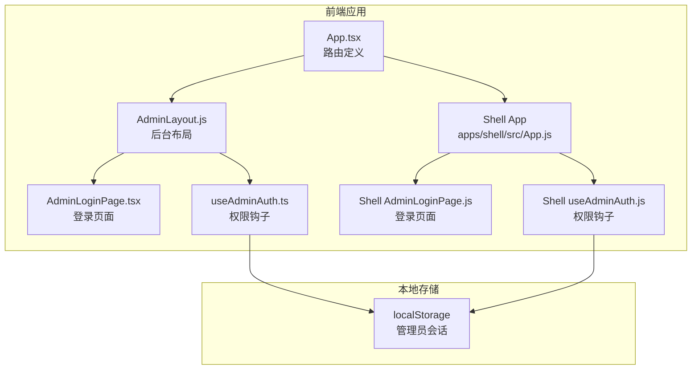
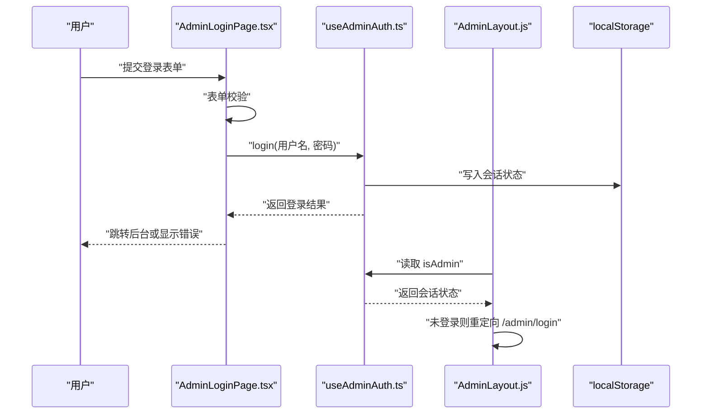
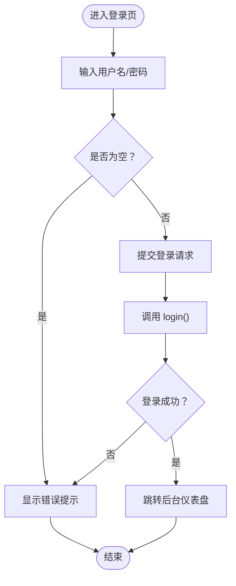
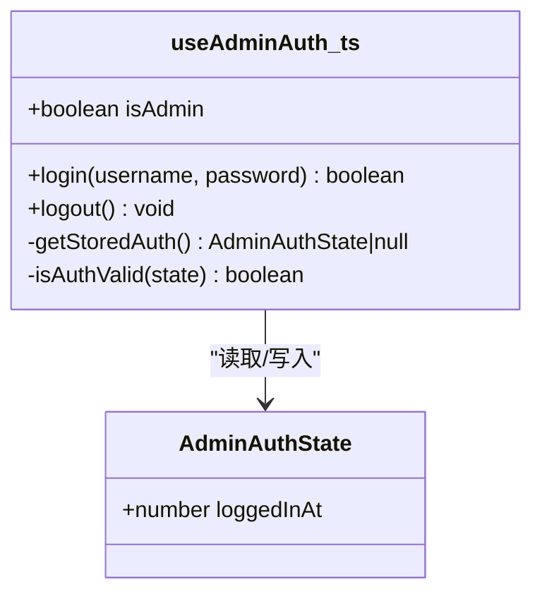
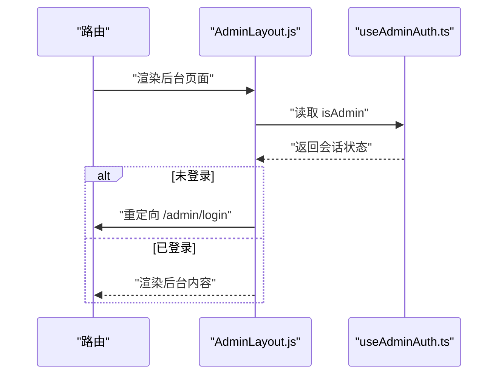
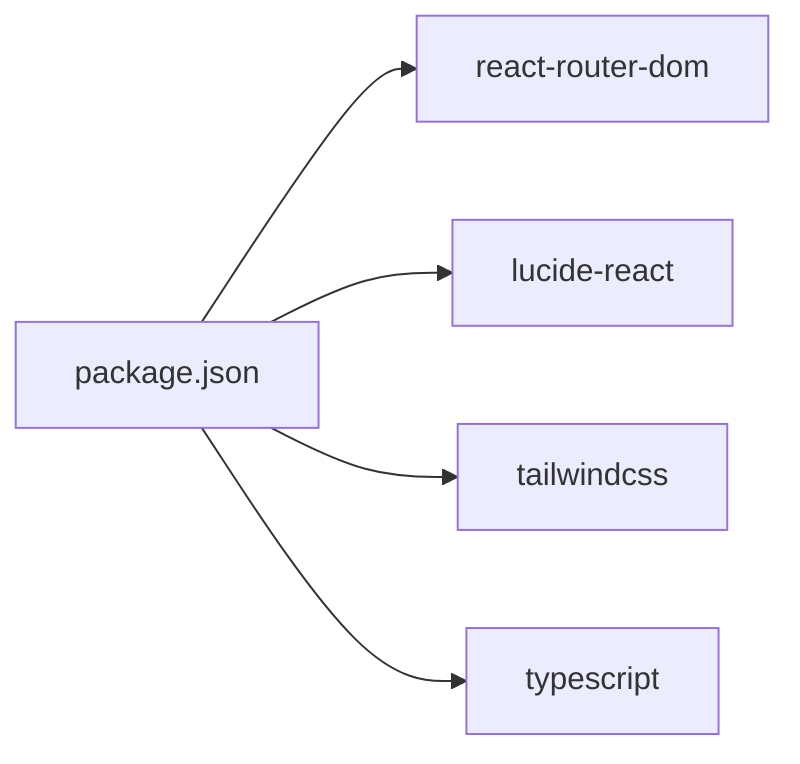

# 管理员登录认证

<cite>
**本文档引用的文件**
- [apps/admin/src/pages/AdminLoginPage.js](file://apps/admin/src/pages/AdminLoginPage.js)
- [apps/shell/src/pages/admin/AdminLoginPage.js](file://apps/shell/src/pages/admin/AdminLoginPage.js)
- [src/pages/AdminLoginPage.tsx](file://src/pages/AdminLoginPage.tsx)
- [archive/src/pages/AdminLoginPage.tsx](file://archive/src/pages/AdminLoginPage.tsx)
- [apps/admin/src/hooks/useAdminAuth.js](file://apps/admin/src/hooks/useAdminAuth.js)
- [apps/shell/src/hooks/useAdminAuth.js](file://apps/shell/src/hooks/useAdminAuth.js)
- [src/hooks/useAdminAuth.ts](file://src/hooks/useAdminAuth.ts)
- [apps/admin/src/components/AdminLayout.js](file://apps/admin/src/components/AdminLayout.js)
- [apps/admin/src/routes.js](file://apps/admin/src/routes.js)
- [apps/shell/src/App.js](file://apps/shell/src/App.js)
- [src/App.tsx](file://src/App.tsx)
- [src/hooks/useUserSystem.ts](file://src/hooks/useUserSystem.ts)
- [package.json](file://package.json)
- [README.md](file://README.md)
</cite>

## 目录
1. [引言](#引言)
2. [项目结构](#项目结构)
3. [核心组件](#核心组件)
4. [架构总览](#架构总览)
5. [详细组件分析](#详细组件分析)
6. [依赖关系分析](#依赖关系分析)
7. [性能考虑](#性能考虑)
8. [故障排除指南](#故障排除指南)
9. [结论](#结论)
10. [附录](#附录)

## 引言
本文件针对 YuleTech 社区技术平台的“管理员登录认证”功能进行系统化技术文档化，覆盖登录界面设计与实现、表单验证、本地会话管理、权限控制、用户体验设计、安全防护以及故障排除建议。当前仓库中的登录认证采用前端本地存储会话方案，未涉及后端 JWT 或密码加密传输等机制；本文在不虚构事实的前提下，对现有实现进行准确记录与指导性建议。

## 项目结构
YuleTech 社区技术平台采用多包/多应用结构，管理员登录认证相关的关键文件分布在以下位置：
- 登录页面：src/pages/AdminLoginPage.tsx、apps/shell/src/pages/admin/AdminLoginPage.js、apps/admin/src/pages/AdminLoginPage.js
- 权限钩子：src/hooks/useAdminAuth.ts、apps/admin/src/hooks/useAdminAuth.js、apps/shell/src/hooks/useAdminAuth.js
- 后台布局与路由：apps/admin/src/components/AdminLayout.js、apps/admin/src/routes.js、src/App.tsx、apps/shell/src/App.js
- 用户系统与积分等级：src/hooks/useUserSystem.ts（用于用户行为与等级体系，非管理员认证）

**图表来源**
- [src/App.tsx:30-70](file://src/App.tsx#L30-L70)
- [apps/admin/src/components/AdminLayout.js:14-40](file://apps/admin/src/components/AdminLayout.js#L14-L40)
- [src/pages/AdminLoginPage.tsx:6-38](file://src/pages/AdminLoginPage.tsx#L6-L38)
- [src/hooks/useAdminAuth.ts:29-66](file://src/hooks/useAdminAuth.ts#L29-L66)
- [apps/shell/src/App.js:23-26](file://apps/shell/src/App.js#L23-L26)
- [apps/shell/src/pages/admin/AdminLoginPage.js:1-17](file://apps/shell/src/pages/admin/AdminLoginPage.js#L1-L17)
- [apps/shell/src/hooks/useAdminAuth.js:1-32](file://apps/shell/src/hooks/useAdminAuth.js#L1-L32)

**章节来源**
- [src/App.tsx:30-70](file://src/App.tsx#L30-L70)
- [apps/admin/src/components/AdminLayout.js:14-40](file://apps/admin/src/components/AdminLayout.js#L14-L40)
- [src/pages/AdminLoginPage.tsx:6-38](file://src/pages/AdminLoginPage.tsx#L6-L38)
- [src/hooks/useAdminAuth.ts:29-66](file://src/hooks/useAdminAuth.ts#L29-L66)
- [apps/shell/src/App.js:23-26](file://apps/shell/src/App.js#L23-L26)
- [apps/shell/src/pages/admin/AdminLoginPage.js:1-17](file://apps/shell/src/pages/admin/AdminLoginPage.js#L1-L17)
- [apps/shell/src/hooks/useAdminAuth.js:1-32](file://apps/shell/src/hooks/useAdminAuth.js#L1-L32)

## 核心组件
- 管理员登录页面
  - 负责收集用户名/密码、执行表单校验、触发登录流程、显示错误信息与加载状态。
  - 参考路径：[src/pages/AdminLoginPage.tsx:6-38](file://src/pages/AdminLoginPage.tsx#L6-L38)
- 权限钩子 useAdminAuth
  - 提供 isAdmin、login、logout 能力；使用 localStorage 存储会话状态；内置会话有效期检查。
  - 参考路径：[src/hooks/useAdminAuth.ts:29-66](file://src/hooks/useAdminAuth.ts#L29-L66)
- 后台布局 AdminLayout
  - 在后台路由内保护页面访问，若未登录则重定向至登录页；提供退出登录入口。
  - 参考路径：[apps/admin/src/components/AdminLayout.js:14-40](file://apps/admin/src/components/AdminLayout.js#L14-L40)
- 路由配置
  - 定义 /admin/login 与后台子路由，确保登录页与后台受控访问。
  - 参考路径：[src/App.tsx:35-70](file://src/App.tsx#L35-L70)、[apps/admin/src/routes.js:7-13](file://apps/admin/src/routes.js#L7-L13)

**章节来源**
- [src/pages/AdminLoginPage.tsx:6-38](file://src/pages/AdminLoginPage.tsx#L6-L38)
- [src/hooks/useAdminAuth.ts:29-66](file://src/hooks/useAdminAuth.ts#L29-L66)
- [apps/admin/src/components/AdminLayout.js:14-40](file://apps/admin/src/components/AdminLayout.js#L14-L40)
- [src/App.tsx:35-70](file://src/App.tsx#L35-L70)
- [apps/admin/src/routes.js:7-13](file://apps/admin/src/routes.js#L7-L13)

## 架构总览
管理员登录认证采用“前端本地会话”的轻量级认证模型，核心流程如下：
- 用户在登录页输入凭据，前端进行基础校验。
- 调用 useAdminAuth.login 进行本地认证，成功后写入 localStorage 并标记已登录。
- 后台布局在每次渲染时检查 isAdmin，未登录则强制跳转至登录页。
- 会话有效期通过时间差判断，定期清理过期状态。

**图表来源**
- [src/pages/AdminLoginPage.tsx:21-38](file://src/pages/AdminLoginPage.tsx#L21-L38)
- [src/hooks/useAdminAuth.ts:50-63](file://src/hooks/useAdminAuth.ts#L50-L63)
- [apps/admin/src/components/AdminLayout.js:20-24](file://apps/admin/src/components/AdminLayout.js#L20-L24)

## 详细组件分析

### 登录页面组件分析
- 表单字段与交互
  - 用户名/密码输入框，支持显示/隐藏密码。
  - 提交按钮禁用状态与加载文案切换。
- 表单验证
  - 前端校验用户名与密码非空；登录失败时显示错误提示。
- 路由跳转
  - 登录成功后跳转至后台仪表盘；失败时保留当前页并提示错误。

**图表来源**
- [src/pages/AdminLoginPage.tsx:21-38](file://src/pages/AdminLoginPage.tsx#L21-L38)

**章节来源**
- [src/pages/AdminLoginPage.tsx:6-38](file://src/pages/AdminLoginPage.tsx#L6-L38)

### 权限钩子 useAdminAuth 分析
- 会话存储键值与有效期
  - 使用固定键名持久化管理员会话；默认会话有效期为 2 小时。
- 会话有效性检查
  - 初始化与定时器轮询检查 localStorage 中的登录时间戳，超时则清除并标记未登录。
- 登录与退出
  - 登录成功写入当前时间戳；退出删除存储并重置状态。

**图表来源**
- [src/hooks/useAdminAuth.ts:8-27](file://src/hooks/useAdminAuth.ts#L8-L27)
- [src/hooks/useAdminAuth.ts:29-66](file://src/hooks/useAdminAuth.ts#L29-L66)

**章节来源**
- [src/hooks/useAdminAuth.ts:1-67](file://src/hooks/useAdminAuth.ts#L1-L67)

### 后台布局与路由保护
- 路由保护
  - 后台布局在挂载与每次渲染时检查 isAdmin，未登录则强制跳转至登录页。
- 侧边栏与导航
  - 提供后台常用功能入口与退出登录按钮，支持移动端抽屉与桌面端折叠。

**图表来源**
- [apps/admin/src/components/AdminLayout.js:14-40](file://apps/admin/src/components/AdminLayout.js#L14-L40)
- [src/hooks/useAdminAuth.ts:29-48](file://src/hooks/useAdminAuth.ts#L29-L48)

**章节来源**
- [apps/admin/src/components/AdminLayout.js:14-40](file://apps/admin/src/components/AdminLayout.js#L14-L40)
- [apps/admin/src/routes.js:7-13](file://apps/admin/src/routes.js#L7-L13)

### 登录界面用户体验设计指南
- 响应式布局
  - 登录容器最大宽度适配移动端与桌面端；表单间距与字号按语义层级设计。
- 错误提示
  - 登录失败时以统一的破坏性提示区域显示错误信息，提升可发现性。
- 加载状态
  - 提交按钮在请求期间禁用并显示加载文案，避免重复提交。
- 可访问性
  - 输入框具备占位符与标签语义；密码可见性切换按钮具备明确图标与标题。

**章节来源**
- [src/pages/AdminLoginPage.tsx:40-118](file://src/pages/AdminLoginPage.tsx#L40-L118)

### 安全防护与会话管理现状
- 本地存储会话
  - 会话状态保存于浏览器 localStorage，存在 XSS 风险；建议配合 HttpOnly Cookie 与 SameSite 属性（见“结论”建议）。
- 会话有效期
  - 前端定时轮询检查登录时间戳，超时自动清除；建议后端颁发短期令牌并在前端使用安全存储。
- 多因素认证
  - 当前未实现 MFA；可在登录成功后引导二次验证流程。
- 登录失败处理
  - 前端仅提示用户名或密码错误；建议结合后端返回的错误码与节流策略。

**章节来源**
- [src/hooks/useAdminAuth.ts:35-48](file://src/hooks/useAdminAuth.ts#L35-L48)
- [src/pages/AdminLoginPage.tsx:24-37](file://src/pages/AdminLoginPage.tsx#L24-L37)

### 管理员权限验证与角色管理
- 权限模型
  - 当前采用“管理员/非管理员”二元模型，通过固定凭据与本地存储判定。
- 角色扩展
  - 可在登录成功后从后端拉取角色列表，前端根据角色动态渲染菜单与权限。
- 审计日志
  - 建议在登录/登出事件中记录时间、IP、UA、结果等信息，便于审计与追踪。

**章节来源**
- [src/hooks/useAdminAuth.ts:4-6](file://src/hooks/useAdminAuth.ts#L4-L6)
- [apps/admin/src/components/AdminLayout.js:6-13](file://apps/admin/src/components/AdminLayout.js#L6-L13)

## 依赖关系分析
- 技术栈
  - React 19 + TypeScript、Vite 7、Tailwind CSS 4、Lucide React、shadcn/ui 组件库。
- 关键依赖
  - react-router-dom：负责路由与导航。
  - lucide-react：提供图标资源。
  - tailwindcss-animate：提供动画类。

**图表来源**
- [package.json:12-26](file://package.json#L12-L26)

**章节来源**
- [package.json:12-26](file://package.json#L12-L26)
- [README.md:11-19](file://README.md#L11-L19)

## 性能考虑
- 路由懒加载
  - 后台页面采用 Suspense + lazy 加载，减少初始包体积。
- 本地存储读写
  - 会话检查采用定时器轮询，建议在后台页面卸载时清理定时器，避免内存泄漏。
- 表单提交节流
  - 建议在前端增加点击去抖与服务端联调限流，降低无效请求。

**章节来源**
- [src/App.tsx:30-70](file://src/App.tsx#L30-L70)
- [src/hooks/useAdminAuth.ts:39-47](file://src/hooks/useAdminAuth.ts#L39-L47)

## 故障排除指南
- 登录后无法进入后台
  - 检查 localStorage 中是否存在管理员会话键值；确认 useAdminAuth 是否正确写入。
  - 查看后台布局是否在渲染时重定向至登录页。
- 会话过期但未自动登出
  - 确认定时器是否正常运行；检查浏览器隐私模式或第三方 Cookie 设置。
- 登录失败无提示
  - 确认表单校验逻辑与错误提示区域是否生效；检查登录回调返回值。
- 退出登录无效
  - 确认退出函数是否移除了存储并重置状态；检查路由跳转逻辑。

**章节来源**
- [src/hooks/useAdminAuth.ts:35-63](file://src/hooks/useAdminAuth.ts#L35-L63)
- [apps/admin/src/components/AdminLayout.js:20-24](file://apps/admin/src/components/AdminLayout.js#L20-L24)
- [src/pages/AdminLoginPage.tsx:24-37](file://src/pages/AdminLoginPage.tsx#L24-L37)

## 结论
- 现状总结
  - 管理员登录采用前端本地会话，实现简单、易于部署；但缺乏后端 JWT、密码加密传输与安全 Cookie 等企业级安全特性。
- 改进建议
  - 后端集成：引入短期 JWT 令牌与刷新令牌，前端使用 HttpOnly Cookie 存储；开启 SameSite=Lax/Strict 与 Secure 属性。
  - 安全增强：实现登录失败次数限制、IP 白名单/黑名单、登录审计日志、MFA 二次验证。
  - 会话治理：缩短会话有效期、增加静默续期、支持多设备互斥登录。
  - 用户体验：提供“记住我”与自动登出提醒、弱密码检测与强制修改策略。
- 适用场景
  - 若为演示/内网环境，当前实现可满足基本需求；生产环境需按上述建议补齐安全基线。

## 附录
- 相关文件清单
  - 登录页面：[src/pages/AdminLoginPage.tsx:6-38](file://src/pages/AdminLoginPage.tsx#L6-L38)、[apps/shell/src/pages/admin/AdminLoginPage.js:1-17](file://apps/shell/src/pages/admin/AdminLoginPage.js#L1-L17)、[apps/admin/src/pages/AdminLoginPage.js:1-5](file://apps/admin/src/pages/AdminLoginPage.js#L1-L5)
  - 权限钩子：[src/hooks/useAdminAuth.ts:29-66](file://src/hooks/useAdminAuth.ts#L29-L66)、[apps/admin/src/hooks/useAdminAuth.js:24-55](file://apps/admin/src/hooks/useAdminAuth.js#L24-L55)、[apps/shell/src/hooks/useAdminAuth.js:1-32](file://apps/shell/src/hooks/useAdminAuth.js#L1-L32)
  - 后台布局与路由：[apps/admin/src/components/AdminLayout.js:14-40](file://apps/admin/src/components/AdminLayout.js#L14-40)、[apps/admin/src/routes.js:7-13](file://apps/admin/src/routes.js#L7-13)、[src/App.tsx:35-70](file://src/App.tsx#L35-L70)、[apps/shell/src/App.js:23-26](file://apps/shell/src/App.js#L23-L26)
  - 用户系统：[src/hooks/useUserSystem.ts:91-132](file://src/hooks/useUserSystem.ts#L91-132)