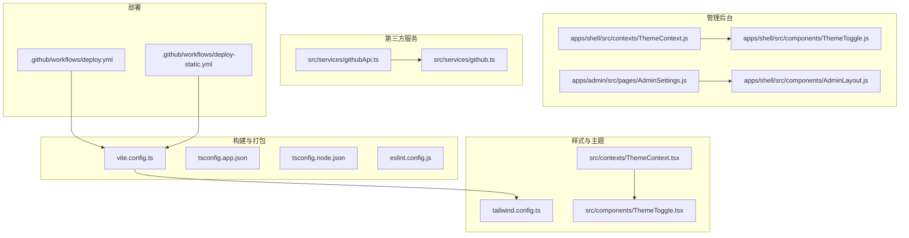
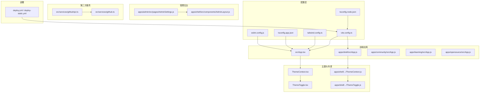
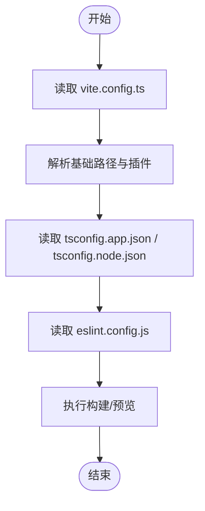
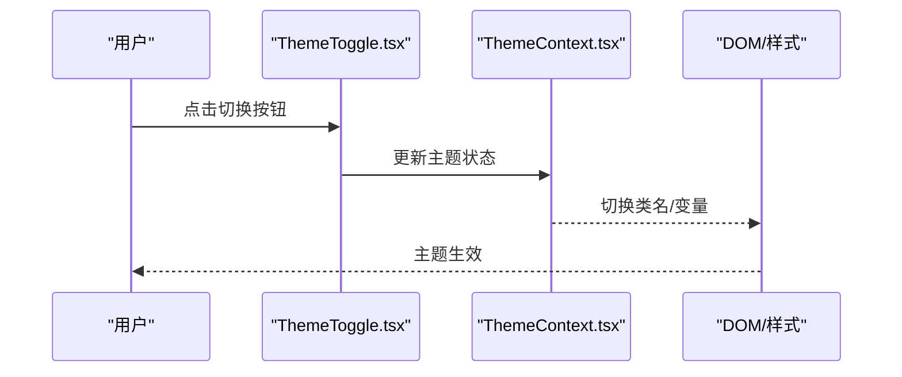
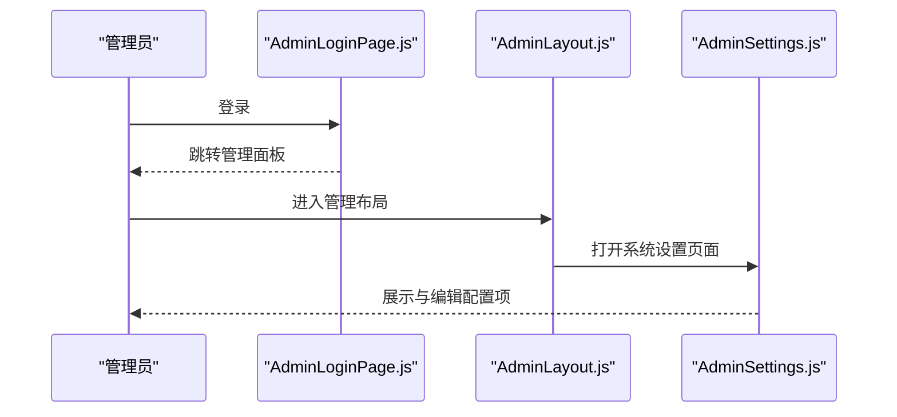
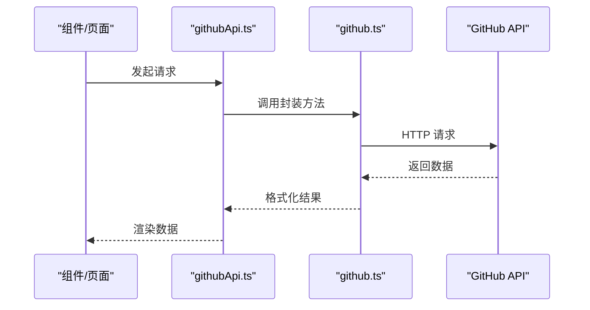
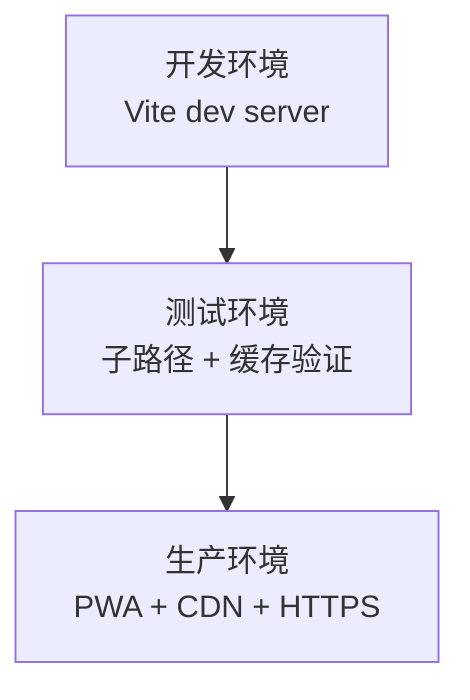
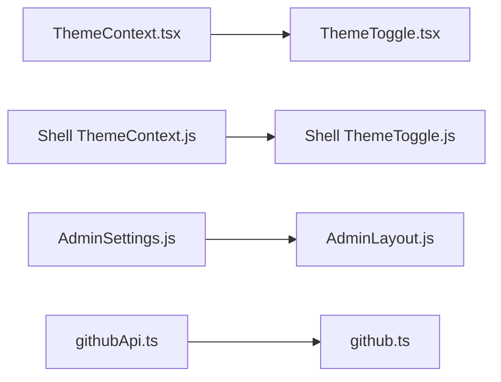
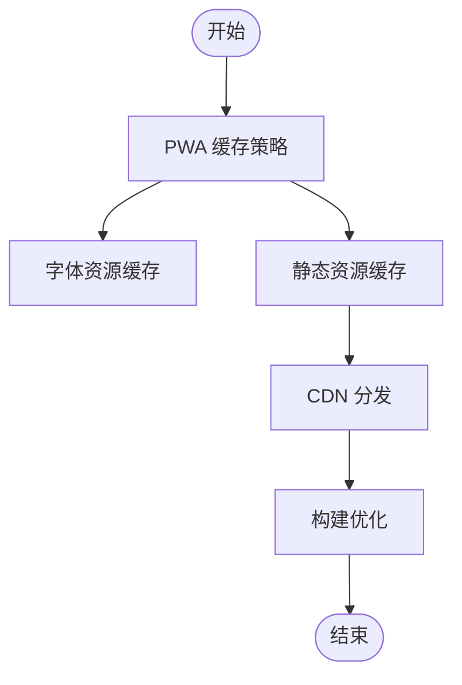

# 系统设置

<cite>
**本文引用的文件**
- [README.md](file://README.md)
- [package.json](file://package.json)
- [vite.config.ts](file://vite.config.ts)
- [tailwind.config.ts](file://tailwind.config.ts)
- [tsconfig.app.json](file://tsconfig.app.json)
- [tsconfig.node.json](file://tsconfig.node.json)
- [eslint.config.js](file://eslint.config.js)
- [src/App.tsx](file://src/App.tsx)
- [src/contexts/ThemeContext.tsx](file://src/contexts/ThemeContext.tsx)
- [src/components/ThemeToggle.tsx](file://src/components/ThemeToggle.tsx)
- [src/pages/AdminSettings.tsx](file://src/pages/AdminSettings.tsx)
- [src/services/github.ts](file://src/services/github.ts)
- [src/services/githubApi.ts](file://src/services/githubApi.ts)
- [apps/shell/src/contexts/ThemeContext.js](file://apps/shell/src/contexts/ThemeContext.js)
- [apps/shell/src/components/ThemeToggle.js](file://apps/shell/src/components/ThemeToggle.js)
- [apps/admin/src/pages/AdminSettings.js](file://apps/admin/src/pages/AdminSettings.js)
- [apps/community/src/hooks/useUserSystem.js](file://apps/community/src/hooks/useUserSystem.js)
- [apps/shell/src/hooks/useAdminAuth.js](file://apps/shell/src/hooks/useAdminAuth.js)
- [apps/shell/src/pages/admin/AdminLoginPage.js](file://apps/shell/src/pages/admin/AdminLoginPage.js)
- [apps/shell/src/components/AdminLayout.js](file://apps/shell/src/components/AdminLayout.js)
- [apps/shell/src/App.js](file://apps/shell/src/App.js)
- [apps/shell/src/main.js](file://apps/shell/src/main.js)
- [apps/community/src/App.js](file://apps/community/src/App.js)
- [apps/community/src/main.js](file://apps/community/src/main.js)
- [apps/learning/src/App.js](file://apps/learning/src/App.js)
- [apps/learning/src/main.js](file://apps/learning/src/main.js)
- [apps/opensource/src/App.js](file://apps/opensource/src/App.js)
- [apps/opensource/src/main.js](file://apps/opensource/src/main.js)
- [.github/workflows/deploy.yml](file://.github/workflows/deploy.yml)
- [.github/workflows/deploy-static.yml](file://.github/workflows/deploy-static.yml)
</cite>

## 目录
1. [引言](#引言)
2. [项目结构](#项目结构)
3. [核心组件](#核心组件)
4. [架构总览](#架构总览)
5. [详细组件分析](#详细组件分析)
6. [依赖分析](#依赖分析)
7. [性能考虑](#性能考虑)
8. [故障排查指南](#故障排查指南)
9. [结论](#结论)
10. [附录](#附录)

## 引言
本文件围绕 YuleTech 社区技术平台的“系统设置”能力进行系统化梳理，覆盖以下方面：
- 系统配置参数管理与维护：网站基本信息、功能开关、外观定制
- 环境变量与部署参数：开发/测试/生产差异
- 缓存策略与性能优化：缓存清理、CDN、静态资源优化
- 用户界面定制：主题切换、布局调整、个性化设置
- 安全配置：访问控制、数据加密、日志记录
- 第三方服务集成：GitHub API、邮件服务、分析工具
- 管理员维护指南与最佳实践
- 配置备份与恢复流程

本文件以仓库现有实现为依据，结合可观察到的配置文件与页面组件，给出可操作的说明与建议。

## 项目结构
项目采用多包/多入口的前端架构，包含多个子应用与共享组件库。系统设置相关的关键位置如下：
- 构建与打包：Vite 配置、TypeScript 配置、ESLint 配置
- 样式与主题：Tailwind 配置、主题上下文与切换组件
- 管理后台：独立的 admin 应用与 shell 应用中的管理布局
- 第三方服务：GitHub API 封装
- 部署工作流：GitHub Actions

**图表来源**
- [vite.config.ts:1-32](file://vite.config.ts#L1-L32)
- [tailwind.config.ts:1-79](file://tailwind.config.ts#L1-L79)
- [src/contexts/ThemeContext.tsx](file://src/contexts/ThemeContext.tsx)
- [src/components/ThemeToggle.tsx](file://src/components/ThemeToggle.tsx)
- [apps/admin/src/pages/AdminSettings.js](file://apps/admin/src/pages/AdminSettings.js)
- [apps/shell/src/components/AdminLayout.js](file://apps/shell/src/components/AdminLayout.js)
- [apps/shell/src/contexts/ThemeContext.js](file://apps/shell/src/contexts/ThemeContext.js)
- [apps/shell/src/components/ThemeToggle.js](file://apps/shell/src/components/ThemeToggle.js)
- [src/services/githubApi.ts](file://src/services/githubApi.ts)
- [src/services/github.ts](file://src/services/github.ts)
- [.github/workflows/deploy.yml](file://.github/workflows/deploy.yml)
- [.github/workflows/deploy-static.yml](file://.github/workflows/deploy-static.yml)

**章节来源**
- [README.md:20-46](file://README.md#L20-L46)
- [package.json:1-46](file://package.json#L1-L46)
- [vite.config.ts:1-32](file://vite.config.ts#L1-L32)
- [tailwind.config.ts:1-79](file://tailwind.config.ts#L1-L79)
- [tsconfig.app.json:1-35](file://tsconfig.app.json#L1-L35)
- [tsconfig.node.json:1-25](file://tsconfig.node.json#L1-L25)
- [eslint.config.js:1-24](file://eslint.config.js#L1-L24)

## 核心组件
- 构建与打包配置
  - Vite 配置：基础路径、PWA 插件、别名、缓存策略
  - TypeScript 配置：应用与 Node 工具链编译目标、路径映射
  - ESLint 配置：推荐规则、React Hooks、React Refresh
- 样式与主题
  - Tailwind 配置：内容扫描、暗色模式、动画插件
  - 主题上下文与切换组件：提供主题状态与切换逻辑
- 管理后台
  - 独立的 AdminSettings 页面与 Shell 管理布局
- 第三方服务
  - GitHub API 封装：提供仓库信息等接口能力
- 部署
  - GitHub Actions 工作流：自动化部署

**章节来源**
- [vite.config.ts:6-31](file://vite.config.ts#L6-L31)
- [tsconfig.app.json:26-30](file://tsconfig.app.json#L26-L30)
- [tsconfig.node.json:10-23](file://tsconfig.node.json#L10-L23)
- [eslint.config.js:8-23](file://eslint.config.js#L8-L23)
- [tailwind.config.ts:3-76](file://tailwind.config.ts#L3-L76)
- [src/contexts/ThemeContext.tsx](file://src/contexts/ThemeContext.tsx)
- [src/components/ThemeToggle.tsx](file://src/components/ThemeToggle.tsx)
- [apps/admin/src/pages/AdminSettings.js](file://apps/admin/src/pages/AdminSettings.js)
- [apps/shell/src/components/AdminLayout.js](file://apps/shell/src/components/AdminLayout.js)
- [src/services/githubApi.ts](file://src/services/githubApi.ts)
- [src/services/github.ts](file://src/services/github.ts)
- [.github/workflows/deploy.yml](file://.github/workflows/deploy.yml)
- [.github/workflows/deploy-static.yml](file://.github/workflows/deploy-static.yml)

## 架构总览
系统设置涉及的配置与运行时交互如下：

**图表来源**
- [src/App.tsx](file://src/App.tsx)
- [apps/shell/src/App.js](file://apps/shell/src/App.js)
- [apps/community/src/App.js](file://apps/community/src/App.js)
- [apps/learning/src/App.js](file://apps/learning/src/App.js)
- [apps/opensource/src/App.js](file://apps/opensource/src/App.js)
- [vite.config.ts:1-32](file://vite.config.ts#L1-L32)
- [tailwind.config.ts:1-79](file://tailwind.config.ts#L1-L79)
- [tsconfig.app.json:1-35](file://tsconfig.app.json#L1-L35)
- [tsconfig.node.json:1-25](file://tsconfig.node.json#L1-L25)
- [eslint.config.js:1-24](file://eslint.config.js#L1-L24)
- [src/contexts/ThemeContext.tsx](file://src/contexts/ThemeContext.tsx)
- [src/components/ThemeToggle.tsx](file://src/components/ThemeToggle.tsx)
- [apps/shell/src/contexts/ThemeContext.js](file://apps/shell/src/contexts/ThemeContext.js)
- [apps/shell/src/components/ThemeToggle.js](file://apps/shell/src/components/ThemeToggle.js)
- [apps/admin/src/pages/AdminSettings.js](file://apps/admin/src/pages/AdminSettings.js)
- [apps/shell/src/components/AdminLayout.js](file://apps/shell/src/components/AdminLayout.js)
- [src/services/githubApi.ts](file://src/services/githubApi.ts)
- [src/services/github.ts](file://src/services/github.ts)
- [.github/workflows/deploy.yml](file://.github/workflows/deploy.yml)
- [.github/workflows/deploy-static.yml](file://.github/workflows/deploy-static.yml)

## 详细组件分析

### 构建与打包配置
- Vite 配置要点
  - 基础路径：用于子路径部署场景
  - PWA 插件：自动更新、缓存模式、字体缓存命名
  - 别名：@ 指向 src，便于统一导入
- TypeScript 配置要点
  - 应用侧：ES2023 目标、React JSX、路径映射
  - Node 侧：ES2023 目标、仅工具链使用
- ESLint 配置要点
  - 推荐规则集、React Hooks、React Refresh

**图表来源**
- [vite.config.ts:6-31](file://vite.config.ts#L6-L31)
- [tsconfig.app.json:26-30](file://tsconfig.app.json#L26-L30)
- [tsconfig.node.json:10-23](file://tsconfig.node.json#L10-L23)
- [eslint.config.js:8-23](file://eslint.config.js#L8-L23)

**章节来源**
- [vite.config.ts:6-31](file://vite.config.ts#L6-L31)
- [tsconfig.app.json:26-30](file://tsconfig.app.json#L26-L30)
- [tsconfig.node.json:10-23](file://tsconfig.node.json#L10-L23)
- [eslint.config.js:8-23](file://eslint.config.js#L8-L23)

### 样式与主题系统
- Tailwind 配置
  - 内容扫描范围、暗色模式类名、动画插件
- 主题上下文与切换组件
  - 提供主题状态与切换逻辑，支持明/暗主题
  - Shell 应用存在对应的上下文与切换组件

**图表来源**
- [src/contexts/ThemeContext.tsx](file://src/contexts/ThemeContext.tsx)
- [src/components/ThemeToggle.tsx](file://src/components/ThemeToggle.tsx)
- [apps/shell/src/contexts/ThemeContext.js](file://apps/shell/src/contexts/ThemeContext.js)
- [apps/shell/src/components/ThemeToggle.js](file://apps/shell/src/components/ThemeToggle.js)

**章节来源**
- [tailwind.config.ts:3-76](file://tailwind.config.ts#L3-L76)
- [src/contexts/ThemeContext.tsx](file://src/contexts/ThemeContext.tsx)
- [src/components/ThemeToggle.tsx](file://src/components/ThemeToggle.tsx)
- [apps/shell/src/contexts/ThemeContext.js](file://apps/shell/src/contexts/ThemeContext.js)
- [apps/shell/src/components/ThemeToggle.js](file://apps/shell/src/components/ThemeToggle.js)

### 管理后台与系统设置页面
- 独立的 AdminSettings 页面位于 admin 应用
- Shell 应用提供管理布局与登录页面
- 管理员认证与本地存储钩子存在于社区应用中

**图表来源**
- [apps/admin/src/pages/AdminSettings.js](file://apps/admin/src/pages/AdminSettings.js)
- [apps/shell/src/pages/admin/AdminLoginPage.js](file://apps/shell/src/pages/admin/AdminLoginPage.js)
- [apps/shell/src/components/AdminLayout.js](file://apps/shell/src/components/AdminLayout.js)
- [apps/community/src/hooks/useUserSystem.js](file://apps/community/src/hooks/useUserSystem.js)
- [apps/shell/src/hooks/useAdminAuth.js](file://apps/shell/src/hooks/useAdminAuth.js)

**章节来源**
- [apps/admin/src/pages/AdminSettings.js](file://apps/admin/src/pages/AdminSettings.js)
- [apps/shell/src/pages/admin/AdminLoginPage.js](file://apps/shell/src/pages/admin/AdminLoginPage.js)
- [apps/shell/src/components/AdminLayout.js](file://apps/shell/src/components/AdminLayout.js)
- [apps/community/src/hooks/useUserSystem.js](file://apps/community/src/hooks/useUserSystem.js)
- [apps/shell/src/hooks/useAdminAuth.js](file://apps/shell/src/hooks/useAdminAuth.js)

### 第三方服务集成（GitHub）
- GitHub API 封装
  - 提供对 GitHub 仓库信息等的调用能力
- 使用场景
  - 可用于社区动态、开源项目展示、数据统计等

**图表来源**
- [src/services/githubApi.ts](file://src/services/githubApi.ts)
- [src/services/github.ts](file://src/services/github.ts)

**章节来源**
- [src/services/githubApi.ts](file://src/services/githubApi.ts)
- [src/services/github.ts](file://src/services/github.ts)

### 部署与环境差异
- GitHub Actions 工作流
  - 自动化部署与静态资源发布
- 环境差异建议
  - 开发：本地 Vite 服务、调试端口、热更新
  - 测试：子路径基础路径、缓存策略验证
  - 生产：PWA 缓存、CDN 静态资源、HTTPS

**图表来源**
- [.github/workflows/deploy.yml](file://.github/workflows/deploy.yml)
- [.github/workflows/deploy-static.yml](file://.github/workflows/deploy-static.yml)
- [vite.config.ts:7](file://vite.config.ts#L7)

**章节来源**
- [.github/workflows/deploy.yml](file://.github/workflows/deploy.yml)
- [.github/workflows/deploy-static.yml](file://.github/workflows/deploy-static.yml)
- [vite.config.ts:7](file://vite.config.ts#L7)

## 依赖分析
- 组件耦合与内聚
  - 主题系统通过上下文与切换组件解耦，便于在不同应用复用
  - 管理后台与 Shell 应用通过布局组件耦合，形成一致的管理体验
- 外部依赖
  - Vite、React、Tailwind、ESLint、PWA 插件
- 潜在循环依赖
  - 当前结构未见明显循环依赖迹象

**图表来源**
- [src/contexts/ThemeContext.tsx](file://src/contexts/ThemeContext.tsx)
- [src/components/ThemeToggle.tsx](file://src/components/ThemeToggle.tsx)
- [apps/shell/src/contexts/ThemeContext.js](file://apps/shell/src/contexts/ThemeContext.js)
- [apps/shell/src/components/ThemeToggle.js](file://apps/shell/src/components/ThemeToggle.js)
- [apps/admin/src/pages/AdminSettings.js](file://apps/admin/src/pages/AdminSettings.js)
- [apps/shell/src/components/AdminLayout.js](file://apps/shell/src/components/AdminLayout.js)
- [src/services/githubApi.ts](file://src/services/githubApi.ts)
- [src/services/github.ts](file://src/services/github.ts)

**章节来源**
- [src/contexts/ThemeContext.tsx](file://src/contexts/ThemeContext.tsx)
- [src/components/ThemeToggle.tsx](file://src/components/ThemeToggle.tsx)
- [apps/shell/src/contexts/ThemeContext.js](file://apps/shell/src/contexts/ThemeContext.js)
- [apps/shell/src/components/ThemeToggle.js](file://apps/shell/src/components/ThemeToggle.js)
- [apps/admin/src/pages/AdminSettings.js](file://apps/admin/src/pages/AdminSettings.js)
- [apps/shell/src/components/AdminLayout.js](file://apps/shell/src/components/AdminLayout.js)
- [src/services/githubApi.ts](file://src/services/githubApi.ts)
- [src/services/github.ts](file://src/services/github.ts)

## 性能考虑
- 缓存策略
  - PWA 运行时缓存：字体资源优先级缓存、最大文件尺寸限制
  - 清理策略：通过 Workbox 配置与版本化资源实现
- CDN 与静态资源
  - 基础路径与静态资源分发，结合 CDN 提升加载速度
- 构建优化
  - TypeScript 编译目标与模块解析策略
  - ESLint 规则减少潜在性能问题

**图表来源**
- [vite.config.ts:10-24](file://vite.config.ts#L10-L24)

**章节来源**
- [vite.config.ts:10-24](file://vite.config.ts#L10-L24)

## 故障排查指南
- 构建与打包
  - 检查基础路径与别名配置是否匹配
  - 确认 TypeScript 路径映射与实际目录一致
- 主题与外观
  - 检查主题上下文是否正确初始化
  - 确认暗色模式类名与 Tailwind 配置一致
- 管理后台
  - 确认登录页面与管理布局的路由连通性
  - 检查管理员认证钩子状态
- 第三方服务
  - 校验 GitHub API 封装的请求参数与返回格式
- 部署
  - 查看 GitHub Actions 工作流日志，确认构建与发布步骤

**章节来源**
- [vite.config.ts:6-31](file://vite.config.ts#L6-L31)
- [tsconfig.app.json:26-30](file://tsconfig.app.json#L26-L30)
- [tailwind.config.ts:3-76](file://tailwind.config.ts#L3-L76)
- [apps/shell/src/pages/admin/AdminLoginPage.js](file://apps/shell/src/pages/admin/AdminLoginPage.js)
- [apps/shell/src/components/AdminLayout.js](file://apps/shell/src/components/AdminLayout.js)
- [apps/shell/src/hooks/useAdminAuth.js](file://apps/shell/src/hooks/useAdminAuth.js)
- [src/services/githubApi.ts](file://src/services/githubApi.ts)
- [.github/workflows/deploy.yml](file://.github/workflows/deploy.yml)

## 结论
本文件基于仓库现有实现，系统梳理了系统设置相关的配置与组件，明确了主题、构建、第三方服务与部署等方面的现状与建议。后续可在 AdminSettings 页面中补充具体的配置项与持久化机制，并完善备份与恢复流程。

## 附录
- 管理员维护与最佳实践
  - 在 AdminSettings 中增加配置项的增删改查与校验
  - 对敏感配置项进行加密存储或环境变量注入
  - 建立配置变更审批与回滚机制
- 配置备份与恢复
  - 备份：导出当前配置到 JSON 文件，保存至安全位置
  - 恢复：从备份文件导入配置，确保与当前版本兼容