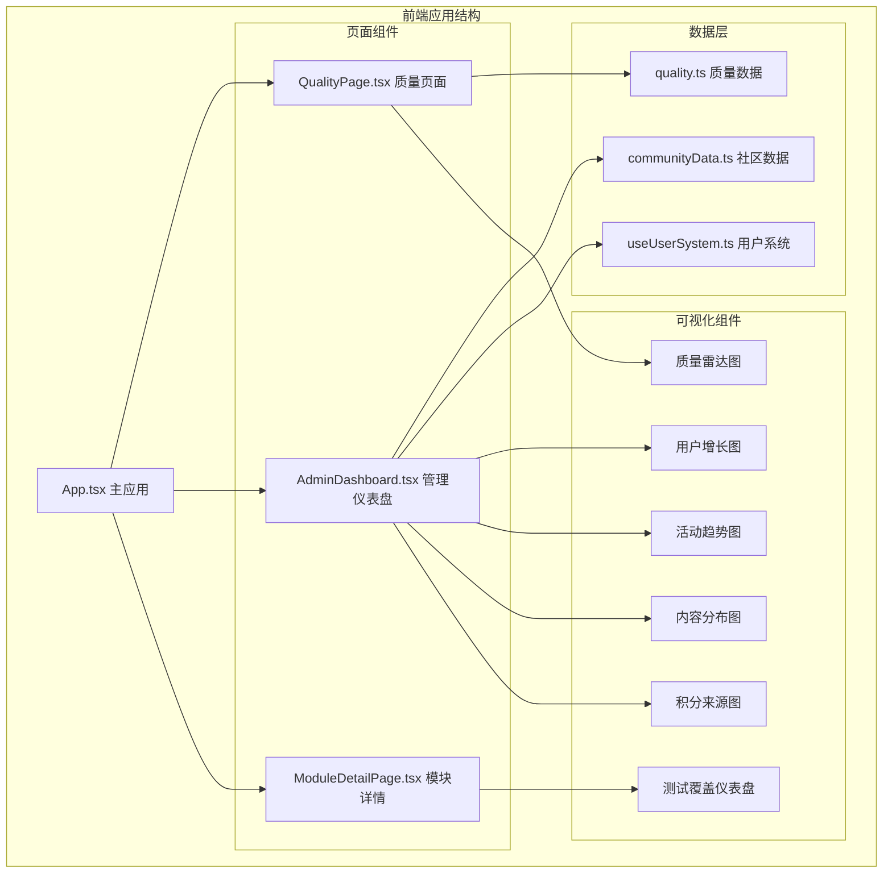
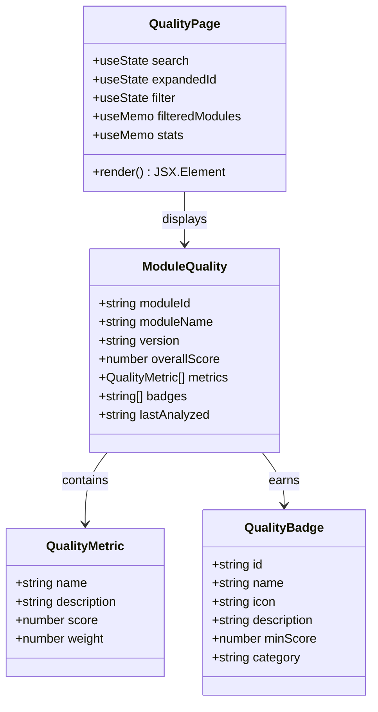
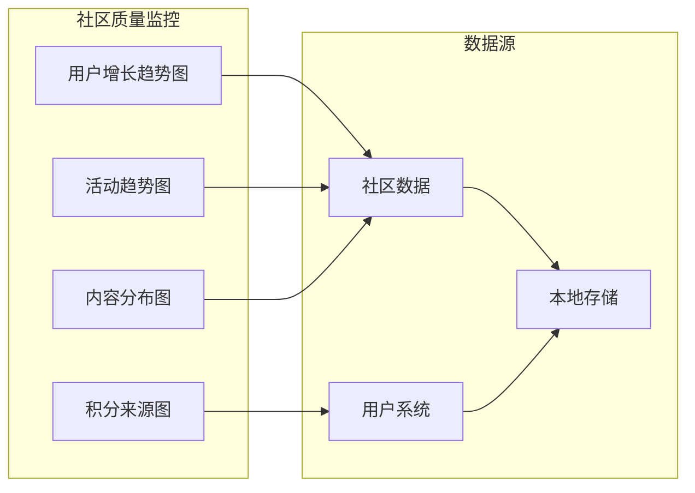
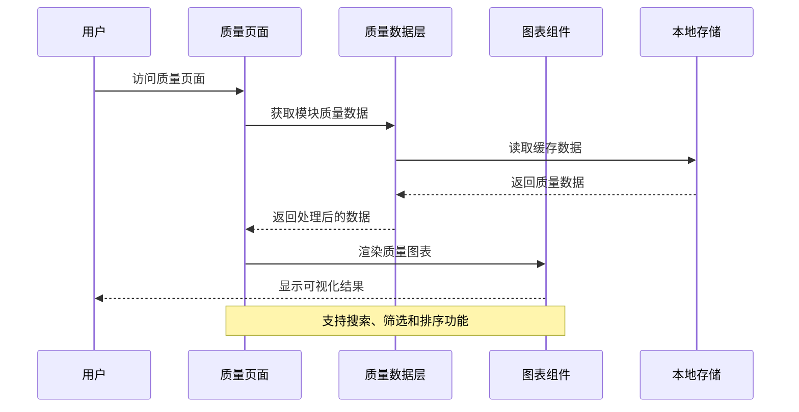
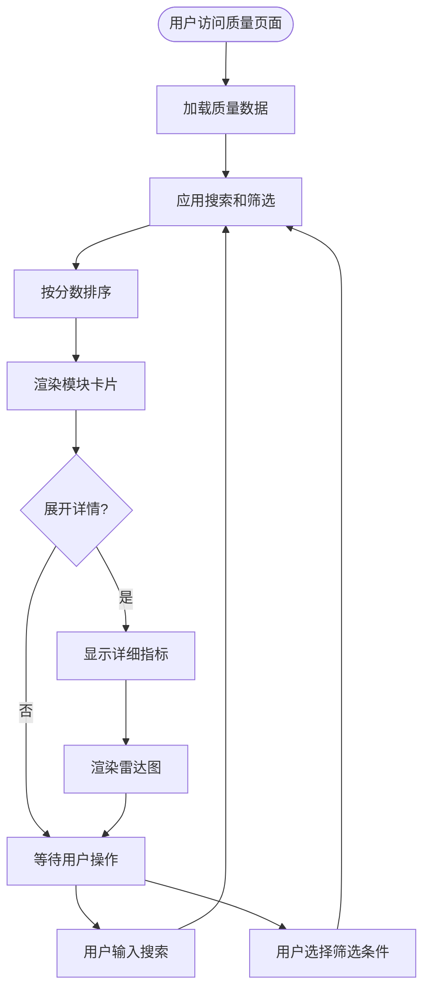
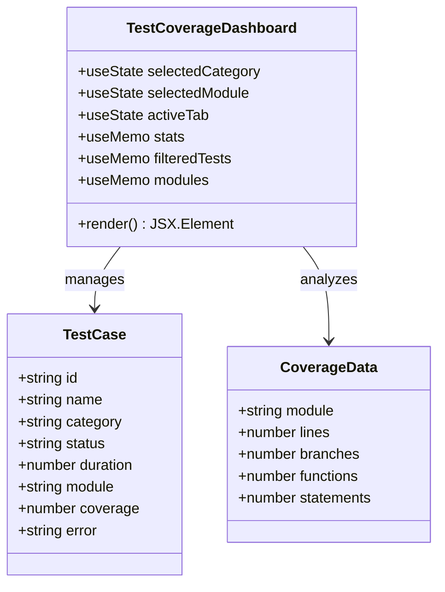
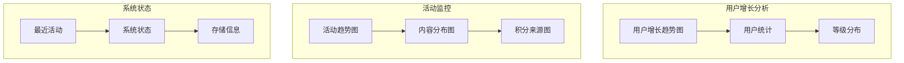
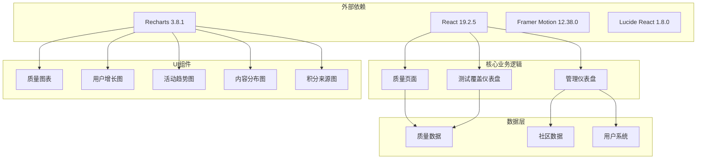

# 质量保证系统

<cite>
**本文档引用的文件**
- [QualityPage.tsx](file://src/pages/QualityPage.tsx)
- [quality.ts](file://src/data/quality.ts)
- [AdminDashboard.tsx](file://src/pages/AdminDashboard.tsx)
- [UserSystem.ts](file://src/hooks/useUserSystem.ts)
- [communityData.ts](file://src/data/communityData.ts)
- [UserGrowthChart.tsx](file://src/components/admin/UserGrowthChart.tsx)
- [ActivityTrendChart.tsx](file://src/components/admin/ActivityTrendChart.tsx)
- [ContentDistributionChart.tsx](file://src/components/admin/ContentDistributionChart.tsx)
- [PointsSourceChart.tsx](file://src/components/admin/PointsSourceChart.tsx)
- [App.tsx](file://src/App.tsx)
- [TestCoverageDashboard.tsx](file://src/components/TestCoverageDashboard.tsx)
- [ModuleDetailPage.tsx](file://src/pages/ModuleDetailPage.tsx)
- [ModuleCompareBar.tsx](file://src/components/ModuleCompareBar.tsx)
- [package.json](file://package.json)
</cite>

## 目录
1. [简介](#简介)
2. [项目结构](#项目结构)
3. [核心组件](#核心组件)
4. [架构概览](#架构概览)
5. [详细组件分析](#详细组件分析)
6. [依赖关系分析](#依赖关系分析)
7. [性能考虑](#性能考虑)
8. [故障排除指南](#故障排除指南)
9. [结论](#结论)

## 简介

质量保证系统是 YuleTech 社区平台的核心组成部分，专注于提供全面的代码质量评估、测试覆盖监控和社区质量指标分析。该系统通过多维度的质量评分体系、可视化图表展示和实时数据监控，帮助开发者和社区成员了解项目的质量状况。

系统主要包含三个核心功能模块：
- **代码质量评分系统**：基于多维度指标自动评估代码质量
- **测试覆盖监控**：跟踪和分析测试用例执行情况
- **社区质量分析**：监控社区活动和用户参与度指标

## 项目结构

**图表来源**
- [App.tsx:40-139](file://src/App.tsx#L40-L139)
- [QualityPage.tsx:152-343](file://src/pages/QualityPage.tsx#L152-L343)
- [AdminDashboard.tsx:67-321](file://src/pages/AdminDashboard.tsx#L67-L321)

**章节来源**
- [App.tsx:1-139](file://src/App.tsx#L1-L139)
- [package.json:1-49](file://package.json#L1-L49)

## 核心组件

### 质量评分系统

质量评分系统是整个质量保证系统的核心，负责对各个模块进行全面的质量评估。系统采用加权评分模型，综合考虑代码规范、可测试性、安全性、性能和文档完整性等多个维度。

**图表来源**
- [quality.ts:1-158](file://src/data/quality.ts#L1-L158)
- [QualityPage.tsx:152-343](file://src/pages/QualityPage.tsx#L152-L343)

### 社区质量监控

社区质量监控系统通过多种图表和指标来跟踪社区的健康状况和用户参与度。系统集成了用户增长趋势、活动趋势、内容分布和积分来源等关键指标。

**图表来源**
- [AdminDashboard.tsx:26-29](file://src/pages/AdminDashboard.tsx#L26-L29)
- [UserGrowthChart.tsx:23-119](file://src/components/admin/UserGrowthChart.tsx#L23-L119)
- [ActivityTrendChart.tsx:29-129](file://src/components/admin/ActivityTrendChart.tsx#L29-L129)
- [ContentDistributionChart.tsx:23-72](file://src/components/admin/ContentDistributionChart.tsx#L23-L72)
- [PointsSourceChart.tsx:22-92](file://src/components/admin/PointsSourceChart.tsx#L22-L92)

**章节来源**
- [quality.ts:48-158](file://src/data/quality.ts#L48-L158)
- [AdminDashboard.tsx:67-321](file://src/pages/AdminDashboard.tsx#L67-L321)

## 架构概览

质量保证系统采用模块化架构设计，通过清晰的组件分离和数据流管理，实现了高效的质量监控和分析功能。

**图表来源**
- [QualityPage.tsx:152-343](file://src/pages/QualityPage.tsx#L152-L343)
- [quality.ts:111-158](file://src/data/quality.ts#L111-L158)

系统架构特点：

1. **响应式设计**：所有图表组件都支持响应式布局，适配不同屏幕尺寸
2. **数据缓存**：利用浏览器本地存储优化数据加载性能
3. **实时更新**：通过 React Hooks 实现数据的实时更新和状态管理
4. **可扩展性**：模块化的组件设计便于功能扩展和维护

## 详细组件分析

### 质量评分页面

质量评分页面是用户交互的核心界面，提供了完整的模块质量信息展示和分析功能。

**图表来源**
- [QualityPage.tsx:157-175](file://src/pages/QualityPage.tsx#L157-L175)
- [QualityPage.tsx:320-329](file://src/pages/QualityPage.tsx#L320-L329)

页面功能特性：

1. **多维搜索**：支持按模块名称进行精确搜索
2. **智能筛选**：按质量等级自动筛选（优秀、良好、待改进）
3. **动态排序**：按综合分数降序排列
4. **展开详情**：点击模块卡片展开详细指标和雷达图
5. **徽章展示**：直观展示获得的质量徽章

**章节来源**
- [QualityPage.tsx:152-343](file://src/pages/QualityPage.tsx#L152-L343)

### 测试覆盖仪表盘

测试覆盖仪表盘提供了全面的测试执行状态监控和覆盖率分析功能。

**图表来源**
- [TestCoverageDashboard.tsx:23-465](file://src/components/TestCoverageDashboard.tsx#L23-L465)

仪表盘核心功能：

1. **多标签页设计**：概览、测试用例、覆盖率三个主要视图
2. **实时状态监控**：跟踪测试用例的执行状态（通过、失败、运行中等）
3. **覆盖率分析**：提供行、分支、函数、语句四个维度的覆盖率统计
4. **智能筛选**：支持按测试类别和模块进行筛选
5. **趋势分析**：展示测试执行的历史趋势

**章节来源**
- [TestCoverageDashboard.tsx:96-465](file://src/components/TestCoverageDashboard.tsx#L96-L465)

### 社区质量图表

社区质量图表系统通过多种可视化方式展示社区的健康状况和发展趋势。

**图表来源**
- [AdminDashboard.tsx:182-318](file://src/pages/AdminDashboard.tsx#L182-L318)
- [UserGrowthChart.tsx:23-119](file://src/components/admin/UserGrowthChart.tsx#L23-L119)
- [ActivityTrendChart.tsx:29-129](file://src/components/admin/ActivityTrendChart.tsx#L29-L129)
- [ContentDistributionChart.tsx:23-72](file://src/components/admin/ContentDistributionChart.tsx#L23-L72)
- [PointsSourceChart.tsx:22-92](file://src/components/admin/PointsSourceChart.tsx#L22-L92)

**章节来源**
- [AdminDashboard.tsx:67-321](file://src/pages/AdminDashboard.tsx#L67-L321)

## 依赖关系分析

质量保证系统的依赖关系体现了清晰的分层架构和模块化设计。

**图表来源**
- [package.json:12-27](file://package.json#L12-L27)
- [App.tsx:1-10](file://src/App.tsx#L1-L10)

**章节来源**
- [package.json:1-49](file://package.json#L1-L49)

## 性能考虑

质量保证系统在设计时充分考虑了性能优化，采用了多种策略来确保良好的用户体验：

### 数据优化策略

1. **懒加载机制**：所有页面组件都采用 React.lazy 实现按需加载
2. **本地缓存**：利用 localStorage 存储用户偏好和统计数据
3. **计算优化**：使用 useMemo 避免不必要的重新计算
4. **虚拟滚动**：对于大量数据的列表采用虚拟滚动技术

### 图表性能优化

1. **响应式容器**：所有图表使用 ResponsiveContainer 自适应调整大小
2. **增量渲染**：图表组件只在数据变化时重新渲染
3. **内存管理**：及时清理图表实例和事件监听器

### 网络优化

1. **CDN 加速**：静态资源通过 CDN 提供服务
2. **压缩传输**：启用 Gzip 压缩减少传输体积
3. **缓存策略**：合理设置 HTTP 缓存头

## 故障排除指南

### 常见问题及解决方案

#### 质量数据加载失败

**问题描述**：质量页面无法加载模块数据

**可能原因**：
1. 本地存储损坏或容量不足
2. 网络连接异常
3. 数据格式不匹配

**解决步骤**：
1. 清除浏览器缓存和本地存储
2. 检查网络连接状态
3. 验证数据格式的正确性

#### 图表渲染异常

**问题描述**：图表组件显示空白或渲染错误

**可能原因**：
1. Recharts 库版本不兼容
2. 数据格式不符合图表要求
3. 容器尺寸计算错误

**解决步骤**：
1. 更新 Recharts 到最新版本
2. 验证数据结构的完整性
3. 检查容器的 CSS 样式设置

#### 性能问题

**问题描述**：页面加载缓慢或响应迟钝

**可能原因**：
1. 组件渲染过于频繁
2. 数据量过大
3. 未使用的依赖项

**解决步骤**：
1. 使用 React DevTools 分析组件性能
2. 实施数据分页和懒加载
3. 移除不必要的依赖项

**章节来源**
- [QualityPage.tsx:332-337](file://src/pages/QualityPage.tsx#L332-L337)
- [AdminDashboard.tsx:318-321](file://src/pages/AdminDashboard.tsx#L318-L321)

## 结论

质量保证系统通过其精心设计的架构和丰富的功能特性，为 YuleTech 社区提供了全面的质量监控和分析能力。系统不仅能够有效评估代码质量，还能深入分析社区活动和用户行为，为项目的持续改进提供了有力支撑。

### 系统优势

1. **全面性**：涵盖了代码质量、测试覆盖、社区分析等多个维度
2. **可视化**：通过丰富的图表和仪表盘提供直观的数据展示
3. **实时性**：支持实时数据更新和动态状态监控
4. **可扩展性**：模块化设计便于功能扩展和维护升级

### 技术亮点

1. **响应式设计**：适配各种设备和屏幕尺寸
2. **性能优化**：采用多种策略确保良好的用户体验
3. **数据安全**：合理的数据存储和隐私保护机制
4. **用户体验**：直观的操作界面和流畅的交互体验

质量保证系统作为 YuleTech 生态系统的重要组成部分，将持续为社区成员提供有价值的质量洞察和改进建议，推动整个社区的技术水平提升。