# 页面系统

<cite>
**本文档引用的文件**
- [App.tsx](file://src/App.tsx)
- [HomePage.tsx](file://src/pages/HomePage.tsx)
- [CommunityPage.tsx](file://src/pages/CommunityPage.tsx)
- [ForumPage.tsx](file://src/pages/ForumPage.tsx)
- [QAPage.tsx](file://src/pages/QAPage.tsx)
- [EventsPage.tsx](file://src/pages/EventsPage.tsx)
- [LearningPage.tsx](file://src/pages/LearningPage.tsx)
- [BlogPage.tsx](file://src/pages/BlogPage.tsx)
- [DocsPage.tsx](file://src/pages/DocsPage.tsx)
- [OpenSourcePage.tsx](file://src/pages/OpenSourcePage.tsx)
- [ToolchainPage.tsx](file://src/pages/ToolchainPage.tsx)
- [AdminDashboard.tsx](file://src/pages/AdminDashboard.tsx)
- [AdminLoginPage.tsx](file://src/pages/AdminLoginPage.tsx)
- [AdminUsers.tsx](file://src/pages/AdminUsers.tsx)
- [AdminContent.tsx](file://src/pages/AdminContent.tsx)
- [AdminSettings.tsx](file://src/pages/AdminSettings.tsx)
- [Hero.tsx](file://src/components/Hero.tsx)
- [Features.tsx](file://src/components/Features.tsx)
- [ImageMarquee.tsx](file://src/components/ImageMarquee.tsx)
- [AnimatedPage.tsx](file://src/components/AnimatedPage.tsx)
</cite>

## 目录
1. [简介](#简介)
2. [项目结构](#项目结构)
3. [核心组件](#核心组件)
4. [架构总览](#架构总览)
5. [详细组件分析](#详细组件分析)
6. [动画系统](#动画系统)
7. [依赖分析](#依赖分析)
8. [性能考虑](#性能考虑)
9. [故障排查指南](#故障排查指南)
10. [结论](#结论)
11. [附录](#附录)

## 简介
本文件系统化梳理 YuleTech 社区技术平台的页面系统，覆盖页面功能定位、用户场景、交互流程、数据获取与状态管理、渲染逻辑、页面导航与路由配置、SEO 优化策略、性能优化措施、定制与扩展指导、不同用户角色的差异化呈现、响应式设计与移动端适配，以及开发者最佳实践与常见问题解决方案。

## 项目结构
平台采用单页应用（SPA）架构，基于 React + React Router v6，页面按功能域拆分至独立文件，公共布局与导航组件集中管理，管理员后台独立路由体系，页面均使用懒加载与骨架屏提升首屏体验。

```mermaid
graph TB
subgraph "应用根组件"
APP["App.tsx<br/>路由与布局"]
end
subgraph "公共布局"
NAV["Navbar<br/>顶部导航"]
FOOTER["Footer<br/>底部信息"]
LOADER["PageLoader<br/>页面加载指示"]
OFFLINE["OfflineIndicator<br/>离线提示"]
end
subgraph "前台页面"
HOME["HomePage"]
COMM["CommunityPage"]
FORUM["ForumPage"]
QA["QAPage"]
EVENTS["EventsPage"]
LEARN["LearningPage"]
BLOG["BlogPage"]
DOCS["DocsPage"]
OPENSRC["OpenSourcePage"]
TOOL["ToolchainPage"]
end
subgraph "管理员后台"
ADM_LOGIN["AdminLoginPage"]
ADM_DASH["AdminDashboard"]
ADM_USERS["AdminUsers"]
ADM_CONTENT["AdminContent"]
ADM_SETTINGS["AdminSettings"]
end
APP --> NAV
APP --> FOOTER
APP --> LOADER
APP --> OFFLINE
APP --> HOME
APP --> COMM
APP --> FORUM
APP --> QA
APP --> EVENTS
APP --> LEARN
APP --> BLOG
APP --> DOCS
APP --> OPENSRC
APP --> TOOL
APP --> ADM_LOGIN
APP --> ADM_DASH
APP --> ADM_USERS
APP --> ADM_CONTENT
APP --> ADM_SETTINGS
```

**图表来源**
- [App.tsx:30-115](file://src/App.tsx#L30-L115)

**章节来源**
- [App.tsx:1-123](file://src/App.tsx#L1-L123)

## 核心组件
- 路由与布局
  - App 根组件负责全局路由配置、公共布局注入、管理员后台路由嵌套、页面懒加载与骨架屏包裹。
- 页面组件
  - 前台页面：首页、社区、论坛、问答、活动、学习、博客、文档、开源、工具链。
  - 管理员页面：登录、仪表盘、用户管理、内容管理、系统设置。
- 公共布局与工具
  - Navbar/Footers、PageLoader、OfflineIndicator、主题切换、CLI 等。

**章节来源**
- [App.tsx:30-115](file://src/App.tsx#L30-L115)

## 架构总览
页面系统围绕"前台 + 管理后台"双轨结构组织：
- 前台页面面向访客与注册用户，强调内容消费与参与（发帖、答题、报名、学习）。
- 管理后台面向管理员，提供内容审核、用户治理、系统配置与数据可视化。

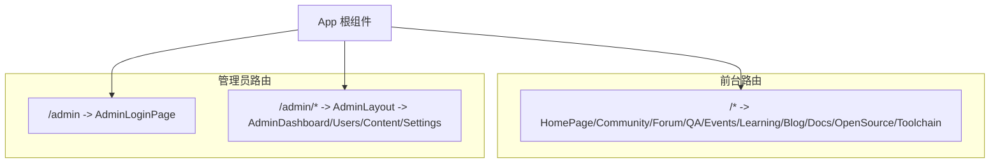

**图表来源**
- [App.tsx:34-111](file://src/App.tsx#L34-L111)

**章节来源**
- [App.tsx:30-115](file://src/App.tsx#L30-L115)

## 详细组件分析

### 首页 HomePage
- 功能定位：平台入口页，聚合社区亮点、GitHub 仓库动态、每日代码、统计数据与开源展示。
- 用户场景：新访客快速了解平台价值；注册用户可切换"极简模式"聚焦核心内容。
- 交互流程：点击"极简模式"按钮切换布局；滚动浏览各模块；点击卡片跳转到对应页面。
- 数据获取与状态管理：本地存储最小模式开关；组件挂载时从 localStorage 初始化；无外部网络请求。
- **动画增强**：页面整体使用淡入过渡（opacity 0→1，duration: 0.5）；极简模式切换按钮使用复杂的入场动画（scale 0→1 + opacity 0→1，delay: 1，duration: 0.3）。
- SEO 优化：使用 react-helmet-async 设置标题与描述。
- 性能优化：页面懒加载；骨架屏包裹；组件内条件渲染减少不必要 DOM。
- 响应式设计：使用 Tailwind 响应式断点，移动端紧凑布局。

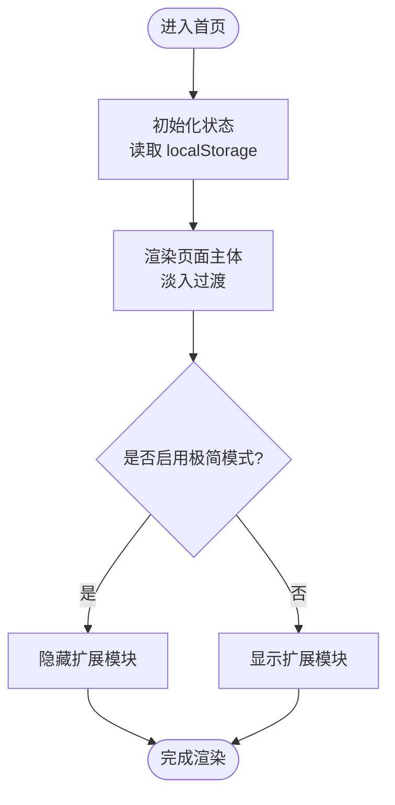

**图表来源**
- [HomePage.tsx:15-87](file://src/pages/HomePage.tsx#L15-L87)

**章节来源**
- [HomePage.tsx:1-102](file://src/pages/HomePage.tsx#L1-L102)

### 社区 CommunityPage
- 功能定位：社区互动中心，包含论坛、活动、工程师圈子、众包任务四大板块。
- 用户场景：注册用户参与讨论、报名活动、加入技术圈子、承接任务。
- 交互流程：顶部标签切换；搜索与筛选；卡片点击查看详情或报名。
- 数据获取与状态管理：本地状态管理各板块数据；使用 useLocalStorage 管理用户偏好。
- SEO 优化：页面标题与描述针对社区场景定制。
- 性能优化：虚拟滚动/列表分页建议（当前为静态数据）；骨架屏与懒加载。
- 响应式设计：网格布局随屏幕缩放；移动端标签横向滚动。

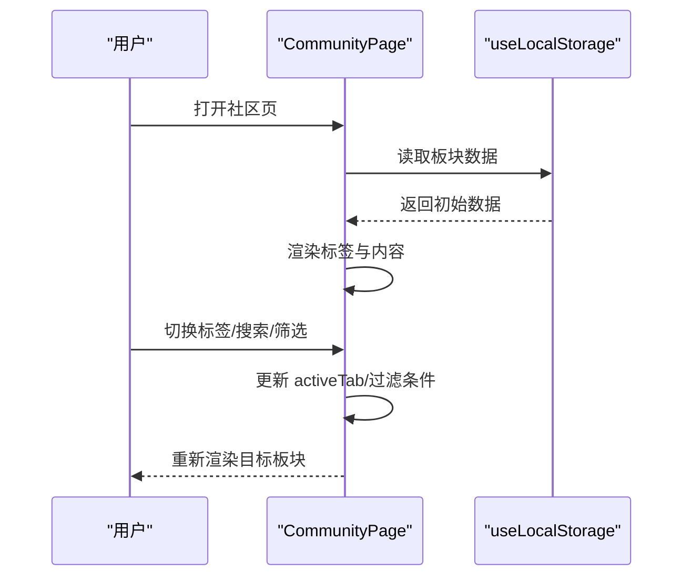

**图表来源**
- [CommunityPage.tsx:245-666](file://src/pages/CommunityPage.tsx#L245-L666)

**章节来源**
- [CommunityPage.tsx:1-667](file://src/pages/CommunityPage.tsx#L1-L667)

### 论坛 ForumPage
- 功能定位：AutoSAR 技术讨论区，支持发帖、回复、点赞、标签筛选、排序。
- 用户场景：工程师发帖求助、分享经验、浏览热门讨论。
- 交互流程：搜索/筛选/排序；点击进入帖子详情；输入回复；点赞。
- 数据获取与状态管理：useLocalStorage 管理帖子、回复、点赞、浏览量；迁移旧数据。
- SEO 优化：页面标题与描述突出论坛价值。
- 性能优化：列表虚拟化（建议）；Modal 内容按需渲染。
- 响应式设计：卡片与列表在小屏可横向滚动。

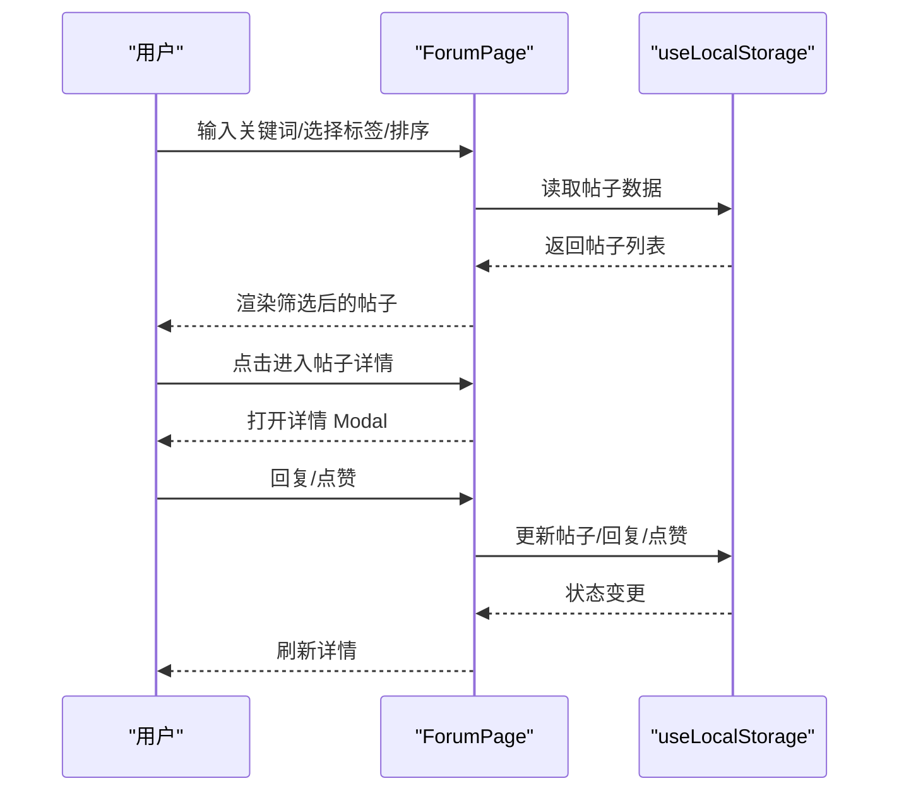

**图表来源**
- [ForumPage.tsx:63-543](file://src/pages/ForumPage.tsx#L63-L543)

**章节来源**
- [ForumPage.tsx:1-544](file://src/pages/ForumPage.tsx#L1-L544)

### 技术问答 QAPage
- 功能定位：悬赏问答，支持提问、回答、采纳、点赞、标签筛选。
- 用户场景：工程师悬赏提问，专家解答，社区激励积分。
- 交互流程：搜索/筛选/排序；展开问题详情；输入回答；采纳回答；点赞。
- 数据获取与状态管理：useLocalStorage 管理问题、答案、悬赏积分。
- SEO 优化：页面标题与描述突出问答与悬赏机制。
- 性能优化：详情展开按需渲染；Modal 内容懒加载。
- 响应式设计：详情卡片与输入框自适应。

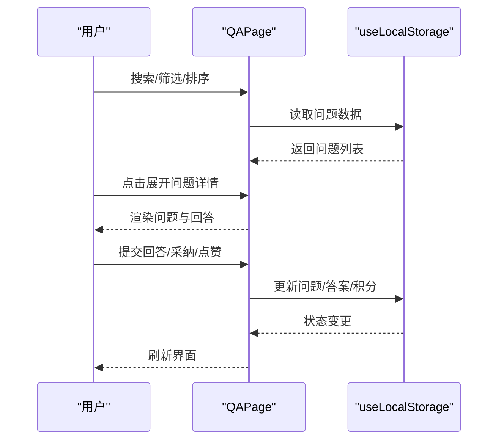

**图表来源**
- [QAPage.tsx:37-503](file://src/pages/QAPage.tsx#L37-L503)

**章节来源**
- [QAPage.tsx:1-504](file://src/pages/QAPage.tsx#L1-L504)

### 社区活动 EventsPage
- 功能定位：活动日历，支持发布活动、报名、状态管理。
- 用户场景：用户浏览活动、报名参加、管理员发布与管理活动。
- 交互流程：搜索/筛选；点击卡片报名；管理员修改状态。
- 数据获取与状态管理：useLocalStorage 管理活动数据；自动通知提醒。
- SEO 优化：页面标题与描述突出活动价值。
- 性能优化：列表分页（建议）；报名状态即时反馈。
- 响应式设计：卡片网格自适应。

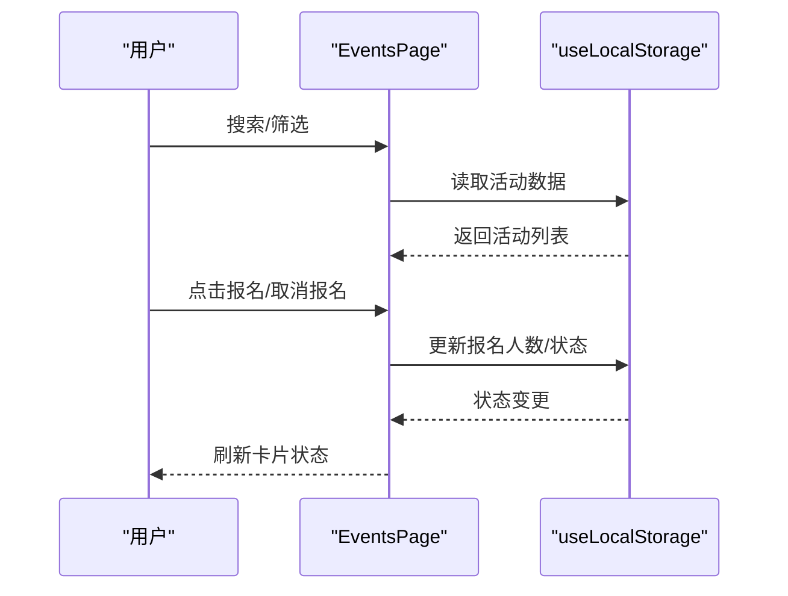

**图表来源**
- [EventsPage.tsx:33-497](file://src/pages/EventsPage.tsx#L33-L497)

**章节来源**
- [EventsPage.tsx:1-498](file://src/pages/EventsPage.tsx#L1-L498)

### 学习成长 LearningPage
- 功能定位：AutoSAR 学习路径与课程资源，支持分类筛选。
- 用户场景：新手入门、进阶提升、专家深造。
- 交互流程：分类筛选；点击卡片查看详情或学习。
- 数据获取与状态管理：静态数据；本地状态管理选中分类。
- SEO 优化：页面标题与描述突出学习价值。
- 性能优化：静态数据直接渲染；建议懒加载封面图。
- 响应式设计：网格布局与标签横向滚动。

**章节来源**
- [LearningPage.tsx:1-404](file://src/pages/LearningPage.tsx#L1-L404)

### 技术博客 BlogPage
- 功能定位：技术文章聚合，支持分类、标签、搜索、点赞、评论。
- 用户场景：阅读技术文章、参与讨论、成为作者。
- 交互流程：分类筛选/搜索；点击文章弹窗详情；输入评论；点赞。
- 数据获取与状态管理：静态文章数据；useLocalStorage 管理点赞与评论。
- SEO 优化：页面标题与描述突出文章价值。
- 性能优化：详情 Modal 按需渲染；代码块按需加载。
- 响应式设计：侧栏与主内容自适应。

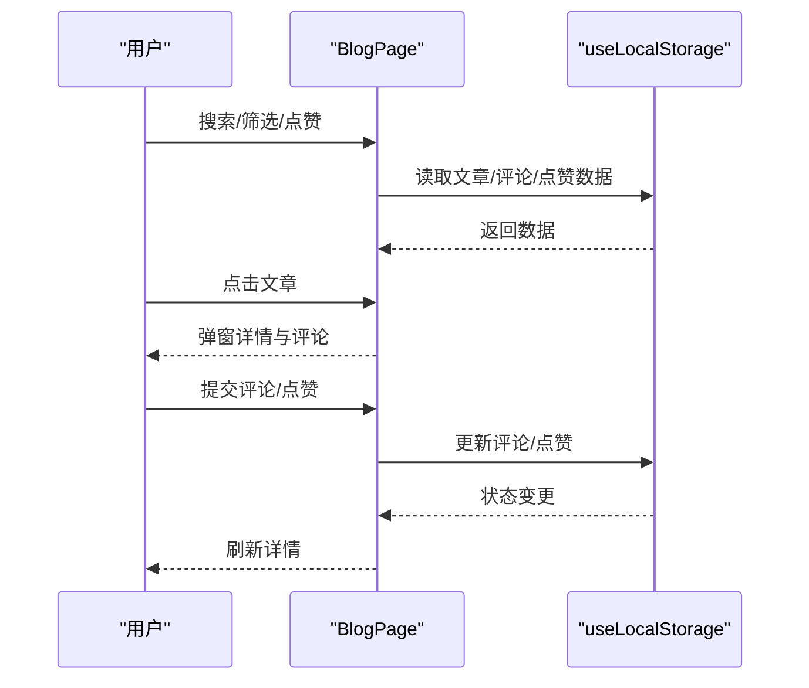

**图表来源**
- [BlogPage.tsx:249-763](file://src/pages/BlogPage.tsx#L249-L763)

**章节来源**
- [BlogPage.tsx:1-764](file://src/pages/BlogPage.tsx#L1-L764)

### 文档中心 DocsPage
- 功能定位：AutoSAR BSW 模块 API 文档索引与快速入口。
- 用户场景：查阅 API、搜索模块、查看覆盖率。
- 交互流程：分类筛选/搜索；点击模块查看详情；访问文档。
- 数据获取与状态管理：静态模块数据；本地状态管理筛选。
- SEO 优化：页面标题与描述突出文档价值。
- 性能优化：静态数据直出；建议分页或虚拟化。
- 响应式设计：网格与筛选条自适应。

**章节来源**
- [DocsPage.tsx:1-343](file://src/pages/DocsPage.tsx#L1-L343)

### 开源代码 OpenSourcePage
- 功能定位：AutoSAR BSW 开源模块清单与 GitHub 数据整合。
- 用户场景：浏览模块、查看状态、下载与贡献。
- 交互流程：分类筛选/搜索；点击模块查看详情；查看 GitHub 状态。
- 数据获取与状态管理：静态模块数据 + GitHub Hook；useMemo 合并数据；统计计算。
- SEO 优化：页面标题与描述突出开源价值。
- 性能优化：useMemo 避免重复计算；GitHub 数据缓存与刷新。
- 响应式设计：网格布局与筛选条自适应。

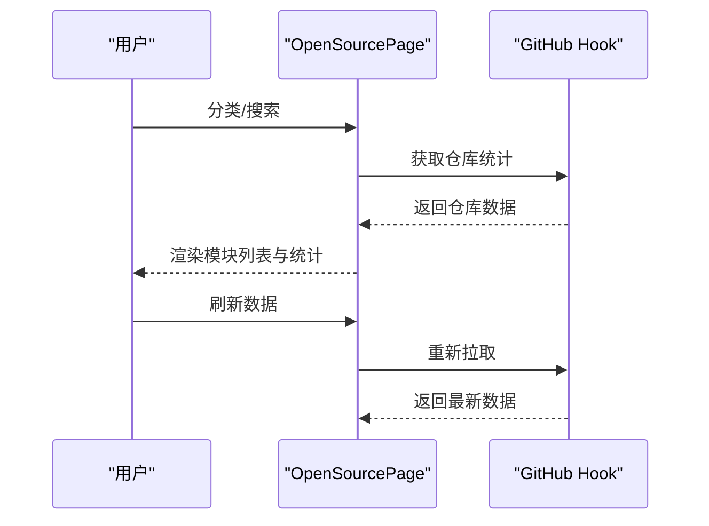

**图表来源**
- [OpenSourcePage.tsx:120-468](file://src/pages/OpenSourcePage.tsx#L120-L468)

**章节来源**
- [OpenSourcePage.tsx:1-469](file://src/pages/OpenSourcePage.tsx#L1-L469)

### 开发工具链 ToolchainPage
- 功能定位：AutoSAR 配置与编译工具、调试与测试工具集合。
- 用户场景：下载工具、查看文档、使用可视化配置器。
- 交互流程：分类筛选；点击卡片下载/查看文档；使用配置器。
- 数据获取与状态管理：静态工具数据；本地状态管理选中分类。
- SEO 优化：页面标题与描述突出工具链价值。
- 性能优化：静态数据直出；建议懒加载封面图。
- 响应式设计：网格布局与图标自适应。

**章节来源**
- [ToolchainPage.tsx:1-380](file://src/pages/ToolchainPage.tsx#L1-L380)

### 管理后台 AdminDashboard
- 功能定位：社区运营仪表盘，展示用户、内容、活动与系统状态。
- 用户场景：管理员查看数据概览、分析趋势、监控系统。
- 交互流程：图表联动；查看最近动态；查看系统状态。
- 数据获取与状态管理：useLocalStorage 读取社区数据；useMemo 计算统计与分布。
- SEO 优化：后台页面无需 SEO。
- 性能优化：useMemo 缓存计算；图表组件懒加载。
- 响应式设计：网格与图表自适应。

**章节来源**
- [AdminDashboard.tsx:1-321](file://src/pages/AdminDashboard.tsx#L1-L321)

### 管理后台 AdminLoginPage
- 功能定位：管理员登录入口。
- 用户场景：管理员凭据登录后台。
- 交互流程：输入用户名/密码；登录校验；跳转仪表盘。
- 数据获取与状态管理：useAdminAuth 管理登录态；useNavigate 路由跳转。
- SEO 优化：后台页面无需 SEO。
- 性能优化：防抖/节流登录请求（建议）。
- 响应式设计：表单自适应。

**章节来源**
- [AdminLoginPage.tsx:1-120](file://src/pages/AdminLoginPage.tsx#L1-L120)

### 管理后台 AdminUsers
- 功能定位：用户管理，支持搜索、筛选、调整积分、重置积分。
- 用户场景：管理员查看与治理用户。
- 交互流程：搜索/筛选；编辑积分；调整等级；重置积分。
- 数据获取与状态管理：useLocalStorage 管理用户数据；getLevelInfo 计算等级。
- SEO 优化：后台页面无需 SEO。
- 性能优化：useMemo 过滤；表格虚拟化（建议）。
- 响应式设计：表格自适应。

**章节来源**
- [AdminUsers.tsx:1-272](file://src/pages/AdminUsers.tsx#L1-L272)

### 管理后台 AdminContent
- 功能定位：内容管理，支持论坛、问答、活动三类内容的搜索、置顶、删除、状态变更。
- 用户场景：管理员审核与治理内容。
- 交互流程：切换标签；搜索；展开详情；置顶/删除/状态变更。
- 数据获取与状态管理：useLocalStorage 管理三类内容；useMemo 展开状态。
- SEO 优化：后台页面无需 SEO。
- 性能优化：useMemo 展开状态；表格虚拟化（建议）。
- 响应式设计：表格自适应。

**章节来源**
- [AdminContent.tsx:1-397](file://src/pages/AdminContent.tsx#L1-L397)

### 管理后台 AdminSettings
- 功能定位：系统设置，支持积分规则、等级阈值、数据导出与清空。
- 用户场景：管理员配置运营规则与数据管理。
- 交互流程：调整积分规则；修改等级阈值；导出/清空数据。
- 数据获取与状态管理：useLocalStorage 管理规则与阈值；导出/清空本地数据。
- SEO 优化：后台页面无需 SEO。
- 性能优化：范围输入与数值输入双向绑定；确认对话框防误操作。
- 响应式设计：表单自适应。

**章节来源**
- [AdminSettings.tsx:1-288](file://src/pages/AdminSettings.tsx#L1-L288)

## 动画系统

平台采用 Framer Motion 实现丰富的动画效果，涵盖页面过渡、组件入场、交互反馈等多个层面：

### 页面级动画
- **页面淡入过渡**：使用 AnimatedPage 组件实现页面级别的淡入效果，支持自定义延迟和持续时间。
- **复杂入场动画**：极简模式切换按钮使用组合动画（scale + opacity），配合延迟实现渐进式出现。

### 组件级动画
- **交错入场效果**：特性组件使用 viewport 触发和延迟参数实现交错入场，增强视觉层次感。
- **视口触发动画**：使用 whileInView 和 viewport 配置，确保组件在进入视口时才触发动画。
- **Hover 动画**：卡片组件使用 scale 和 y 轴偏移实现悬浮效果，提升交互体验。

### 动画组件库
- **FadeIn**：简单的淡入动画包装器，支持自定义延迟和持续时间。
- **StaggerContainer/StaggerItem**：实现子元素的交错动画序列。
- **ScrollReveal**：基于视口的滚动触发动画。
- **HoverCard**：卡片悬停的缩放和位移动画。

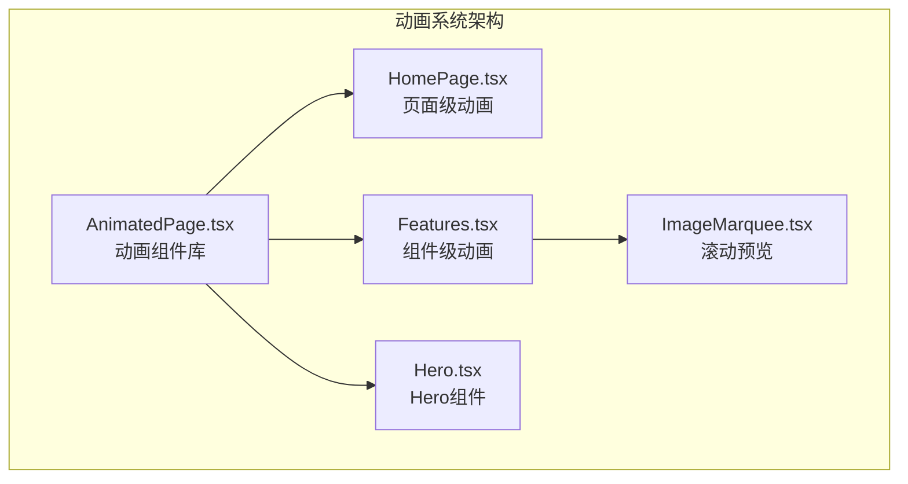

**图表来源**
- [AnimatedPage.tsx:1-149](file://src/components/AnimatedPage.tsx#L1-L149)
- [HomePage.tsx:39-80](file://src/pages/HomePage.tsx#L39-L80)
- [Features.tsx:98-127](file://src/components/Features.tsx#L98-L127)

**章节来源**
- [AnimatedPage.tsx:1-149](file://src/components/AnimatedPage.tsx#L1-L149)
- [HomePage.tsx:39-80](file://src/pages/HomePage.tsx#L39-L80)
- [Features.tsx:98-127](file://src/components/Features.tsx#L98-L127)

## 依赖分析
- 组件耦合
  - 页面组件与公共布局弱耦合，通过 App 根组件注入。
  - 管理后台页面与前台页面隔离，路由独立。
  - 数据管理主要依赖 useLocalStorage 与自定义 Hook（如 useUserSystem、useAdminAuth），减少对外部状态库依赖。
- 外部依赖
  - react-helmet-async：用于 SEO 标题与描述。
  - lucide-react：图标库。
  - react-router-dom：路由与导航。
  - **framer-motion**：动画系统核心依赖。
- 潜在循环依赖
  - 当前结构清晰，页面间无直接循环依赖。

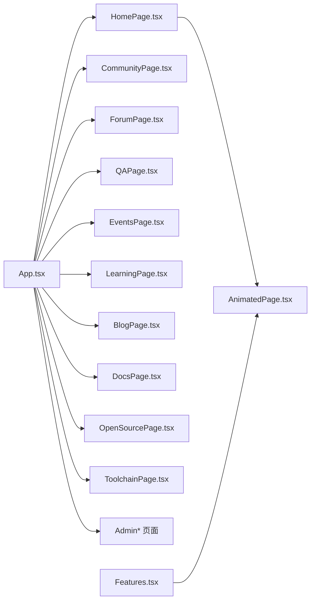

**图表来源**
- [App.tsx:10-28](file://src/App.tsx#L10-L28)

**章节来源**
- [App.tsx:1-123](file://src/App.tsx#L1-L123)

## 性能考虑
- 懒加载与骨架屏
  - App 根组件对所有页面使用 lazy 与 Suspense 包裹，配合 PageLoader 提升首屏体验。
- 本地状态与计算缓存
  - 多数页面使用 useLocalStorage 与 useMemo，避免重复计算与无谓重渲染。
- 列表渲染优化
  - 建议在大型列表（如论坛、问答、活动、博客、开源模块）引入虚拟滚动或分页。
- 图标与媒体
  - 使用 lucide-react 图标，建议在图片资源处采用懒加载与合适的尺寸/格式。
- 缓存与同步
  - OpenSourcePage 通过 GitHub Hook 同步仓库数据，提供刷新与错误提示。
- **动画性能优化**
  - 使用 viewport 触发减少不必要的动画计算。
  - 合理设置动画延迟和持续时间，避免过度动画影响性能。
  - 使用 transform 替代 position 属性进行动画，提高渲染性能。

[本节为通用指导，无需特定文件引用]

## 故障排查指南
- 页面空白或白屏
  - 检查 Suspense fallback 是否正确渲染；确认 lazy 导入路径与文件存在。
- 路由跳转无效
  - 检查 App 中路由配置与嵌套路由；确认 Link 或 useNavigate 使用正确。
- 管理后台无法登录
  - 检查 useAdminAuth 登录逻辑；确认凭据与跳转路径。
- 数据未持久化
  - 检查 useLocalStorage 的键名与数据结构；确认浏览器允许 localStorage。
- 表格/列表卡顿
  - 引入虚拟滚动或分页；减少不必要的 re-render；使用 useMemo/memo。
- **动画异常**
  - 检查 framer-motion 版本兼容性；确认 viewport 配置正确。
  - 验证动画延迟和持续时间设置是否合理。
  - 确认 DOM 结构符合动画组件要求。

**章节来源**
- [App.tsx:30-115](file://src/App.tsx#L30-L115)
- [AdminLoginPage.tsx:1-120](file://src/pages/AdminLoginPage.tsx#L1-L120)

## 结论
页面系统以清晰的路由与布局分离前台与后台，围绕内容消费与运营治理两大目标构建。通过本地状态与懒加载优化用户体验，配合 SEO 与响应式设计提升可达性与可用性。新增的动画系统进一步提升了用户体验，通过合理的动画策略平衡了视觉效果与性能表现。建议后续引入虚拟滚动、服务端数据与鉴权、国际化与无障碍等能力，进一步完善平台。

[本节为总结，无需特定文件引用]

## 附录

### 页面导航与路由配置
- 前台路由
  - 根路径与多页面路由，支持模块化懒加载。
- 管理后台路由
  - 独立 /admin 前缀，嵌套路由包含仪表盘、用户、内容、设置。
- 导航建议
  - 在 Navbar 中添加面包屑与返回按钮，提升多级页面可导航性。

**章节来源**
- [App.tsx:34-111](file://src/App.tsx#L34-L111)

### 不同用户角色的差异化呈现
- 访客
  - 可浏览首页、社区、学习、博客、文档、开源、工具链等公开内容。
- 注册用户
  - 可参与论坛发帖/回复、问答提问/回答、活动报名、学习课程、博客评论与点赞。
- 管理员
  - 可访问 /admin 下的所有管理页面，进行内容治理与系统配置。

**章节来源**
- [App.tsx:34-111](file://src/App.tsx#L34-L111)
- [AdminLoginPage.tsx:1-120](file://src/pages/AdminLoginPage.tsx#L1-L120)

### SEO 优化策略
- 标题与描述
  - 每个页面使用 react-helmet-async 设置页面级标题与描述，贴合页面语义。
- 结构化数据
  - 建议在内容页增加结构化数据（如 FAQ、Article、BreadcrumbList）。
- 可访问性
  - 为图片提供 alt；为交互元素提供 aria-label；键盘可导航。

**章节来源**
- [HomePage.tsx:39-42](file://src/pages/HomePage.tsx#L39-L42)
- [CommunityPage.tsx:250-253](file://src/pages/CommunityPage.tsx#L250-L253)
- [ForumPage.tsx:212-215](file://src/pages/ForumPage.tsx#L212-L215)
- [QAPage.tsx:189-192](file://src/pages/QAPage.tsx#L189-L192)
- [EventsPage.tsx:172-175](file://src/pages/EventsPage.tsx#L172-L175)
- [BlogPage.tsx:334-337](file://src/pages/BlogPage.tsx#L334-L337)
- [DocsPage.tsx:117-120](file://src/pages/DocsPage.tsx#L117-L120)
- [OpenSourcePage.tsx:172-175](file://src/pages/OpenSourcePage.tsx#L172-L175)
- [ToolchainPage.tsx:190-193](file://src/pages/ToolchainPage.tsx#L190-L193)

### 响应式设计与移动端适配
- 断点与布局
  - 使用 Tailwind 响应式断点，确保在移动设备上标签横向滚动、网格自适应。
- 交互优化
  - 按钮与输入控件在移动端具备足够触控面积；Modal 在移动端采用全屏或大屏适配。
- **动画适配**
  - 移动端适当减少动画复杂度；使用 transform 动画替代 position 动画。
  - viewport 动画在移动端可能表现不同，需要测试和调整。

**章节来源**
- [CommunityPage.tsx:388-407](file://src/pages/CommunityPage.tsx#L388-L407)
- [ForumPage.tsx:234-277](file://src/pages/ForumPage.tsx#L234-L277)
- [QAPage.tsx:211-254](file://src/pages/QAPage.tsx#L211-L254)
- [EventsPage.tsx:194-236](file://src/pages/EventsPage.tsx#L194-L236)
- [BlogPage.tsx:462-480](file://src/pages/BlogPage.tsx#L462-L480)
- [OpenSourcePage.tsx:283-313](file://src/pages/OpenSourcePage.tsx#L283-L313)

### 开发者最佳实践
- 页面开发
  - 使用 lazy 与 Suspense 包裹页面；为复杂页面提供骨架屏。
  - 将静态数据与动态数据分离；优先使用本地状态与 useMemo。
- 数据管理
  - 统一使用 useLocalStorage 管理前端数据；为关键数据提供备份与恢复。
- 可维护性
  - 页面组件保持单一职责；公共逻辑抽取为自定义 Hook；组件命名与目录结构一致。
- 安全与权限
  - 管理后台使用受控路由与鉴权 Hook；对敏感操作增加二次确认。
- **动画开发**
  - 合理使用 viewport 触发，避免过度动画影响性能。
  - 使用 transform 属性进行动画，提升渲染性能。
  - 为动画设置适当的延迟和持续时间，提供流畅的用户体验。

**章节来源**
- [App.tsx:10-28](file://src/App.tsx#L10-L28)
- [AdminSettings.tsx:72-120](file://src/pages/AdminSettings.tsx#L72-L120)
- [AnimatedPage.tsx:1-149](file://src/components/AnimatedPage.tsx#L1-L149)