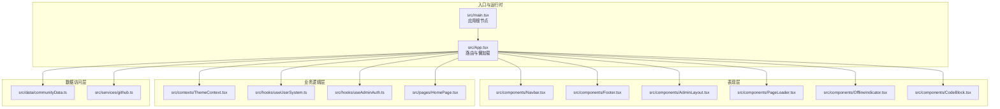
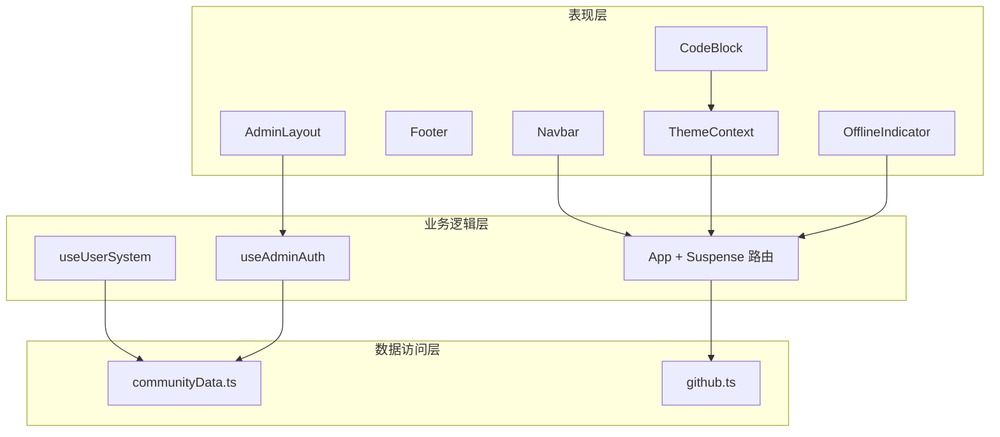
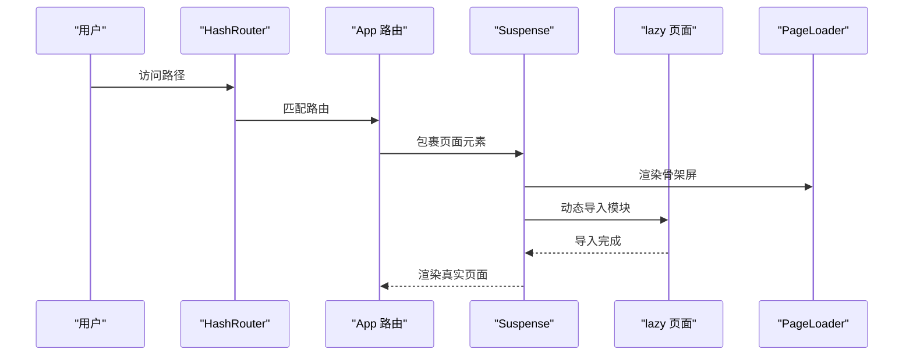
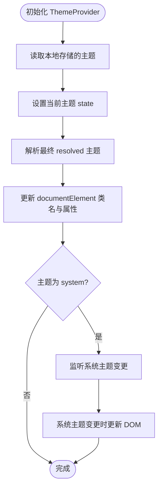
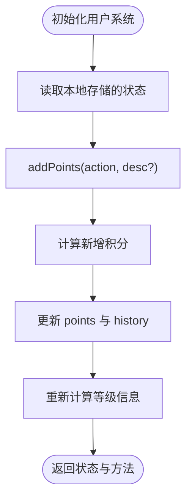
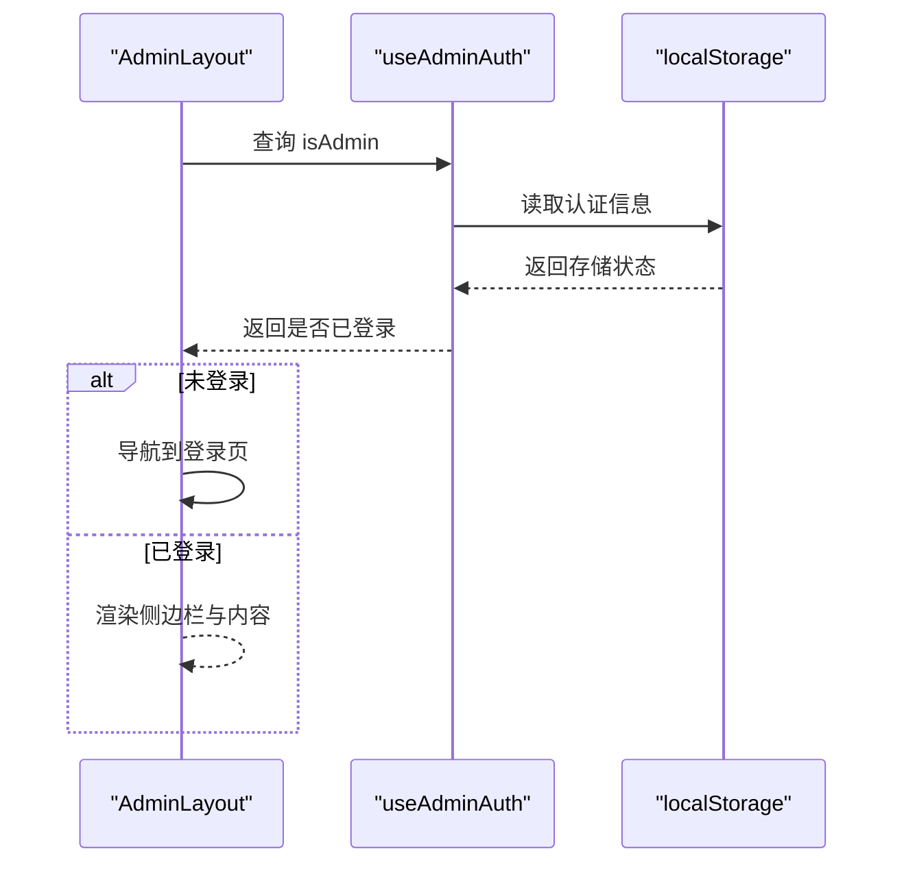
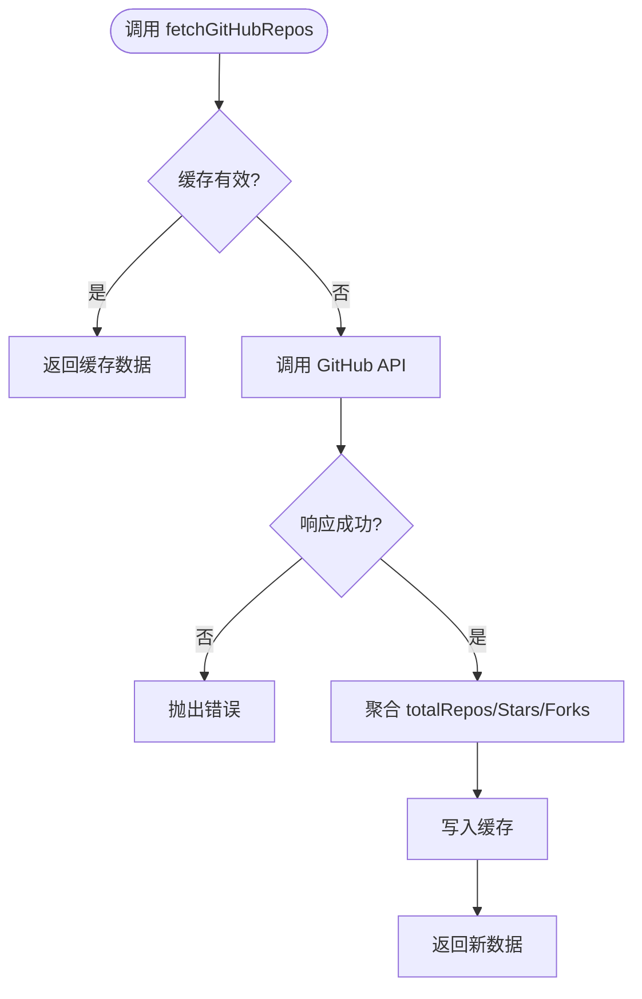
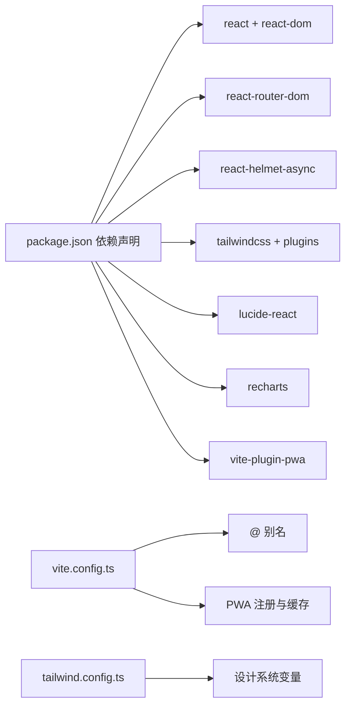

# 前端架构设计

<cite>
**本文引用的文件**
- [package.json](file://package.json)
- [README.md](file://README.md)
- [vite.config.ts](file://vite.config.ts)
- [tailwind.config.ts](file://tailwind.config.ts)
- [src/main.tsx](file://src/main.tsx)
- [src/App.tsx](file://src/App.tsx)
- [src/components/Navbar.tsx](file://src/components/Navbar.tsx)
- [src/components/Footer.tsx](file://src/components/Footer.tsx)
- [src/components/AdminLayout.tsx](file://src/components/AdminLayout.tsx)
- [src/components/CodeBlock.tsx](file://src/components/CodeBlock.tsx)
- [src/components/PageLoader.tsx](file://src/components/PageLoader.tsx)
- [src/components/OfflineIndicator.tsx](file://src/components/OfflineIndicator.tsx)
- [src/contexts/ThemeContext.tsx](file://src/contexts/ThemeContext.tsx)
- [src/hooks/useUserSystem.ts](file://src/hooks/useUserSystem.ts)
- [src/hooks/useAdminAuth.ts](file://src/hooks/useAdminAuth.ts)
- [src/data/communityData.ts](file://src/data/communityData.ts)
- [src/services/github.ts](file://src/services/github.ts)
- [src/pages/HomePage.tsx](file://src/pages/HomePage.tsx)
</cite>

## 目录
1. [引言](#引言)
2. [项目结构](#项目结构)
3. [核心组件](#核心组件)
4. [架构总览](#架构总览)
5. [详细组件分析](#详细组件分析)
6. [依赖分析](#依赖分析)
7. [性能考虑](#性能考虑)
8. [故障排查指南](#故障排查指南)
9. [结论](#结论)
10. [附录](#附录)

## 引言
本文件为 YuleTech 社区技术平台的前端架构设计文档，围绕 React 19 + TypeScript + Tailwind CSS 的技术栈，系统阐述组件化设计理念、模块化组织结构、代码分割策略与 Suspense 懒加载机制的实现与性能优化。文档还覆盖应用的分层架构（表现层、业务逻辑层、数据访问层）、组件通信机制、状态管理模式、路由系统架构，并给出技术选型原因、架构决策的技术考量与可扩展性设计，辅以架构图表与组件关系图，帮助开发者快速理解系统整体设计。

## 项目结构
项目采用多页面应用（MPA）风格的单页入口 + 路由分发模式，通过 HashRouter 提供路由能力，结合 Suspense 实现按需加载与骨架屏体验。Tailwind CSS 作为原子化样式框架，Vite 作为构建工具，PWA 插件提供离线缓存与更新能力。

**图表来源**
- [src/main.tsx:1-23](file://src/main.tsx#L1-L23)
- [src/App.tsx:1-118](file://src/App.tsx#L1-L118)
- [src/components/Navbar.tsx:1-204](file://src/components/Navbar.tsx#L1-L204)
- [src/components/Footer.tsx:1-95](file://src/components/Footer.tsx#L1-L95)
- [src/components/AdminLayout.tsx:1-178](file://src/components/AdminLayout.tsx#L1-L178)
- [src/components/PageLoader.tsx:1-11](file://src/components/PageLoader.tsx#L1-L11)
- [src/components/OfflineIndicator.tsx:1-29](file://src/components/OfflineIndicator.tsx#L1-L29)
- [src/components/CodeBlock.tsx:1-49](file://src/components/CodeBlock.tsx#L1-L49)
- [src/contexts/ThemeContext.tsx:1-127](file://src/contexts/ThemeContext.tsx#L1-L127)
- [src/hooks/useUserSystem.ts:1-135](file://src/hooks/useUserSystem.ts#L1-L135)
- [src/hooks/useAdminAuth.ts:1-67](file://src/hooks/useAdminAuth.ts#L1-L67)
- [src/data/communityData.ts:1-371](file://src/data/communityData.ts#L1-L371)
- [src/services/github.ts:1-97](file://src/services/github.ts#L1-L97)
- [src/pages/HomePage.tsx:1-88](file://src/pages/HomePage.tsx#L1-L88)

**章节来源**
- [README.md:1-95](file://README.md#L1-L95)
- [package.json:1-46](file://package.json#L1-L46)
- [vite.config.ts:1-32](file://vite.config.ts#L1-L32)
- [tailwind.config.ts:1-79](file://tailwind.config.ts#L1-L79)

## 核心组件
- 应用根节点与运行时上下文：在入口文件中注入 HelmetProvider、ThemeProvider、HashRouter，形成全局上下文树。
- 路由与懒加载：App 组件集中定义路由与 Suspense 包裹，实现按需加载与骨架屏体验。
- 导航与页脚：Navbar 提供响应式导航与搜索、通知、主题切换；Footer 提供多列导航与版权信息。
- 管理后台布局：AdminLayout 提供侧边栏、移动端抽屉、权限校验与内容出口。
- 主题系统：ThemeContext 提供 light/dark/system 三态主题与持久化，避免首屏闪烁。
- 用户体系：useUserSystem 提供积分、等级、行为历史等本地持久化状态。
- 离线指示：OfflineIndicator 监听网络状态并在离线时提示。
- 代码高亮：CodeBlock 基于主题自动切换语法高亮风格。
- GitHub 数据服务：封装仓库列表、统计与缓存逻辑。

**章节来源**
- [src/main.tsx:1-23](file://src/main.tsx#L1-L23)
- [src/App.tsx:1-118](file://src/App.tsx#L1-L118)
- [src/components/Navbar.tsx:1-204](file://src/components/Navbar.tsx#L1-L204)
- [src/components/Footer.tsx:1-95](file://src/components/Footer.tsx#L1-L95)
- [src/components/AdminLayout.tsx:1-178](file://src/components/AdminLayout.tsx#L1-L178)
- [src/contexts/ThemeContext.tsx:1-127](file://src/contexts/ThemeContext.tsx#L1-L127)
- [src/hooks/useUserSystem.ts:1-135](file://src/hooks/useUserSystem.ts#L1-L135)
- [src/components/OfflineIndicator.tsx:1-29](file://src/components/OfflineIndicator.tsx#L1-L29)
- [src/components/CodeBlock.tsx:1-49](file://src/components/CodeBlock.tsx#L1-L49)
- [src/services/github.ts:1-97](file://src/services/github.ts#L1-L97)

## 架构总览
系统采用“表现层-业务逻辑层-数据访问层”的分层架构：
- 表现层：组件负责 UI 渲染、交互与主题、路由、懒加载体验。
- 业务逻辑层：Hooks 与 Context 提供用户状态、权限、主题等跨组件共享逻辑。
- 数据访问层：服务封装外部 API 与本地数据模型，提供缓存与迁移能力。

**图表来源**
- [src/components/Navbar.tsx:1-204](file://src/components/Navbar.tsx#L1-L204)
- [src/components/AdminLayout.tsx:1-178](file://src/components/AdminLayout.tsx#L1-L178)
- [src/contexts/ThemeContext.tsx:1-127](file://src/contexts/ThemeContext.tsx#L1-L127)
- [src/components/OfflineIndicator.tsx:1-29](file://src/components/OfflineIndicator.tsx#L1-L29)
- [src/components/CodeBlock.tsx:1-49](file://src/components/CodeBlock.tsx#L1-L49)
- [src/hooks/useUserSystem.ts:1-135](file://src/hooks/useUserSystem.ts#L1-L135)
- [src/hooks/useAdminAuth.ts:1-67](file://src/hooks/useAdminAuth.ts#L1-L67)
- [src/App.tsx:1-118](file://src/App.tsx#L1-L118)
- [src/data/communityData.ts:1-371](file://src/data/communityData.ts#L1-L371)
- [src/services/github.ts:1-97](file://src/services/github.ts#L1-L97)

## 详细组件分析

### 路由与懒加载（Suspense）
- 路由组织：App 使用 HashRouter 与多级路由，公共区域与管理后台区域分离。
- 懒加载策略：使用 React.lazy 对各页面进行动态导入，并在 Route 内部包裹 Suspense，fallback 使用 PageLoader。
- 性能收益：按需加载显著降低首屏包体，提升首屏渲染速度与用户体验。

**图表来源**
- [src/App.tsx:30-115](file://src/App.tsx#L30-L115)
- [src/components/PageLoader.tsx:1-11](file://src/components/PageLoader.tsx#L1-L11)

**章节来源**
- [src/App.tsx:1-118](file://src/App.tsx#L1-L118)
- [src/main.tsx:1-23](file://src/main.tsx#L1-L23)

### 主题系统（ThemeContext）
- 支持 light/dark/system 三种模式，持久化存储于 localStorage。
- 首次挂载阶段避免主题闪烁，根据系统偏好或用户选择解析最终主题。
- 监听系统主题变化，实时更新 DOM 类名与属性，保证样式一致性。

**图表来源**
- [src/contexts/ThemeContext.tsx:41-124](file://src/contexts/ThemeContext.tsx#L41-L124)

**章节来源**
- [src/contexts/ThemeContext.tsx:1-127](file://src/contexts/ThemeContext.tsx#L1-L127)

### 用户体系与等级（useUserSystem）
- 积分规则与等级阈值支持本地持久化配置，便于运营调整。
- 提供添加积分、设置积分、查询等级信息等方法，返回稳定计算结果。
- 历史记录包含动作类型、描述、时间戳，便于审计与报表。

**图表来源**
- [src/hooks/useUserSystem.ts:91-132](file://src/hooks/useUserSystem.ts#L91-L132)
- [src/data/communityData.ts:361-371](file://src/data/communityData.ts#L361-L371)

**章节来源**
- [src/hooks/useUserSystem.ts:1-135](file://src/hooks/useUserSystem.ts#L1-L135)
- [src/data/communityData.ts:1-371](file://src/data/communityData.ts#L1-L371)

### 管理后台权限（useAdminAuth）
- 登录成功写入带过期时间的本地存储，定期轮询校验有效性。
- AdminLayout 在渲染前校验权限，未登录重定向至登录页。
- 提供登录与登出方法，简化后台入口控制。

**图表来源**
- [src/components/AdminLayout.tsx:28-43](file://src/components/AdminLayout.tsx#L28-L43)
- [src/hooks/useAdminAuth.ts:29-66](file://src/hooks/useAdminAuth.ts#L29-L66)

**章节来源**
- [src/components/AdminLayout.tsx:1-178](file://src/components/AdminLayout.tsx#L1-L178)
- [src/hooks/useAdminAuth.ts:1-67](file://src/hooks/useAdminAuth.ts#L1-L67)

### GitHub 数据服务（github.ts）
- 缓存策略：使用 sessionStorage 缓存请求结果，TTL 5 分钟，避免频繁请求。
- 搜索匹配：提供模块名到仓库名的候选匹配，便于导航到对应仓库。
- 错误处理：对非 2xx 响应抛出错误，便于上层捕获与提示。

**图表来源**
- [src/services/github.ts:52-80](file://src/services/github.ts#L52-L80)

**章节来源**
- [src/services/github.ts:1-97](file://src/services/github.ts#L1-L97)

### 代码高亮（CodeBlock）
- 主题感知：周期性检测主题变化，动态切换 oneDark/oneLight 风格。
- 自适应背景：根据主题自动选择卡片/背景色，保证阅读体验一致。

**章节来源**
- [src/components/CodeBlock.tsx:1-49](file://src/components/CodeBlock.tsx#L1-L49)

### 导航与页脚（Navbar/Foot）
- Navbar：响应式导航、滚动阴影、移动端抽屉菜单、搜索、通知、主题切换、管理入口。
- Footer：多列导航、社交链接、版权信息。

**章节来源**
- [src/components/Navbar.tsx:1-204](file://src/components/Navbar.tsx#L1-L204)
- [src/components/Footer.tsx:1-95](file://src/components/Footer.tsx#L1-L95)

## 依赖分析
- 运行时依赖：React 19、react-router-dom、react-helmet-async、Tailwind CSS、Lucide React、Recharts、vite-plugin-pwa。
- 构建与开发：Vite、TailwindCSS、TypeScript、ESLint、PostCSS。
- 项目通过 Vite 配置别名 @ 指向 src，启用 PWA 自动注册与缓存策略。

**图表来源**
- [package.json:12-44](file://package.json#L12-L44)
- [vite.config.ts:6-31](file://vite.config.ts#L6-L31)
- [tailwind.config.ts:3-79](file://tailwind.config.ts#L3-L79)

**章节来源**
- [package.json:1-46](file://package.json#L1-L46)
- [vite.config.ts:1-32](file://vite.config.ts#L1-L32)
- [tailwind.config.ts:1-79](file://tailwind.config.ts#L1-L79)

## 性能考虑
- 代码分割与懒加载：通过 React.lazy 与 Suspense 将页面按需加载，显著降低首屏体积与白屏时间。
- 骨架屏体验：PageLoader 提供加载指示，改善感知性能。
- 主题无闪烁：ThemeContext 在挂载阶段隐藏内容，解析主题后再显示，避免闪烁。
- 缓存策略：GitHub 服务使用 sessionStorage 缓存，TTL 5 分钟，减少重复请求。
- PWA 与静态资源：VitePWA 自动缓存静态资源，Workbox 配置运行时缓存与最大文件大小，提升离线可用性与二次加载速度。
- Tailwind 原子类：按需扫描 content，减少未使用样式体积。

**章节来源**
- [src/App.tsx:10-28](file://src/App.tsx#L10-L28)
- [src/components/PageLoader.tsx:1-11](file://src/components/PageLoader.tsx#L1-L11)
- [src/contexts/ThemeContext.tsx:95-109](file://src/contexts/ThemeContext.tsx#L95-L109)
- [src/services/github.ts:28-50](file://src/services/github.ts#L28-L50)
- [vite.config.ts:10-24](file://vite.config.ts#L10-L24)
- [tailwind.config.ts:5-8](file://tailwind.config.ts#L5-L8)

## 故障排查指南
- 页面空白或长时间加载
  - 检查路由与 Suspense 包裹是否正确，确认 lazy 导入路径与导出名称一致。
  - 查看网络面板，确认页面资源可正常加载。
  - 参考：[src/App.tsx:30-115](file://src/App.tsx#L30-L115)
- 骨架屏不消失
  - 确认动态模块导出的默认组件名称与 lazy 返回一致。
  - 参考：[src/components/PageLoader.tsx:1-11](file://src/components/PageLoader.tsx#L1-L11)
- 主题切换无效或闪烁
  - 确保 ThemeProvider 正确包裹应用根节点，检查 localStorage 可用性。
  - 参考：[src/contexts/ThemeContext.tsx:41-124](file://src/contexts/ThemeContext.tsx#L41-L124)
- 管理后台无法进入
  - 检查本地存储的认证信息是否过期，确认登录流程与会话时长。
  - 参考：[src/hooks/useAdminAuth.ts:29-66](file://src/hooks/useAdminAuth.ts#L29-L66)
- GitHub 数据不更新
  - 检查缓存 TTL 与 sessionStorage 是否被清理，确认网络请求状态码。
  - 参考：[src/services/github.ts:52-80](file://src/services/github.ts#L52-L80)

**章节来源**
- [src/App.tsx:30-115](file://src/App.tsx#L30-L115)
- [src/components/PageLoader.tsx:1-11](file://src/components/PageLoader.tsx#L1-L11)
- [src/contexts/ThemeContext.tsx:41-124](file://src/contexts/ThemeContext.tsx#L41-L124)
- [src/hooks/useAdminAuth.ts:29-66](file://src/hooks/useAdminAuth.ts#L29-L66)
- [src/services/github.ts:52-80](file://src/services/github.ts#L52-L80)

## 结论
本架构以 React 19 + TypeScript + Tailwind CSS 为基础，结合 Suspense 懒加载、主题系统、权限控制与数据服务缓存，实现了高性能、可维护、可扩展的前端平台。通过清晰的分层与模块化组织，开发者可在保持一致设计语言的同时快速迭代功能。后续可进一步引入状态管理库（如 Zustand 或 Jotai）以承载更复杂的跨组件状态，或在生产环境引入更细粒度的代码分割与预加载策略。

## 附录
- 技术栈选择理由
  - React 19：支持并发特性与 Suspense，适合现代前端性能优化。
  - TypeScript：提供类型安全与更好的开发体验。
  - Tailwind CSS：原子化样式，易于主题化与响应式适配。
  - Vite：快速冷启动与热更新，构建性能优异。
  - PWA：提升离线可用性与二次加载速度。
- 架构决策的技术考量
  - 懒加载与骨架屏：平衡首屏体积与用户体验。
  - 主题系统：统一设计语言与无障碍支持。
  - 本地持久化：降低服务器压力，提升响应速度。
  - 缓存策略：在准确性与性能之间取得平衡。
- 可扩展性设计
  - 组件拆分与 Hooks 抽象，便于复用与测试。
  - 数据层与服务层解耦，便于替换与扩展。
  - 路由与懒加载策略可扩展至更多页面与模块。