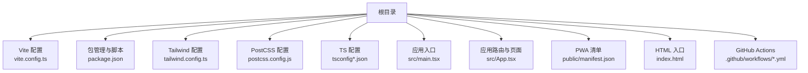
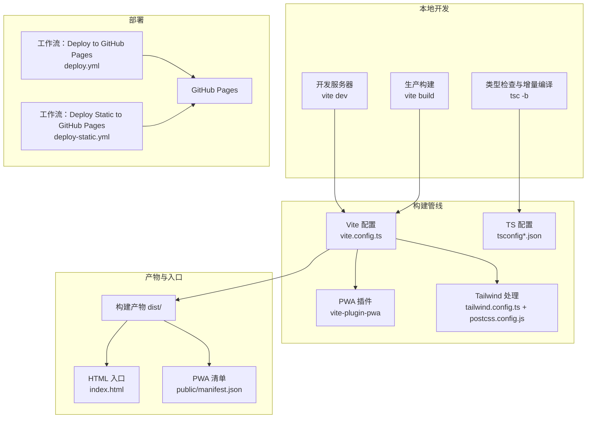
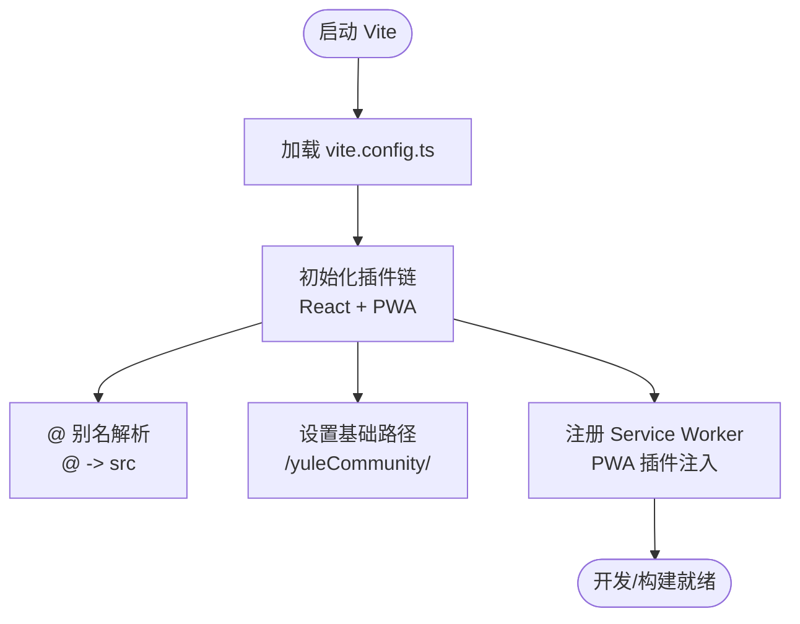
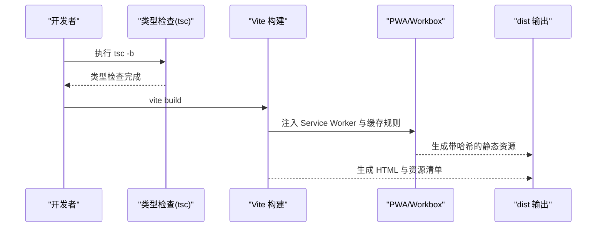
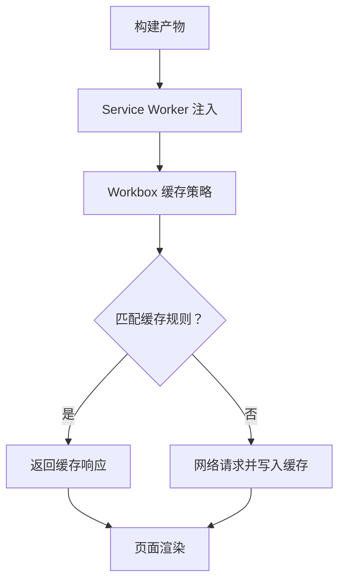
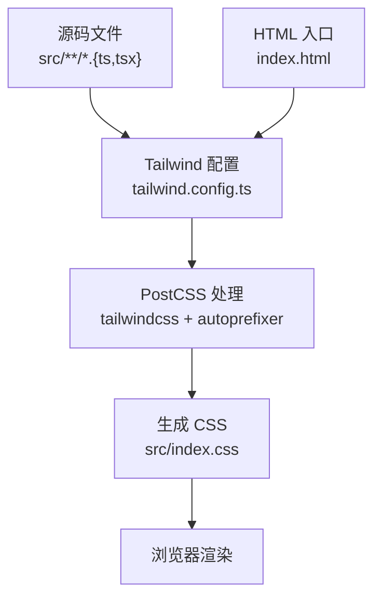
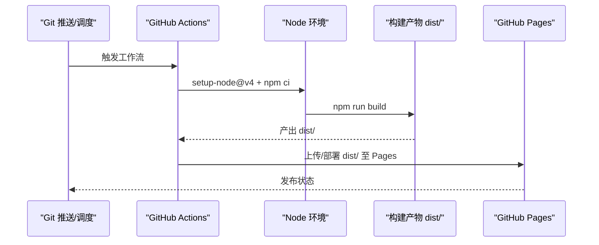
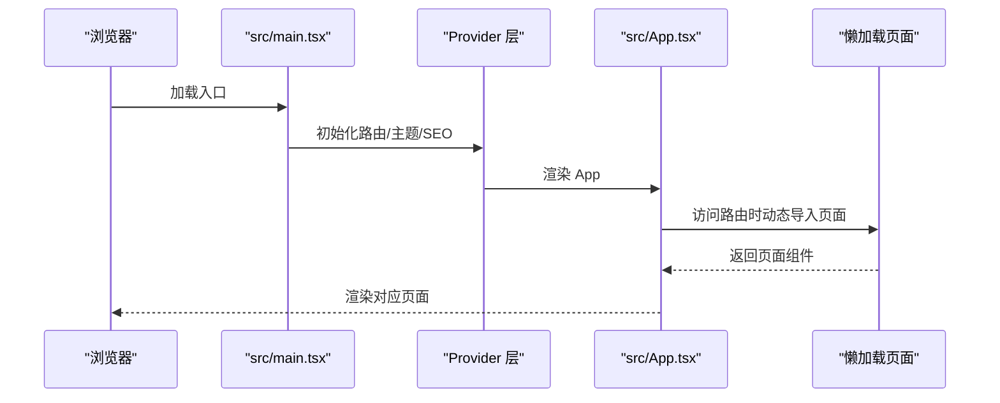
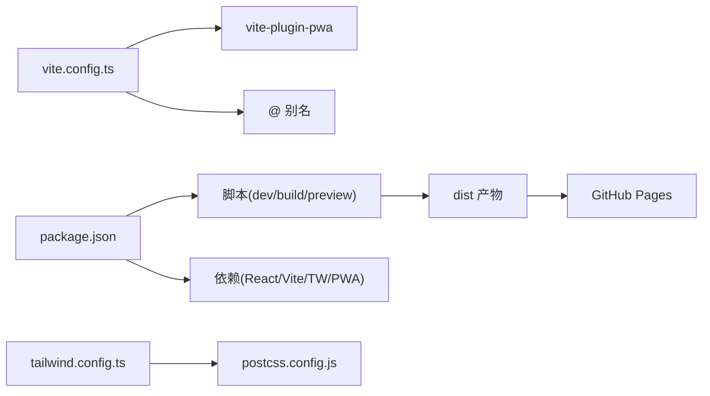

# 构建与部署架构

<cite>
**本文引用的文件**
- [vite.config.ts](file://vite.config.ts)
- [package.json](file://package.json)
- [tailwind.config.ts](file://tailwind.config.ts)
- [postcss.config.js](file://postcss.config.js)
- [.github/workflows/deploy.yml](file://.github/workflows/deploy.yml)
- [.github/workflows/deploy-static.yml](file://.github/workflows/deploy-static.yml)
- [public/manifest.json](file://public/manifest.json)
- [index.html](file://index.html)
- [src/main.tsx](file://src/main.tsx)
- [src/App.tsx](file://src/App.tsx)
- [tsconfig.json](file://tsconfig.json)
- [tsconfig.app.json](file://tsconfig.app.json)
- [eslint.config.js](file://eslint.config.js)
- [src/index.css](file://src/index.css)
</cite>

## 目录
1. [简介](#简介)
2. [项目结构](#项目结构)
3. [核心组件](#核心组件)
4. [架构总览](#架构总览)
5. [详细组件分析](#详细组件分析)
6. [依赖关系分析](#依赖关系分析)
7. [性能考量](#性能考量)
8. [故障排除指南](#故障排除指南)
9. [结论](#结论)
10. [附录](#附录)

## 简介
本文件面向 YuleTech 社区技术平台的构建与部署架构，围绕基于 Vite 7.3.2 的前端工程体系，系统性阐述开发服务器配置、生产构建优化、PWA 支持机制；同时覆盖 Tailwind CSS 的构建配置与样式处理流程；并完整文档化 GitHub Actions 自动化部署流水线（CI/CD 流程、环境配置与部署策略）。最后提供构建优化技术（代码分割、资源压缩、缓存策略）、部署架构设计、环境管理与监控建议，以及构建配置指南、部署最佳实践与故障排除方法。

## 项目结构
该仓库采用多应用单体结构（Monorepo 风格），根目录包含多个应用入口与共享资源，核心构建与部署配置集中在根级配置文件中，配合 GitHub Actions 实现自动化发布到 GitHub Pages。

- 核心构建配置
  - Vite：定义开发服务器、插件、别名与 PWA 行为
  - TypeScript：类型检查与编译配置
  - Tailwind CSS：原子化样式与暗色模式支持
  - PostCSS：自动前缀与 Tailwind 处理管线
- 应用入口
  - 主应用入口位于 src/main.tsx，使用 HashRouter 与 HelmetProvider 包裹
  - App.tsx 定义路由与懒加载页面
- 部署配置
  - GitHub Actions 工作流：两个并行工作流分别用于标准 Pages 与静态部署
  - PWA 清单与 HTML 入口：通过 manifest.json 与 index.html 注入

**图表来源**
- [vite.config.ts:1-32](file://vite.config.ts#L1-L32)
- [package.json:1-46](file://package.json#L1-L46)
- [tailwind.config.ts:1-79](file://tailwind.config.ts#L1-L79)
- [postcss.config.js:1-7](file://postcss.config.js#L1-L7)
- [tsconfig.json:1-8](file://tsconfig.json#L1-L8)
- [tsconfig.app.json:1-35](file://tsconfig.app.json#L1-L35)
- [src/main.tsx:1-23](file://src/main.tsx#L1-L23)
- [src/App.tsx:1-118](file://src/App.tsx#L1-L118)
- [public/manifest.json:1-22](file://public/manifest.json#L1-L22)
- [index.html:1-18](file://index.html#L1-L18)
- [.github/workflows/deploy.yml:1-54](file://.github/workflows/deploy.yml#L1-L54)
- [.github/workflows/deploy-static.yml:1-43](file://.github/workflows/deploy-static.yml#L1-L43)

**章节来源**
- [vite.config.ts:1-32](file://vite.config.ts#L1-L32)
- [package.json:1-46](file://package.json#L1-L46)
- [tailwind.config.ts:1-79](file://tailwind.config.ts#L1-L79)
- [postcss.config.js:1-7](file://postcss.config.js#L1-L7)
- [tsconfig.json:1-8](file://tsconfig.json#L1-L8)
- [tsconfig.app.json:1-35](file://tsconfig.app.json#L1-L35)
- [src/main.tsx:1-23](file://src/main.tsx#L1-L23)
- [src/App.tsx:1-118](file://src/App.tsx#L1-L118)
- [public/manifest.json:1-22](file://public/manifest.json#L1-L22)
- [index.html:1-18](file://index.html#L1-L18)
- [.github/workflows/deploy.yml:1-54](file://.github/workflows/deploy.yml#L1-L54)
- [.github/workflows/deploy-static.yml:1-43](file://.github/workflows/deploy-static.yml#L1-L43)

## 核心组件
- Vite 构建系统与开发服务器
  - 插件链：React 插件、PWA 插件（Workbox）
  - 路径别名：@ 指向 src
  - 基础路径：/yuleCommunity/
- TypeScript 编译与类型检查
  - 分层 tsconfig 引用 app 与 node
  - esnext 目标、bundler 解析、JSX React
- Tailwind CSS 与 PostCSS
  - 内容扫描：index.html 与 src 下 TS/TSX
  - 暗色模式：class 驱动
  - 插件：tailwindcss-animate
  - 后处理器：tailwindcss + autoprefixer
- GitHub Actions 部署
  - 两套工作流：标准 Pages 与静态 gh-pages
  - Node 20、npm ci、构建产物 dist、上传/部署

**章节来源**
- [vite.config.ts:6-31](file://vite.config.ts#L6-L31)
- [package.json:6-11](file://package.json#L6-L11)
- [tsconfig.app.json:1-35](file://tsconfig.app.json#L1-L35)
- [tailwind.config.ts:3-76](file://tailwind.config.ts#L3-L76)
- [postcss.config.js:1-7](file://postcss.config.js#L1-L7)
- [.github/workflows/deploy.yml:17-54](file://.github/workflows/deploy.yml#L17-L54)
- [.github/workflows/deploy-static.yml:17-43](file://.github/workflows/deploy-static.yml#L17-L43)

## 架构总览
下图展示从本地开发到 GitHub Pages 的端到端构建与部署流程，涵盖 Vite 构建、PWA 注册、样式管线与 GitHub Actions 工作流。

**图表来源**
- [vite.config.ts:1-32](file://vite.config.ts#L1-L32)
- [package.json:6-11](file://package.json#L6-L11)
- [tailwind.config.ts:1-79](file://tailwind.config.ts#L1-L79)
- [postcss.config.js:1-7](file://postcss.config.js#L1-L7)
- [tsconfig.json:1-8](file://tsconfig.json#L1-L8)
- [tsconfig.app.json:1-35](file://tsconfig.app.json#L1-L35)
- [index.html:1-18](file://index.html#L1-L18)
- [public/manifest.json:1-22](file://public/manifest.json#L1-L22)
- [.github/workflows/deploy.yml:1-54](file://.github/workflows/deploy.yml#L1-L54)
- [.github/workflows/deploy-static.yml:1-43](file://.github/workflows/deploy-static.yml#L1-L43)

## 详细组件分析

### Vite 构建系统与开发服务器
- 基础路径与别名
  - base 设置为 /yuleCommunity/，适配子路径部署
  - @ 别名指向 src，统一模块导入路径
- 插件链
  - React 插件：支持 JSX/TSX 热重载与转换
  - PWA 插件：启用自动更新、自定义 Workbox 策略（字体缓存、大文件阈值、glob 规则）
- 开发与预览
  - dev：启动本地开发服务器
  - preview：本地预览生产构建

**图表来源**
- [vite.config.ts:6-31](file://vite.config.ts#L6-L31)

**章节来源**
- [vite.config.ts:6-31](file://vite.config.ts#L6-L31)
- [package.json:6-11](file://package.json#L6-L11)

### 生产构建优化
- 类型检查前置
  - 构建脚本先执行 tsc -b 进行增量编译与类型检查
- 代码分割与懒加载
  - App.tsx 使用 React.lazy 与 Suspense 对页面进行按需加载，减少首屏体积
- 资源压缩与缓存
  - PWA Workbox 默认启用最小化与资源缓存策略
  - 字体资源采用 CacheFirst 缓存，提升重复访问性能
  - 大文件阈值限制为 5MB，避免缓存超大资源
- 路由与入口
  - index.html 中引入 PWA 清单与主题色，确保安装体验与视觉一致性

**图表来源**
- [package.json:8](file://package.json#L8)
- [vite.config.ts:10-24](file://vite.config.ts#L10-L24)
- [src/App.tsx:10-28](file://src/App.tsx#L10-L28)
- [index.html:9](file://index.html#L9)

**章节来源**
- [package.json:8](file://package.json#L8)
- [vite.config.ts:10-24](file://vite.config.ts#L10-L24)
- [src/App.tsx:10-28](file://src/App.tsx#L10-L28)
- [index.html:9](file://index.html#L9)

### PWA 支持机制
- 自动更新与缓存策略
  - registerType: autoUpdate，启用后台自动更新
  - runtimeCaching：对 Google Fonts 使用 CacheFirst 并指定缓存名
  - globPatterns：缓存 JS/CSS/HTML/图标等静态资源
  - maximumFileSizeToCacheInBytes：限制最大可缓存文件大小
- 清单与入口
  - manifest.json 指定名称、短名、图标与启动路径
  - index.html 引入 manifest 与 Apple Touch Icon，保证安装体验

**图表来源**
- [vite.config.ts:10-24](file://vite.config.ts#L10-L24)
- [public/manifest.json:1-22](file://public/manifest.json#L1-22)
- [index.html:9](file://index.html#L9)

**章节来源**
- [vite.config.ts:10-24](file://vite.config.ts#L10-L24)
- [public/manifest.json:1-22](file://public/manifest.json#L1-22)
- [index.html:9](file://index.html#L9)

### Tailwind CSS 构建配置与样式处理流程
- 内容扫描与作用域
  - content 指向 index.html 与 src 下 TS/TSX 文件，确保仅生成使用到的样式
- 暗色模式与主题变量
  - darkMode: class，结合 :root 与 .dark 声明 HSL 变量，实现主题切换
  - 在 src/index.css 中通过 @layer base/utilities 定义过渡与渐变效果
- 动画与扩展
  - 使用 tailwindcss-animate 插件提供内置动画类
  - 扩展 keyframes 与 animation，配合 Accordion 等交互组件
- PostCSS 管线
  - postcss.config.js 同时启用 tailwindcss 与 autoprefixer，确保跨浏览器兼容

**图表来源**
- [tailwind.config.ts:5-76](file://tailwind.config.ts#L5-L76)
- [postcss.config.js:1-7](file://postcss.config.js#L1-L7)
- [src/index.css:1-112](file://src/index.css#L1-L112)

**章节来源**
- [tailwind.config.ts:5-76](file://tailwind.config.ts#L5-L76)
- [postcss.config.js:1-7](file://postcss.config.js#L1-L7)
- [src/index.css:1-112](file://src/index.css#L1-L112)

### GitHub Actions 自动化部署流水线
- 标准 Pages 工作流
  - 触发：推送到 master 或手动触发
  - 步骤：检出代码、设置 Node 20、安装依赖、构建、配置 Pages、上传 dist
  - 部署：actions/deploy-pages@v4
- 静态 gh-pages 工作流
  - 触发：同上
  - 步骤：检出、设置 Node、安装依赖、构建、直接部署到 gh-pages 分支
  - 权限：write 权限用于 Pages 与内容写入

**图表来源**
- [.github/workflows/deploy.yml:17-54](file://.github/workflows/deploy.yml#L17-L54)
- [.github/workflows/deploy-static.yml:17-43](file://.github/workflows/deploy-static.yml#L17-L43)

**章节来源**
- [.github/workflows/deploy.yml:1-54](file://.github/workflows/deploy.yml#L1-L54)
- [.github/workflows/deploy-static.yml:1-43](file://.github/workflows/deploy-static.yml#L1-L43)

### 应用入口与路由
- 入口组织
  - src/main.tsx：HashRouter、HelmetProvider、ThemeProvider 包裹 App，并引入全局样式
- 路由与懒加载
  - App.tsx：使用 React.lazy 对所有页面进行按需加载，结合 Suspense 提供加载态
  - 管理端与公开端路由分离，支持嵌套路由与 404 页面

**图表来源**
- [src/main.tsx:1-23](file://src/main.tsx#L1-L23)
- [src/App.tsx:10-28](file://src/App.tsx#L10-L28)

**章节来源**
- [src/main.tsx:1-23](file://src/main.tsx#L1-L23)
- [src/App.tsx:10-28](file://src/App.tsx#L10-L28)

## 依赖关系分析
- 组件耦合与职责
  - vite.config.ts 作为构建中枢，耦合 PWA 插件与别名解析
  - package.json 定义脚本与依赖，驱动构建与类型检查
  - tailwind.config.ts 与 postcss.config.js 形成样式管线
  - GitHub Actions 工作流依赖构建脚本与 dist 输出
- 外部依赖与集成点
  - Vite 7.3.2、React 19、React Router DOM 7、vite-plugin-pwa
  - Tailwind CSS 3、PostCSS Autoprefixer、tailwindcss-animate
  - GitHub Pages 部署服务

**图表来源**
- [vite.config.ts:1-32](file://vite.config.ts#L1-L32)
- [package.json:1-46](file://package.json#L1-L46)
- [tailwind.config.ts:1-79](file://tailwind.config.ts#L1-L79)
- [postcss.config.js:1-7](file://postcss.config.js#L1-L7)

**章节来源**
- [vite.config.ts:1-32](file://vite.config.ts#L1-L32)
- [package.json:1-46](file://package.json#L1-L46)
- [tailwind.config.ts:1-79](file://tailwind.config.ts#L1-L79)
- [postcss.config.js:1-7](file://postcss.config.js#L1-L7)

## 性能考量
- 代码分割与懒加载
  - 使用 React.lazy 与 Suspense 将页面拆分为独立 chunk，降低首屏 JS 体积
- 资源缓存策略
  - PWA Workbox 默认缓存策略；对 Google Fonts 使用 CacheFirst，显著提升字体加载速度
  - 大文件阈值限制避免缓存超大资源，平衡缓存命中与存储占用
- 样式体积控制
  - Tailwind content 仅扫描实际使用文件，避免生成未使用样式
  - 使用 @layer 与变量减少重复定义
- 构建与预览
  - 预览命令用于在本地验证生产构建的体积与行为

**章节来源**
- [src/App.tsx:10-28](file://src/App.tsx#L10-L28)
- [vite.config.ts:10-24](file://vite.config.ts#L10-L24)
- [tailwind.config.ts:5-76](file://tailwind.config.ts#L5-L76)
- [package.json:6-11](file://package.json#L6-L11)

## 故障排除指南
- 构建失败或类型错误
  - 确认已执行 tsc -b 并修复类型问题
  - 检查 tsconfig.app.json 的目标、模块解析与 JSX 配置
- PWA 未生效或缓存异常
  - 检查 vite.config.ts 中 PWA 插件配置与 base 路径是否一致
  - 确认 index.html 引入了正确的 manifest 与主题色
- 样式未更新或未生效
  - 确保 tailwind.config.ts 的 content 路径包含新增文件
  - 检查 postcss.config.js 是否正确启用 tailwindcss 与 autoprefixer
- 部署失败或 Pages 404
  - 确认工作流输出 dist 目录且包含必要文件
  - 检查 GitHub Pages 设置与分支配置（Pages vs gh-pages）

**章节来源**
- [package.json:8](file://package.json#L8)
- [tsconfig.app.json:1-35](file://tsconfig.app.json#L1-L35)
- [vite.config.ts:6-31](file://vite.config.ts#L6-L31)
- [index.html:9](file://index.html#L9)
- [tailwind.config.ts:5-76](file://tailwind.config.ts#L5-L76)
- [postcss.config.js:1-7](file://postcss.config.js#L1-L7)
- [.github/workflows/deploy.yml:17-54](file://.github/workflows/deploy.yml#L17-L54)
- [.github/workflows/deploy-static.yml:17-43](file://.github/workflows/deploy-static.yml#L17-L43)

## 结论
本架构以 Vite 7.3.2 为核心，结合 PWA 与 Tailwind CSS，形成高效、可维护且具备离线能力的前端构建与部署体系。通过 React 懒加载与 Workbox 缓存策略，显著优化首屏性能与用户体验；借助 GitHub Actions，实现从开发到发布的自动化流水线。建议持续关注 PWA 缓存策略与样式扫描范围，确保在功能演进过程中保持构建稳定性与性能优势。

## 附录
- 构建配置指南
  - 开发：npm run dev
  - 预览：npm run preview
  - 生产构建：先 tsc -b，再 vite build
- 部署最佳实践
  - 使用子路径部署时，确保 base 与 manifest/start_url 一致
  - 在 GitHub Pages 中启用“使用子目录”或正确配置分发目录
- 监控与可观测性
  - 关注 Pages 部署日志与构建时间趋势
  - 使用 Lighthouse 或 WebPageTest 定期评估性能指标