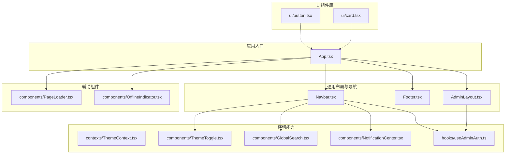
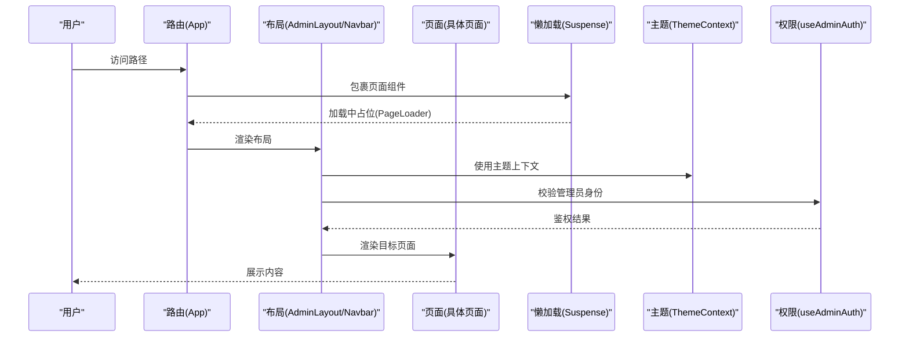
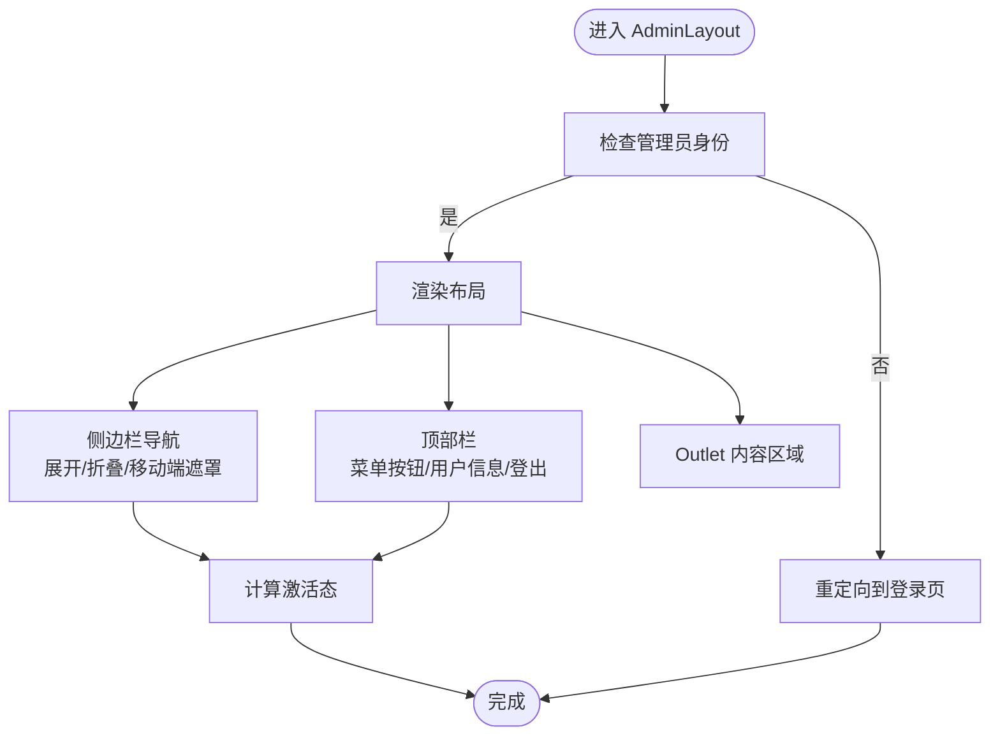
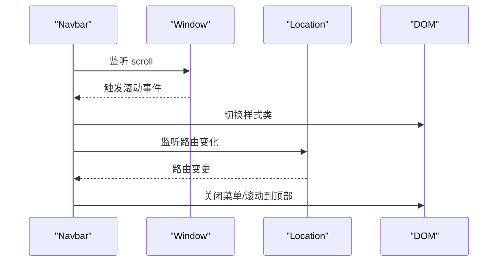
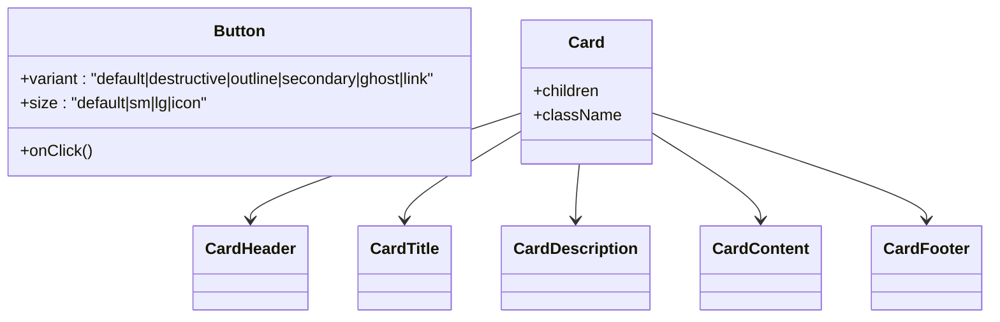
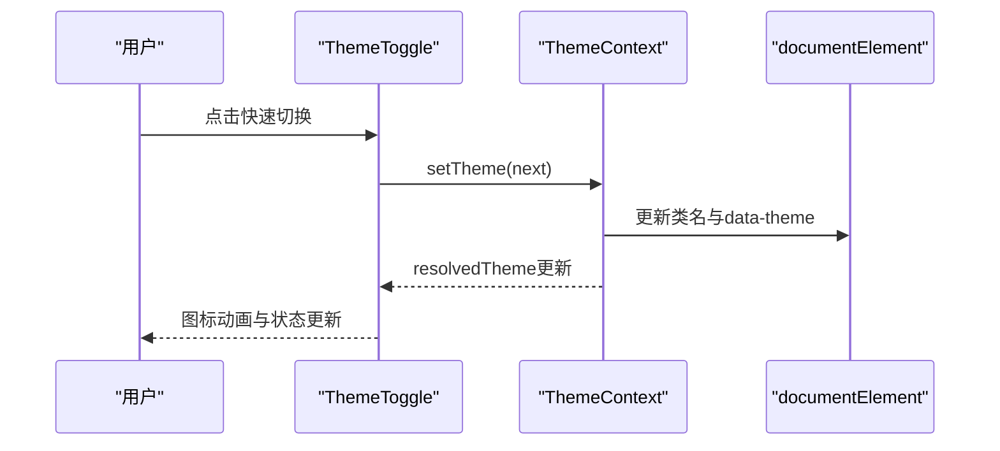
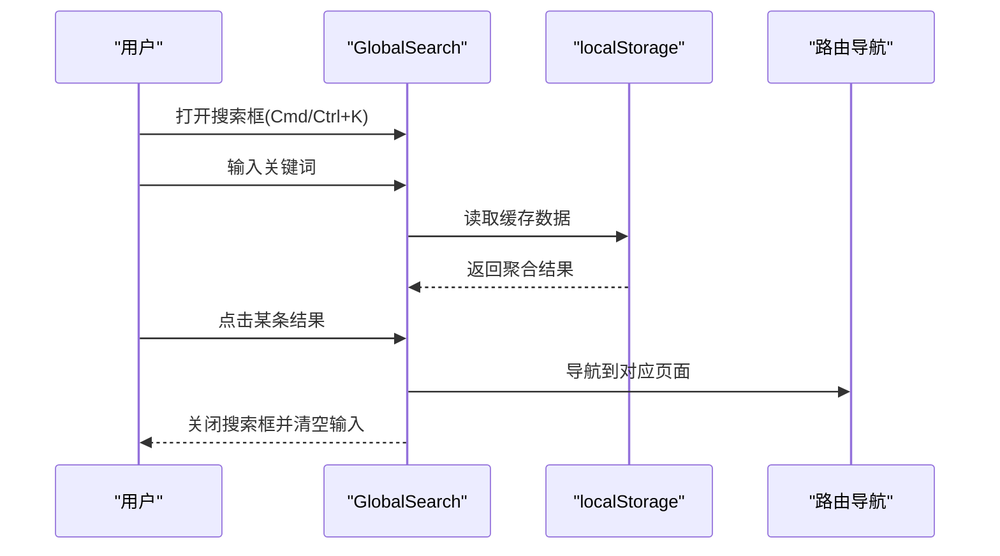
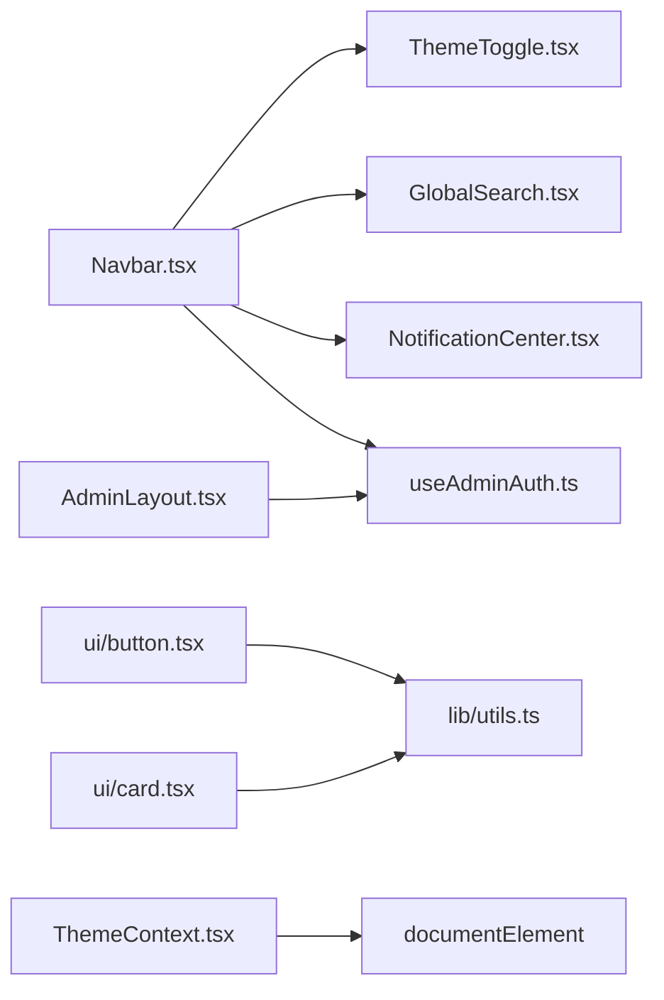

# 组件设计模式

<cite>
**本文引用的文件**
- [src/components/AdminLayout.tsx](file://src/components/AdminLayout.tsx)
- [src/components/Navbar.tsx](file://src/components/Navbar.tsx)
- [src/components/Footer.tsx](file://src/components/Footer.tsx)
- [src/components/ui/button.tsx](file://src/components/ui/button.tsx)
- [src/components/ui/card.tsx](file://src/components/ui/card.tsx)
- [src/hooks/useAdminAuth.ts](file://src/hooks/useAdminAuth.ts)
- [src/contexts/ThemeContext.tsx](file://src/contexts/ThemeContext.tsx)
- [src/components/ThemeToggle.tsx](file://src/components/ThemeToggle.tsx)
- [src/lib/utils.ts](file://src/lib/utils.ts)
- [src/components/GlobalSearch.tsx](file://src/components/GlobalSearch.tsx)
- [src/components/NotificationCenter.tsx](file://src/components/NotificationCenter.tsx)
- [src/components/PageLoader.tsx](file://src/components/PageLoader.tsx)
- [src/components/OfflineIndicator.tsx](file://src/components/OfflineIndicator.tsx)
- [src/App.tsx](file://src/App.tsx)
- [package.json](file://package.json)
</cite>

## 目录
1. [引言](#引言)
2. [项目结构](#项目结构)
3. [核心组件](#核心组件)
4. [架构总览](#架构总览)
5. [详细组件分析](#详细组件分析)
6. [依赖关系分析](#依赖关系分析)
7. [性能考量](#性能考量)
8. [故障排查指南](#故障排查指南)
9. [结论](#结论)
10. [附录](#附录)

## 引言
本文件面向YuleTech社区技术平台的前端组件体系，系统阐述基于函数组件的组件化设计理念与实践。内容覆盖组件分类、命名规范与文件组织、核心布局与导航组件（AdminLayout、Navbar、Footer）的设计模式与复用策略、UI组件库（Button、Card）的设计原则与定制化方案、组件通信与事件处理机制、生命周期管理、性能优化技巧以及可访问性设计。文档同时提供最佳实践、扩展指南与可视化图示，帮助开发者快速理解并高效迭代平台组件。

## 项目结构
项目采用按功能域分层的目录组织方式：顶层应用入口负责路由与骨架拼装；各功能域（社区、学习、开源、Shell）共享通用组件与上下文；核心UI组件集中在统一的ui目录下，便于跨域复用。主题、权限与通知等横切能力通过Context与Hook抽象，降低耦合度。

图表来源
- [src/App.tsx:30-115](file://src/App.tsx#L30-L115)
- [src/components/Navbar.tsx:9-203](file://src/components/Navbar.tsx#L9-L203)
- [src/components/AdminLayout.tsx:28-177](file://src/components/AdminLayout.tsx#L28-L177)
- [src/components/Footer.tsx:30-94](file://src/components/Footer.tsx#L30-L94)
- [src/components/ui/button.tsx:5-48](file://src/components/ui/button.tsx#L5-L48)
- [src/components/ui/card.tsx:4-46](file://src/components/ui/card.tsx#L4-L46)
- [src/contexts/ThemeContext.tsx:41-116](file://src/contexts/ThemeContext.tsx#L41-L116)
- [src/components/ThemeToggle.tsx:11-99](file://src/components/ThemeToggle.tsx#L11-L99)
- [src/components/GlobalSearch.tsx:26-215](file://src/components/GlobalSearch.tsx#L26-L215)
- [src/components/NotificationCenter.tsx:14-102](file://src/components/NotificationCenter.tsx#L14-L102)
- [src/hooks/useAdminAuth.ts:29-66](file://src/hooks/useAdminAuth.ts#L29-L66)
- [src/components/PageLoader.tsx:3-10](file://src/components/PageLoader.tsx#L3-L10)
- [src/components/OfflineIndicator.tsx:4-28](file://src/components/OfflineIndicator.tsx#L4-L28)

章节来源
- [src/App.tsx:30-115](file://src/App.tsx#L30-L115)

## 核心组件
本节聚焦三大骨架组件：AdminLayout（管理后台布局）、Navbar（站点导航）、Footer（底部信息），阐释其职责边界、状态管理与复用策略。

- AdminLayout
  - 职责：提供管理后台的侧边栏导航、顶部栏与内容区域Outlet；内置移动端遮罩与折叠交互；集成管理员鉴权与跳转。
  - 设计要点：使用受控状态控制侧边栏展开/折叠与移动端菜单开关；通过useLocation与isActive计算当前高亮项；结合useAdminAuth在渲染前校验管理员身份。
  - 复用策略：作为路由嵌套容器，承载多个子页面（仪表盘、用户、内容、设置等），统一风格与行为。

- Navbar
  - 职责：提供全站主导航、搜索、通知、主题切换、登录/注册与个人中心入口；支持滚动态样式与移动端抽屉菜单。
  - 设计要点：滚动监听动态调整样式；路由变化时自动关闭菜单并回到顶部；根据isAdmin条件显示管理入口；移动端菜单包含主题切换与常用入口。
  - 复用策略：作为顶层布局的一部分，在公共路由与管理路由中均被复用。

- Footer
  - 职责：展示品牌信息、多列导航链接与版权信息；提供社交图标入口。
  - 设计要点：响应式网格布局；通过对象映射维护链接分组，便于扩展与维护。

章节来源
- [src/components/AdminLayout.tsx:28-177](file://src/components/AdminLayout.tsx#L28-L177)
- [src/components/Navbar.tsx:9-203](file://src/components/Navbar.tsx#L9-L203)
- [src/components/Footer.tsx:30-94](file://src/components/Footer.tsx#L30-L94)

## 架构总览
下图展示了从应用入口到具体页面的数据流与组件协作关系，突出Suspense懒加载、主题上下文注入、权限校验与全局提示等横切关注点。

图表来源
- [src/App.tsx:30-115](file://src/App.tsx#L30-L115)
- [src/components/PageLoader.tsx:3-10](file://src/components/PageLoader.tsx#L3-L10)
- [src/contexts/ThemeContext.tsx:41-116](file://src/contexts/ThemeContext.tsx#L41-L116)
- [src/hooks/useAdminAuth.ts:29-66](file://src/hooks/useAdminAuth.ts#L29-L66)

## 详细组件分析

### AdminLayout 设计与复用
- 状态与交互
  - 侧边栏展开/折叠：通过本地状态控制宽度与图标；移动端以遮罩与平移过渡提升可用性。
  - 导航激活态：根据pathname与查询参数精确匹配，支持带查询参数的导航项。
  - 管理员鉴权：未通过则重定向至登录页，避免无效渲染。
- 结构与样式
  - 使用Tailwind类名组合实现响应式布局与主题变量适配；通过CSS变量与数据属性实现主题切换。
- 复用策略
  - 作为路由嵌套路由容器，统一承载管理后台各子页面，减少重复逻辑。

图表来源
- [src/components/AdminLayout.tsx:28-177](file://src/components/AdminLayout.tsx#L28-L177)
- [src/hooks/useAdminAuth.ts:29-66](file://src/hooks/useAdminAuth.ts#L29-L66)

章节来源
- [src/components/AdminLayout.tsx:28-177](file://src/components/AdminLayout.tsx#L28-L177)
- [src/hooks/useAdminAuth.ts:29-66](file://src/hooks/useAdminAuth.ts#L29-L66)

### Navbar 设计与交互
- 动态样式与滚动行为：根据滚动距离切换背景与阴影，提升阅读体验。
- 移动端菜单：抽屉式菜单，包含主导航、主题切换、个人中心与注册入口。
- 权限入口：当isAdmin为真时显示管理后台入口。
- 事件处理：路由变化时自动关闭菜单并滚动到顶部，保证一致的用户体验。

图表来源
- [src/components/Navbar.tsx:9-203](file://src/components/Navbar.tsx#L9-L203)

章节来源
- [src/components/Navbar.tsx:9-203](file://src/components/Navbar.tsx#L9-L203)

### Footer 设计与可维护性
- 数据驱动：通过对象映射维护分组链接，便于新增/修改导航。
- 响应式网格：两列到六列自适应，确保在小屏设备上的可读性。
- 品牌一致性：统一使用渐变色Logo与强调色，强化品牌识别。

章节来源
- [src/components/Footer.tsx:30-94](file://src/components/Footer.tsx#L30-L94)

### UI组件库：Button 与 Card
- Button
  - 设计原则：基于class-variance-authority定义变体与尺寸，统一语义化样式与交互反馈。
  - 定制化：通过variant与size属性组合，满足不同场景；支持forwardRef与className合并。
- Card
  - 设计原则：模块化结构（Card/CardHeader/CardTitle/CardDescription/CardContent/CardFooter），便于组合与扩展。
  - 定制化：通过forwardRef暴露原生HTML属性，支持className透传与内容区灵活排版。

图表来源
- [src/components/ui/button.tsx:5-48](file://src/components/ui/button.tsx#L5-L48)
- [src/components/ui/card.tsx:4-46](file://src/components/ui/card.tsx#L4-L46)

章节来源
- [src/components/ui/button.tsx:5-48](file://src/components/ui/button.tsx#L5-L48)
- [src/components/ui/card.tsx:4-46](file://src/components/ui/card.tsx#L4-L46)

### 主题系统：ThemeContext 与 ThemeToggle
- ThemeContext
  - 职责：集中管理主题状态（light/dark/system）、解析后的resolvedTheme、持久化存储与系统主题监听。
  - 优化：首次挂载阶段避免闪烁，通过隐藏children与占位Provider实现。
- ThemeToggle
  - 职责：提供快速切换与下拉菜单两种交互；支持点击循环切换与右键打开菜单。
  - 可访问性：为深色模式提供屏幕阅读器标签，增强无障碍体验。

图表来源
- [src/components/ThemeToggle.tsx:11-99](file://src/components/ThemeToggle.tsx#L11-L99)
- [src/contexts/ThemeContext.tsx:41-116](file://src/contexts/ThemeContext.tsx#L41-L116)

章节来源
- [src/contexts/ThemeContext.tsx:41-116](file://src/contexts/ThemeContext.tsx#L41-L116)
- [src/components/ThemeToggle.tsx:11-99](file://src/components/ThemeToggle.tsx#L11-L99)

### 搜索与通知：GlobalSearch 与 NotificationCenter
- GlobalSearch
  - 职责：聚合论坛、问答、博客、活动与代码搜索结果，支持Cmd/Ctrl+K快捷键与Esc关闭。
  - 交互：点击外部区域自动关闭；输入为空时提示引导；结果列表支持类型图标与截断文本。
- NotificationCenter
  - 职责：展示通知列表、未读计数与一键全部已读；点击后标记已读并跳转。
  - 交互：点击外部区域关闭；根据通知类型配置颜色与图标，提升辨识度。

图表来源
- [src/components/GlobalSearch.tsx:26-215](file://src/components/GlobalSearch.tsx#L26-L215)

章节来源
- [src/components/GlobalSearch.tsx:26-215](file://src/components/GlobalSearch.tsx#L26-L215)
- [src/components/NotificationCenter.tsx:14-102](file://src/components/NotificationCenter.tsx#L14-L102)

### 辅助组件：PageLoader 与 OfflineIndicator
- PageLoader：在Suspense占位期间提供加载指示，统一加载态视觉反馈。
- OfflineIndicator：监听在线/离线事件，提供全局离线提示，避免功能异常导致的困惑。

章节来源
- [src/components/PageLoader.tsx:3-10](file://src/components/PageLoader.tsx#L3-L10)
- [src/components/OfflineIndicator.tsx:4-28](file://src/components/OfflineIndicator.tsx#L4-L28)

## 依赖关系分析
- 组件依赖
  - Navbar依赖ThemeToggle、GlobalSearch、NotificationCenter与useAdminAuth。
  - AdminLayout依赖useAdminAuth与路由Outlet。
  - UI组件（Button、Card）依赖工具函数cn进行类名合并。
- 外部依赖
  - class-variance-authority用于Button变体定义；tailwind-merge与clsx用于类名合并；lucide-react提供图标；react-router-dom提供路由能力。

图表来源
- [src/components/Navbar.tsx:9-203](file://src/components/Navbar.tsx#L9-L203)
- [src/components/AdminLayout.tsx:28-177](file://src/components/AdminLayout.tsx#L28-L177)
- [src/components/ui/button.tsx:5-48](file://src/components/ui/button.tsx#L5-L48)
- [src/components/ui/card.tsx:4-46](file://src/components/ui/card.tsx#L4-L46)
- [src/lib/utils.ts:4-6](file://src/lib/utils.ts#L4-L6)
- [src/contexts/ThemeContext.tsx:41-116](file://src/contexts/ThemeContext.tsx#L41-L116)

章节来源
- [package.json:12-26](file://package.json#L12-L26)

## 性能考量
- 懒加载与Suspense
  - 应用入口对所有页面组件使用lazy与Suspense包裹，配合PageLoader提供流畅的加载体验，避免首屏阻塞。
- 事件监听与清理
  - Navbar与各弹出式组件（搜索、通知、主题）均在卸载时清理事件监听，防止内存泄漏。
- 本地存储与缓存
  - GlobalSearch与useAdminAuth使用localStorage进行轻量持久化，减少网络请求与重复计算。
- 类名合并
  - 通过cn函数合并Tailwind类，避免冗余样式与重复覆盖，提升渲染效率。
- 主题切换防闪烁
  - ThemeContext在挂载阶段通过占位Provider与隐藏children避免主题闪烁。

章节来源
- [src/App.tsx:30-115](file://src/App.tsx#L30-L115)
- [src/components/Navbar.tsx:9-203](file://src/components/Navbar.tsx#L9-L203)
- [src/components/GlobalSearch.tsx:26-215](file://src/components/GlobalSearch.tsx#L26-L215)
- [src/hooks/useAdminAuth.ts:29-66](file://src/hooks/useAdminAuth.ts#L29-L66)
- [src/lib/utils.ts:4-6](file://src/lib/utils.ts#L4-L6)
- [src/contexts/ThemeContext.tsx:41-116](file://src/contexts/ThemeContext.tsx#L41-L116)

## 故障排查指南
- 管理后台无法进入
  - 检查useAdminAuth是否返回isAdmin为true；确认登录流程与localStorage存储是否正常；观察AdminLayout是否触发重定向。
- 主题切换无效或闪烁
  - 确认ThemeContext已正确包裹应用根节点；检查documentElement类名与data-theme是否更新；验证系统主题监听是否生效。
- 搜索无结果或卡顿
  - 检查localStorage中相关键值是否存在；确认聚合数据是否正确读取；优化搜索词长度阈值与结果数量。
- 通知不显示或未读计数异常
  - 检查通知数据结构与类型配置；确认点击事件是否调用标记已读；验证路由跳转逻辑。
- 离线提示不出现
  - 检查window online/offline事件绑定与清理；确认组件渲染层级高于页面内容。

章节来源
- [src/hooks/useAdminAuth.ts:29-66](file://src/hooks/useAdminAuth.ts#L29-L66)
- [src/contexts/ThemeContext.tsx:41-116](file://src/contexts/ThemeContext.tsx#L41-L116)
- [src/components/GlobalSearch.tsx:26-215](file://src/components/GlobalSearch.tsx#L26-L215)
- [src/components/NotificationCenter.tsx:14-102](file://src/components/NotificationCenter.tsx#L14-L102)
- [src/components/OfflineIndicator.tsx:4-28](file://src/components/OfflineIndicator.tsx#L4-L28)

## 结论
本设计以函数组件为核心，围绕布局、导航、主题、搜索与通知等横切能力构建了高内聚、低耦合的组件体系。通过Context与Hook抽象权限与主题，利用Suspense与懒加载优化性能，借助UI组件库实现一致的视觉与交互体验。建议在后续迭代中持续完善可访问性、测试覆盖与文档化，确保组件的长期可维护性与扩展性。

## 附录
- 组件分类与命名规范
  - 布局与导航：AdminLayout、Navbar、Footer
  - UI基础：Button、Card及其子结构
  - 横切能力：ThemeContext、ThemeToggle、GlobalSearch、NotificationCenter
  - 辅助：PageLoader、OfflineIndicator
- Props传递策略
  - 通过路由参数与查询参数传递页面状态；通过Context向子组件注入主题与权限状态；通过className与forwardRef实现样式与行为的透传。
- 事件处理机制
  - 使用useEffect绑定/解绑事件；通过useCallback稳定回调；在弹出式组件中统一处理点击外部关闭逻辑。
- 生命周期管理
  - 在组件卸载时清理事件监听与定时器；在ThemeContext中处理挂载阶段的闪烁问题。
- 可访问性设计
  - 为主题切换提供aria-label与屏幕阅读器标签；为图标提供title或sr-only说明；保持键盘可达性与焦点可见性。
- 最佳实践与扩展指南
  - 将样式与逻辑分离，优先使用Tailwind原子类与CVA；通过forwardRef与className合并提升可定制性；为复杂组件拆分子组件并明确职责边界；为每个页面组件提供加载占位与错误兜底。