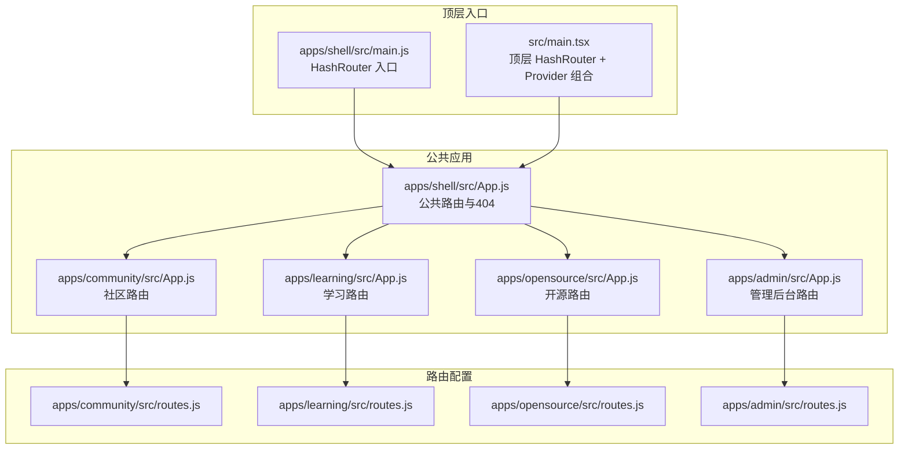
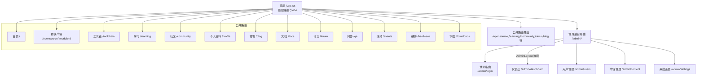
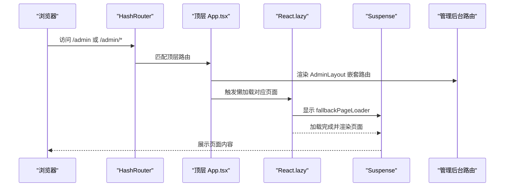
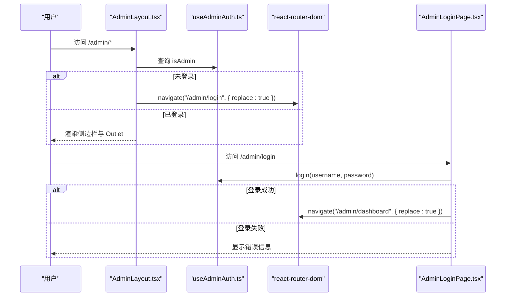
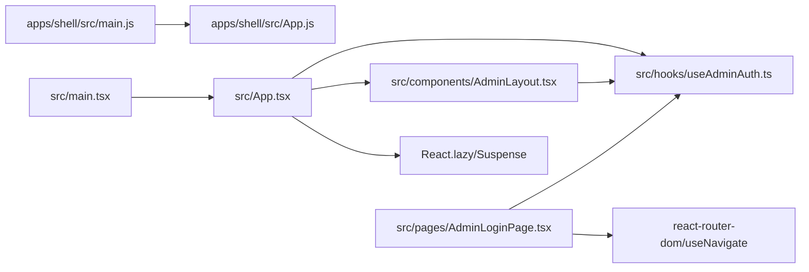

# 路由系统架构

<cite>
**本文档引用的文件**
- [apps/shell/src/main.js](file://apps/shell/src/main.js)
- [src/main.tsx](file://src/main.tsx)
- [apps/shell/src/App.js](file://apps/shell/src/App.js)
- [src/App.tsx](file://src/App.tsx)
- [apps/admin/src/routes.js](file://apps/admin/src/routes.js)
- [apps/community/src/routes.js](file://apps/community/src/routes.js)
- [apps/learning/src/routes.js](file://apps/learning/src/routes.js)
- [apps/opensource/src/routes.js](file://apps/opensource/src/routes.js)
- [apps/admin/src/App.js](file://apps/admin/src/App.js)
- [apps/community/src/App.js](file://apps/community/src/App.js)
- [apps/learning/src/App.js](file://apps/learning/src/App.js)
- [apps/opensource/src/App.js](file://apps/opensource/src/App.js)
- [src/components/AdminLayout.tsx](file://src/components/AdminLayout.tsx)
- [apps/shell/src/components/AdminLayout.js](file://apps/shell/src/components/AdminLayout.js)
- [src/hooks/useAdminAuth.ts](file://src/hooks/useAdminAuth.ts)
- [apps/shell/src/hooks/useAdminAuth.js](file://apps/shell/src/hooks/useAdminAuth.js)
- [src/pages/AdminLoginPage.tsx](file://src/pages/AdminLoginPage.tsx)
- [apps/admin/src/pages/AdminLoginPage.js](file://apps/admin/src/pages/AdminLoginPage.js)
</cite>

## 目录
1. [引言](#引言)
2. [项目结构](#项目结构)
3. [核心组件](#核心组件)
4. [架构总览](#架构总览)
5. [详细组件分析](#详细组件分析)
6. [依赖关系分析](#依赖关系分析)
7. [性能考虑](#性能考虑)
8. [故障排除指南](#故障排除指南)
9. [结论](#结论)
10. [附录](#附录)

## 引言
本文件系统性梳理 YuleTech 社区技术平台的路由体系，围绕 React Router DOM 7.14.2 的版本特性与实际实现，阐述以下主题：
- 嵌套路由结构与模块化组织
- 路由守卫机制与权限控制
- 代码分割与 Suspense 懒加载策略
- 管理后台路由与公共页面路由的分离设计
- 动态路由参数处理、404 页面与重定向机制
- 导航状态管理与性能优化
- 最佳实践、常见问题与扩展指南

## 项目结构
平台采用多应用（apps）分层组织，每个子应用独立维护其路由配置，并通过顶层 Shell 应用统一挂载与渲染。顶层入口使用 HashRouter 提供无后端依赖的前端路由能力。

图表来源
- [apps/shell/src/main.js:1-8](file://apps/shell/src/main.js#L1-L8)
- [src/main.tsx:1-23](file://src/main.tsx#L1-L23)
- [apps/shell/src/App.js:1-30](file://apps/shell/src/App.js#L1-L30)
- [apps/community/src/App.js:1-8](file://apps/community/src/App.js#L1-L8)
- [apps/learning/src/App.js:1-8](file://apps/learning/src/App.js#L1-L8)
- [apps/opensource/src/App.js:1-8](file://apps/opensource/src/App.js#L1-L8)
- [apps/admin/src/App.js:1-8](file://apps/admin/src/App.js#L1-L8)
- [apps/community/src/routes.js:1-41](file://apps/community/src/routes.js#L1-L41)
- [apps/learning/src/routes.js:1-32](file://apps/learning/src/routes.js#L1-L32)
- [apps/opensource/src/routes.js:1-23](file://apps/opensource/src/routes.js#L1-L23)
- [apps/admin/src/routes.js:1-15](file://apps/admin/src/routes.js#L1-L15)

章节来源
- [apps/shell/src/main.js:1-8](file://apps/shell/src/main.js#L1-L8)
- [src/main.tsx:1-23](file://src/main.tsx#L1-L23)
- [apps/shell/src/App.js:1-30](file://apps/shell/src/App.js#L1-L30)

## 核心组件
- HashRouter 入口：顶层通过 HashRouter 提供前端路由能力，支持静态部署与无需后端配置。
- 公共路由与嵌套路由：顶层 App 统一注册公共路由与管理后台嵌套路由，其中管理后台通过 AdminLayout 实现嵌套视图与权限守卫。
- 代码分割与懒加载：顶层 App 使用 React.lazy 与 Suspense 对页面进行按需加载，提升首屏性能。
- 路由守卫与权限控制：通过 useAdminAuth 钩子与 AdminLayout 的导航逻辑，实现管理后台访问控制与自动重定向。
- 404 与重定向：顶层 App 定义通配路由与返回首页链接，提供一致的错误体验。

章节来源
- [src/App.tsx:1-118](file://src/App.tsx#L1-L118)
- [src/components/AdminLayout.tsx:1-178](file://src/components/AdminLayout.tsx#L1-L178)
- [src/hooks/useAdminAuth.ts:1-67](file://src/hooks/useAdminAuth.ts#L1-L67)

## 架构总览
下图展示顶层路由与各子应用路由的关系，以及管理后台的嵌套路由与权限守卫流程。

图表来源
- [src/App.tsx:30-115](file://src/App.tsx#L30-L115)
- [apps/admin/src/routes.js:7-13](file://apps/admin/src/routes.js#L7-L13)
- [apps/community/src/routes.js:6-39](file://apps/community/src/routes.js#L6-L39)
- [apps/learning/src/routes.js:5-31](file://apps/learning/src/routes.js#L5-L31)
- [apps/opensource/src/routes.js:4-22](file://apps/opensource/src/routes.js#L4-L22)

## 详细组件分析

### 顶层路由与代码分割
- 顶层 App.tsx 将所有页面组件通过 React.lazy 进行延迟加载，并在 Suspense 中包裹，确保首次渲染时仅加载必要资源。
- 管理后台路由采用嵌套路由，父级路径为 /admin，子路由包含 dashboard、users、content、settings 等；登录页单独处理并置于顶层路由中。
- 顶层定义通配路由，匹配所有未命中路径，渲染 404 页面并提供返回首页链接。

图表来源
- [src/App.tsx:35-70](file://src/App.tsx#L35-L70)
- [src/App.tsx:78-106](file://src/App.tsx#L78-L106)

章节来源
- [src/App.tsx:1-118](file://src/App.tsx#L1-L118)

### 管理后台路由与权限守卫
- 权限钩子 useAdminAuth.ts 提供登录状态判断、登录与登出方法，并内置会话有效期校验。
- AdminLayout.tsx 在每次渲染时检查管理员状态，若未登录则自动跳转至 /admin/login。
- 登录页 AdminLoginPage.tsx 在已登录状态下直接跳转到 /admin/dashboard，并提供表单校验与错误提示。

图表来源
- [src/components/AdminLayout.tsx:28-43](file://src/components/AdminLayout.tsx#L28-L43)
- [src/hooks/useAdminAuth.ts:29-66](file://src/hooks/useAdminAuth.ts#L29-L66)
- [src/pages/AdminLoginPage.tsx:6-19](file://src/pages/AdminLoginPage.tsx#L6-L19)
- [src/pages/AdminLoginPage.tsx:21-38](file://src/pages/AdminLoginPage.tsx#L21-L38)

章节来源
- [src/components/AdminLayout.tsx:1-178](file://src/components/AdminLayout.tsx#L1-L178)
- [src/hooks/useAdminAuth.ts:1-67](file://src/hooks/useAdminAuth.ts#L1-L67)
- [src/pages/AdminLoginPage.tsx:1-120](file://src/pages/AdminLoginPage.tsx#L1-L120)

### 公共页面路由与嵌套结构
- 各子应用（community、learning、opensource）各自维护独立的路由数组，支持通配符匹配以覆盖子路径。
- 顶层 App.tsx 将这些路由整合到公共路由集合中，形成统一的导航与渲染入口。
- 顶层 App.js（Shell 应用）同样提供公共路由与 404 处理，但本仓库以 src/App.tsx 为主入口，Shell 版本用于兼容或早期版本。

章节来源
- [apps/community/src/routes.js:1-41](file://apps/community/src/routes.js#L1-L41)
- [apps/learning/src/routes.js:1-32](file://apps/learning/src/routes.js#L1-L32)
- [apps/opensource/src/routes.js:1-23](file://apps/opensource/src/routes.js#L1-L23)
- [apps/shell/src/App.js:1-30](file://apps/shell/src/App.js#L1-L30)

### 动态路由参数与通配符
- 顶层 App.tsx 定义了带参数的路由，如 /opensource/:moduleId，用于模块详情页等场景。
- 通配符路由（*）用于兜底所有未匹配路径，统一渲染 404 页面并提供返回首页链接，保证用户体验一致性。

章节来源
- [src/App.tsx:82-104](file://src/App.tsx#L82-L104)

### 重定向机制
- 管理后台未登录时，AdminLayout.tsx 通过 navigate 自动重定向至 /admin/login。
- 登录成功后，AdminLoginPage.tsx 重定向至 /admin/dashboard。
- 顶层 App.tsx 的通配符路由提供返回首页的链接，便于用户快速回到主页面。

章节来源
- [src/components/AdminLayout.tsx:35-39](file://src/components/AdminLayout.tsx#L35-L39)
- [src/pages/AdminLoginPage.tsx:15-19](file://src/pages/AdminLoginPage.tsx#L15-L19)
- [src/pages/AdminLoginPage.tsx:31-34](file://src/pages/AdminLoginPage.tsx#L31-L34)
- [src/App.tsx:94-104](file://src/App.tsx#L94-L104)

## 依赖关系分析
- 入口依赖：apps/shell/src/main.js 与 src/main.tsx 均引入 HashRouter 并挂载 App。
- 路由依赖：各子应用的 App.js 依赖其 routes.js；顶层 App.tsx 依赖 AdminLayout.tsx 与 useAdminAuth.ts。
- 权限依赖：AdminLayout.tsx 依赖 useAdminAuth.ts；AdminLoginPage.tsx 依赖 useAdminAuth.ts 与 react-router-dom 的 useNavigate。
- 代码分割依赖：顶层 App.tsx 通过 React.lazy 与 Suspense 实现按需加载。

图表来源
- [apps/shell/src/main.js:1-8](file://apps/shell/src/main.js#L1-L8)
- [src/main.tsx:1-23](file://src/main.tsx#L1-L23)
- [apps/shell/src/App.js:1-30](file://apps/shell/src/App.js#L1-L30)
- [src/App.tsx:1-118](file://src/App.tsx#L1-L118)
- [src/components/AdminLayout.tsx:1-178](file://src/components/AdminLayout.tsx#L1-L178)
- [src/hooks/useAdminAuth.ts:1-67](file://src/hooks/useAdminAuth.ts#L1-L67)
- [src/pages/AdminLoginPage.tsx:1-120](file://src/pages/AdminLoginPage.tsx#L1-L120)

章节来源
- [apps/shell/src/main.js:1-8](file://apps/shell/src/main.js#L1-L8)
- [src/main.tsx:1-23](file://src/main.tsx#L1-L23)
- [src/App.tsx:1-118](file://src/App.tsx#L1-L118)

## 性能考虑
- 代码分割：通过 React.lazy 与 Suspense 对页面进行按需加载，减少初始包体积，提升首屏渲染速度。
- Suspense 回退：在懒加载期间显示 PageLoader，改善用户感知，避免空白等待。
- 嵌套路由：管理后台采用嵌套路由，避免重复渲染父级布局，降低不必要的计算开销。
- 会话清理：useAdminAuth.ts 内置会话有效期检查与定期清理，防止无效状态占用内存。

章节来源
- [src/App.tsx:10-28](file://src/App.tsx#L10-L28)
- [src/App.tsx:36-49](file://src/App.tsx#L36-L49)
- [src/hooks/useAdminAuth.ts:23-48](file://src/hooks/useAdminAuth.ts#L23-L48)

## 故障排除指南
- 管理后台无法访问
  - 检查本地存储中是否存在有效的管理员会话标识。
  - 若会话过期，AdminLayout.tsx 会自动重定向至登录页。
  - 参考：[src/components/AdminLayout.tsx:35-39](file://src/components/AdminLayout.tsx#L35-L39)，[src/hooks/useAdminAuth.ts:23-27](file://src/hooks/useAdminAuth.ts#L23-L27)
- 登录失败或页面不跳转
  - 确认用户名与密码是否符合预期，登录成功后应重定向至 /admin/dashboard。
  - 参考：[src/pages/AdminLoginPage.tsx:21-38](file://src/pages/AdminLoginPage.tsx#L21-L38)
- 404 页面出现空白或无返回链接
  - 检查顶层 App.tsx 的通配符路由与返回链接逻辑。
  - 参考：[src/App.tsx:94-104](file://src/App.tsx#L94-L104)
- 首屏加载缓慢
  - 确认 Suspense 回退组件是否正常显示，检查懒加载模块是否正确拆分。
  - 参考：[src/App.tsx:36-49](file://src/App.tsx#L36-L49)

章节来源
- [src/components/AdminLayout.tsx:35-39](file://src/components/AdminLayout.tsx#L35-L39)
- [src/pages/AdminLoginPage.tsx:21-38](file://src/pages/AdminLoginPage.tsx#L21-L38)
- [src/App.tsx:94-104](file://src/App.tsx#L94-L104)
- [src/App.tsx:36-49](file://src/App.tsx#L36-L49)

## 结论
本路由系统以 HashRouter 为基础，结合 React.lazy 与 Suspense 实现高效的代码分割与懒加载；通过 AdminLayout 与 useAdminAuth 提供完善的权限守卫与导航控制；顶层 App.tsx 将公共与管理后台路由统一组织，既满足功能需求又兼顾性能与可维护性。建议在后续迭代中持续优化懒加载边界、完善错误边界与日志埋点，以进一步提升用户体验与可观测性。

## 附录
- 最佳实践
  - 将高频访问页面与低频页面分离，合理划分懒加载模块。
  - 在嵌套路由中复用布局组件，减少重复渲染。
  - 使用通配符路由统一处理 404，提供明确的返回路径。
- 扩展指南
  - 新增页面时优先采用 React.lazy 与 Suspense 包裹。
  - 管理后台新增菜单项时，同步更新 AdminLayout 的导航列表与权限判断。
  - 公共路由新增模块时，遵循现有命名规范与通配符策略。