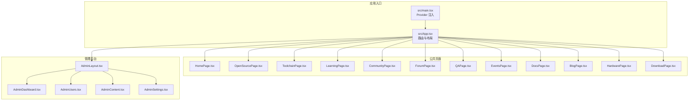
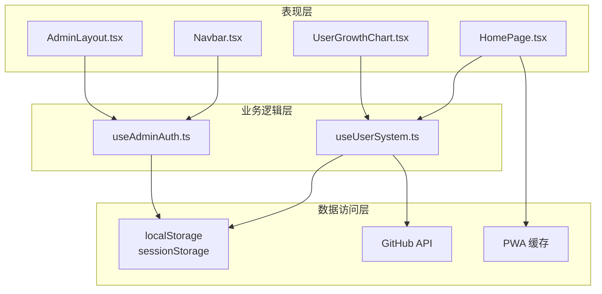
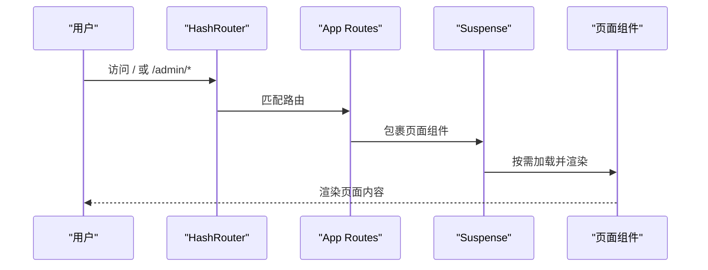
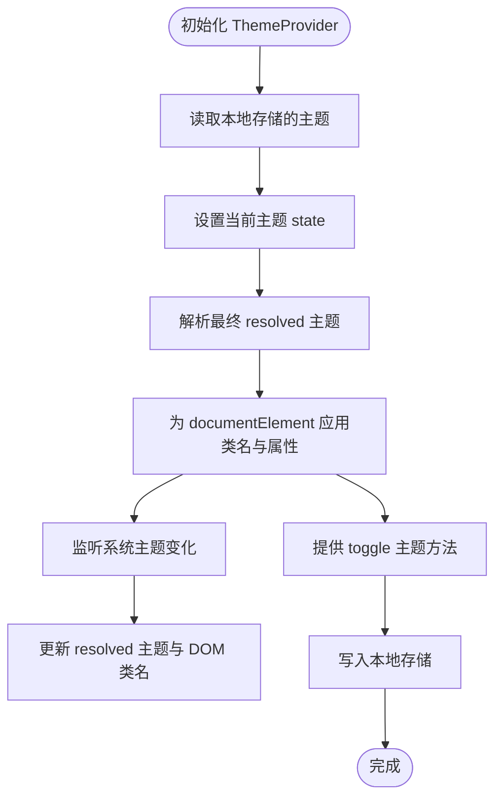
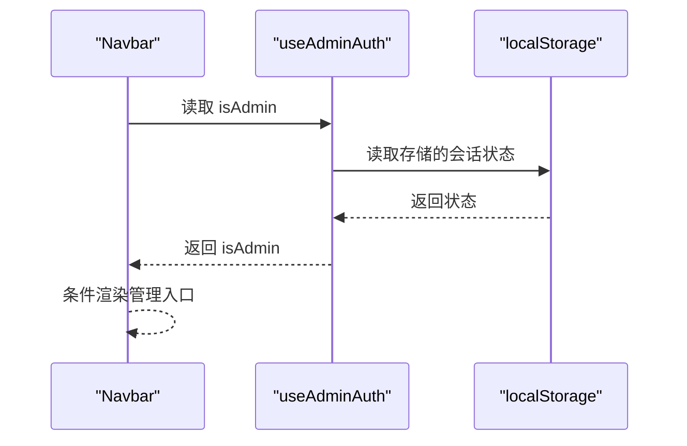
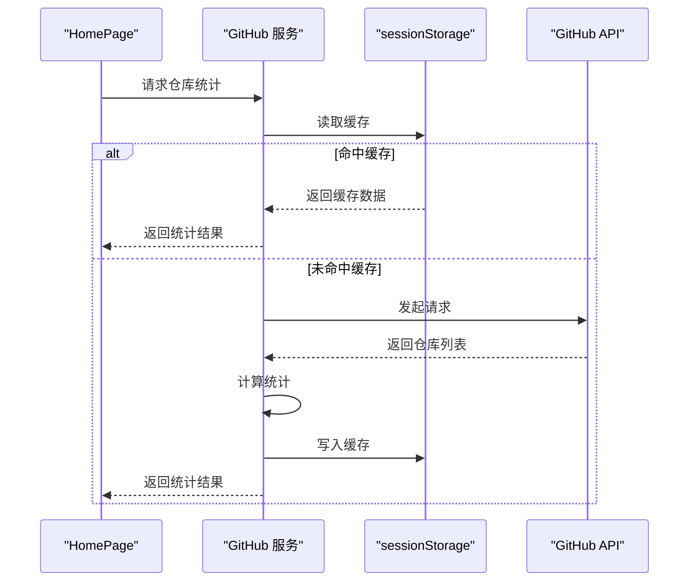
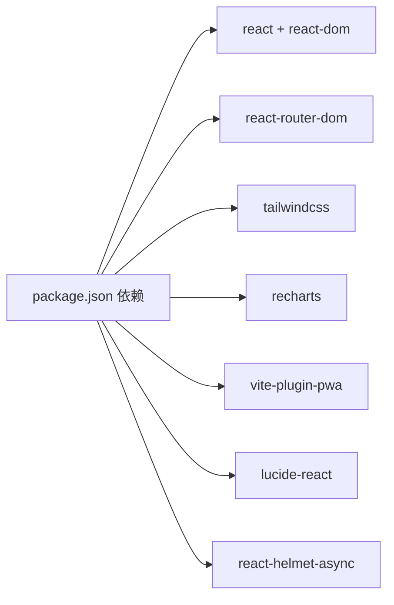

# 项目架构

<cite>
**本文引用的文件**
- [package.json](file://package.json)
- [README.md](file://README.md)
- [vite.config.ts](file://vite.config.ts)
- [tailwind.config.ts](file://tailwind.config.ts)
- [src/main.tsx](file://src/main.tsx)
- [src/App.tsx](file://src/App.tsx)
- [src/contexts/ThemeContext.tsx](file://src/contexts/ThemeContext.tsx)
- [src/components/Navbar.tsx](file://src/components/Navbar.tsx)
- [src/components/AdminLayout.tsx](file://src/components/AdminLayout.tsx)
- [src/hooks/useUserSystem.ts](file://src/hooks/useUserSystem.ts)
- [src/hooks/useAdminAuth.ts](file://src/hooks/useAdminAuth.ts)
- [src/services/github.ts](file://src/services/github.ts)
- [src/pages/HomePage.tsx](file://src/pages/HomePage.tsx)
- [src/data/communityData.ts](file://src/data/communityData.ts)
- [src/components/admin/UserGrowthChart.tsx](file://src/components/admin/UserGrowthChart.tsx)
</cite>

## 目录
1. [引言](#引言)
2. [项目结构](#项目结构)
3. [核心组件](#核心组件)
4. [架构总览](#架构总览)
5. [详细组件分析](#详细组件分析)
6. [依赖关系分析](#依赖关系分析)
7. [性能考虑](#性能考虑)
8. [故障排查指南](#故障排查指南)
9. [结论](#结论)
10. [附录](#附录)

## 引言
本架构文档面向 YuleTech 社区技术平台，系统阐述前端架构设计、组件化理念、模块化组织、路由与状态管理、组件通信机制，以及技术选型与性能优化策略。文档旨在帮助开发者快速理解系统整体设计，并为后续扩展提供清晰的参考。

## 项目结构
项目采用多页面单页应用（MPA + SPA）混合架构：根级入口通过 HashRouter 提供 SPA 能力；公共页面与管理后台分别以独立路由树组织，形成清晰的功能边界与模块化结构。

- 应用入口与全局上下文
  - 入口文件负责注入 Provider（主题、路由、SEO），并挂载根组件。
- 页面与路由
  - 公共路由与管理路由分离，支持按需懒加载与骨架屏占位。
- 组件与服务
  - 组件按功能域拆分，服务封装外部数据访问与缓存策略。
- 构建与样式
  - Vite 提供开发与生产构建，Tailwind CSS 提供原子化样式与暗色模式支持。

**图表来源**
- [src/main.tsx:1-23](file://src/main.tsx#L1-L23)
- [src/App.tsx:30-115](file://src/App.tsx#L30-L115)
- [src/components/AdminLayout.tsx:28-177](file://src/components/AdminLayout.tsx#L28-L177)

**章节来源**
- [README.md:20-46](file://README.md#L20-L46)
- [src/main.tsx:1-23](file://src/main.tsx#L1-L23)
- [src/App.tsx:30-115](file://src/App.tsx#L30-L115)

## 核心组件
- 主题上下文（ThemeContext）
  - 支持 light/dark/system 三种主题，持久化存储与系统偏好联动，避免首次渲染闪烁。
- 导航栏（Navbar）
  - 响应式导航、滚动阴影、移动端抽屉菜单、搜索与通知入口、管理员入口。
- 管理后台布局（AdminLayout）
  - 侧边栏折叠/展开、移动端遮罩、子路由 Outlet 渲染、登出流程。
- 用户体系钩子（useUserSystem）
  - 积分规则与等级阈值可配置，本地持久化，提供增减积分与历史记录。
- 管理员鉴权钩子（useAdminAuth）
  - 本地存储会话状态，定时校验有效性，提供登录/登出。
- GitHub 服务（github.ts）
  - 缓存策略（sessionStorage + TTL），聚合仓库统计信息。
- 页面组件（如 HomePage）
  - 页面级状态与特性开关（极简模式），集成 SEO 与模块化区块。

**章节来源**
- [src/contexts/ThemeContext.tsx:41-124](file://src/contexts/ThemeContext.tsx#L41-L124)
- [src/components/Navbar.tsx:9-203](file://src/components/Navbar.tsx#L9-L203)
- [src/components/AdminLayout.tsx:28-177](file://src/components/AdminLayout.tsx#L28-L177)
- [src/hooks/useUserSystem.ts:91-132](file://src/hooks/useUserSystem.ts#L91-L132)
- [src/hooks/useAdminAuth.ts:29-66](file://src/hooks/useAdminAuth.ts#L29-L66)
- [src/services/github.ts:52-80](file://src/services/github.ts#L52-L80)
- [src/pages/HomePage.tsx:15-87](file://src/pages/HomePage.tsx#L15-L87)

## 架构总览
系统采用“入口 Provider + 路由分层 + 组件域划分”的三层架构：

- 表现层（Presentation Layer）
  - 页面组件负责视图与交互，使用 Tailwind 原子类与主题上下文控制外观。
- 业务逻辑层（Business Logic Layer）
  - 钩子与服务封装业务规则：用户积分、管理员鉴权、GitHub 数据访问。
- 数据访问层（Data Access Layer）
  - 本地存储（localStorage/sessionStorage）、第三方 API（GitHub）与构建期缓存（PWA）。

**图表来源**
- [src/components/Navbar.tsx:9-203](file://src/components/Navbar.tsx#L9-L203)
- [src/components/AdminLayout.tsx:28-177](file://src/components/AdminLayout.tsx#L28-L177)
- [src/pages/HomePage.tsx:15-87](file://src/pages/HomePage.tsx#L15-L87)
- [src/components/admin/UserGrowthChart.tsx:23-67](file://src/components/admin/UserGrowthChart.tsx#L23-L67)
- [src/hooks/useUserSystem.ts:91-132](file://src/hooks/useUserSystem.ts#L91-L132)
- [src/hooks/useAdminAuth.ts:29-66](file://src/hooks/useAdminAuth.ts#L29-L66)
- [src/services/github.ts:52-80](file://src/services/github.ts#L52-L80)
- [vite.config.ts:10-24](file://vite.config.ts#L10-L24)

## 详细组件分析

### 路由系统与页面组织
- 路由结构
  - 管理后台路由嵌套在 AdminLayout 下，支持多级子路由与查询参数。
  - 公共路由覆盖首页、开源、工具链、学习、社区、问答、活动、文档、博客、硬件、下载等。
- 懒加载与骨架
  - 使用 React.lazy 与 Suspense 提供按需加载与骨架屏占位，提升首屏体验。
- 404 降级
  - 通配符路由返回简洁的 404 页面，引导返回首页。

**图表来源**
- [src/App.tsx:30-115](file://src/App.tsx#L30-L115)
- [src/main.tsx:3-19](file://src/main.tsx#L3-L19)

**章节来源**
- [src/App.tsx:30-115](file://src/App.tsx#L30-L115)

### 主题与外观系统
- 主题上下文
  - 支持从系统偏好读取、本地存储持久化、切换主题与响应系统变化。
  - 首次渲染阶段隐藏内容，避免主题闪烁。
- 样式与设计系统
  - Tailwind CSS 与原子化类名，配合 CSS 变量与暗色模式类名切换。

**图表来源**
- [src/contexts/ThemeContext.tsx:41-124](file://src/contexts/ThemeContext.tsx#L41-L124)

**章节来源**
- [src/contexts/ThemeContext.tsx:41-124](file://src/contexts/ThemeContext.tsx#L41-L124)
- [tailwind.config.ts:1-79](file://tailwind.config.ts#L1-L79)

### 状态管理与组件通信
- 本地状态与持久化
  - useUserSystem：积分与等级计算、历史记录、本地持久化。
  - useAdminAuth：管理员登录状态、会话有效期、定时校验。
- 组件间通信
  - Navbar 通过 useAdminAuth 决定是否显示管理入口。
  - AdminLayout 通过 useAdminAuth 控制访问与登出。
  - HomePage 通过本地存储控制“极简模式”开关。

**图表来源**
- [src/components/Navbar.tsx:13](file://src/components/Navbar.tsx#L13)
- [src/hooks/useAdminAuth.ts:29-66](file://src/hooks/useAdminAuth.ts#L29-L66)

**章节来源**
- [src/hooks/useUserSystem.ts:91-132](file://src/hooks/useUserSystem.ts#L91-L132)
- [src/hooks/useAdminAuth.ts:29-66](file://src/hooks/useAdminAuth.ts#L29-L66)
- [src/components/Navbar.tsx:9-203](file://src/components/Navbar.tsx#L9-L203)
- [src/components/AdminLayout.tsx:28-177](file://src/components/AdminLayout.tsx#L28-L177)

### 数据流与外部集成
- GitHub 数据
  - 通过缓存键与 TTL 避免频繁请求，聚合仓库总数、星标数、派生数与列表。
- 页面级数据
  - 社区数据模型（论坛、问答、活动）用于演示与填充页面内容。
- 图表组件
  - 基于 Recharts 的用户增长曲线，从本地历史推导日新增用户并累计。

**图表来源**
- [src/pages/HomePage.tsx:15-87](file://src/pages/HomePage.tsx#L15-L87)
- [src/services/github.ts:52-80](file://src/services/github.ts#L52-L80)

**章节来源**
- [src/services/github.ts:52-80](file://src/services/github.ts#L52-L80)
- [src/data/communityData.ts:72-371](file://src/data/communityData.ts#L72-L371)
- [src/components/admin/UserGrowthChart.tsx:23-67](file://src/components/admin/UserGrowthChart.tsx#L23-L67)

## 依赖关系分析
- 技术栈与职责
  - React 19 + TypeScript：类型安全与现代 Hooks。
  - Vite 7：快速开发与高效构建。
  - Tailwind CSS + shadcn/ui：原子化样式与可复用 UI 组件。
  - Recharts：数据可视化。
  - PWA：离线能力与缓存策略。
- 关键依赖
  - react-router-dom：路由与导航。
  - lucide-react：图标库。
  - react-helmet-async：SEO 标签管理。

**图表来源**
- [package.json:12-26](file://package.json#L12-L26)

**章节来源**
- [package.json:12-26](file://package.json#L12-L26)
- [README.md:11-19](file://README.md#L11-L19)

## 性能考虑
- 按需加载与骨架屏
  - 路由级懒加载与 Suspense 占位，降低首屏阻塞。
- 缓存策略
  - GitHub 数据使用 sessionStorage + TTL，减少网络开销。
  - PWA 自动注册与缓存配置，加速静态资源加载。
- 样式与构建
  - Tailwind 原子类减少样式体积，Vite 快速打包与热更新。
- 本地存储
  - 用户积分与管理员会话本地持久化，减少重复计算与网络请求。

**章节来源**
- [src/App.tsx:30-115](file://src/App.tsx#L30-L115)
- [src/services/github.ts:28-50](file://src/services/github.ts#L28-L50)
- [vite.config.ts:10-24](file://vite.config.ts#L10-L24)
- [src/hooks/useUserSystem.ts:91-132](file://src/hooks/useUserSystem.ts#L91-L132)
- [src/hooks/useAdminAuth.ts:29-66](file://src/hooks/useAdminAuth.ts#L29-L66)

## 故障排查指南
- 主题闪烁
  - 确认 ThemeProvider 在入口处包裹，且 mounted 初始状态处理正确。
- 路由跳转异常
  - 检查 HashRouter 配置与路由层级，确认懒加载组件导出默认模块。
- 管理后台无权限
  - 校验本地存储会话是否过期，确认定时校验逻辑生效。
- GitHub 数据不更新
  - 清除 sessionStorage 缓存键或等待 TTL 过期后重试。
- PWA 缓存问题
  - 检查 workbox 配置与缓存策略，必要时强制刷新或清理缓存。

**章节来源**
- [src/contexts/ThemeContext.tsx:95-109](file://src/contexts/ThemeContext.tsx#L95-L109)
- [src/App.tsx:30-115](file://src/App.tsx#L30-L115)
- [src/hooks/useAdminAuth.ts:35-48](file://src/hooks/useAdminAuth.ts#L35-L48)
- [src/services/github.ts:28-50](file://src/services/github.ts#L28-L50)
- [vite.config.ts:10-24](file://vite.config.ts#L10-L24)

## 结论
本项目以 React + TypeScript 为核心，结合 Vite、Tailwind CSS、Recharts 与 PWA，构建了具备良好可维护性与扩展性的前端架构。通过路由分层、组件域划分、本地状态与外部服务的清晰边界，以及缓存与懒加载策略，系统在性能与开发体验之间取得平衡。未来可在服务端渲染（SSR）、国际化（i18n）与可观测性（日志/埋点）等方面进一步演进。

## 附录
- 构建与预览命令
  - 开发：npm run dev
  - 生产构建：npm run build
  - 预览：npm run preview
- 路由别名
  - @ 指向 src 目录，便于导入与维护。

**章节来源**
- [README.md:68-82](file://README.md#L68-L82)
- [vite.config.ts:26-31](file://vite.config.ts#L26-L31)