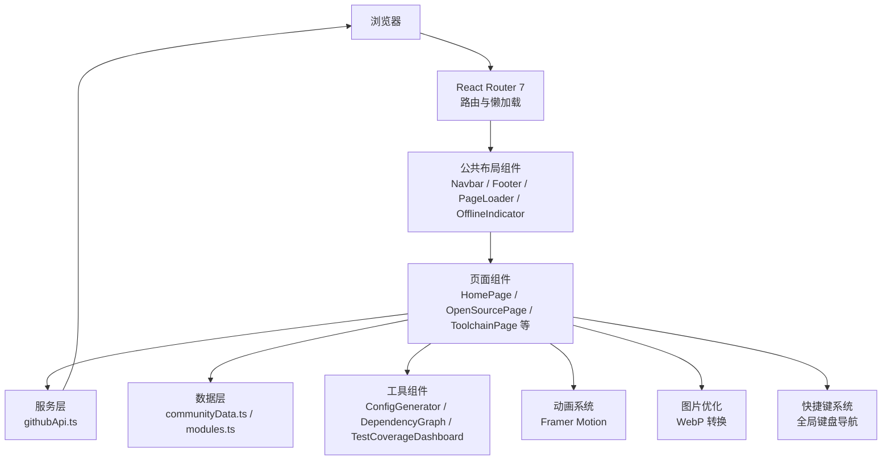
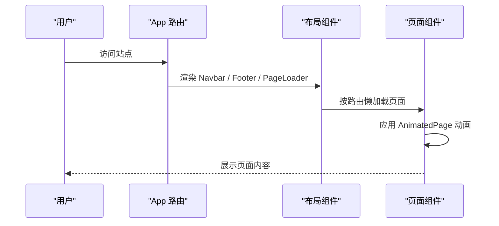
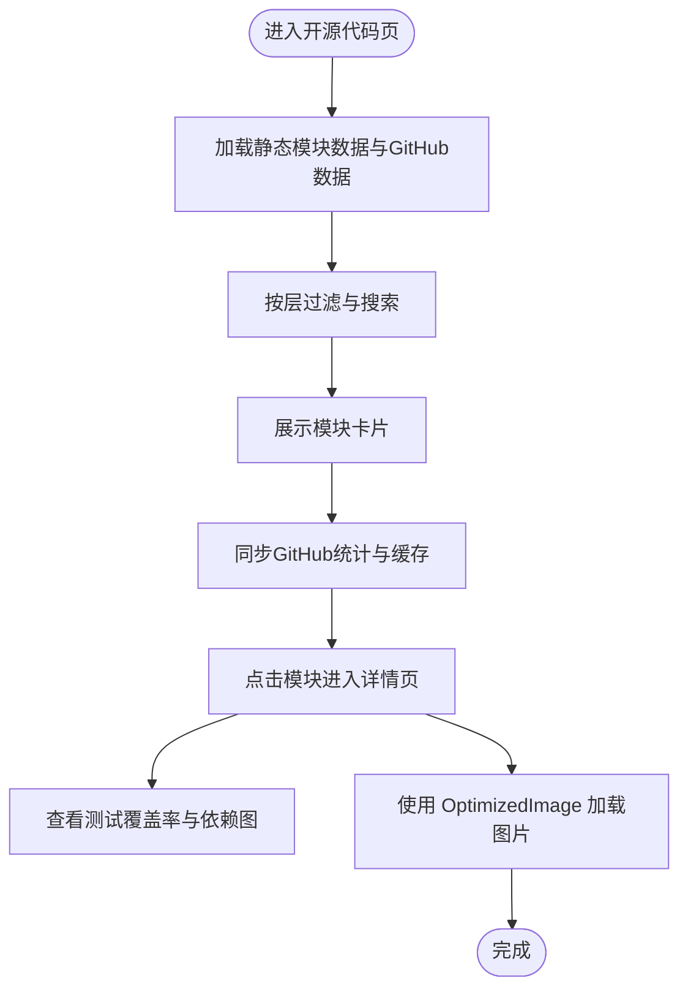
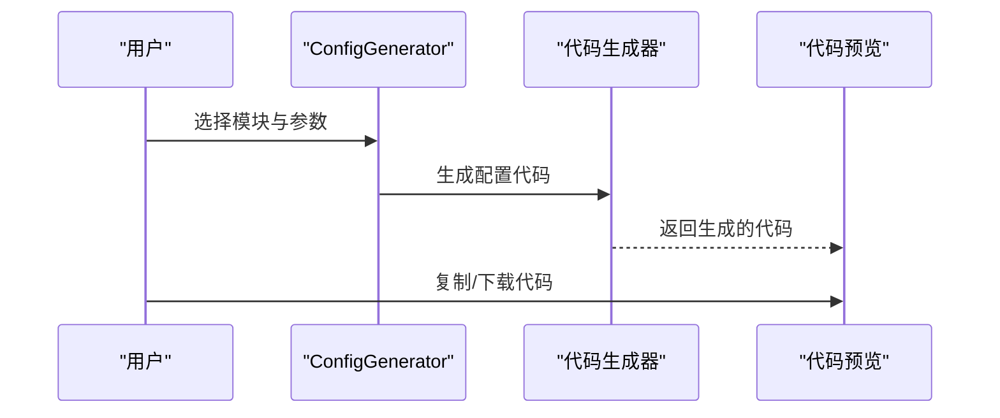
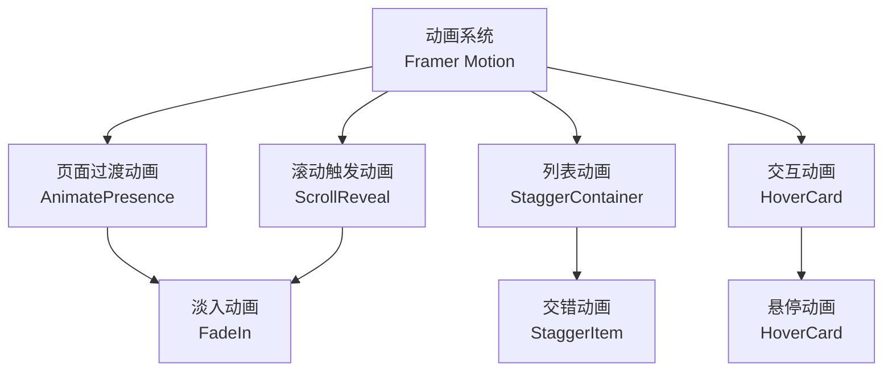
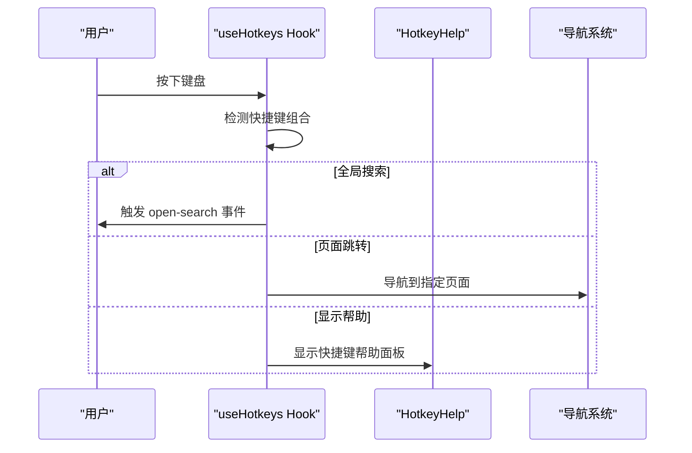
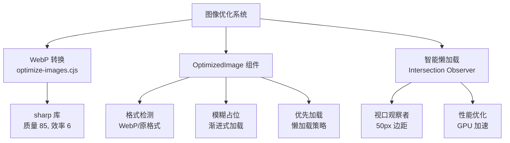
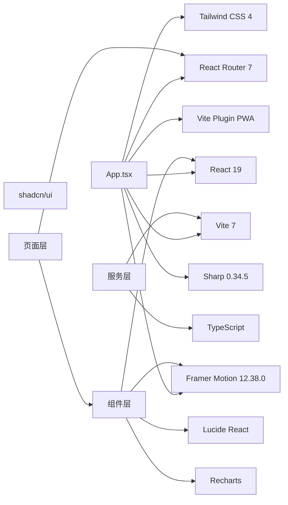

# 项目概述

<cite>
**本文档引用的文件**
- [README.md](file://README.md)
- [package.json](file://package.json)
- [RELEASE_NOTES.md](file://RELEASE_NOTES.md)
- [ROADMAP-v0.9-to-v1.0.md](file://docs/ROADMAP-v0.9-to-v1.0.md)
- [src/App.tsx](file://src/App.tsx)
- [src/pages/HomePage.tsx](file://src/pages/HomePage.tsx)
- [src/components/Navbar.tsx](file://src/components/Navbar.tsx)
- [src/components/Hero.tsx](file://src/components/Hero.tsx)
- [src/components/Features.tsx](file://src/components/Features.tsx)
- [src/components/OpenSource.tsx](file://src/components/OpenSource.tsx)
- [src/pages/OpenSourcePage.tsx](file://src/pages/OpenSourcePage.tsx)
- [src/components/AnimatedPage.tsx](file://src/components/AnimatedPage.tsx)
- [src/components/OptimizedImage.tsx](file://src/components/OptimizedImage.tsx)
- [src/hooks/useHotkeys.ts](file://src/hooks/useHotkeys.ts)
- [src/components/HotkeyHelp.tsx](file://src/components/HotkeyHelp.tsx)
- [scripts/optimize-images.cjs](file://scripts/optimize-images.cjs)
- [src/data/communityData.ts](file://src/data/communityData.ts)
- [src/services/githubApi.ts](file://src/services/githubApi.ts)
- [src/data/modules.ts](file://src/data/modules.ts)
- [src/components/ConfigGenerator.tsx](file://src/components/ConfigGenerator.tsx)
- [src/components/DependencyGraph.tsx](file://src/components/DependencyGraph.tsx)
- [src/components/TestCoverageDashboard.tsx](file://src/components/TestCoverageDashboard.tsx)
</cite>

## 更新摘要
**所做更改**
- 新增动画优化章节，详细介绍 Framer Motion 的集成与应用
- 新增全局键盘快捷键系统章节，涵盖 useHotkeys Hook 和快捷键帮助面板
- 新增图像优化章节，说明 WebP 转换和 OptimizedImage 组件
- 更新项目结构图，反映新增的动画和优化组件
- 更新技术栈信息，包含 Framer Motion 和 Sharp 依赖
- 更新当前版本信息，反映 v0.9.0 的重大更新

## 目录
1. [引言](#引言)
2. [项目结构](#项目结构)
3. [核心组件](#核心组件)
4. [架构总览](#架构总览)
5. [详细组件分析](#详细组件分析)
6. [动画优化](#动画优化)
7. [全局键盘快捷键系统](#全局键盘快捷键系统)
8. [图像优化](#图像优化)
9. [依赖分析](#依赖分析)
10. [性能考虑](#性能考虑)
11. [故障排除指南](#故障排除指南)
12. [结论](#结论)
13. [附录](#附录)

## 引言
YuleTech 社区技术平台是一个面向 AutoSAR BSW（基础软件）开发者的开源社区网站，旨在构建国产替代的 AutoSAR BSW 开源方案，服务于 OEM/Tier1/Tier2、高校及个人开发者。平台通过"一站式汽车基础软件开发生态"，整合开源代码、开发工具链、学习成长与硬件开发板资源，提供从底层驱动到应用组件的完整技术支撑。

平台定位独特之处在于：
- 以 AutoSAR Classic Platform 4.x 标准为核心，覆盖 MCAL、ECUAL、Service、RTE + ASW 四层架构，提供 32+ 个模块的开源实现与可视化配置工具。
- 面向真实工程场景，提供模块依赖关系图、测试覆盖率仪表盘、在线配置生成器等工程化能力，降低汽车软件开发门槛。
- 依托 GitHub API 实时同步开源项目数据，结合本地缓存与降级策略，保障用户体验与稳定性。
- **v0.9.0 版本引入了动画优化、全局键盘快捷键系统和图像优化等核心功能增强**，显著提升了用户体验和性能表现。

**章节来源**
- [README.md:5-9](file://README.md#L5-L9)
- [README.md:84-91](file://README.md#L84-L91)
- [ROADMAP-v0.9-to-v1.0.md:7-9](file://docs/ROADMAP-v0.9-to-v1.0.md#L7-L9)

## 项目结构
项目采用前端单页应用架构，基于 React 19 + TypeScript，使用 Vite 7 构建，Tailwind CSS 4 进行样式设计。页面路由通过 React Router 7 管理，PWA 能力通过 Vite Plugin PWA 提供。项目包含社区前台、管理后台、学习平台、开源代码平台、工具链等多个页面模块，组件化程度高，便于扩展与维护。

**更新** 新增动画优化组件和图像优化组件，增强了用户体验和性能表现。

```mermaid
graph TB
subgraph "应用入口"
App["App.tsx<br/>路由与布局"]
end
subgraph "前台页面"
Home["HomePage.tsx"]
OpenSource["OpenSourcePage.tsx"]
Toolchain["ToolchainPage.tsx"]
Learning["LearningPage.tsx"]
Community["CommunityPage.tsx"]
Forum["ForumPage.tsx"]
QA["QAPage.tsx"]
Events["EventsPage.tsx"]
Hardware["HardwarePage.tsx"]
Downloads["DownloadPage.tsx"]
Profile["ProfilePage.tsx"]
Docs["DocsPage.tsx"]
Blog["BlogPage.tsx"]
end
subgraph "组件层"
Navbar["Navbar.tsx"]
Hero["Hero.tsx"]
Features["Features.tsx"]
OpenSourceComp["OpenSource.tsx"]
ConfigGen["ConfigGenerator.tsx"]
DepGraph["DependencyGraph.tsx"]
TestDash["TestCoverageDashboard.tsx"]
Footer["Footer.tsx"]
Offline["OfflineIndicator.tsx"]
Loader["PageLoader.tsx"]
CLI["InteractiveCLI.tsx"]
AnimatedPage["AnimatedPage.tsx<br/>动画页面容器"]
OptimizedImage["OptimizedImage.tsx<br/>优化图片组件"]
HotkeyHelp["HotkeyHelp.tsx<br/>快捷键帮助面板"]
end
subgraph "工具层"
HotkeysHook["useHotkeys.ts<br/>全局快捷键 Hook"]
ImageOptimizer["optimize-images.cjs<br/>图片优化脚本"]
end
App --> Home
App --> OpenSource
App --> Toolchain
App --> Learning
App --> Community
App --> Forum
App --> QA
App --> Events
App --> Hardware
App --> Downloads
App --> Profile
App --> Docs
App --> Blog
Home --> Hero
Home --> Features
Home --> OpenSourceComp
OpenSource --> DepGraph
OpenSource --> TestDash
Toolchain --> ConfigGen
AnimatedPage --> App
OptimizedImage --> ImageOptimizer
HotkeyHelp --> HotkeysHook
```

**图表来源**
- [src/App.tsx:30-115](file://src/App.tsx#L30-L115)
- [src/pages/HomePage.tsx:15-87](file://src/pages/HomePage.tsx#L15-L87)
- [src/components/Navbar.tsx:9-203](file://src/components/Navbar.tsx#L9-L203)
- [src/components/Hero.tsx:3-81](file://src/components/Hero.tsx#L3-L81)
- [src/components/Features.tsx:91-162](file://src/components/Features.tsx#L91-L162)
- [src/components/OpenSource.tsx:47-123](file://src/components/OpenSource.tsx#L47-L123)
- [src/pages/OpenSourcePage.tsx:120-468](file://src/pages/OpenSourcePage.tsx#L120-L468)
- [src/components/ConfigGenerator.tsx:392-681](file://src/components/ConfigGenerator.tsx#L392-L681)
- [src/components/DependencyGraph.tsx:92-530](file://src/components/DependencyGraph.tsx#L92-L530)
- [src/components/TestCoverageDashboard.tsx:96-461](file://src/components/TestCoverageDashboard.tsx#L96-L461)
- [src/components/AnimatedPage.tsx:1-149](file://src/components/AnimatedPage.tsx#L1-L149)
- [src/components/OptimizedImage.tsx:1-181](file://src/components/OptimizedImage.tsx#L1-L181)
- [src/hooks/useHotkeys.ts:1-78](file://src/hooks/useHotkeys.ts#L1-L78)
- [src/components/HotkeyHelp.tsx:1-146](file://src/components/HotkeyHelp.tsx#L1-L146)
- [scripts/optimize-images.cjs:1-116](file://scripts/optimize-images.cjs#L1-L116)

**章节来源**
- [README.md:20-46](file://README.md#L20-L46)
- [package.json:1-48](file://package.json#L1-L48)

## 核心组件
- 导航栏组件：提供统一的导航入口、搜索、主题切换、通知中心与管理员入口，支持桌面与移动端响应式布局。
- 首页英雄区与功能区：通过 Hero 与 Features 组件展示平台核心能力，包含开源代码、开发工具链、学习成长、硬件开发板四大生态板块的可视化预览。
- 开源代码平台：集中展示 32 个 AutoSAR BSW 模块，支持按层过滤、搜索、GitHub 数据同步与模块详情跳转。
- 工具链配置器：提供 MCAL 与 BSW 模块的可视化配置生成器，一键输出符合 AutoSAR 标准的 C 语言配置头文件。
- 依赖关系图：交互式 SVG 图展示模块间依赖关系，支持缩放、拖拽、分层筛选与节点详情查看。
- 测试覆盖率仪表盘：提供测试用例概览、按类别/模块筛选、覆盖率统计与趋势分析，辅助质量保障。
- **动画页面容器**：使用 Framer Motion 实现页面切换动画、列表入场动画和交互动画，提升用户体验。
- **优化图片组件**：支持 WebP/AVIF 格式、懒加载、模糊占位和渐进式加载，显著提升图片加载性能。
- **全局快捷键系统**：提供键盘导航、页面跳转和搜索功能，支持自定义快捷键配置。

**章节来源**
- [src/components/Navbar.tsx:30-41](file://src/components/Navbar.tsx#L30-L41)
- [src/components/Hero.tsx:25-34](file://src/components/Hero.tsx#L25-L34)
- [src/components/Features.tsx:24-89](file://src/components/Features.tsx#L24-L89)
- [src/components/OpenSource.tsx:3-32](file://src/components/OpenSource.tsx#L3-L32)
- [src/pages/OpenSourcePage.tsx:27-47](file://src/pages/OpenSourcePage.tsx#L27-L47)
- [src/components/ConfigGenerator.tsx:18-99](file://src/components/ConfigGenerator.tsx#L18-L99)
- [src/components/DependencyGraph.tsx:32-67](file://src/components/DependencyGraph.tsx#L32-L67)
- [src/components/TestCoverageDashboard.tsx:44-79](file://src/components/TestCoverageDashboard.tsx#L44-L79)
- [src/components/AnimatedPage.tsx:1-149](file://src/components/AnimatedPage.tsx#L1-L149)
- [src/components/OptimizedImage.tsx:1-181](file://src/components/OptimizedImage.tsx#L1-L181)
- [src/hooks/useHotkeys.ts:1-78](file://src/hooks/useHotkeys.ts#L1-L78)

## 架构总览
平台采用前后端分离的前端 SPA 架构，核心设计原则包括：
- 路由与懒加载：通过 React Router 7 与 React.lazy 实现页面级懒加载，提升首屏性能。
- 组件化与可复用：公共组件（Navbar、Footer、PageLoader、OfflineIndicator）贯穿多页面，提升一致性与可维护性。
- 工具链与数据可视化：通过 ConfigGenerator、DependencyGraph、TestCoverageDashboard 等组件提供工程化能力。
- GitHub 集成：使用 githubApi.ts 服务对接 GitHub API，实现仓库 Stars/Forks 等数据的实时同步与缓存降级。
- **动画系统**：集成 Framer Motion 实现流畅的页面切换和交互动画，提升用户体验。
- **性能优化**：通过图片 WebP 转换、懒加载和缓存策略优化加载性能。

**图表来源**
- [src/App.tsx:30-115](file://src/App.tsx#L30-L115)
- [src/pages/HomePage.tsx:15-87](file://src/pages/HomePage.tsx#L15-L87)
- [src/components/Navbar.tsx:9-203](file://src/components/Navbar.tsx#L9-L203)
- [src/services/githubApi.ts:65-85](file://src/services/githubApi.ts#L65-L85)
- [src/data/communityData.ts:1-371](file://src/data/communityData.ts#L1-L371)
- [src/data/modules.ts:15-32](file://src/data/modules.ts#L15-L32)
- [src/components/ConfigGenerator.tsx:392-681](file://src/components/ConfigGenerator.tsx#L392-L681)
- [src/components/DependencyGraph.tsx:92-530](file://src/components/DependencyGraph.tsx#L92-L530)
- [src/components/TestCoverageDashboard.tsx:96-461](file://src/components/TestCoverageDashboard.tsx#L96-L461)
- [src/components/AnimatedPage.tsx:1-149](file://src/components/AnimatedPage.tsx#L1-L149)
- [src/components/OptimizedImage.tsx:1-181](file://src/components/OptimizedImage.tsx#L1-L181)
- [src/hooks/useHotkeys.ts:1-78](file://src/hooks/useHotkeys.ts#L1-L78)

## 详细组件分析

### 路由与页面组织
- App 组件集中定义公共路由与后台路由，前台页面采用 Suspense + lazy 实现按需加载；后台页面提供管理员登录与管理功能。
- HomePage 提供极简模式切换，支持在加载完成后按需渲染统计、开源、社区等模块，兼顾性能与可读性。
- **动画页面容器**：通过 AnimatedPage 组件实现页面切换时的淡入淡出效果，提升导航体验。

**图表来源**
- [src/App.tsx:30-115](file://src/App.tsx#L30-L115)
- [src/pages/HomePage.tsx:15-87](file://src/pages/HomePage.tsx#L15-L87)
- [src/components/AnimatedPage.tsx:31-43](file://src/components/AnimatedPage.tsx#L31-L43)

**章节来源**
- [src/App.tsx:30-115](file://src/App.tsx#L30-L115)
- [src/pages/HomePage.tsx:15-87](file://src/pages/HomePage.tsx#L15-L87)
- [src/components/AnimatedPage.tsx:1-149](file://src/components/AnimatedPage.tsx#L1-L149)

### 导航栏与响应式设计
- 导航栏支持桌面端与移动端两种布局，提供搜索、通知、主题切换与管理员入口；滚动时具备粘性样式与背景虚化效果。
- 移动端菜单在路由切换时自动收起，并支持主题切换与登录/注册入口。
- **快捷键支持**：导航栏与全局快捷键系统协同工作，提供键盘导航体验。

**章节来源**
- [src/components/Navbar.tsx:9-203](file://src/components/Navbar.tsx#L9-L203)
- [src/hooks/useHotkeys.ts:1-78](file://src/hooks/useHotkeys.ts#L1-L78)

### 首页英雄区与功能区
- Hero 组件通过渐变背景与统计数字突出平台价值主张，提供"开始探索""代码仓库"等行动按钮。
- Features 组件以卡片形式展示四大生态板块，每个板块包含图标、标题、描述、统计数据与横向滚动的界面预览，体现"从开源代码到开发工具，从学习到实战"的完整生态闭环。
- **动画增强**：通过 AnimatedPage 和 StaggerContainer 实现卡片的有序入场动画。

**章节来源**
- [src/components/Hero.tsx:3-81](file://src/components/Hero.tsx#L3-L81)
- [src/components/Features.tsx:24-89](file://src/components/Features.tsx#L24-L89)
- [src/components/AnimatedPage.tsx:67-108](file://src/components/AnimatedPage.tsx#L67-L108)

### 开源代码平台与模块详情
- OpenSource 组件展示 MCAL、ECUAL、Service、RTE + ASW 四层模块分类，支持查看源码与统计信息。
- OpenSourcePage 提供模块列表、按层过滤、搜索、GitHub 数据同步与模块详情跳转；集成了测试覆盖率仪表盘与依赖关系图，帮助开发者快速理解模块状态与依赖关系。
- **图片优化**：使用 OptimizedImage 组件替换传统图片，支持 WebP 格式和懒加载。

**图表来源**
- [src/pages/OpenSourcePage.tsx:120-468](file://src/pages/OpenSourcePage.tsx#L120-L468)
- [src/components/OpenSource.tsx:47-123](file://src/components/OpenSource.tsx#L47-L123)
- [src/components/TestCoverageDashboard.tsx:96-461](file://src/components/TestCoverageDashboard.tsx#L96-L461)
- [src/components/DependencyGraph.tsx:92-530](file://src/components/DependencyGraph.tsx#L92-L530)
- [src/components/OptimizedImage.tsx:1-181](file://src/components/OptimizedImage.tsx#L1-L181)

**章节来源**
- [src/pages/OpenSourcePage.tsx:120-468](file://src/pages/OpenSourcePage.tsx#L120-L468)
- [src/components/OpenSource.tsx:47-123](file://src/components/OpenSource.tsx#L47-L123)
- [src/services/githubApi.ts:65-85](file://src/services/githubApi.ts#L65-L85)
- [src/components/OptimizedImage.tsx:1-181](file://src/components/OptimizedImage.tsx#L1-L181)

### 工具链配置生成器
- ConfigGenerator 提供 MCAL 与 BSW 模块的可视化配置界面，支持参数选择、布尔开关与数值输入，一键生成符合 AutoSAR 标准的 C 语言配置头文件，支持复制与下载。

**图表来源**
- [src/components/ConfigGenerator.tsx:392-681](file://src/components/ConfigGenerator.tsx#L392-L681)

**章节来源**
- [src/components/ConfigGenerator.tsx:18-99](file://src/components/ConfigGenerator.tsx#L18-L99)
- [src/components/ConfigGenerator.tsx:188-389](file://src/components/ConfigGenerator.tsx#L188-L389)

### 依赖关系图
- DependencyGraph 以 SVG 形式展示模块间依赖关系，支持缩放、拖拽、分层筛选与节点详情查看；导出为 PNG 图片，便于分享与归档。

**章节来源**
- [src/components/DependencyGraph.tsx:92-530](file://src/components/DependencyGraph.tsx#L92-L530)

### 测试覆盖率仪表盘
- TestCoverageDashboard 提供测试用例概览、按类别/模块筛选、覆盖率统计与趋势分析，辅助质量保障与回归测试管理。

**章节来源**
- [src/components/TestCoverageDashboard.tsx:96-461](file://src/components/TestCoverageDashboard.tsx#L96-L461)

### 社区数据模型
- communityData.ts 定义论坛帖子、问答、社区活动等数据结构，支持热帖标记、点赞、回复、标签与状态管理，为社区互动提供数据基础。

**章节来源**
- [src/data/communityData.ts:1-371](file://src/data/communityData.ts#L1-L371)

## 动画优化
**v0.9.0 版本引入了基于 Framer Motion 的动画优化系统，显著提升了用户体验和视觉表现力。**

### Framer Motion 集成
- **页面过渡动画**：使用 AnimatePresence 和 motion.div 实现页面切换时的淡入淡出效果，提供流畅的导航体验。
- **列表入场动画**：通过 StaggerContainer 和 StaggerItem 实现模块卡片的有序入场，增强视觉层次感。
- **交互动画**：HoverCard 组件提供卡片悬停放大和点击反馈，提升用户交互体验。
- **滚动触发动画**：ScrollReveal 组件支持视口触发的渐显效果，优化长页面加载体验。

### 动画组件详解
- **AnimatedPage**：提供页面级别的动画容器，支持自定义变体和过渡效果。
- **FadeIn**：简单的淡入动画包装器，支持延迟和持续时间配置。
- **StaggerContainer/StaggerItem**：实现子元素的交错动画效果，常用于列表渲染。
- **ScrollReveal**：基于 Intersection Observer 的视口触发动画。
- **HoverCard**：提供悬停和点击的交互动画效果。

**图表来源**
- [src/components/AnimatedPage.tsx:1-149](file://src/components/AnimatedPage.tsx#L1-L149)

**章节来源**
- [src/components/AnimatedPage.tsx:1-149](file://src/components/AnimatedPage.tsx#L1-L149)
- [ROADMAP-v0.9-to-v1.0.md:120-155](file://docs/ROADMAP-v0.9-to-v1.0.md#L120-L155)

## 全局键盘快捷键系统
**v0.9.0 版本新增了完整的全局键盘快捷键系统，提供高效的键盘导航体验。**

### 快捷键 Hook 实现
- **useHotkeys Hook**：全局快捷键管理，支持组合键监听和事件处理。
- **快捷键配置**：支持 Cmd+K 全局搜索、G+字母页面跳转、? 显示帮助等快捷键。
- **防冲突机制**：智能检测输入框焦点，避免快捷键干扰文本输入。
- **一次性监听**：G 键组合使用一次性监听器，防止按键冲突。

### 快捷键帮助面板
- **HotkeyHelp 组件**：提供快捷键帮助对话框，显示所有可用快捷键。
- **自定义配置**：支持快捷键配置和自定义，提升用户体验。
- **模态管理**：ESC 键关闭帮助面板，支持键盘导航。

### 快捷键功能列表
- **Cmd+K**：打开全局搜索面板
- **G+O**：跳转到开源代码页面
- **G+T**：跳转到工具链页面
- **G+L**：跳转到学习页面
- **G+B**：跳转到博客页面
- **G+D**：跳转到文档页面
- **G+H**：跳转到硬件页面
- **?**：显示快捷键帮助
- **Esc**：关闭模态框和帮助面板

**图表来源**
- [src/hooks/useHotkeys.ts:1-78](file://src/hooks/useHotkeys.ts#L1-L78)
- [src/components/HotkeyHelp.tsx:1-146](file://src/components/HotkeyHelp.tsx#L1-L146)

**章节来源**
- [src/hooks/useHotkeys.ts:1-78](file://src/hooks/useHotkeys.ts#L1-L78)
- [src/components/HotkeyHelp.tsx:1-146](file://src/components/HotkeyHelp.tsx#L1-L146)
- [ROADMAP-v0.9-to-v1.0.md:79-117](file://docs/ROADMAP-v0.9-to-v1.0.md#L79-L117)

## 图像优化
**v0.9.0 版本实现了全面的图像优化系统，通过 WebP 转换和智能加载策略显著提升性能。**

### WebP 转换系统
- **优化脚本**：scripts/optimize-images.cjs 自动将 JPG/JPEG/PNG 图片转换为 WebP 格式。
- **质量控制**：使用 sharp 库，WebP 质量设置为 85，压缩效率 6。
- **自动化流程**：支持批量转换和增量优化，避免重复转换。

### OptimizedImage 组件
- **格式支持**：自动检测并使用 WebP 格式，回退到原格式确保兼容性。
- **懒加载实现**：基于 Intersection Observer 的智能懒加载，提升首屏性能。
- **模糊占位**：支持模糊占位图，提供更好的加载体验。
- **渐进式加载**：图片加载完成时的平滑过渡效果。

### 图片优化特性
- **性能提升**：WebP 格式相比原格式平均节省 20-40% 的文件大小。
- **用户体验**：模糊占位和渐进式加载减少加载等待焦虑。
- **SEO 友好**：保持 alt 属性和语义化结构。
- **响应式支持**：支持 width、height 参数，优化布局稳定性和性能。

**图表来源**
- [scripts/optimize-images.cjs:1-116](file://scripts/optimize-images.cjs#L1-L116)
- [src/components/OptimizedImage.tsx:1-181](file://src/components/OptimizedImage.tsx#L1-L181)

**章节来源**
- [scripts/optimize-images.cjs:1-116](file://scripts/optimize-images.cjs#L1-L116)
- [src/components/OptimizedImage.tsx:1-181](file://src/components/OptimizedImage.tsx#L1-L181)
- [ROADMAP-v0.9-to-v1.0.md:45-76](file://docs/ROADMAP-v0.9-to-v1.0.md#L45-L76)

## 依赖分析
- 外部依赖：React 19、React Router 7、TypeScript、Vite 7、Tailwind CSS 4、shadcn/ui、Lucide React、Recharts、Vite Plugin PWA、**Framer Motion 12.38.0**、**Sharp 0.34.5** 等。
- 内部依赖：页面组件依赖公共布局与工具组件；OpenSourcePage 依赖 githubApi.ts 与 modules.ts；工具组件依赖各自的数据与配置定义。

**更新** 新增 Framer Motion 和 Sharp 依赖，用于动画系统和图片优化。

**图表来源**
- [package.json:12-27](file://package.json#L12-L27)
- [package.json:28-46](file://package.json#L28-L46)
- [src/App.tsx:30-115](file://src/App.tsx#L30-L115)

**章节来源**
- [package.json:1-48](file://package.json#L1-L48)

## 性能考虑
- 首屏优化：通过 React.lazy 与 Suspense 实现页面级懒加载，减少初始包体积。
- 路由懒加载：App 中对所有页面组件进行懒加载封装，提升路由切换性能。
- 缓存策略：GitHub API 数据通过 sessionStorage 缓存（5 分钟 TTL），在网络异常时自动降级为静态数据，保障可用性。
- 响应式设计：组件针对移动端与桌面端分别优化布局与交互，减少不必要的重排与重绘。
- **动画性能**：使用 will-change 和 GPU 加速优化动画性能，支持 prefers-reduced-motion 媒体查询。
- **图片性能**：WebP 格式转换减少 20-40% 文件大小，Intersection Observer 实现智能懒加载。
- **键盘导航**：全局快捷键系统减少鼠标依赖，提升高效用户的工作效率。

**更新** 新增动画性能优化和图片性能优化相关内容。

**章节来源**
- [src/App.tsx:10-28](file://src/App.tsx#L10-L28)
- [src/pages/OpenSourcePage.tsx:248-278](file://src/pages/OpenSourcePage.tsx#L248-L278)
- [src/services/githubApi.ts:139-150](file://src/services/githubApi.ts#L139-L150)
- [src/components/AnimatedPage.tsx:149](file://src/components/AnimatedPage.tsx#L149)
- [src/components/OptimizedImage.tsx:27-49](file://src/components/OptimizedImage.tsx#L27-L49)

## 故障排除指南
- 导航栏响应式问题：在 768px-1024px 屏幕宽度下，曾出现导航菜单与汉堡按钮同时隐藏的问题，已通过修复响应式断点解决。
- Service Worker 冲突：移除重复注册，避免缓存异常与加载问题。
- GitHub Actions 构建失败：将 Vite 从 8.x 降级至 7.x，解决与 vite-plugin-pwa 的 peer dependency 冲突导致的 npm ci 失败。
- 404 页面：为未知路由提供友好提示页面，避免空白页影响用户体验。
- **动画兼容性**：确保浏览器支持 Web Animations API，Framer Motion 提供降级方案。
- **图片加载**：WebP 格式不支持时自动回退到原格式，确保兼容性。

**更新** 新增动画兼容性和图片加载相关故障排除内容。

**章节来源**
- [RELEASE_NOTES.md:300-315](file://RELEASE_NOTES.md#L300-L315)
- [RELEASE_NOTES.md:308-310](file://RELEASE_NOTES.md#L308-L310)
- [RELEASE_NOTES.md:367-369](file://RELEASE_NOTES.md#L367-L369)

## 结论
YuleTech 社区技术平台以 AutoSAR BSW 为核心，构建了从开源代码、工具链、学习到硬件的完整生态闭环。通过工程化工具与可视化组件，平台显著降低了汽车软件开发门槛，提升了工程师的学习效率与协作质量。

**v0.9.0 版本的重大更新**进一步强化了平台的用户体验和技术实力：
- **动画优化**：基于 Framer Motion 的流畅动画系统，提供现代化的视觉体验
- **全局快捷键**：完整的键盘导航系统，提升高效用户的操作效率
- **图像优化**：WebP 转换和智能加载策略，显著提升页面加载性能

未来版本将持续完善模块覆盖、增强工具链能力与社区互动功能，助力国产替代 AutoSAR BSW 生态的繁荣发展。

## 附录
- **当前版本**：v0.9.0（重大更新：动画优化、全局快捷键、图像优化）
- **技术栈**：React 19 + TypeScript、Vite 7、Tailwind CSS 4、shadcn/ui、Lucide React、Recharts、React Router 7、Vite Plugin PWA、**Framer Motion 12.38.0**、**Sharp 0.34.5**
- **许可证**：MIT © 上海予乐电子科技有限公司
- **路线图**：v0.9.0 性能与体验优化 → v0.10.0 功能深化 → v1.0.0 企业级功能

**更新** 更新当前版本信息和路线图规划，反映 v0.9.0 的重大更新内容。

**章节来源**
- [README.md:11-19](file://README.md#L11-L19)
- [README.md:92-95](file://README.md#L92-L95)
- [RELEASE_NOTES.md:1-5](file://RELEASE_NOTES.md#L1-L5)
- [ROADMAP-v0.9-to-v1.0.md:3-9](file://docs/ROADMAP-v0.9-to-v1.0.md#L3-L9)